# CHAPTER 14: DESIGN YOUTUBE

The solution to this question can be applied to other interview questions like designing a video sharing platform such as Netflix and Hulu.

statistics, demographics:
- Total number of monthly active users: 2 billion.
- Number of videos watched per day: 5 billion.
- 73% of US adults use YouTube.
- 50 million creators on YouTube.
- YouTube’s Ad revenue was $15.1 billion for the full year 2019, up 36% from 2018.
- YouTube is responsible for 37% of all mobile internet traffic.
- YouTube is available in 80 different languages.

## Step 1 - Understand the problem and establish design scope
Besides watching a video, you can do a lot more on YouTube. For example, comment, share, or like a video, save a video to playlists, subscribe to a channel, etc. It is impossible to design everything within a 45- or 60-minute interview. Thus, it is important to ask questions to narrow down the scope.

**Candidate**: **What features** are important?\
**Interviewer**: Ability to upload a video and watch a video.\
**Candidate**: **What clients** do we need to support?\
**Interviewer**: Mobile apps, web browsers, and smart TV.\
**Candidate**: How many **daily active users** do we have?\
**Interviewer**: 5 million\
**Candidate**: What is the **average daily time** spent on the product?\
**Interviewer**: 30 minutes.\
**Candidate**: Do we need to support **international users**?\
**Interviewer**: Yes, a large percentage of users are international users.\
**Candidate**: What are the supported **video resolutions**?\
**Interviewer**: The system accepts most of the video resolutions and formats.\
**Candidate**: Is **encryption** required?\
**Interviewer**: Yes\
**Candidate**: Any **file size requirement** for videos?\
**Interviewer**: Our platform focuses on small and medium-sized videos. The maximum allowed video size is 1GB.\
**Candidate**: Can we leverage some of the **existing cloud infrastructures** provided by Amazon, Google, or Microsoft?\
**Interviewer**: That is a great question. Building everything from scratch is unrealistic for most companies, it is recommended to leverage some of the existing cloud services.

We focus on designing a video streaming service with the following features:
- Ability to upload videos fast
- Smooth video streaming
- Ability to change video quality
- Low infrastructure cost
- High availability, scalability, and reliability requirements
- Clients supported: mobile apps, web browser, and smart TV

## Back of the envelope estimation
The following estimations are based on many assumptions, so it is important to communicate with the interviewer to make sure she is on the same page.

- Assume the product has 5 million daily active users (DAU).
- Users watch 5 videos per day.
- 10% of users upload 1 video per day.
- Assume the average video size is 300 MB.
- Total daily storage space needed: 5 million * 10% * 300 MB = 150TB 
- CDN cost:
    - When cloud CDN serves a video, you are charged for data transferred out of the CDN.
    - Let us use Amazon’s CDN CloudFront for cost estimation (Figure 14-2). Assume 100% of traffic is served from the United States. The average cost per GB is $0.02. For simplicity, we only calculate the cost of video streaming.
    - 5 million * 5 videos * 0.3GB * $0.02 = $150,000 per day.


| Per Month   | United States & Canada | Europe & Israel | South Africa & Middle East | South America | Japan   | Australia | Singapore, South Korea, Taiwan, Hong Kong, & Philippines | India   |
|-------------|-------------------------|-----------------|-----------------------------|---------------|---------|-----------|----------------------------------------------------------|---------|
| First 10TB  | $0.085                 | $0.085          | $0.110                      | $0.110        | $0.114  | $0.114    | $0.140                                                   | $0.170  |
| Next 40TB   | $0.080                 | $0.080          | $0.105                      | $0.105        | $0.089  | $0.098    | $0.135                                                   | $0.130  |
| Next 100TB  | $0.060                 | $0.060          | $0.090                      | $0.090        | $0.086  | $0.094    | $0.120                                                   | $0.110  |
| Next 350TB  | $0.040                 | $0.040          | $0.080                      | $0.080        | $0.084  | $0.092    | $0.100                                                   | $0.100  |
| Next 524TB  | $0.030                 | $0.030          | $0.060                      | $0.060        | $0.080  | $0.090    | $0.080                                                   | $0.100  |
| Next 4PB    | $0.025                 | $0.025          | $0.050                      | $0.050        | $0.070  | $0.085    | $0.070                                                   | $0.100  |
| Over 5PB    | $0.020                 | $0.020          | $0.040                      | $0.040        | $0.060  | $0.080    | $0.060                                                   | $0.100  |

*Figure 14-2 On-demand pricing for Data Transfer to the internet (per GB)*

## Step 2 - Propose high-level design and get buy-in
As discussed previously, the interviewer recommended leveraging existing cloud services instead of building everything from scratch. **CDN** and **blob storage** are the cloud services we will leverage. 
Why not building everything by ourselves? 
- System design interviews are not about building everything from scratch. Within the limited time frame, choosing the right technology to do a job right is more important than **explaining how the technology works in detail**. For instance, mentioning blob storage for storing source videos is enough for the interview. Talking about the detailed design for blob storage could be an overkill.
- Building scalable blob storage or CDN is extremely complex and costly. Even large companies like Netflix or Facebook do not build everything themselves. Netflix leverages Amazon’s cloud services, and Facebook uses Akamai’s CDN.

At the high-level, the system comprises three components
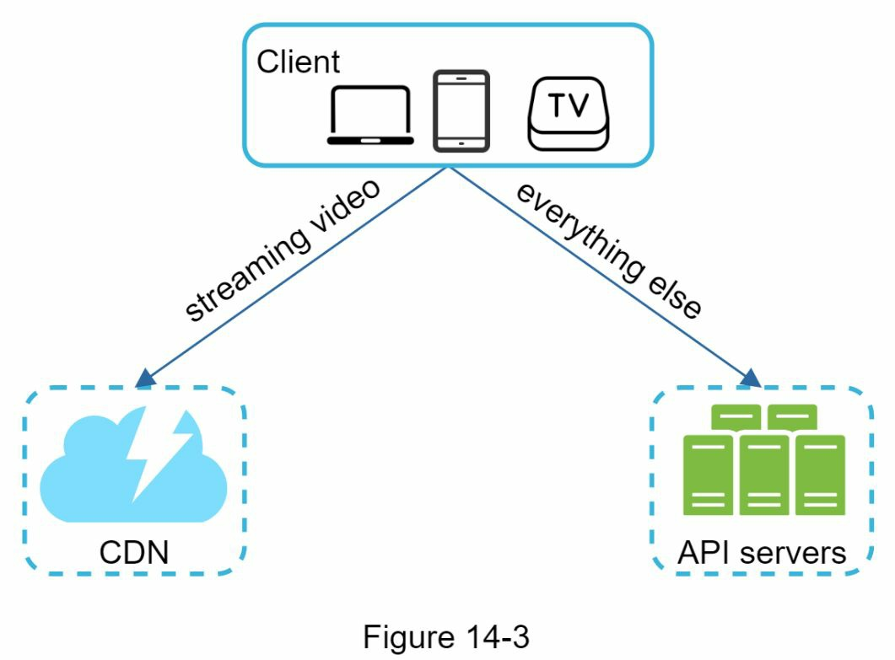

<details>
<summary>Figure 14-3</summary>

Client: You can watch YouTube on your computer, mobile phone, and smartTV.\
CDN: Videos are stored in CDN. When you press play, a video is streamed from the CDN.\
API servers: Everything else **except video streaming** goes through API servers. This includes feed recommendation, generating video upload URL, updating metadata database and cache, user sign-up, etc.
</details>

In the question/answer session, the interviewer showed interests in two flows:
- [Video uploading flow](#video-uploading-flow)
- [Video streaming flow](#video-streaming-flow)

### Video uploading flow
High-level design for the video uploading
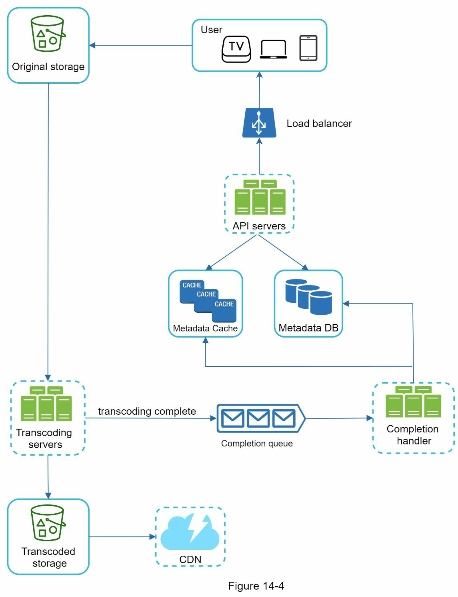

### Video streaming flow 
It consists of the following components:
- User: A user watches YouTube on devices such as a computer, mobile phone, or smart TV.
- Load balancer: A load balancer evenly distributes requests among API servers.
- API servers: All user requests go through API servers **except video streaming**.
- Metadata DB: Video metadata are stored in Metadata DB. It is sharded and replicated to meet performance and high availability requirements.
- Metadata cache: For better performance, video metadata and user objects are cached.
- Original storage: A **blob storage** system is used to **store original videos**. “A Binary Large Object (BLOB) is a collection of binary data stored as a single entity in a database management system”. [learn more](https://www.baeldung.com/cs/blob-storage)
- Transcoding servers: Video transcoding (encoding). It is the process of
converting a video format to other formats (MPEG, HLS, etc), which provide the best video streams possible for different devices and bandwidth capabilities.
- Transcoded storage: It is a blob storage that stores transcoded video files.
- CDN: Videos are cached in CDN. When you click the play button, a video is streamed from the CDN.
- Completion queue: It is a message queue that stores information about video transcoding completion events.
- Completion handler: This consists of a list of workers that pull event data from the completion queue and update metadata cache and database.

How the video uploading flow works: The flow is broken down into two processes running in parallel.\
a. [Upload the actual video.](#flow-a-upload-the-actual-video)\
b. [Update video metadata.]() Metadata contains information about video URL, size, resolution, format, user info, etc.

#### Flow a: upload the actual video
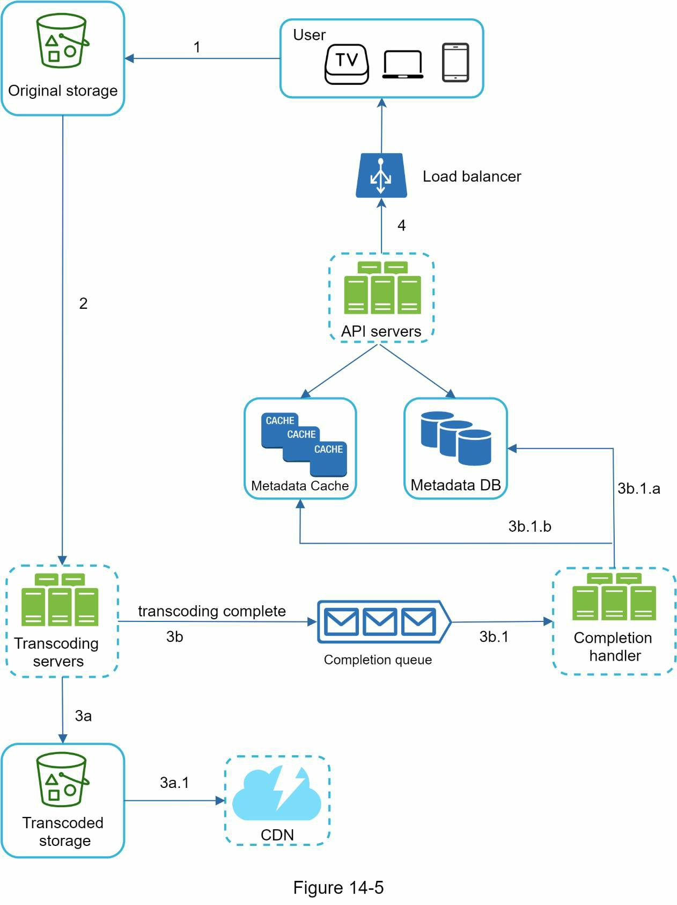

Figure 14-5 shows how to upload the actual video. The explanation is shown below:
1. Videos are uploaded to the original storage.
2. Transcoding servers fetch videos from the original storage and start transcoding.
3. Once transcoding is complete, the following two steps are executed in parallel:\
    3a. Transcoded videos are sent to transcoded storage.\
        3a.1. Transcoded videos are distributed to CDN.\
    3b. Transcoding completion events are queued in the completion queue\
        3b.1. Completion handler contains a bunch of workers that continuously pull event data from the queue. Completion handler updates the metadata database `3b.1.a` and cache `3b.1.b` when video transcoding is complete.

4. API servers inform the client that the video is successfully uploaded and is ready for
streaming.

#### Flow b: update the metadata
While a file is being uploaded to the original storage, the client in parallel sends a request to **update the video metadata** as shown in Figure 14-6. The request contains video metadata, including file name, size, format, etc. API servers update the metadata cache and database.
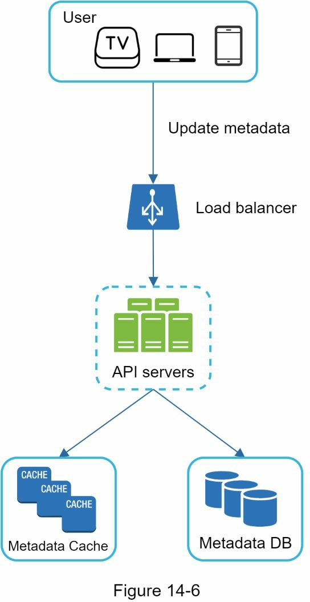

### Video streaming flow
while streaming means your device continuously receives video streams from remote source videos. When you watch streaming videos, your client loads a little bit of data at a time so you can watch videos immediately and continuously.

Before we discuss video streaming flow, let us look at an important concept: **streaming protocol**. This is a standardized way to control data transfer for video streaming. Popular streaming protocols are:
- MPEG–DASH. MPEG stands for “Moving Picture Experts Group” and DASH stands for "Dynamic Adaptive Streaming over HTTP".
- Apple HLS. HLS stands for “HTTP Live Streaming”.
- Microsoft Smooth Streaming.
- Adobe HTTP Dynamic Streaming (HDS).

You do not need to fully understand or even remember those streaming protocol names as they are low-level details that require specific domain knowledge. The important thing here is to understand that different streaming protocols support different video encodings and playback players. When we design a video streaming service, we have to choose the right streaming protocol to support our use cases.

Videos are streamed from CDN directly. The edge server closest to you will deliver the video. Thus, there is very little latency. Figure 14-7 shows a high level of design for video streaming.
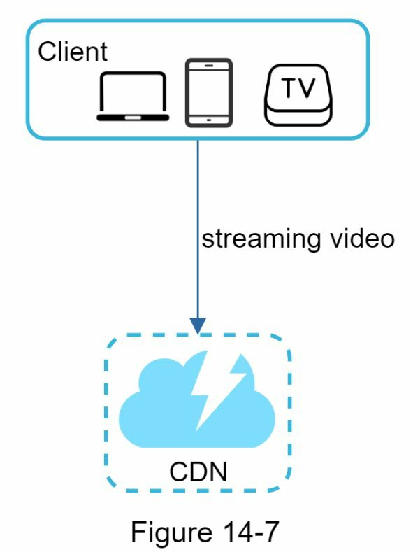

## Step 3 - Design deep dive

### Video transcoding
Video transcoding is important for the following reasons:
- Raw video consumes large amounts of storage space. An hour-long high definition video recorded at 60 frames per second can take up a few hundred GB of space.
- Many devices and browsers only support certain types of video formats. Thus, it is important to encode a video to different formats for compatibility reasons.
- To ensure users watch high-quality videos while maintaining smooth playback, it is a good idea to deliver higher resolution video to users who have high network bandwidth and lower resolution video to users who have low bandwidth.
- Network conditions can change, especially on mobile devices. To ensure a video is played continuously, switching video quality automatically or manually based on network conditions is essential for smooth user experience. 

Many types of encoding formats are available; however, most of them contain two parts:
- Container: This is like a basket that contains the video file, audio, and metadata. You can tell the container format by the file extension, such as .avi, .mov, or .mp4.
- Codecs: These are compression and decompression algorithms aim to reduce the video size while preserving the video quality. The most used video codecs are H.264, VP9, and HEVC.

### Directed acyclic graph (DAG) model
Video transcoding is computationally intensive and varies based on content creator requirements (e.g., adding watermarks, handling thumbnails, or processing HD videos). To support diverse workflows and maintain high parallelism, an abstraction layer is needed, allowing programmers to define tasks. A Directed Acyclic Graph (DAG) model, like Facebook’s streaming engine, organizes tasks into sequential or parallel stages for flexibility and efficiency.
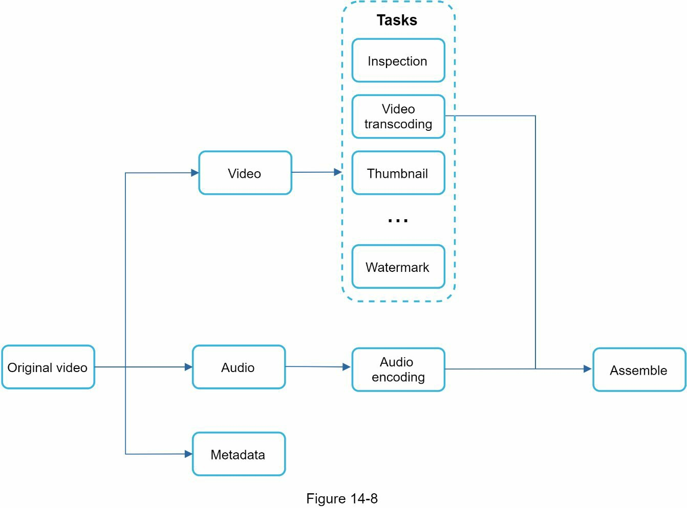

The original video is split into video, audio, and metadata. Here are some of the tasks that can be applied on a video file:
- Inspection: Make sure videos have good quality and are not malformed.
- Video encodings: Videos are converted to support different resolutions, codec, bitrates, etc. Figure 14-9 shows an example of video encoded files.
- Thumbnail. Thumbnails can either be uploaded by a user or automatically generated by the system.
- Watermark: An image overlay on top of your video contains identifying information about your video.
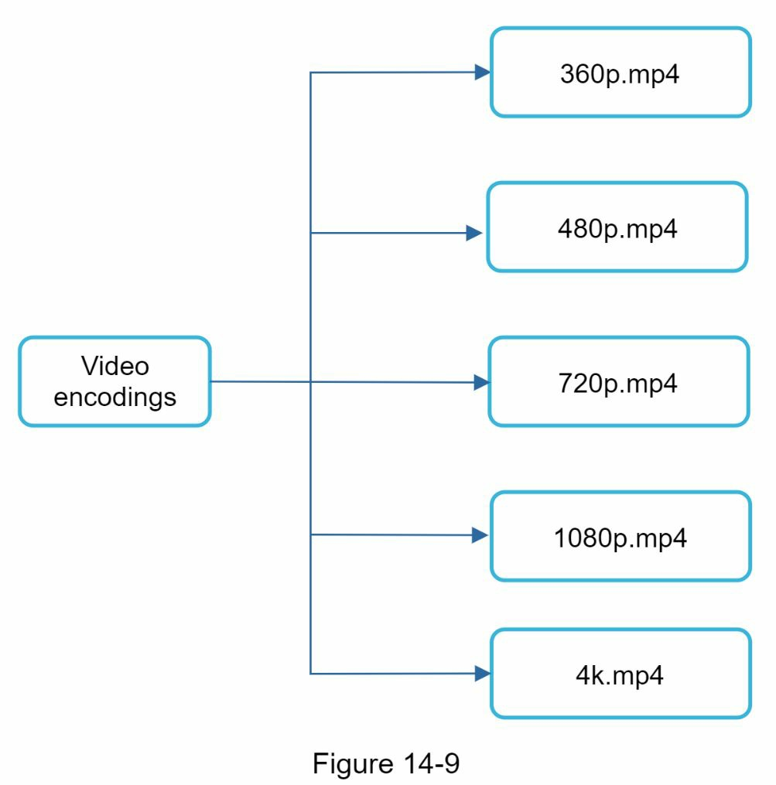

### Video transcoding architecture
The proposed video transcoding architecture that leverages the cloud services
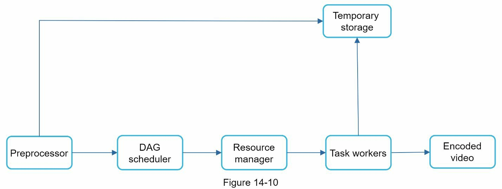
The architecture has six main components: [preprocessor](#preprocessor), [DAG scheduler](#dag-scheduler), [resource manager](#resource-manager), [task workers](#task-workers), [temporary storage](#temporary-storage), and [encoded video](#encoded-video) as the output.

#### Preprocessor
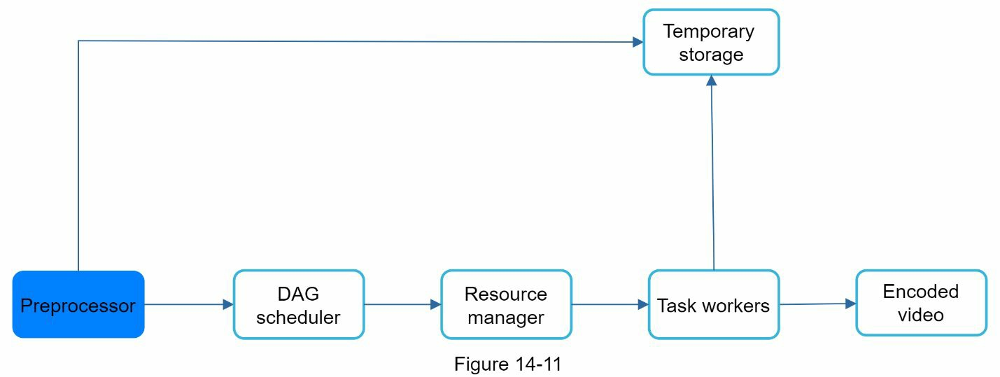
The preprocessor has 4 responsibilities:
1. Video splitting. Video stream is split or further split into smaller Group of Pictures (GOP) alignment. GOP is a group/chunk of frames arranged in a specific order. Each chunk is an independently playable unit, usually a few seconds in length.
2. Some old mobile devices or browsers might not support video splitting. Preprocessor split videos by GOP alignment for old clients.
3. DAG generation. The processor generates DAG based on configuration files client programmers write. Simplified DAG representation which has 2 nodes and 1 edge:

    Download -> Transcode

This DAG representation is generated from the two configuration files below
```groovy
task {
    name 'download-input'
    type 'Download'
    input {
        url config.url
    }
    output { it ->
        context.inputVideo = it.file
    }
    next 'transcode'
}
```
```groovy
task {
    name 'transcode'
    type 'Transcode'
    input {
        input context.inputVideo
        config config.transConfig
    }
    output { it ->
        context.file = it.outputVideo
    }
}
```

#### DAG scheduler
The DAG scheduler splits a DAG graph into stages of tasks and puts them in the task queue in the resource manager. Figure 14-15 shows an example of how the DAG scheduler works.
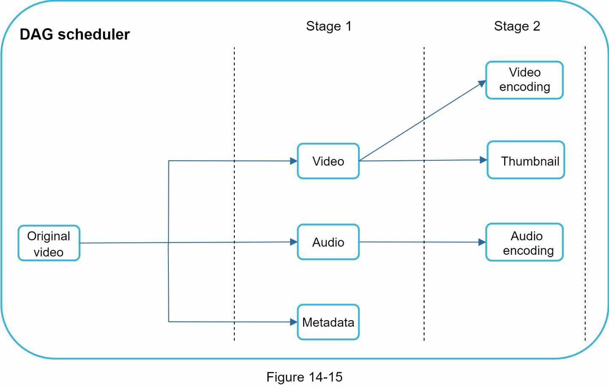
The original video is split into three stages: Stage 1: video, audio, and metadata. The video file is further split into two tasks in stage 2: video encoding and thumbnail. The audio file requires audio encoding as part of the stage 2 tasks.

#### Resource manager
The resource manager is responsible for managing the efficiency of resource allocation. It contains 3 queues and a task scheduler as shown in Figure 14-17.
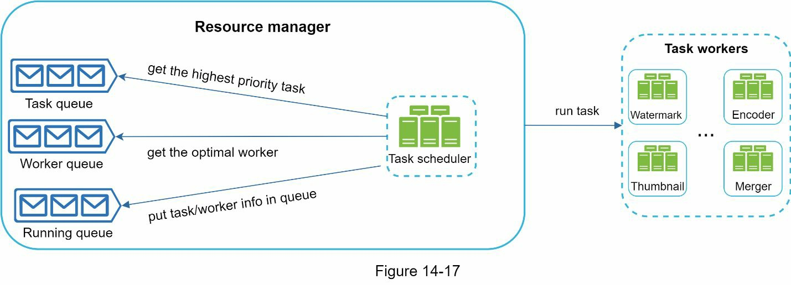

- Task queue: It is a priority queue that contains tasks to be executed.
- Worker queue: It is a priority queue that contains worker utilization info.
- Running queue: It contains info about the currently running tasks and workers running the tasks.
- Task scheduler: It picks the optimal task/worker, and instructs the chosen task worker to execute the job.

The resource manager works as follows:
- The task scheduler gets the highest priority task from the task queue.
- The task scheduler gets the optimal task worker to run the task from the worker queue.
- The task scheduler instructs the chosen task worker to run the task.
- The task scheduler binds the task/worker info and puts it in the running queue.
- The task scheduler removes the job from the running queue once the job is done.

#### Task workers
Task workers run the tasks which are defined in the DAG. Different task workers may run different tasks as shown in Figure 14-19.
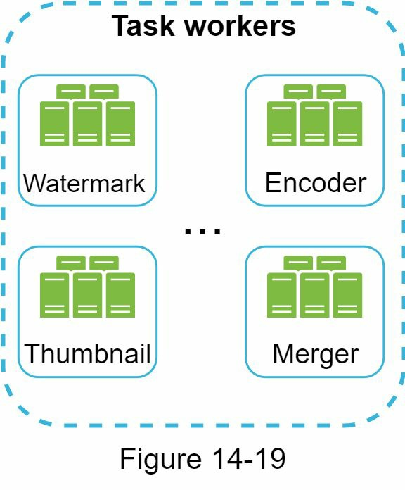

#### Temporary storage
Multiple storage systems are used here. The choice of storage system depends on factors like data type, data size, access frequency, data life span, etc. For instance, metadata is frequently accessed by workers, and the data size is usually small. Thus, caching metadata in memory is a good idea. For video or audio data, we put them in blob storage. Data in temporary storage is freed up once the corresponding video processing is complete.

#### Encoded video

Encoded video is the final output of the encoding pipeline. Here is an example of the output:
*funny_720p.mp4*

### System optimizations
Will refine the system with optimizations, including speed, safety, and cost-saving.

#### Speed optimization: parallelize video uploading
split a video into smaller chunks by GOP alignment:


This allows fast resumable uploads when the previous upload failed. The job of splitting a
video file by GOP can be implemented by the client to improve the upload speed:
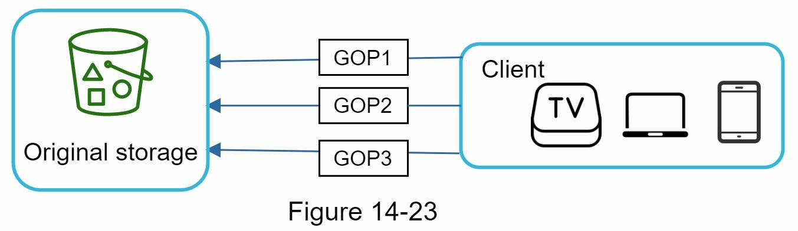

#### Speed optimization: place upload centers close to users
Another way to improve the upload speed is by setting up multiple upload centers across the globe.
<details>
People in the United States can upload videos to the North America
upload center, and people in China can upload videos to the Asian upload center. To achieve this, we use CDN as upload centers.
</details>

#### Speed optimization: parallelism everywhere
Another optimization is to build a loosely coupled system and enable high parallelism.

Let us zoom in to the flow of how a video is transferred from original storage to the CDN. The flow is shown in Figure 14-25, revealing that the output depends on the input of the previous step. This dependency makes parallelism difficult.
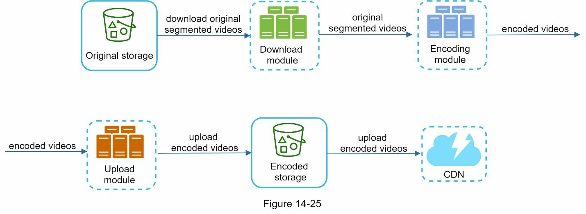

how message queues make the system more loosely coupled.
- Before the message queue is introduced, the encoding module must wait for the output of the download module.
- After the message queue is introduced, the encoding module does not need to wait for the output of the download module anymore. If there are events in the message queue, the encoding module can execute those jobs in parallel.

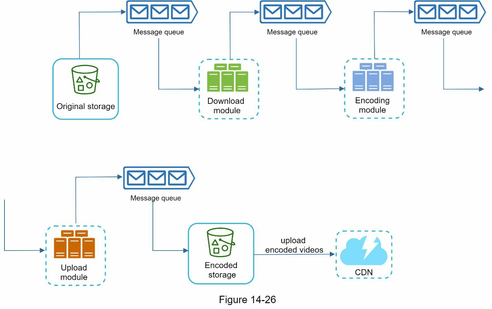

#### Safety optimization: pre-signed upload URL
To ensure only authorized users upload videos to the right location, we introduce pre-signed URLs:
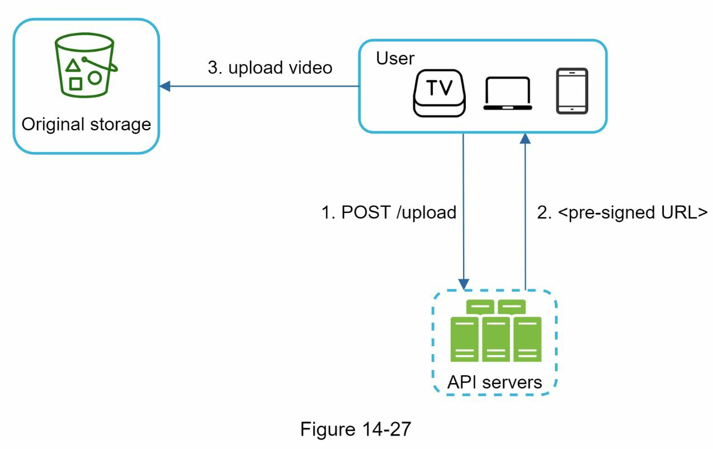

The upload flow is updated as follows:
1. The client makes a HTTP request to API servers to fetch the pre-signed URL, which gives the access permission to the object identified in the URL. The term pre-signed URL is used by uploading files to Amazon S3. Other cloud service providers might use a different name. For instance, Microsoft Azure blob storage supports the same feature, but call it “Shared Access Signature” [10].
2. API servers respond with a pre-signed URL.
3. Once the client receives the response, it uploads the video using the pre-signed URL.

#### Safety optimization: protect your videos

To protect copyrighted videos, we can adopt one of the following three safety options:
- Digital rights management (DRM) systems: Three major DRM systems are Apple FairPlay, Google Widevine, and Microsoft PlayReady.
- AES encryption: You can encrypt a video and configure an authorization policy. The encrypted video will be decrypted upon playback. This ensures that only authorized users can watch an encrypted video.
- Visual watermarking: This is an image overlay on top of your video that contains identifying information for your video. It can be your company logo or company name.

#### Cost-saving optimization
CDN is expensive, especially when the data size is large.

YouTube video streams follow long-tail distribution: a few popular videos are accessed frequently but many others have few or no viewers.

1. Only serve the most popular videos from CDN and other videos from our high capacity storage video servers.
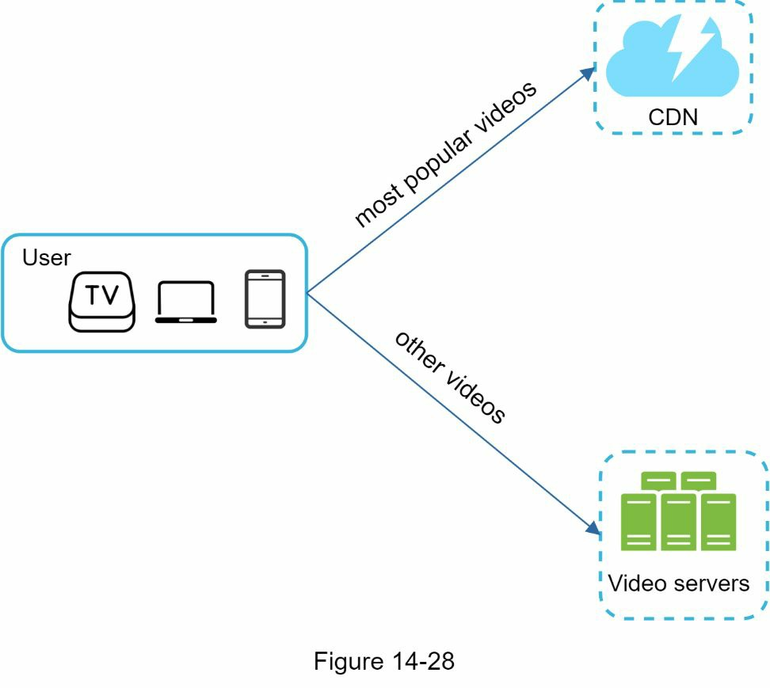

2. For less popular content, we may not need to store many encoded video versions. Short videos can be encoded on-demand.
3. Some videos are popular only in certain regions. There is no need to distribute these videos to other regions.
4. Build your own CDN like Netflix and partner with Internet Service Providers (ISPs). Building your CDN is a giant project; however, this could make sense for large streaming companies. 
    <details>
    An ISP can be Comcast, AT&T, Verizon, or other internet providers. ISPs are located all around the world and are close to users. By partnering with ISPs, you can improve the viewing experience and reduce the bandwidth charges.
    </details>

### Error handling

Two types of errors exist:
- Recoverable error. For recoverable errors such as video segment fails to transcode, the general idea is to retry the operation a few times. If the task continues to fail and the system believes it is not recoverable, it returns a proper error code to the client.
- Non-recoverable error. For non-recoverable errors such as malformed video format, the system stops the running tasks associated with the video and returns the proper error code to the client. 

Typical errors for each system component are covered by the following playbook:
- Upload error: retry a few times.
- Split video error: if older versions of clients cannot split videos by GOP alignment, the entire video is passed to the server. The job of splitting videos is done on the server-side.
- Transcoding error: retry.
- Preprocessor error: regenerate DAG diagram.
- DAG scheduler error: reschedule a task.
- Resource manager queue down: use a replica.
- Task worker down: retry the task on a new worker.
- API server down: API servers are stateless so requests will be directed to a different API server.
- Metadata cache server down: data is replicated multiple times. If one node goes down, you can still access other nodes to fetch data. We can bring up a new cache server to replace the dead one.
- Metadata DB server down:
    - Master is down. If the master is down, promote one of the slaves to act as the new master.
    - Slave is down. If a slave goes down, you can use another slave for reads and bring up another database server to replace the dead one.

## Step 4 - Wrap up
In this chapter, we presented the architecture design for video streaming services like YouTube. If there is extra time at the end of the interview, here are a few additional points:
- Scale the API tier: Because API servers are stateless, it is easy to scale API tier horizontally.
- Scale the database: You can talk about database replication and sharding.
- Live streaming: It refers to the process of how a video is recorded and broadcasted in real time. Although our system is not designed specifically for live streaming, live streaming and non-live streaming have some similarities: both require uploading, encoding, and streaming. The notable differences are:
    - Live streaming has a higher latency requirement, so it might need a different streaming protocol.
    - Live streaming has a lower requirement for parallelism because small chunks of data are already processed in real-time.
    - Live streaming requires different sets of error handling. Any error handling that takes too much time is not acceptable.

- Video takedowns: Videos that violate copyrights, pornography, or other illegal acts shall be removed. Some can be discovered by the system during the upload process, while others might be discovered through user flagging.