YouTube stats
• Total number of monthly active users: 2 billion.
• Number of videos watched per day: 5 billion.
• 73% of US adults use YouTube.
• 50 million creators on YouTube.
• YouTube’s Ad revenue was $15.1 billion for the full year 2019, up 36% from 2018.
• YouTube is responsible for 37% of all mobile internet traffic.
• YouTube is available in 80 different languages.

# Step 1 - Understand the problem and establish design scope

- Features
  - Upload a video and watch a video
- Clients
  - Mobile, Web, Smart TV
- DAU
  - 5 mil
- Average daily time spent
  - 30 min
- Support international users
  - yes
- Supported video resolutions
  - Accept most of the video resolutions and formats
- Encryption required
  - Yes
- Any file size requirement for videos?
  - Small/medium sized video. Max: 1GB
- Use the existing cloud infra providers?
  - Yes

Major features
• Ability to upload videos fast
• Smooth video streaming
• Ability to change video quality
• Low infrastructure cost
• High availability, scalability, and reliability requirements
• Clients supported: mobile apps, web browser, and smart TV

## Back of the envelope estimation
- DAU: 5 mil
- Users watch 5 videos per day
- 10 % of users upload 1 video per day
- Average video size is 300 MB
- Total daily storage space needed: 5 mil * 10% * 300MB = 150TB
- CDN cost

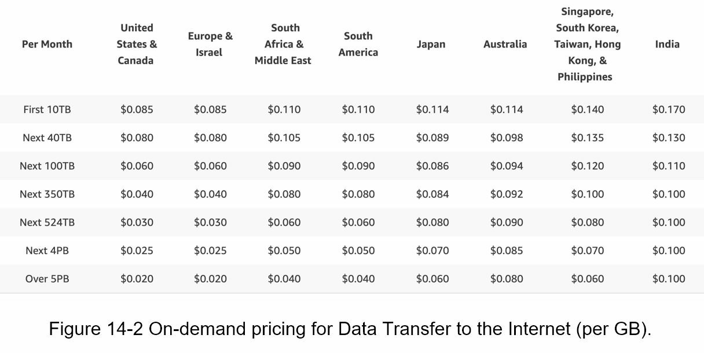

# Step 2 - Propose high-level design and get buy-in

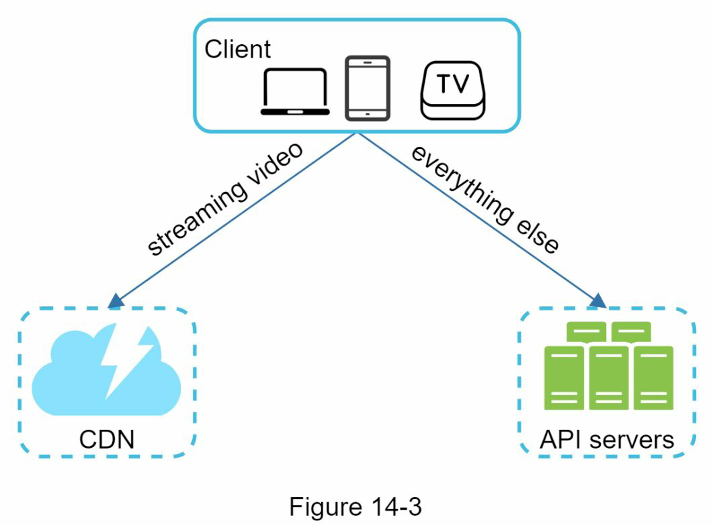

API servers: feed recommendation, generating video upload URL, updating metadata database and cache,
user signup, etc

## Video uploading flow

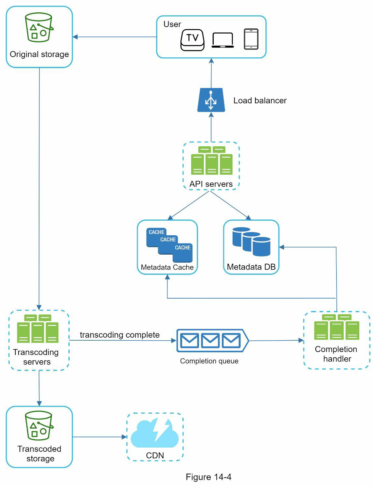

- User
- Load balancer: distributes requests among API servers.
- API servers: All user requests go through API servers except video streaming.
- Metadata DB: Video metadata. Sharded and replicated to meet performance and high availability requirements.
- Metadata cache: For better performance, video metadata and user objects are cached.
- Original storage: A blob storage system is used to store original videos.
- Transcoding servers: It is the process of converting a video format to other formats (MPEG, HLS, etc), which provide the best video streams possible for different devices and bandwidth capabilities.
- Transcoded storage: It is a blob storage that stores transcoded video files.
- CDN: Videos are cached in CDN. When you click the play button, a video is streamed from the CDN.
- Completion queue: Stores information about video transcoding completion events.
- Completion handler: List of workers that pull event data from the completion queue and update metadata cache and database.

### Flow break down
- Upload the actual video
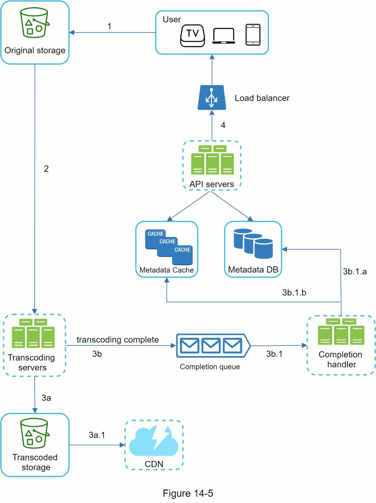
  1. Videos are uploaded to the original storage
  2. Transcoding.
     2.1. Transcoded videos are sent to transcoded storage.
     2.2. Transcoding completion events are queued in the completion queue
  3. Transcoded videos are distributed to CDN
  4. Completion handler updates the metadata database and cache when video transcoding is complete
  5. API servers inform the client that the video is successfully uploaded and is ready for streaming

- Update video metadata (video URL, size, resolution, format, user info, etc.)

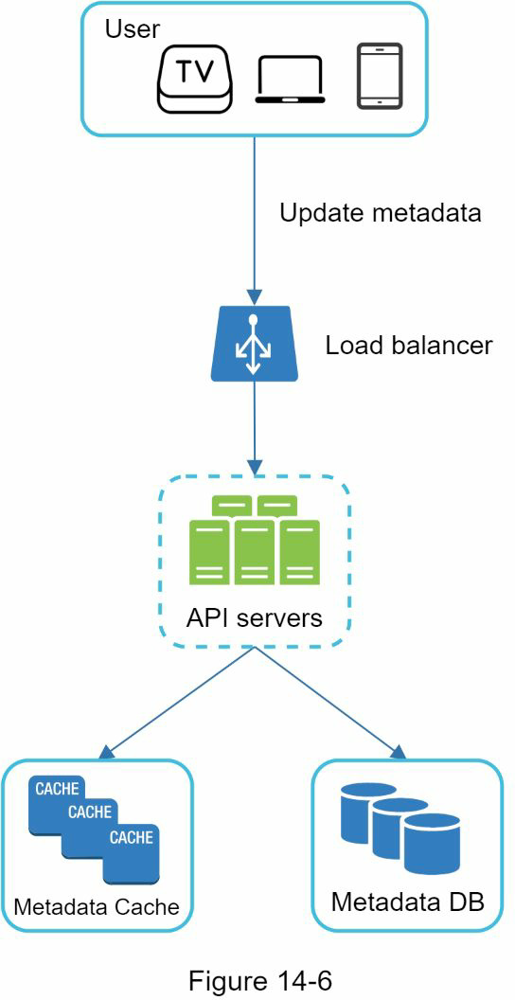

## Video streaming flow

Streaming protocols
- MPEG–DASH. MPEG stands for “Moving Picture Experts Group” and DASH stands for"Dynamic Adaptive Streaming over HTTP".
- Apple HLS. HLS stands for “HTTP Live Streaming”.
- Microsoft Smooth Streaming.
- Adobe HTTP Dynamic Streaming (HDS).

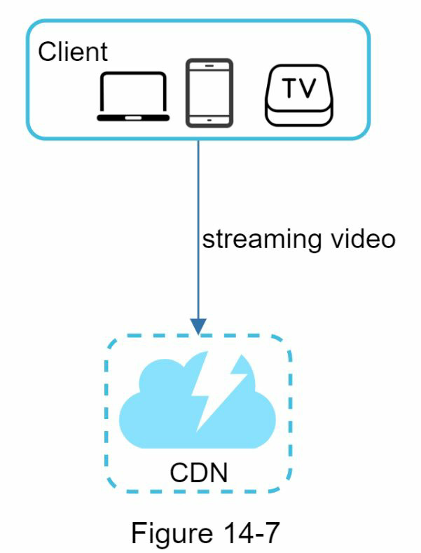

- Understand that different streaming protocols support different video encodings and playback players

# Step 3 - Design deep dive

## Video transcoding

- Encoding formats contain two parts
  - Container: a basket that contains the video file, audio, and metadata. You can tell the container format by the file extension, such as .avi, .mov, or .mp4
  - Codecs: compression and decompression algorithms aim to reduce the video size while preserving the video quality. The most used video codecs are H.264, VP9, and HEVC.

## Directed acyclic graph (DAG) model

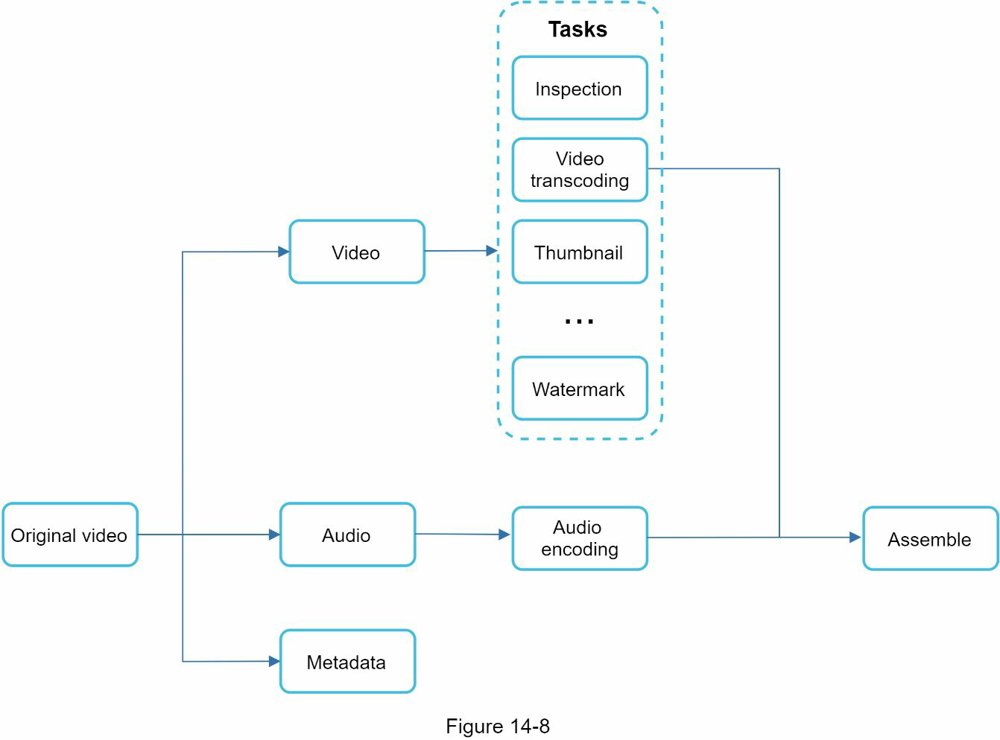

- Inspection: Make sure videos have good quality and are not malformed.
- Video encodings: Videos are converted to support different resolutions, codec, bitrates, etc. Figure 14-9 shows an example of video encoded files.
- Thumbnail. Thumbnails can either be uploaded by a user or automatically generated by the system.
- Watermark: An image overlay on top of your video contains identifying information about your video.

### Video transcoding architecture

Preprocessor has 4 responsibilities
- Vide splitting
  - Preprocessor split videos by GOP alignment for old clients.
- DAG generation
  - Generates DAG based on configuration files client programmers write
- Cache data: stores GOPs and metadata in temporary storage

### DAG Scheduler
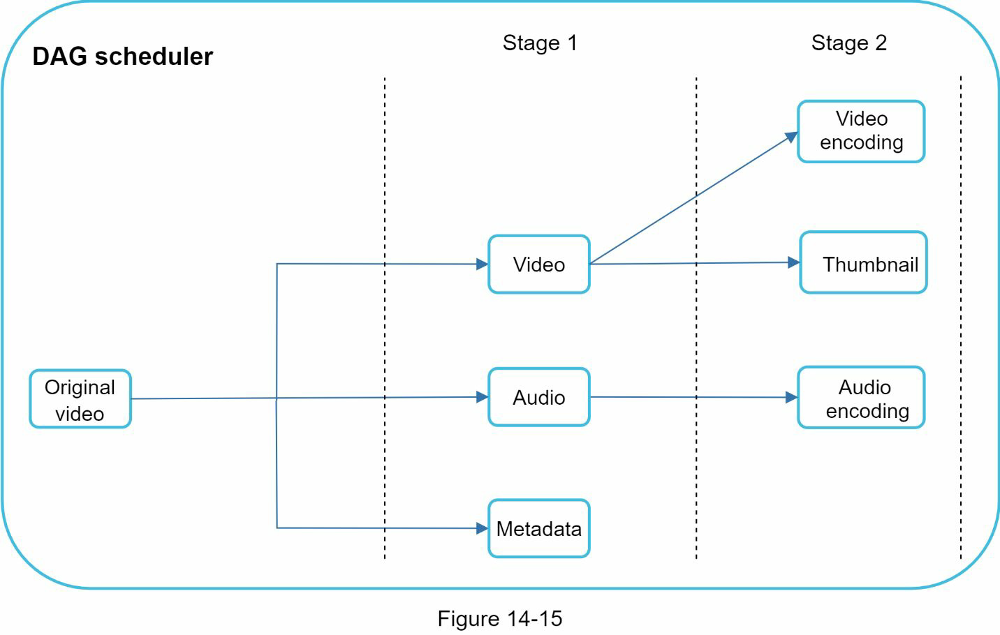

- DAG scheduler splits a DAG graph into stages of tasks and puts them in the task queue in the resource manager

### Resource manager

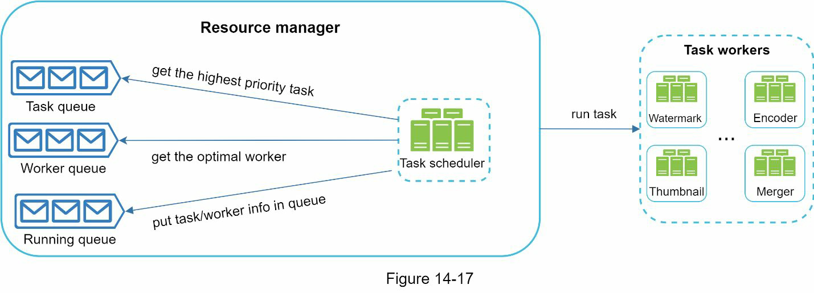

- Task queue: It is a priority queue that contains tasks to be executed.
- Worker queue: It is a priority queue that contains worker utilization info.
- Running queue: It contains info about the currently running tasks and workers running the tasks.
- Task scheduler: It picks the optimal task/worker, and instructs the chosen task worker to execute the job.

### Task workers

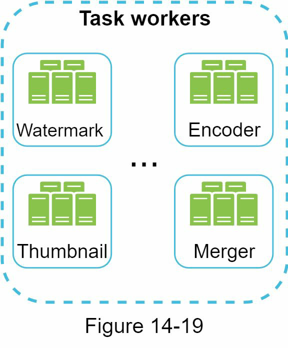

### Temporary storage

- The choice of storage system depends on factors like data type, data size, access frequency, data life span, etc.

### Encoded video

- The final output of the encoding pipeline

## System optimizations

### Speed optimization: parallelize video uploading

### Speed optimization: place upload centers close to users

- Setting up multiple upload centers across the globe

### Speed optimization: parallelism everywhere

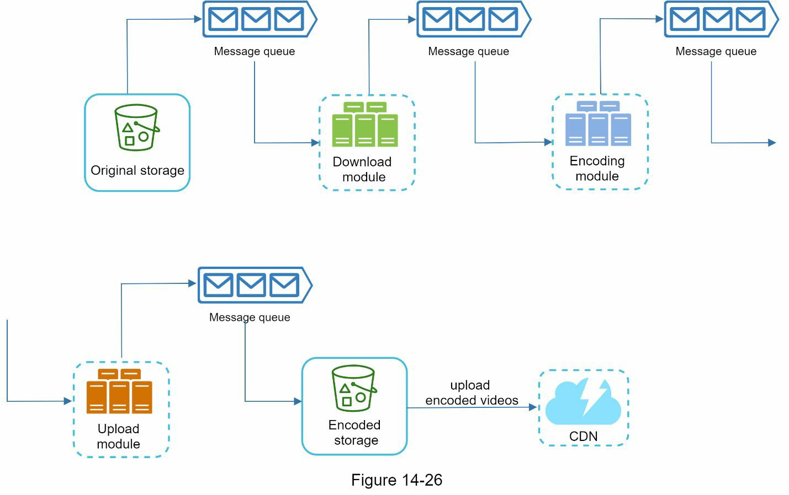

- The encoding module does not need to wait for the output of the download module anymore. If there are events in the message queue, the encoding module can execute those jobs in parallel.

### Safety optimization: pre-signed upload URL

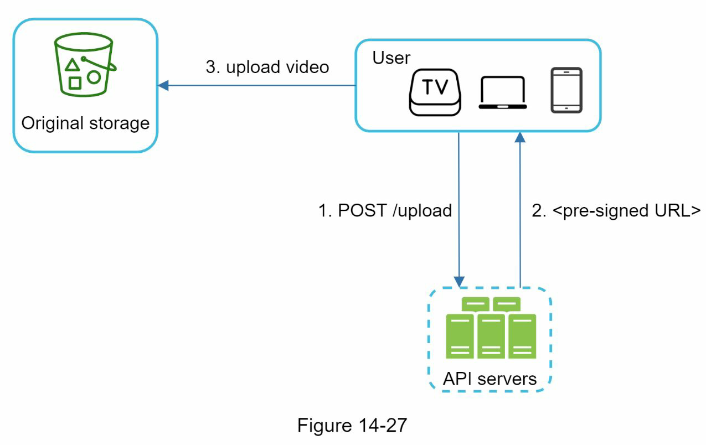

1. The client makes a HTTP request to API servers to fetch the pre-signed URL, which gives the access permission to the object identified in the URL. The term pre-signed URL
   is used by uploading files to Amazon S3. Other cloud service providers might use a
   different name.
2. API servers respond with a pre-signed URL.
3. Once the client receives the response, it uploads the video using the pre-signed URL.

### Safety optimization: protect your videos
- DRM, AES encryption, Visual watermarking

### Cost-saving optimization

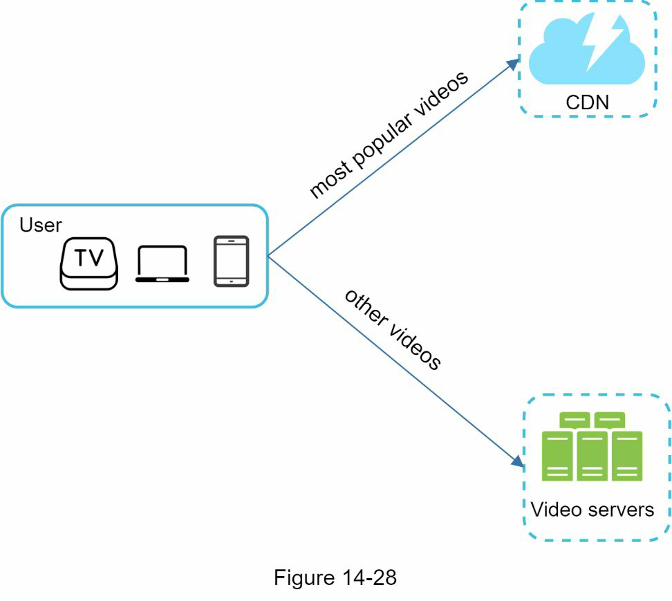
- Only serve the most popular videos from CDN and other videos from our high capacity storage video servers
- Short videos can be encoded on-demand.
- Some videos are popular only in certain regions. There is no need to distribute these videos to other regions
- Build your own CDN like Netflix and partner with Internet Service Providers (ISPs).

### Error handling

- Recoverable error: E.g. video segment fails to transcode
  - Retry the operation a few times. If the task continues to fail and the system believes it is not recoverable, it returns a proper error code to the client.
- Non-recoverable error. E.g. malformed video format
  - System stops the running tasks associated with the video and returns the proper error code to the client

#### Typical errors
- Upload error: retry a few times.
- Split video error: if older versions of clients cannot split videos by GOP alignment, the entire video is passed to the server. The job of splitting videos is done on the server-side.
- Transcoding error: retry.
- Preprocessor error: regenerate DAG diagram.
- DAG scheduler error: reschedule a task.
- Resource manager queue down: use a replica.
- Task worker down: retry the task on a new worker.
- API server down: API servers are stateless so requests will be directed to a different API server.
- Metadata cache server down: data is replicated multiple times. If one node goes down, you can still access other nodes to fetch data. We can bring up a new cache server to
replace the dead one.
- Metadata DB server down:
- Master is down. If the master is down, promote one of the slaves to act as the new master.
- Slave is down. If a slave goes down, you can use another slave for reads and bring up another database server to replace the dead one.

# Step 4 - Wrap up

Few additional points
- Scale the API tier
- Scale the database
- Live streaming
  - higher latency requirement: might need a different streaming protocol
  - lower requirement for parallelism because small chunks of data are already processed in real-time
  - different sets of error handling. Any error handling that takes too much time is not acceptable
- Video takedowns: Videos that violate copyrights, pornography, or other illegal acts shall be removed. Some can be discovered by the system during the upload process, while others might be discovered through user flagging

