# 14. DESIGN YOUTUBE

### Step 1 - Understand the problem and establish design scope
---
##### Features
- Ability to upload videos fast
- Smooth video streaming
- Ability to change video quality
- Low infrastructure cost
- High availability, scalability, and reliability requirements
- Clients supported: mobile apps, web browser, and smart TV

##### Back of the envelope estimation
- Assume the product has 5 million daily active users (DAU).
- Users watch 5 videos per day.
- 10% of users upload 1 video per day.
- Assume the average video size is 300 MB.
- Total daily storage space needed: 5 million * 10% * 300 MB = 150TB
- CDN cost.
    - 5 million * 5 videos * 0.3GB * $0.02 = $150,000 per day.

### Step 2 - Propose high-level design and get buy-in
---
##### 3 components 
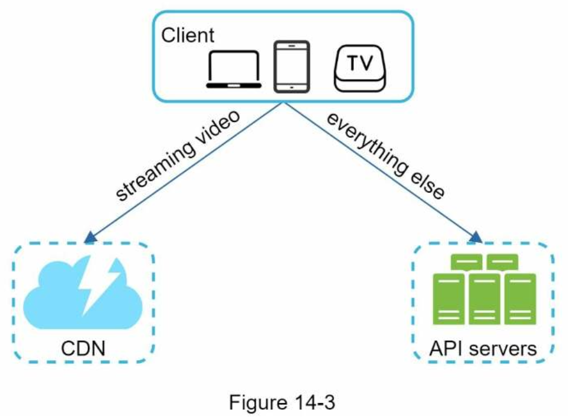
- **Client**: You can watch YouTube on your computer, mobile phone, and smartTV.
- **CDN**: Videos are stored in CDN. When you press play, a video is streamed from the CDN.
- **API servers**: Everything else except video streaming goes through API servers. This includes feed recommendation, generating video upload URL, updating metadata database and cache, user signup, etc.

##### Video uploading flow

- **User**: A user watches YouTube on devices such as a computer, mobile phone, or smart TV.
- **Load balancer**: A load balancer evenly distributes requests among API servers.
- **API servers**: All user requests go through API servers except video streaming.
- **Metadata DB**: Video metadata are stored in Metadata DB. It is sharded and replicated to meet performance and high availability requirements.
- **Metadata cache**: For better performance, video metadata and user objects are cached.
- **Original storage**: A blob storage system is used to store original videos. A quotation in Wikipedia regarding blob storage shows that: “A Binary Large Object (BLOB) is a collection of binary data stored as a single entity in a database management system”.
- **Transcoding servers**: Video transcoding is also called video encoding. It is the process of converting a video format to other formats (MPEG, HLS, etc), which provide the best video streams possible for different devices and bandwidth capabilities.
- **Transcoded storage**: It is a blob storage that stores transcoded video files.
- **CDN**: Videos are cached in CDN. When you click the play button, a video is streamed from the CDN.
- **Completion queue**: It is a message queue that stores information about video transcoding completion events.
- **Completion handler**: This consists of a list of workers that pull event data from the completion queue and update metadata cache and database.

##### Flow a: upload the actual video
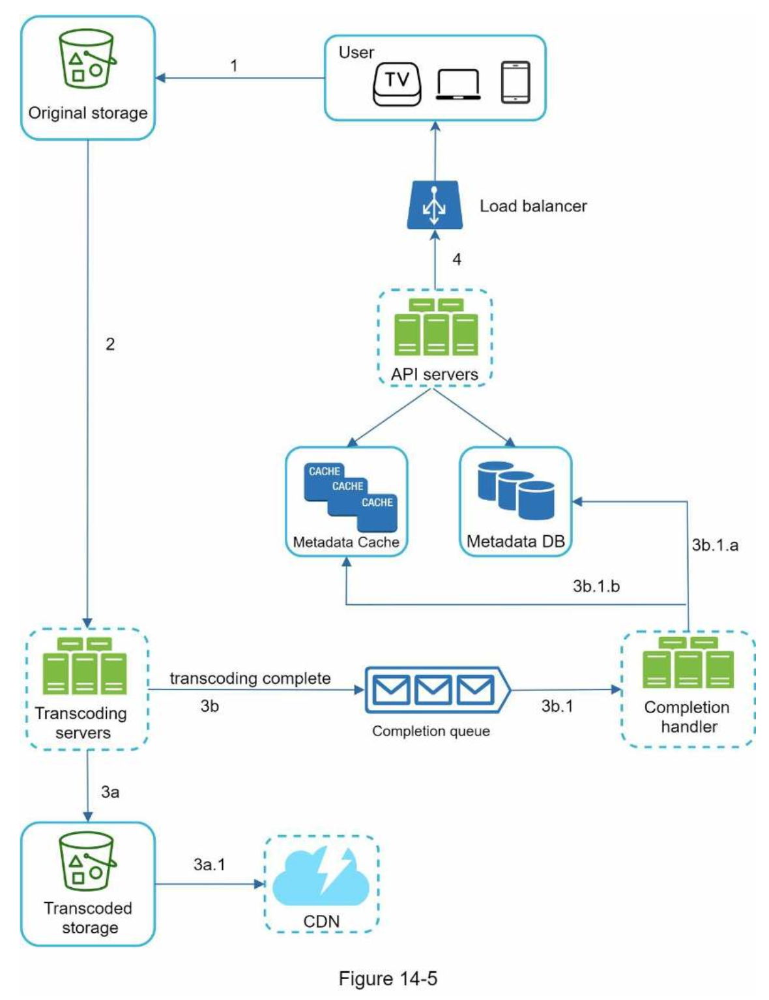
1. Videos are uploaded to the original storage.
2. Transcoding servers fetch videos from the original storage and start transcoding.
3. Once transcoding is complete, the following two steps are executed in parallel:
    - 3a. Transcoded videos are sent to transcoded storage.
        - 3a.1. Transcoded videos are distributed to CDN.
    - 3b. Transcoding completion events are queued in the completion queue. 
        - 3b.1. Completion handler contains a bunch of workers that continuously pull event data from the queue.
    - 3b.1.a. and 3b.1.b. Completion handler updates the metadata database and cache when video transcoding is complete.
4. API servers inform the client that the video is successfully uploaded and is ready for streaming.

##### Flow b: update the metadata
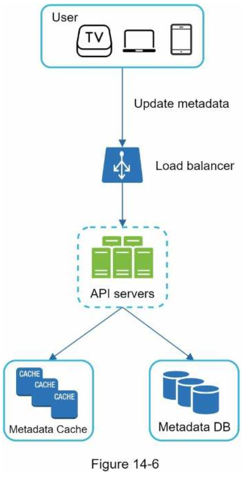
- The request contains video metadata, including file name, size, format, etc.

##### Video streaming flow
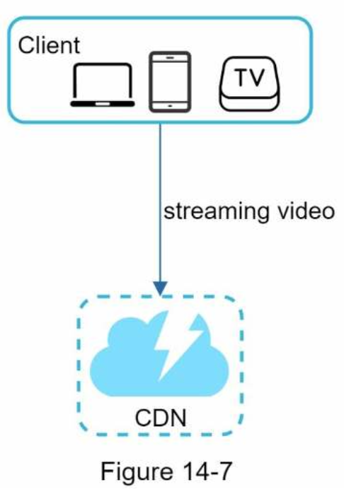
- When you watch streaming videos, your client loads a little bit of data at a time so you can watch videos immediately and continuously.
- The edge server closest to you will deliver the video. Thus, there is very little latency.

### Step 3 - Design deep dive
---
##### Video transcoding
- Reasons why it is important:
    - Raw video consumes large amounts of storage space. An hour-long high definition video recorded at 60 frames per second can take up a few hundred GB of space.
    - Many devices and browsers only support certain types of video formats. Thus, it is important to encode a video to different formats for compatibility reasons.
    - To ensure users watch high-quality videos while maintaining smooth playback, it is a good idea to deliver higher resolution video to users who have high network bandwidth and lower resolution video to users who have low bandwidth.
    - Network conditions can change, especially on mobile devices. To ensure a video is played continuously, switching video quality automatically or manually based on network conditions is essential for smooth user experience.
- Two parts of encoding formats: 
    - **Container**: This is like a basket that contains the video file, audio, and metadata. You can tell the container format by the file extension, such as .avi, .mov, or .mp4.
    - **Codecs**: These are compression and decompression algorithms aim to reduce the video size while preserving the video quality. The most used video codecs are H.264, VP9, and HEVC.

##### Directed acyclic graph (DAG) model
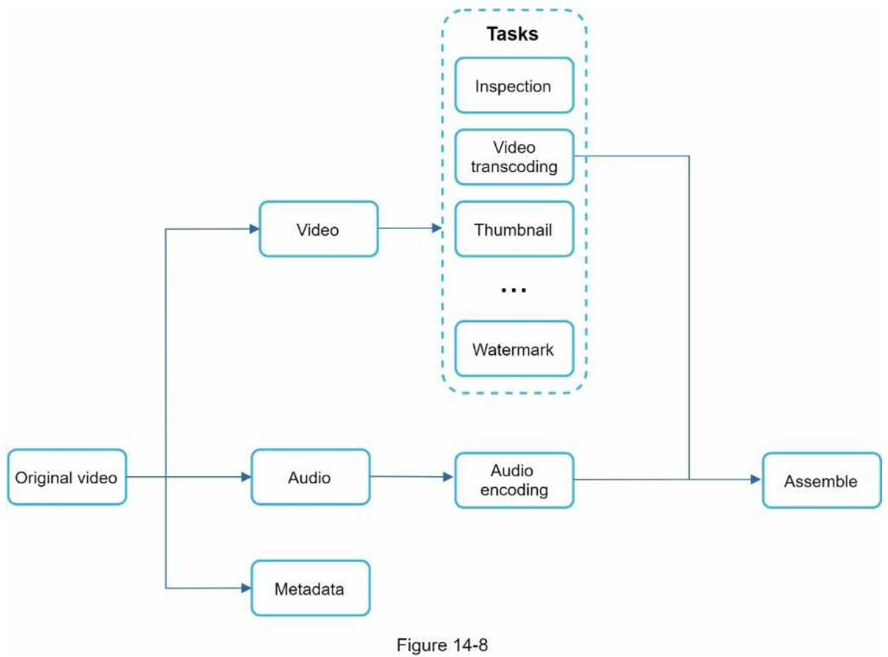
- Inspection: Make sure videos have good quality and are not malformed.
- Video encodings: Videos are converted to support different resolutions, codec, bitrates, etc. Figure 14-9 shows an example of video encoded files.
- Thumbnail. Thumbnails can either be uploaded by a user or automatically generated by the system.
- Watermark: An image overlay on top of your video contains identifying information about your video.

##### Video transcoding architecture
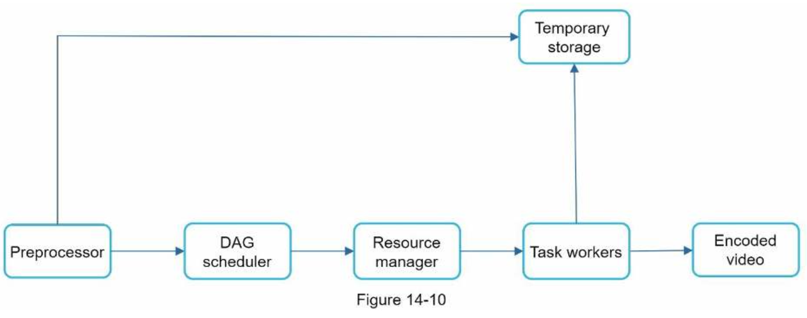
###### Preprocessor
1. Video splitting. Video stream is split or further split into smaller Group of Pictures (GOP) alignment. GOP is a group/chunk of frames arranged in a specific order. Each chunk is an independently playable unit, usually a few seconds in length.
2. Some old mobile devices or browsers might not support video splitting. Preprocessor split videos by GOP alignment for old clients.
3. DAG generation. The processor generates DAG based on configuration files client programmers write. This DAG representation is generated from the two configuration files below
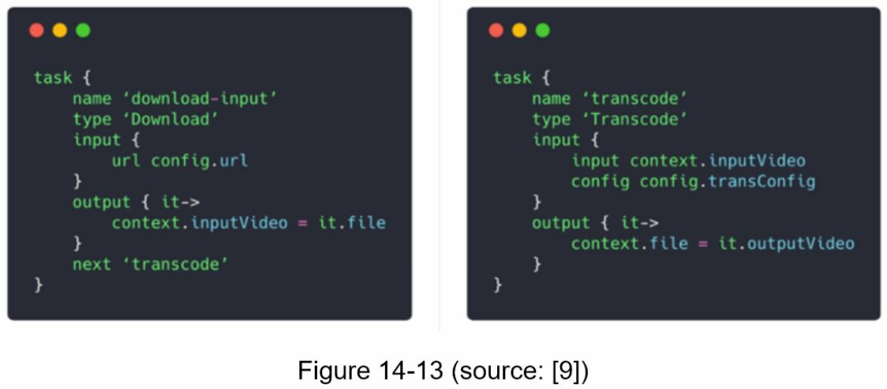
4. Cache data. The preprocessor is a cache for segmented videos. For better reliability, the preprocessor stores GOPs and metadata in temporary storage. If video encoding fails, the system could use persisted data for retry operations.

###### DAG scheduler
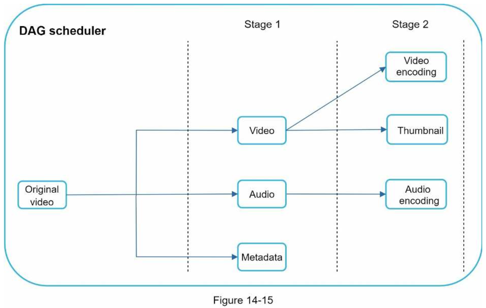

###### Resource manager
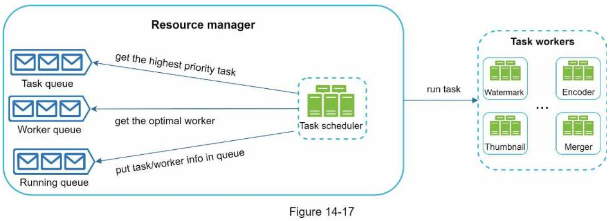
- The resource manager is responsible for managing the efficiency of resource allocation.

###### Task workers
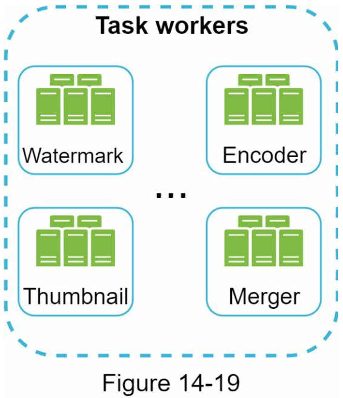
- Task workers run the tasks which are defined in the DAG.

###### Temporary storage
- Data in temporary storage is freed up once the corresponding video processing is complete.

###### Encoded video
- Encoded video is the final output of the encoding pipeline.

##### System optimizations
###### Speed optimization: parallelize video uploading

- We can split a video into smaller chunks by GOP alignment
- This allows fast resumable uploads when the previous upload failed. The job of splitting a video file by GOP can be implemented by the client to improve the upload speed.

###### Speed optimization: place upload centers close to users
- Another way to improve the upload speed is by setting up multiple upload centers across the globe.

###### Speed optimization: parallelism everywhere
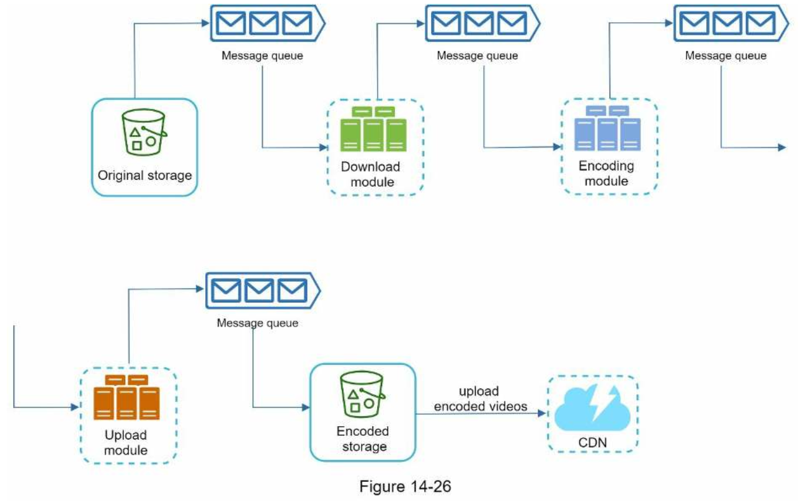
- Another optimization is to build a loosely coupled system and enable high parallelism.
- To make the system more loosely coupled, we introduced message queues.
- Before the message queue is introduced, the encoding module must wait for the output of the download module.
- After the message queue is introduced, the encoding module does not need to wait for the output of the download module anymore. If there are events in the message queue, the encoding module can execute those jobs in parallel.

###### Safety optimization: pre-signed upload URL
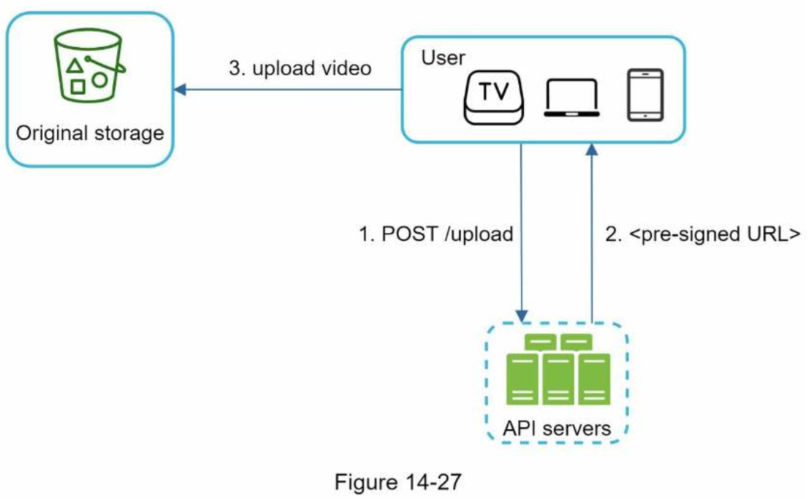
- To ensure only authorized users upload videos to the right location, we introduce pre-signed URLs.
1. The client makes a HTTP request to API servers to fetch the pre-signed URL, which gives the access permission to the object identified in the URL. The term pre-signed URL is used by uploading files to Amazon S3. Other cloud service providers might use a different name.
2. API servers respond with a pre-signed URL.
3. Once the client receives the response, it uploads the video using the pre-signed URL.

###### Safety optimization: protect your videos
- Digital rights management (DRM) systems: Three major DRM systems are Apple FairPlay, Google Widevine, and Microsoft PlayReady.
- AES encryption: You can encrypt a video and configure an authorization policy. The encrypted video will be decrypted upon playback. This ensures that only authorized users can watch an encrypted video.
- Visual watermarking: This is an image overlay on top of your video that contains identifying information for your video. It can be your company logo or company name.

###### Cost-saving optimization
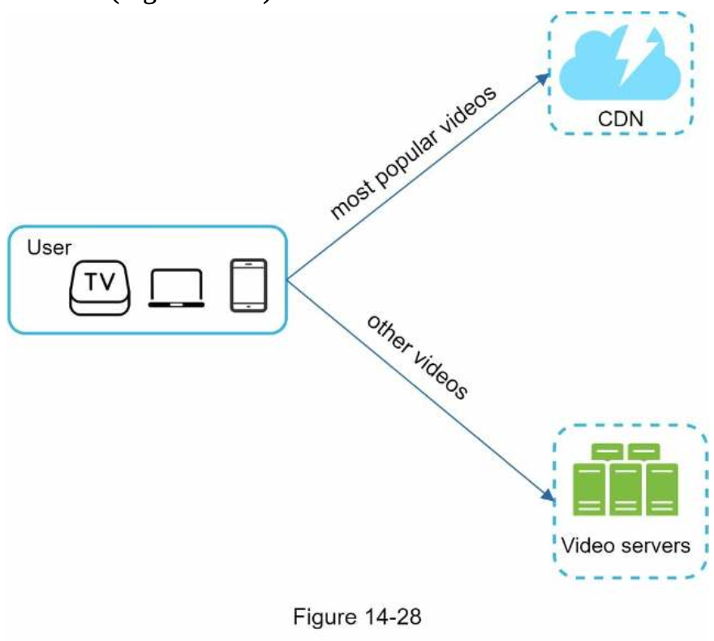
1. Only serve the most popular videos from CDN and other videos from our high capacity storage video servers
2. For less popular content, we may not need to store many encoded video versions. Short videos can be encoded on-demand.
3. Some videos are popular only in certain regions. There is no need to distribute these videos to other regions.
4. Build your own CDN like Netflix and partner with Internet Service Providers (ISPs). Building your CDN is a giant project; however, this could make sense for large streaming companies. An ISP can be Comcast, AT&T, Verizon, or other internet providers. ISPs are located all around the world and are close to users. By partnering with ISPs, you can improve the viewing experience and reduce the bandwidth charges.

##### Error handling
- Two types of errors:
    - Recoverable error. For recoverable errors such as video segment fails to transcode, the general idea is to retry the operation a few times. If the task continues to fail and the system believes it is not recoverable, it returns a proper error code to the client.
    - Non-recoverable error. For non-recoverable errors such as malformed video format, the system stops the running tasks associated with the video and returns the proper error code to the client.
- Error handling:
    - **Upload error**: retry a few times.
    - **Split video error**: if older versions of clients cannot split videos by GOP alignment, the entire video is passed to the server. The job of splitting videos is done on the server-side.
    - **Transcoding error**: retry.
    - **Preprocessor error**: regenerate DAG diagram.
    - **DAG scheduler error**: reschedule a task.
    - **Resource manager queue down**: use a replica.
    - **Task worker down**: retry the task on a new worker.
    - **API server down**: API servers are stateless so requests will be directed to a different API server.
    - **Metadata cache server down**: data is replicated multiple times. If one node goes down, you can still access other nodes to fetch data. We can bring up a new cache server to replace the dead one.
    - **Metadata DB server down**:
        - Master is down. If the master is down, promote one of the slaves to act as the new master.
        - Slave is down. If a slave goes down, you can use another slave for reads and bring up another database server to replace the dead one.

### Step 4 - Wrap up
---
##### A few additional points:
- Scale the API tier: Because API servers are stateless, it is easy to scale API tier horizontally.
- Scale the database: You can talk about database replication and sharding.
- Live streaming: It refers to the process of how a video is recorded and broadcasted in real time.
    - Live streaming has a higher latency requirement, so it might need a different streaming protocol.
    - Live streaming has a lower requirement for parallelism because small chunks of data are already processed in real-time.
    - Live streaming requires different sets of error handling. Any error handling that takes too much time is not acceptable.
- Video takedowns: Videos that violate copyrights, pornography, or other illegal acts shall be removed. Some can be discovered by the system during the upload process, while others might be discovered through user flagging.