# Chapter 14: Design Youtube
- You are asked to design YouTube.
    - Can be applied to other questions like designing a video sharing platform (i.e. Netflix, Hulu)
- Looks simple - content creators upload videos and viewers click play. However, there are lots of complex technologies underneath the simplicity.

- Fun facts of YouTube 2023/2024:
    - Total number of monthly active users: Over 2.5 billion.
    - Number of videos watched per day: Over 6 billion.
    - Approximately 75% of US adults use YouTube.
    - There are now over 60 million creators on YouTube.
    - YouTube's Ad revenue reached $20.5 billion for the full year 2023, showing continued growth.
    - YouTube is responsible for approximately 40% of all mobile internet traffic.
    - YouTube is available in over 100 different languages.

## Step 1: Understand the Problem and Establish Design Scope
- Some features: 
    - watch a video
    - comment
    - share
    - like
    - save a video to playlists
    - subscribe to a channel
- Impossible to design everything within 45-60 min interview. Thus very important to ask questions to narrow down the scope.

- Q: What are important features?
- A: Ability to upload a video and watch a video

- Q: What clients do we need to support?
- A: Mobile apps, web browsers, and smart TV

- Q: How many daily active users do we have?
- A: 5 million

- Q: What is the average daily time spent on the product?
- A: 30 minutes

- Q: Do we need to support international users?
- A: Yes, a large percentage of users are international users

- Q: What are the supported video resolutions?
- A: The system accepts most of the video resolutions and formats

- Q: Is encryption required?
- A: Yes
    - Transport Layer Security (TLS): TLS encryption secures data transmission over the internet between the client (user's device) and the server (YouTube's servers). It ensures that data exchanged during the upload process is encrypted and protected from eavesdropping or tampering.

    - Storage Encryption: Encryption of stored video files on the server-side ensures that even if unauthorized access occurs, the data remains encrypted and unreadable. This can involve techniques such as encrypting files at rest using encryption keys managed by the server.

    - Access Control Encryption: Encryption of access control mechanisms such as user credentials, authentication tokens, and access policies helps prevent unauthorized access to user accounts and uploaded videos.

    - Digital Rights Management (DRM): For premium content or copyrighted material, DRM encryption may be employed to protect against unauthorized distribution or copying. DRM technologies often use encryption to control access to video content and enforce usage restrictions.

- Q: Any file size requirement for videos?
- A: Our platform focuses on small and medium-sized videos. Max allowed video size is 1GB.

- Q: Can we leverage some of the existing cloud infrastructures provided by Amazon, Google, or Microsoft?
- A: Building everything from scratch is unrealistic for most companies, it is recommended to leverage some of the existing cloud services.

- In summary:
    - Ability to upload videos fast
    - Smooth video streaming
    - Ability to change video quality
    - Low infrastructure cost
    - High availability, scalability, and reliability requirements
    - Clients supported: mobile apps, web browser, and smart TV

## Back of the Envelope Estimation
- Based on many assumptions, so very important to communicate with the interviewer to make sure they are on the same page.
    - Assume the product has 5 million daily active users (DAU). - Users watch 5 videos per day.
    - 10% of users upload 1 video per day.
    - Assume the average video size is 300 MB.
    - Total daily storage space needed: 5 million * 10% * 300 MB = 150TB
    - CDN cost.
        - When cloud CDN serves a video, you are charged for data transferred out of the CDN.
        - Let us use Amazon’s CDN CloudFront for cost estimation (Figure 14-2) [3]. Assume 100% of traffic is served from the United States. The average cost per GB is $0.02. For simplicity, we only calculate the cost of video streaming.
        - 5 million * 5 videos * 0.3GB * $0.02 = $150,000 per day.
    
- From this rough cost estimation, we know serving videos from the CDN is expensive.

- On-demand pricing for Data Transfer to the Internet (/GB):

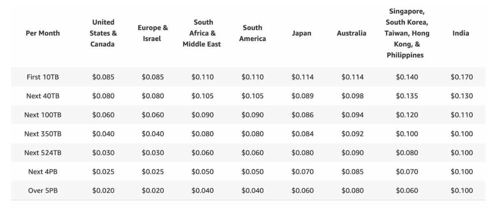

## Step 2: Propose High-Level Design and Get Buy-In
- Cloud services we will leverage: 
    - CDN
    - blob storage
        - Blob storage, short for Binary Large Object storage, is a type of storage system designed to store and manage unstructured data as binary data objects, or blobs. These blobs can include various types of data, such as images, videos, documents, backups, logs, and other types of files.

- Why not build everything ourselves?
    - System design interviews are not about building everything from scratch.
    - Choosing the right technology to do the right job > explaining in detail how every technology works
    - Talking about the detailed design for every component could even be an overkill
        - mentioning blob storage for storing source videos is enough
    - Building scalable blob storage or CDN is extremely complex & costly
        - Netflix leverages Amazon's cloud services
        - Facebook uses Akamai's CDN

- System components at the high-level:

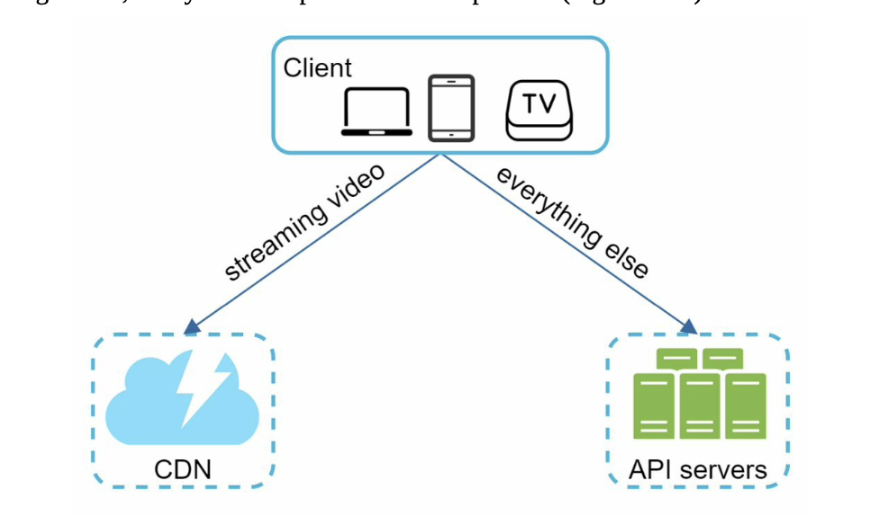    

- Client: can watch YouTube on their computer, mobile phone, smartTV
- CDN: stores videos. When clients press play, a video is streamed from the CDN
- API servers: Everything else except video streaming goes through API servers
    - feed recommendation
    - generating video upload URL
    - updating metadata db and cache
    - user signup
    - etc

### Video uploading flow

- High-level design:

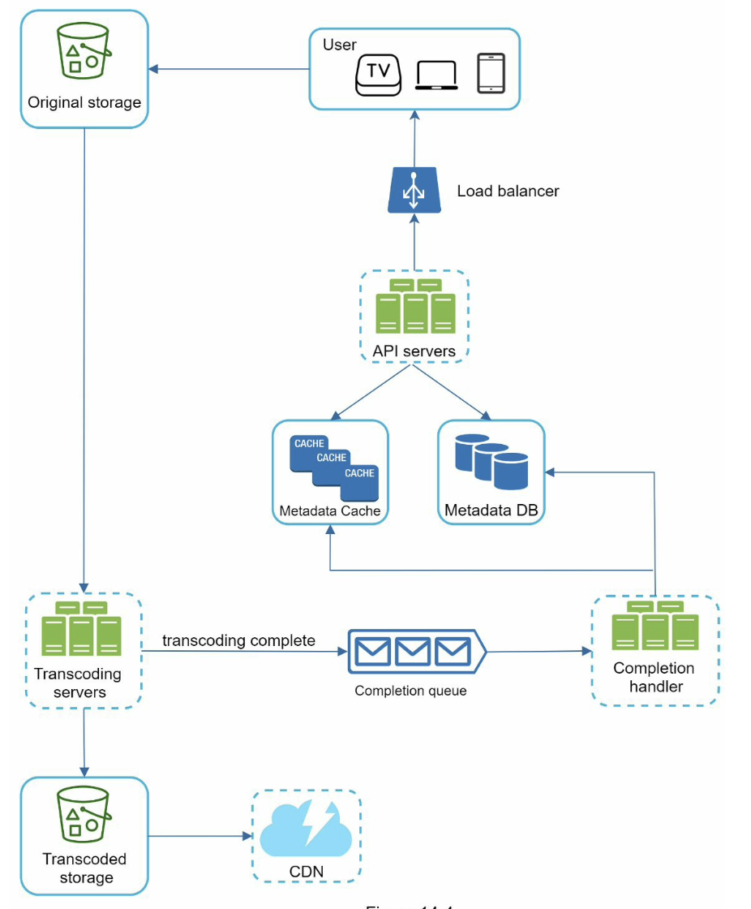    

- User: watches YouTube on devides
- Load Balancer: evenly distributes requests among API servers
- API servers: all user requests go through API servers but video streaming
- Metadata DB: stores video metadata. It is sharded and replicated to meet performance and high availability requirements
- Metadata cache: for better performance, caches video metadata and user objects
- Original storage: a blob storage system is used to store original videos
- Transcoding servers: aka video encoding. The process of converting a video format to other formats (MPEG, HLS, etc) to provide the best video streams possible for different devices and bandwidth capabilities
- Transcoded storage: blob storage that stores transcoded video files
- CDN: caches videos. 
- Completion queue: message queue that stores information about video transcoding completion events
- Completion handler: a list of workers that pull event data from the completion queue and update metadata cache and db

### Flow a: upload the actual video
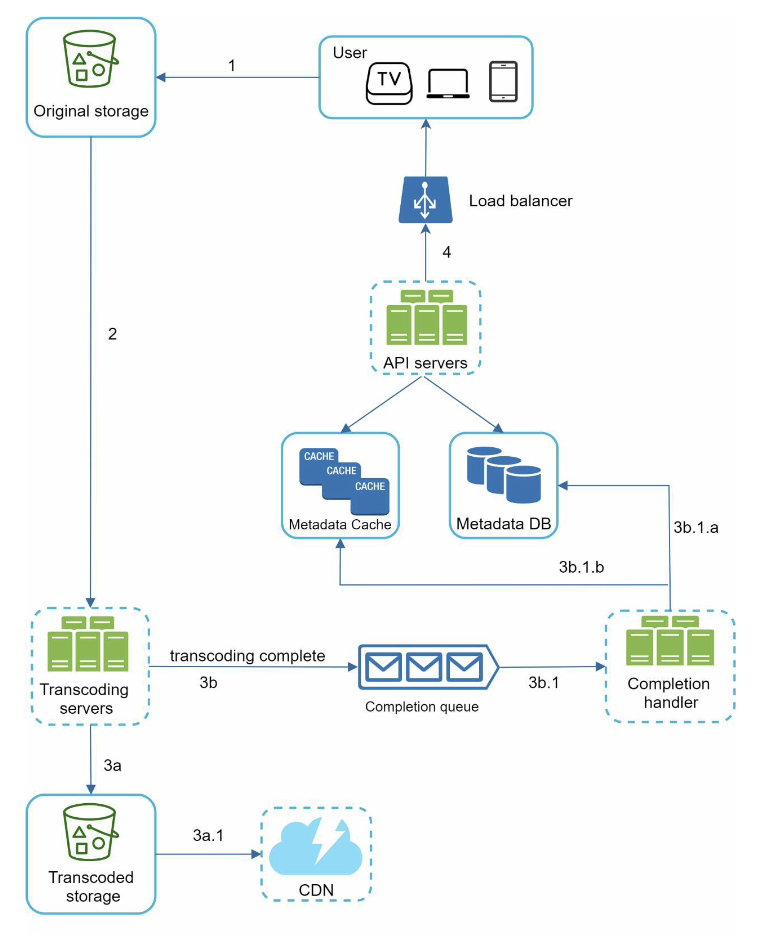    
1. Videos are uploaded to the original storage.
2. Transcoding servers fetch videos from the original storage and start transcoding. 3. Once transcoding is complete, the following two steps are executed in parallel:
3a. Transcoded videos are sent to transcoded storage.
3b. Transcoding completion events are queued in the completion queue. 3a.1. Transcoded videos are distributed to CDN.
    3b.1. Completion handler contains a bunch of workers that continuously pull event data from the queue.
    3b.1.a. and 3b.1.b. Completion handler updates the metadata database and cache when video transcoding is complete.
4. API servers inform the client that the video is successfully uploaded and is ready for streaming.

### Flow b: update the metadata
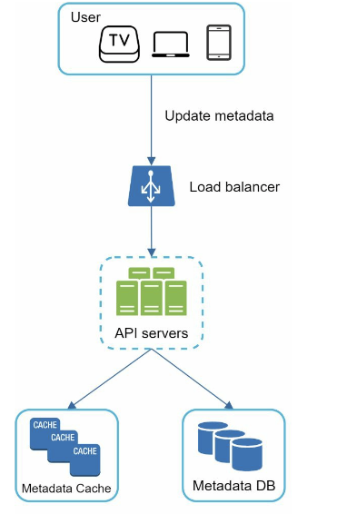   

- While a file is being uploaded to the original storage, the client in parallel sends a request to update the video metadata.
- Request contains:
    - video metadata - file name, size, format, etc
- API servers update the metadata cache and db

### Video streaming flow
- Users usually start streaming immediately instead of downloading the whole video
    - downloading: the whole video is copied to your device
    - streaming: your device continuously receives video streams from remote source videos. Your client loads a little bit of data at a time.

- Streaming protocol: standardized way to control data transfer for video streaming
    - MPEG–DASH. MPEG stands for “Moving Picture Experts Group” and DASH stands for "Dynamic Adaptive Streaming over HTTP".
    - Apple HLS. HLS stands for “HTTP Live Streaming”. 
    - Microsoft Smooth Streaming.
    - Adobe HTTP Dynamic Streaming (HDS).

- Don't need to fully understand/remember all streaming protocols, but need to know that different streaming protocols support different video encodings and playback players

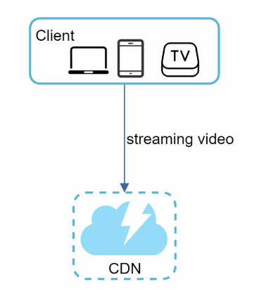 
- Videos streamed from CDNs directly
- The edge server closest to you delivers the video

## Step 3: Design deep dive
- Refine video uploading flow and video streaming flow with important optimizations and introduce error handling mechanisms

### Video transcoding
- When recording a video, the device (i.e. phone, camera) gives the video file a certain format
    - if you want this to play smoothly on other devices, we need encoding (into bitrates and formats)
        - bitrate: the rate at which bits are processed over time 
            - higher bitrate, higher video quality
            - high bitrat streams need more processing power and fast internet speed

- Why is video transcoding important?
    - raw video consumes large amounts of storage space
    - many devices and browsers only support certain types of video formats (compatibility)
    - ensure users watch high-quality videos while maintaining smooth playback
        - high resolution videos to users with high network bandwidth
        - low resolution videos to users with low bandwidth
    - network conditions change (especially mobile devices)
        - need to switch video quality automatically based on network conditions for smooth user experience
    
- Many types of encoding formats, but most contian two parts:
    - Container: contains the video file, audio, and metadata
        - format: .avi, .mov, .mp4
    - Codecs: compression and decompression algorithms to reduce the video size while preserving video quality
        - i.e. H.264, VP9, HEVC

### Directed acyclic graph (DAG) model

- Transcoding a video is computationally expensive and time-consuming.
    - Also, different content creators may havw different video processing requirements
        - watermarks on top of their videos
        - provide thumbnail images themselves
        - high definition videos
    
- To support different video processing pipelines and maintain high parallelism, we need to add some abstraction and let client programmers define what tasks to execute
- Thus we adopt a DAG model to achieve flexibility and parallelism

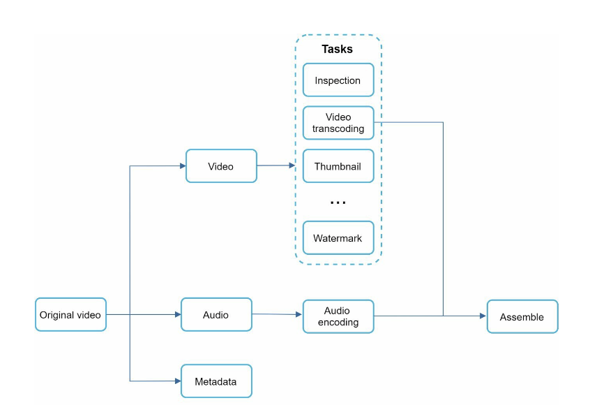 

- original video split into video, audio, and metadata
- tasks that are applied on a video file:
    - inspection: make sure videos have good quality and are not malformed
    - video encodings: videos are converted to support different resolutions, codec, bitrates, etc
     
    - thumbnail: can either be uploaded by a user or automatically generated by the system
    - watermark: an image overlay on top of the video that contains identifying information about the video

### Video transcoding architecture

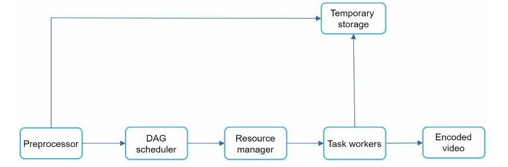 

#### Preprocessor - 4 responsibilities
    - Video splitting: video stream is split into smaller GOPs (Group Of Pictures) alignment. 
        - GOP: group of frames arranged in a specific order
            - each group is an independently playable unit
            - usually a few seconds
    - Some old mobile devices might not support ^. Preprocessor split videos by GOP alignment for old clients
    - DAG generation
        - generates DAG based on configuration files client programmers write
        - Simplified DAG representation:
         
        - config files example:
        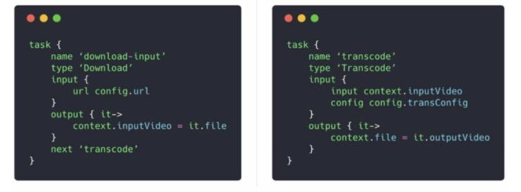 

    - Cache data
        - preprocessor is a cache for segmented videos.
        - stores GOPs and metadata in temporary storage for better reliability
            - if video encoding fails, the system could use persisted data for retry operations
    
#### DAG scheduler
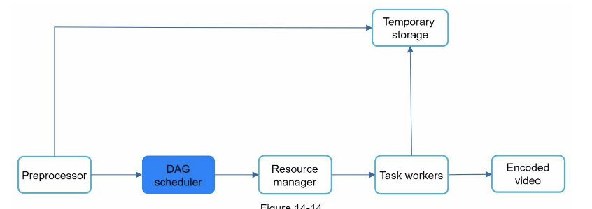 
- DAG scheduler splits a DAG graph into stages of tasks and puts them in the task queue in the resource manager

- How a DAG scheduler works:
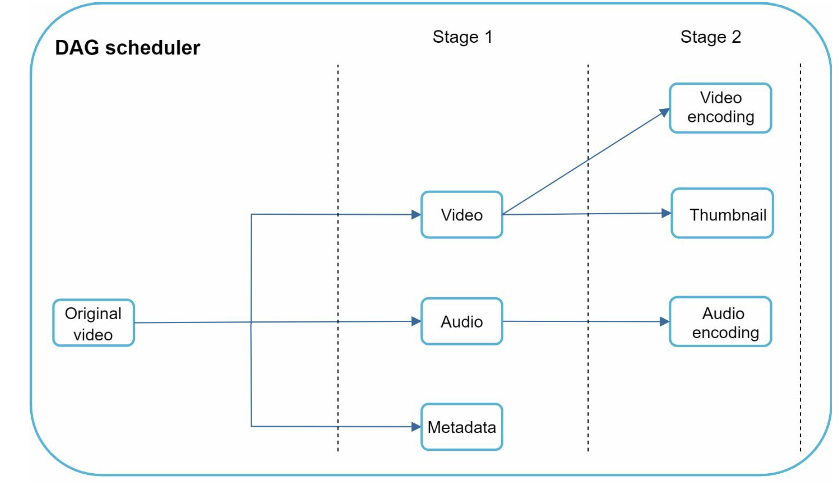 

- Stage 1: split original video into video, audeo, metadata
- Stage 2: video encoding, thumbnail, audio encoding

#### Resource manager
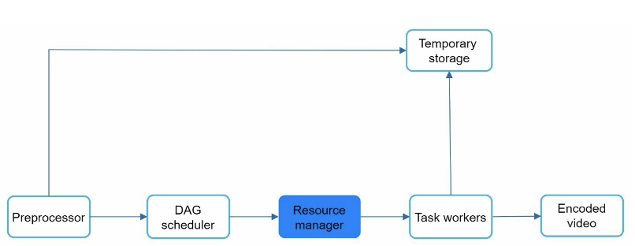 
- Responsible for maintaining the efficiency of resource allocation
- contains 3 queues and a task scheduler
    - Task queue: a priority queue that contains tasks to be executed
    - Worker queue: a priority queue that contains worker utilization info
    - Running queue: contains info about the currently running tasks and workers running the tasks
    - Task scheduler: pick the optimal task/worker, and instructs the chosen task worker to execute the job

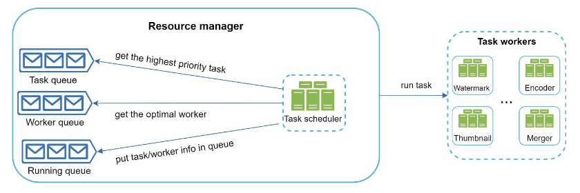 

- The task scheduler gets the highest priority task from the task queue.
- The task scheduler gets the optimal task worker to run the task from the worker queue. - The task scheduler instructs the chosen task worker to run the task.
- The task scheduler binds the task/worker info and puts it in the running queue.
- The task scheduler removes the job from the running queue once the job is done.

#### Task workers
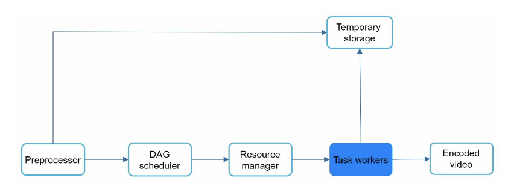 
- run the tasks which are defined in the DAG
- different task workers may run different tasks

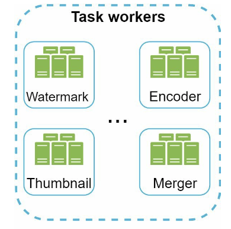 

#### Temporary storage

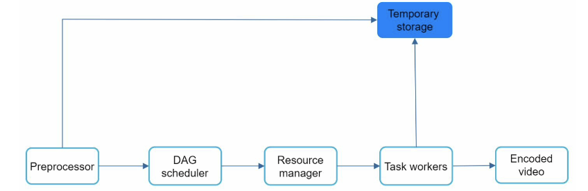 
- multiple storage systems are used here
    - choice of storage system depends on:
        - data type
        - data size
        - access frequency
        - data life span
        - etc
    - i.e. metadata is frequently accessed by workers, and the data size is usually small. Thus, caching metadata in memory is a good idea. For video or audio data, we put them in blob storage. Data in temporary storage is freed up once the corresponding video processing is complete.

#### Encode video
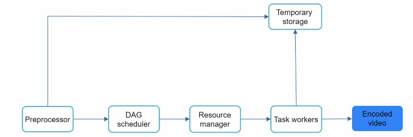 
- final output of the encoding pipeline
- i.e. funny_720p.mp4

### System Optimizations
#### Speed optimization: parallelize video uploading
- uploading a video as a whole unit is inefficient
- can split a video into smaller chunks by GOP alignment 

 

- allows fask resumable uploads when the previous upload failed
- The job of splitting a video file by GOP can be implemented by the client to improve the upload speed:

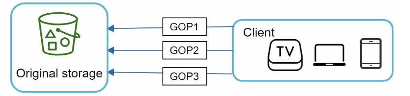 

#### Speed optimization: place upload centers close to users
- set up multiple upload centers across the globe
- to achieve this, we use CDN as upload centers

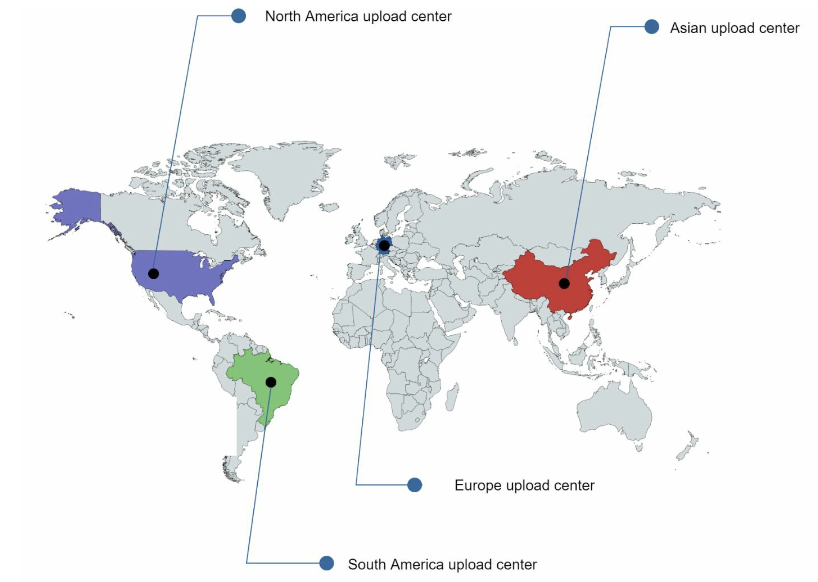 

#### Speed optimization: parallelizm everywhere

- achieving low latency - build a loosely coupled system and enable high parallelism
- flow of how a video is transferred from original storage to the CDN:
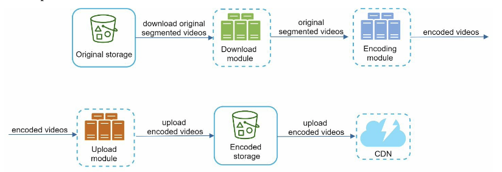 

- the output depends on the input of the previous step.
    - this dependency makes parallelism difficult

- to make the system more loosely coupled, we introduce message queues :

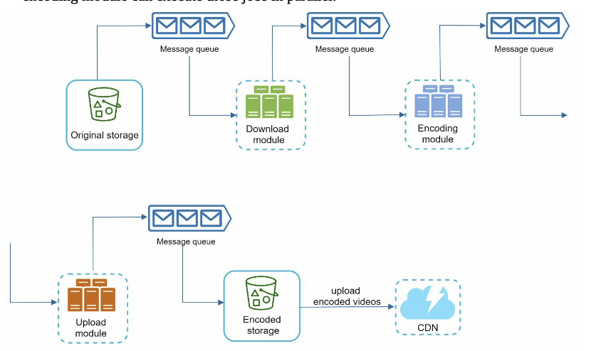 

- before the message queue was introduced, the encoding module must wait for the output of the download module
- after message queue, the encoding module doesn't need to wait for the output of the download module. If there are events in the message queue, the encoding module can execute those jobs in parallel

#### Safety optimization: pre-signed upload URL
- ensure only authorized users upload videos to the right location
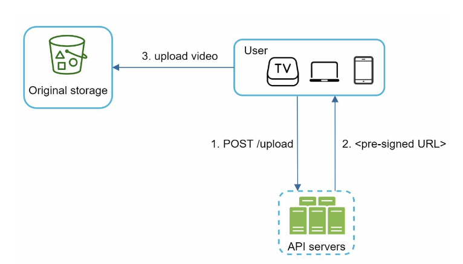 

- new upload flow:
    1. Client requests a pre-signed URL from API servers to access the desired object (e.g., video) for uploading.
    2. API servers provide the client with a pre-signed URL.
    3. The client receives the pre-signed URL and proceeds to upload the video using this URL.

#### Safety optimization: protect your videos
To safeguard copyrighted videos, there are three main safety options:

- Digital rights management (DRM) systems: Examples include Apple FairPlay, Google Widevine, and Microsoft PlayReady.
- AES encryption: Encrypt the video and establish an authorization policy to decrypt it during playback, ensuring only authorized users can view it.
- Visual watermarking: Overlay the video with an image containing identifying information, such as a company logo or name, to deter unauthorized use.

#### Cost-saving optimization
To reduce CDN costs while ensuring efficient video delivery, we implement several optimizations based on content popularity and user access patterns:

1. Serve only the most popular videos from the CDN, while storing other videos on high-capacity storage video servers.
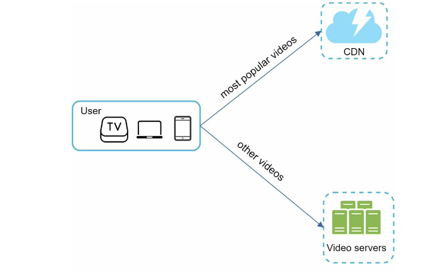 

2. Encode less popular content on-demand to minimize the number of stored video versions.
3. Distribute videos to regions based on popularity, avoiding unnecessary distribution to regions with low demand.
4. Consider building a custom CDN in partnership with ISPs, leveraging their global presence to improve user experience and reduce bandwidth charges.

- These optimizations are tailored to historical viewing patterns and aim to balance cost-effectiveness with efficient content delivery.

### Error handling
- In a large-scale system, errors are inevitable, categorized as recoverable and non-recoverable. Recovery strategies include retrying operations for recoverable errors and halting tasks for non-recoverable ones. Each system component has a playbook for handling typical errors:
    - Upload errors are retried.
    - Split video errors are managed server-side if older clients fail.
    - Transcoding errors are retried.
    - Preprocessor errors require regenerating DAG diagrams.
    - DAG scheduler errors necessitate task rescheduling.
    - Resource manager queue downtime is managed with replicas.
    - Task worker downtime involves retrying tasks on new workers.
    - API server downtime is handled by routing requests to other servers.
    - Metadata cache server failures access replicated data, with new servers replacing dead ones.
    - Metadata DB server failures involve promoting a slave to master and replacing dead slaves.

## Step 4: Wrap Up
- Additional points to talk about:
    - Scaling the API tier is straightforward due to its statelessness, enabling horizontal scaling.
    - Database scaling options include replication and sharding.
    - Live streaming, although not the system's focus, shares similarities with non-live streaming but has differences in latency requirements, parallelism needs, and error handling.
    - Video takedown processes involve identifying and removing videos violating copyrights, containing pornography, or featuring illegal acts, which may be flagged by users or detected during upload.
