# Chapter 14. Design Youtube

Statistics, demographics, and fun facts of YouTube in 2020 (2023)
- Total number of monthly active users: 2 billion (2.7 billion)
- Number of videos watched per day: 5 billion (1 billion hours/day)
- 73% of US adults use YouTube
- 50 million creators on YouTube (61.1 million)
- Ad revenue was $15.1 billion in 2019 and now $31.51 billion in 2023
- 37% of all mobile internet traffic redirects to YouTube
- 80 different languages are supported
- 100 million premium subscribers (2024)

### Step 1 - Understand the problem and establish design scope

Youtube does not only support watching a video, but also comment, share, or like a video, save a video to playlists, subscribe to a channel, etc. So it is important to narrow down the scope during the interview.

> 1-1. Product requirements: 
- Feature to upload and watch a video
- Mobile apps, web browsers and smart TV should be supported
- 5 million DAU
- 30 minutes of average daily time spent on the product
- Should support international users
- Accepts most of the video resolutions and formats
- Encryption required
- Maximum video size is 1GB
- Recommend to leverage existing cloud services (building from scratch is unrealistic)

> 1-2. Checkpoint of this chapter:
- Ability to upload videos fast
- Smooth video streaming
- Ability to change video quality
- Low infrastructure cost
- High availability, scalability, and reliability 
- Supported medium: mobile apps, web browser, and smart TV 

> 1-3. Back of the envelope estimation

Assumptions:
- 5 million DAU
- Users watch 5 videos/day
- 10% of users upload 1 video/day
- Average size is 300MB

Then, 
- Total daily storage space required: 5 million * 10% * 300MB = 150TB
- If we use cloud CDN, it's charged based on the data transferred out of the CDN. 
Assume we use Amazon's CloudFront(CDN service) and 100% of traffic is served from the U.S. THe average cost per GB is $0.02.

5 million * 5 videos * 0.3GB * $0.02 = **$150,000/day**

    
    
Regional Data Transfer Out to Internet(per GB)

    
    
Regional Data Transfer Out to Origin(per GB)

### Step 2 - Propose high-level design and get buy-in

The reason why we leverage cloud services for CDN and blob storage:
- **System design interviews are not about building everything from scratch.** Within the limited time frame, choosing the right technology to do a job right is more important than explaining how the technology works in detail.
- Building scalable blob storage or CDN is extremely complex and costly

    

**Client**: can watch YouTube on computer, mobile phone, and smartTV
**CDN**: Videos are stored in CDN. A video is streamed from CDN
**API servers**: Everything else rather than video streaming goes through API servers; including feed recommendation, generating video upload URL, updating metadata database and cache, user sign-up, etc

> 2-1. Video uploading flow

    

**Metadata DB**: Video metadata are stored in Metadata DB. IT is sharded and replicated to meet performance and high availability requirements
**Metadata cache**: VIdeo metadata and user objects are cached
**Original storage**: A blob storage system is used to store original videos
**Transcoding servers**: Video transcoding is also called video encoding. It is process of converting a video format to other formats(MPEG, HLS, etc), which provide the best video streams possible for different devices and bandwidth capabilities
**Transcoded storage**: BLOB storage that stores transcoded video files
**Completion queue**: MQ that stores information about video transcoding completion events
**Completion handler**: A list of workers that pull event data form the completion queue and update metadata cache and database

> 2-2. How the video uploading flow works?

The flow is broken down into two processed running **in parallel**.
1. Upload the actual video
2. Update video metadata. It contains information about video URL, size, resolution, format, user info, etc

#### Flow 1. upload the actual video

    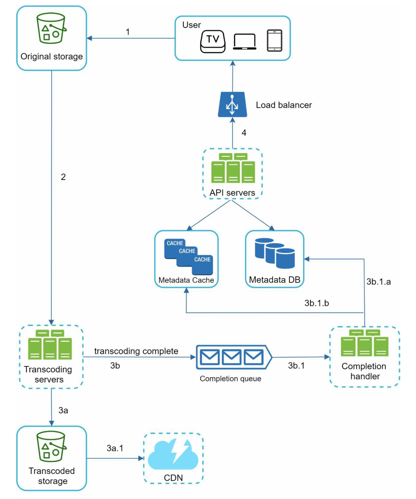

**1.** Videos are uploaded to the original storage
**2.** Transcoding servers fetch videos from the original storage and start transcoding
**3.** Once transcoding is complete, the following two steps are executed in parallel:
    **3a.** Transcoded videos are sent to transcoded storage
    **3b.** Transcoding completion events are queued in the completion queue
**3a.1.** Transcoded videos are distributed to CDN
**3b.1.** Completion handler contains a bunch of workers that continuously pull event data from the queue
**3b.1.a** and **3b.1.b.** Completion handler updates the metadata database and cache when video transcoding is complete
**4.** API servers inform the client that the video is successfully uploaded and is ready for streaming

#### Flow 2. update the metadata
While a file is being uploaded to the original storage, the client in parallel sends a request to update the video metadata as shown below. 

    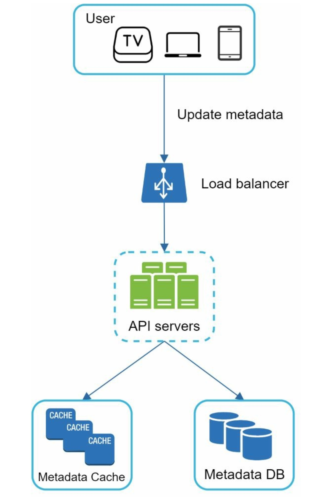

> 2-2. Video streaming flow

Streaming means our device continuously receives video streams from remote source videos. 

**Streaming protocol**: A standardized way to control data transfer for video streaming. 
Popular streaming protocols:
- **MPEG-DASH**: MPEG, "Moving Picture Experts Group" and DASH, "Dynamic Adaptive Streaming over HTTP"
- **Apple HLS**: HLS, "HTTP Live Streaming"
- **Microsoft Smooth Streaming**
- **Adobe HTTP Dynamic Streaming(HDS)**

*Different streaming protocols supports different video encoding and playback players. When we design a video streaming service, we have to choose the right streaming protocol to support our use cases. 

Videos are streamed from CDN directly. The edge server closes to us will deliver the video with very little latency.

### Step 3 - Design deep dive
We will refine video uploading flow and video streaming flow with optimizations and introduce **error handling mechanisms**.

> 3-1. Video transcoding

When we record a video, the device gives the video file a certain format. It must be encoded into compatible bit-rates and formats to be played smoothly on other devices. 

**Bitrate** is the rate at which bits are processed over time. A higher bitrate generally means higher video quality. High bitrate streams need more processing power and fast internet speed.

Video transcoding is important because:
- Raw video consumes large amounts of storage space
- To support compatibility. Many devices and browsers only support certain types of video formats
- To ensure users watch high-quality videos while maintaining smooth playback
- Network conditions can change, especially on mobile devices

Most of encoding formats contain two parts:
- **Container**: A basket that contains the video file, audio, and metadata. We can distinguish the container format by the file extension, such as .avi, .mov, or .mp4
- **Codecs**: Compression and decompression algorithms aim to reduce the video size while preserving the video quality

> 3-2. Directed acyclic graph (DAG) model [DAG - Wikipedia](https://en.wikipedia.org/wiki/Directed_acyclic_graph)

Transcoding a video is computationally expensive and time-consuming. 

To support different video processing pipelines and maintain high parallelism, it is important to add some level of abstraction and let client programmers define what tasks to execute. 
Meta's streaming video engine uses a directed acyclic graph(DAG), which defines tasks in stage so they can be executed sequentially or parallelly.

**DAG adopted for video transcoding**

    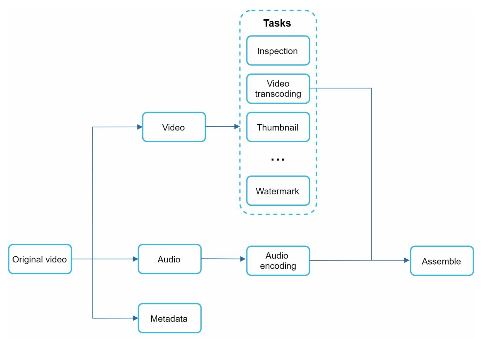

Some of the tasks can be applied on a split video file:
- **Inspection**: makes sure videos have good quality and are not malformed
- **Video encodings**: Videos are converted to support different resolutions, codec, bitrates, etc.

    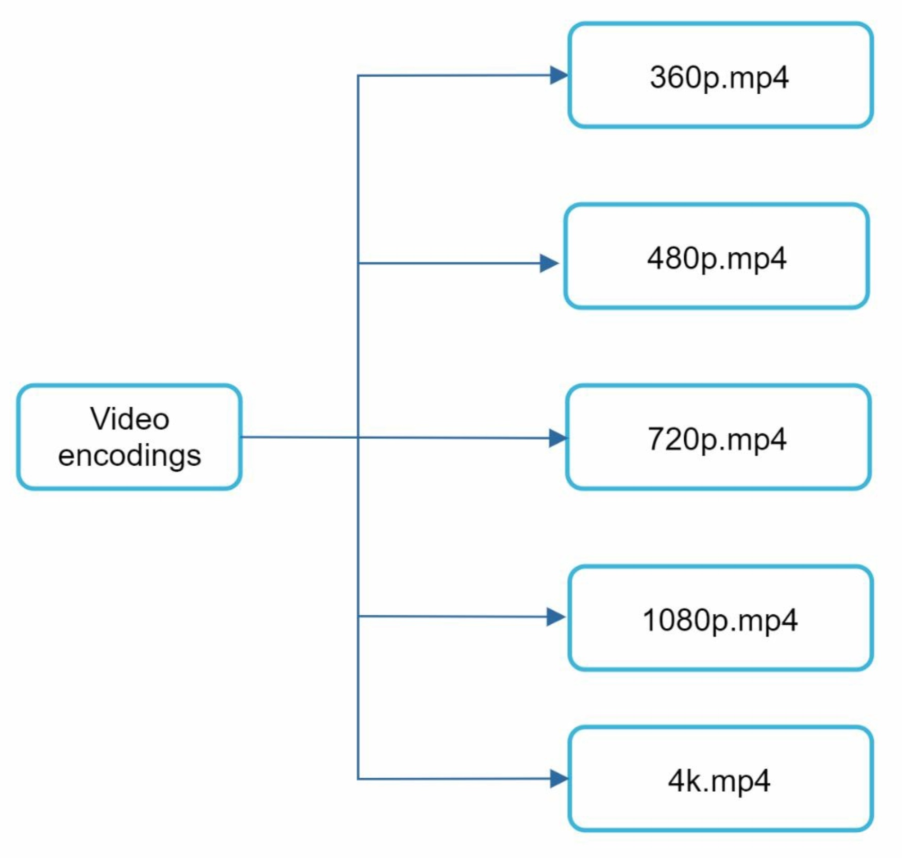

- **Thumbnail**: can either be uploaded by a user or automatically generated by the system
- **Watermark**: overlay on top of video contains identifying information about the video

> 3-3. Video transcoding architecture

    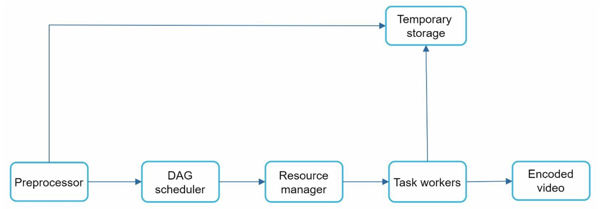

**Preprocessor**
It has 4 responsibilities:
1. Video splitting. Video stream is split or further split into small Group of Pictures(GOP) alignment.
**GOP** is a group/chunk of frames arranged in a specific order. Each chunk is an independently playable unit, usually a few seconds in length.
2. Some old mobile devices or browsers might not support video splitting. Preprocessor split bideos by GOP alignment for old clients
3. DAG generation. The processor generates DAG based on configuration files client programmers write. 

    
    
DAG representation which has 2 nodes and 1 edge

    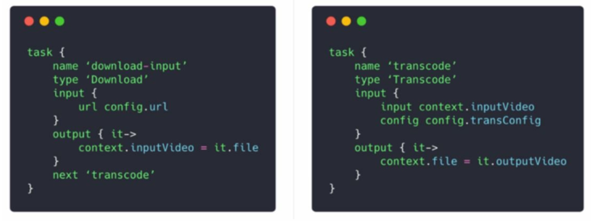
    
configuration for above DAG representation

4. Cache data: The preprocessor is a cache for segmented videos. For better reliability, the preprocessor stores GOPs and metadata in temporary storage. If video encoding fails, the system could use persisted data for retry operations.

**DAG scheduler**
The DAG scheduler splits a DAG graph into stages of tasks and puts them in the task queue in the resource manager.

    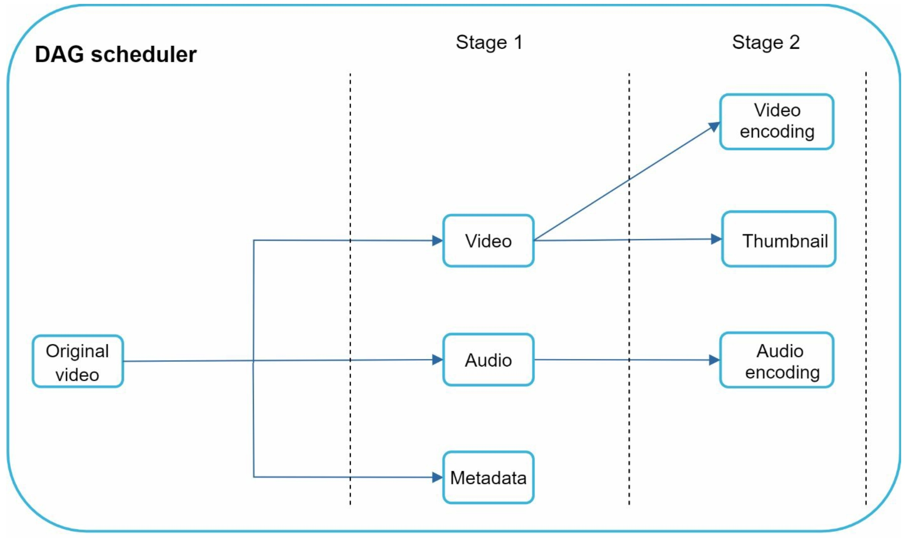

**Resource manager**
It is responsible for managing the efficiency fo resource allocation. It contains 3 queues and a task scheduler like below

- Task queue: a priority queue that contains tasks to be executed
- Worker queue: a priority queue that contains worker utilization info
- Running queue: contains info about the currently running tasks and workers running the tasks
- Task scheduler: picks the optimal task/worker, and instructs the chosen task worker to execute the job

    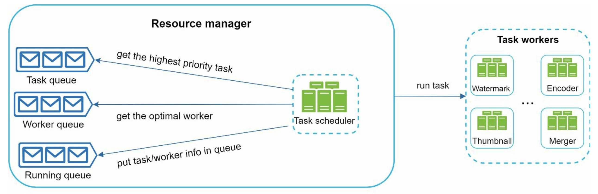

The resource manager works as follows:
- The task scheduler gets the highest priority task from the task queue
- The task scheduler gets the optimal task worker to run the task from the worker queue
- The task scheduler instructs the chosen task worker to run the task
- The task scheduler binds the task/worker info and puts it in the running queue
- The task scheduler removes the job from the running queue once the job is done

**Task workers**

    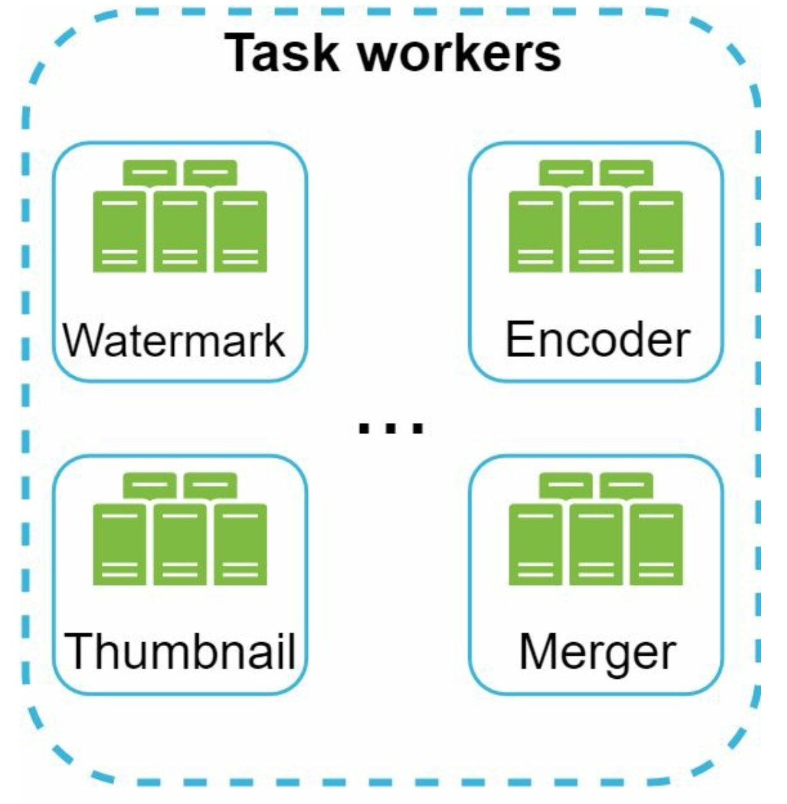

**Temporary storage**
Multiple storage systems are used. The choice of storage system depends on factors like data type, data size, access frequency, data life span, etc.

For example, metadata is frequently accessed by workers, and the data size is usually small. So, caching metadata in memory is a good idea. For video or audio data, we put them in blob storage. 

*Data in temporary storage is freed up once the corresponding video processing is complete*

**Encoded video**
Final output of encoding pipeline.

> 3-4. System optimizations

**Speed optimization: parallelize video uploading**
We can split a video into smaller chunks by GOP alignment.

    

This allows fast resumable uploads when the previous upload failed. The job of splitting a video file by GOP can be implemented by the client to improve the upload speed like below

    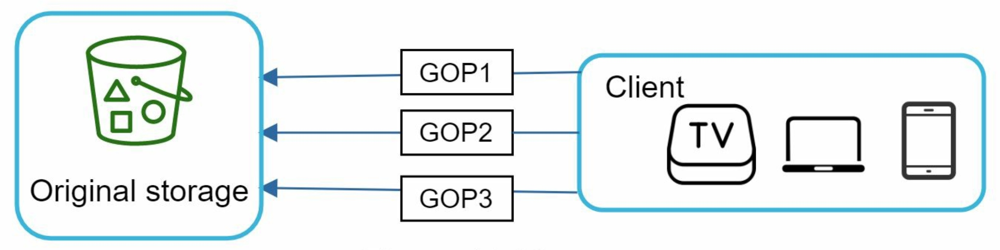

**Speed optimization: place upload centers close to users**
Setting up multiple upload centers across the globe. To achieve this, we use CDN as upload centers.

    

**Speed optimization: parallelism everywhere**
Building a loosely coupled system and enable high parallelism.

Below depicts that the output depends on the input of the previous step. This dependency makes parallelism difficult.

    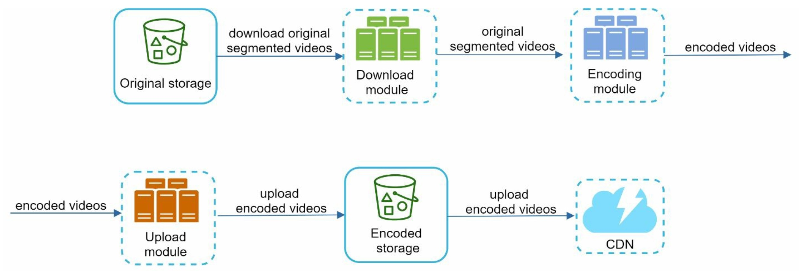

We can introduce message queue to make the system more loosely coupled.
- Before the message queue is introduced, the encoding module must wait for the output of the download module
- After the message queue is introduced, the encoding module does not need to wait for the output of the download module anymore. The encoding module can execute jobs in parallel.

    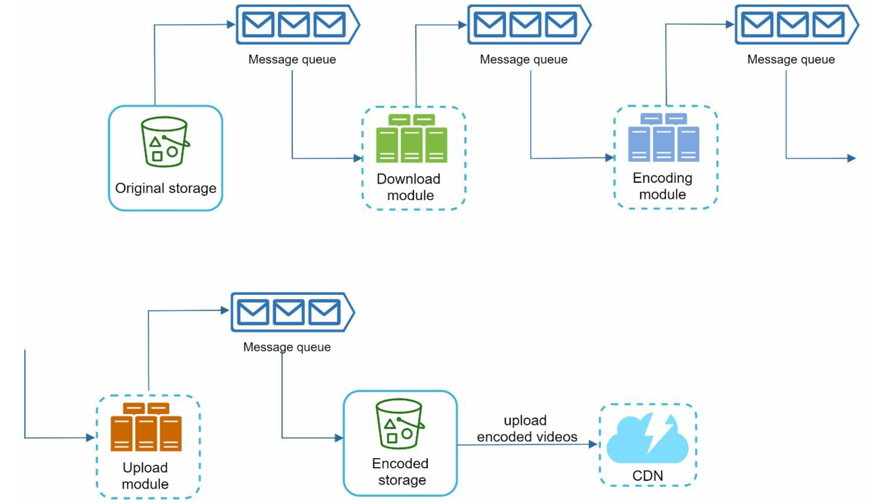

**Safety optimization: pre-signed upload URL**
To ensure only authorized users upload videos to the right location, we introduce **pre-signed URLs**

    

The upload flow is updated as follows:
1. The client makes a HTTP request to API servers to fetch the pre-signed URL, which gives the access permission to the object identified in the URL. 
2. API servers respond with a pre-signed URL
3. Once the client receives the response, it uploads the video using the pre-signed URL

**Safety optimization: protect your videos**
To protect copyrighted videos, we can adopt following safety options:
- **Digital rights management(DRM) systems**: e.g. Apple FairPlay, Google Widevine, and Microsoft PlayReady
- **AES encryption**: We can encrypt a video and configure an authorization policy. The video will be decrypted upon playback. It ensures that only authorized users can watch an encrypted video
- **Visual watermarking**: An image overlay on top of video that contains identifying information of the video

**Cost-saving optimization**
CDN is crucial component of our system, but it is expensive, especially when the data size is large.

YouTube video streams follow long-tail distribution, which means a few popular videos are accessed frequently but many others have few or no viewers. Based on this, we can implement a few optimizations:
1. Only serve the most popular videos from CDN and other videos from high capacity storage video servers.

    

2. For less popular content, we may not need to store many encoded video versions. Short videos can be encoded on-demand
3. Some videos are popular only in certain regions. There is no need to distribute these videos to other regions
4. Build our own CDN like Netflix and partner with Internet Service Providers(ISPs).
It is a huge project, but this could make sense for large streaming companies. By partnering with IPS, we can improve the viewing experience and reduce the bandwidth charges.

All these optimizations are based on analysis; historical viewing pattens. So it is important to analyze it before any optimization.

> 3-5. Error handling

Two types of errors we must handle gracefully:
- **Recoverable error**: such as video segment fails to transcode -> can retry the operation a few times. If the task continues to fail and the system believes it is not recoverable, it returns a proper error code to the client
- **Non-recoverable error**: such as malformed video format -> the system stops the running tasks associated with the video and returns the proper error code to the client

Typical errors and possible action to recover:
- **Upload error** -> retry a few times
- **Split video error** -> if older versions of clients cannot split videos by GOP alignments, the entire video is passed to the server and splitting video is done on the server-side
- **Transcoding error** -> retry
- **Preprocessor error** -> regenerate DAG diagram
- **DAG scheduler error** -> reschedule a task
- **Resource manage queue down** -> use a replica
- **Task worker down** -> retry the task on a new worker
- **API server down** -> requests will be directed to a different API server
- **Metadata cache server down** -> if one node goes down, access other nodes to fetch data. We can bring up a new cache server to replace the dead one
- **Metadata DB server down**
    - if master is down -> promote one of the slaves to ace as the new master
    - if slave is down -> use another slave for reads and bring up another database server to replace the dead one

### Step 4 - Wrap up
Few additional points we can talk about:
- **Scaling the API tier**
- **Scaling the database**; replication/sharding
- **Live streaming**; how a video is recorded and broadcasted in realtime
    - Differences between live streaming and non-live streaming:
        a. Live streaming might need a different stream protocol as it has a higher latency requirement
        b. Live streaming has a lower requirement for parallelism as small chucks of data are already processed in real-time
        c. Live streaming requires different sets of error handling, time-consuming error handling is not acceptable

- **Video takedowns**; Videos violate copyrights, pornography, or other illegal acts shall be removed
