# CHAPTER 15: DESIGN GOOGLE DRIVE

```
In this chapter, you are asked to design YouTube.
The solution to this question can be applied to other interview questions like designing a video sharing platform such as Netflix and Hulu. 
Figure 14-1 shows the YouTube homepage.
```

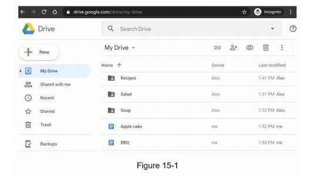
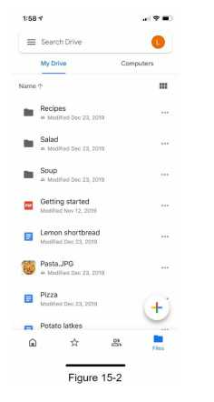
## Step 1 - Understand the problem and establish design scope
```
  • Add files. The easiest way to add a file is to drag and drop a file into Google drive.
  • Download files.
  • Sync files across multiple devices. When a file is added to one device, it is automatically synced to other devices.
  •  See file revisions.
  • Share files with your friends, family, and coworkers
  • Send a notification when a file is edited, deleted, or shared with you.
```
### Back of the envelope estimation
```      
  • Assume the application has 50 million signed up users and 10 million DAU.
  • Users get 10 GB free space.
  • Assume users upload 2 files per day. The average file size is 500 KB.
  • 1:1 read to write ratio.
  • Total space allocated: 50 million * 10 GB = 500 Petabyte
  • QPS for upload API: 10 million * 2 uploads / 24 hours / 3600 seconds = ~ 240
  • Peak QPS = QPS * 2 = 480
```
## Step 2 - Propose high-level design and get buy-in
```
Instead of showing the high-level design diagram from the beginning, we will use a slightly different approach.
We will start with something simple: build everything in a single server. 
Then, gradually scale it up to support millions of users.
By doing this exercise, it will refresh your memory about some important topics covered in the book.
Let us start with a single server setup as listed below:
  • A web server to upload and download files.
  • A database to keep track of metadata like user data, login info, files info, etc.
  • A storage system to store files. We allocate 1TB of storage space to store files.
We spend a few hours setting up an Apache web server, a MySql database, and a directory called drive/ as the root directory to store uploaded files.
Under drive/ directory, there is a list of directories, known as namespaces.
Each namespace contains all the uploaded files for that user.
The filename on the server is kept the same as the original file name.
Each file or folder can be uniquely identified by joining the namespace and the relative path.
Figure 15-3 shows an example of how the /drive directory looks like on the left side and its expanded view on the right side.
```

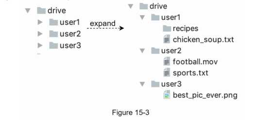

### APIs

#### 1. Upload a file to Google Drive 
```
Two types of uploads are supported:
  • Simple upload. Use this upload type when the file size is small.
  • Resumable upload. Use this upload type when the file size is large and there is high chance of network interruption.
Here is an example of resumable upload API:
https://api.example.com/files/upload?uploadType=resumable Params:
  • uploadType=resumable
  • data: Local file to be uploaded.
A resumable upload is achieved by the following 3 steps [2]:
  • Send the initial request to retrieve the resumable URL.
  • Upload the data and monitor upload state.
  • If upload is disturbed, resume the upload.
```
#### 2. Download a file from Google Drive
```
Example API: https://api.example.com/files/download 
Params:
  • path: download file path. 
Example params:
  {
    "path": "/recipes/soup/best_soup.txt" 
  }
```
#### 3. Get file revisions
```
Example API: https://api.example.com/files/list_revisions 
Params:
  • path: The path to the file you want to get the revision history.
  • limit: The maximum number of revisions to return.

Example params:
  {
  "path": "/recipes/soup/best_soup.txt", 
  "limit": 20
  }
All the APIs require user authentication and use HTTPS.
Secure Sockets Layer (SSL) protects data transfer between the client and backend servers.
```
#### Move away from single server

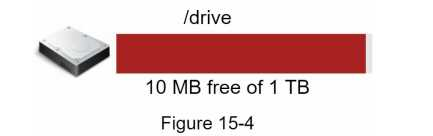
```
Only 10 MB of storage space is left!
This is an emergency as users cannot upload files anymore. The first solution comes to mind is to shard the data,
so it is stored on multiple storage servers.
Figure 15-5 shows an example of sharding based on user_id .
```

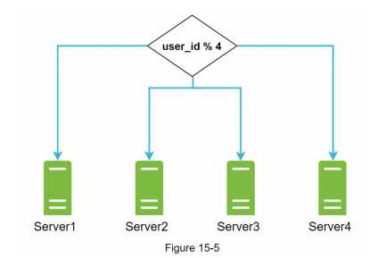
```
You pull an all-nighter to set up database sharding and monitor it closely.
Everything works smoothly again. You have stopped the fire, but you are still worried about potential data losses in case of storage server outage.
You ask around and your backend guru friend Frank told you that many leading companies like Netflix and Airbnb use Amazon S3 for storage. 
“Amazon Simple Storage Service (Amazon S3) is an object storage service that offers industry-leading scalability, data availability, security, and performance” [3].
You decide to do some research to see if it is a good fit.
After a lot of reading, you gain a good understanding of the S3 storage system and decide to store files in S3.
Amazon S3 supports same-region and cross-region replication.
A region is a geographic area where Amazon web services (AWS) have data centers.
As shown in Figure 15-6, data can be replicated on the same-region (left side) and cross-region (right side). 
Redundant files are stored in multiple regions to guard against data loss and ensure availability.
A bucket is like a folder in file systems.
```
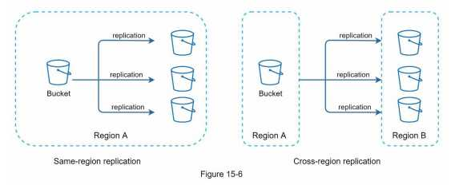
```
After putting files in S3, you can finally have a good night's sleep without worrying about data losses.
To stop similar problems from happening in the future, you decide to do further research on areas you can improve. Here are a few areas you find:
    • Load balancer: Add a load balancer to distribute network traffic.
A load balancer ensures evenly distributed traffic, and if a web server goes down, it will redistribute the traffic.
    • Web servers: After a load balancer is added, more web servers can be added/removed 
easily, depending on the traffic load.
    • Metadata database: Move the database out of the server to avoid single point of failure. 
In the meantime, set up data replication and sharding to meet the availability and scalability requirements.
    • File storage: Amazon S3 is used for file storage.
To ensure availability and durability, files are replicated in two separate geographical regions.
After applying the above improvements, you have successfully decoupled web servers, metadata database, and file storage from a single server.
The updated design is shown in Figure 15-7.
```
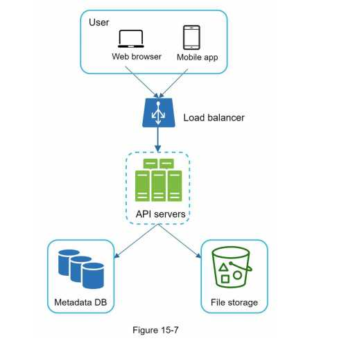

#### Sync conflicts
```
For a large storage system like Google Drive, sync conflicts happen from time to time.
When two users modify the same file or folder at the same time, a conflict happens.
How can we resolve the conflict?
Here is our strategy: the first version that gets processed wins, and the version that gets processed later receives a conflict.
Figure 15-8 shows an example of a sync conflict.
```
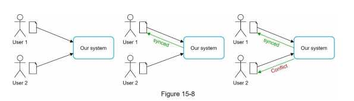

```
In Figure 15-8, user 1 and user 2 tries to update the same file at the same time, but user 1’s file is processed by our system first.
User 1’s update operation goes through, but, user 2 gets a sync conflict.
How can we resolve the conflict for user 2?
Our system presents both copies of the same file: user 2’s local copy and the latest version from the server (Figure 15-9).
User 2 has the option to merge both files or override one version with the other.
```
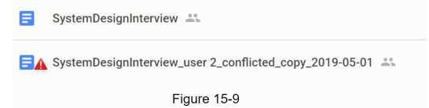

### High-level design

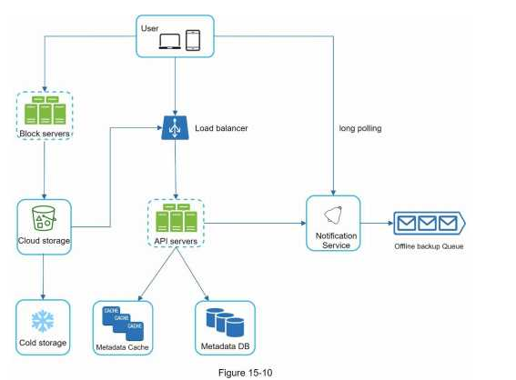

```
User: A user uses the application either through a browser or mobile app.
Block servers: Block servers upload blocks to cloud storage.
    Block storage, referred to as block-level storage, is a technology to store data files on cloud-based environments.
    A file can be split into several blocks, each with a unique hash value, stored in our metadata database.
    Each block is treated as an independent object and stored in our storage system (S3).
    To reconstruct a file, blocks are joined in a particular order. As for the block size, we use Dropbox as a reference: it sets the maximal size of a block to 4MB [6].
Cloud storage: A file is split into smaller blocks and stored in cloud storage.
Cold storage: Cold storage is a computer system designed for storing inactive data, meaning files are not accessed for a long time.
Load balancer: A load balancer evenly distributes requests among API servers.
API servers: These are responsible for almost everything other than the uploading flow.
      API servers are used for user authentication, managing user profile, updating file metadata, etc.
Metadata database: It stores metadata of users, files, blocks, versions, etc.

Please note that files are stored in the cloud and the metadata database only contains metadata.
Metadata cache: Some of the metadata are cached for fast retrieval.
Notification service: It is a publisher/subscriber system that allows data to be transferred backup queue stores the info so changes will be synced when the client is online.
```

## Step 3 - Design deep dive
### Block servers
```
For large files that are updated regularly, sending the whole file on each update consumes a lot of bandwidth.
Two optimizations are proposed to minimize the amount of network traffic being transmitted:
  • Delta sync. When a file is modified, only modified blocks are synced instead of the whole file using a sync algorithm [7] [8].
  • Compression. Applying compression on blocks can significantly reduce the data size. 
Thus, blocks are compressed using compression algorithms depending on file types.
For example, gzip and bzip2 are used to compress text files. Different compression algorithms are needed to compress images and videos.
In our system, block servers do the heavy lifting work for uploading files. Block servers process files passed from clients by splitting a file into blocks,
compressing each block, and encrypting them. Instead of uploading the whole file to the storage system, only modified blocks are transferred.
```
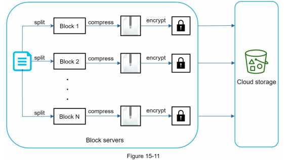
```
• A file is split into smaller blocks.
• Each block is compressed using compression algorithms.
• To ensure security, each block is encrypted before it is sent to cloud storage.
• Blocks are uploaded to the cloud storage.
```
```
Figure 15-12 illustrates delta sync, meaning only modified blocks are transferred to cloud storage.
Highlighted blocks “block 2” and “block 5” represent changed blocks. Using delta sync, only those two blocks are uploaded to the cloud storage.
```
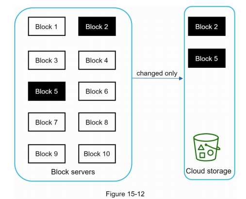

#### High consistency requirement
```
Our system requires strong consistency by default. It is unacceptable for a file to be shown differently by different clients at the same time.
The system needs to provide strong consistency for metadata cache and database layers.
Memory caches adopt an eventual consistency model by default, which means different replicas might have different data.
To achieve strong consistency, we must ensure the following:
  • Data in cache replicas and the master is consistent.
  • Invalidate caches on database write to ensure cache and database hold the same value. 
Achieving strong consistency in a relational database is easy because it maintains the ACID (Atomicity,
Consistency, Isolation, Durability) properties [9]. However, NoSQL databases do not support ACID properties by default.
ACID properties must be programmatically incorporated in synchronization logic.
In our design, we choose relational databases because the ACID is natively supported.
```
#### Metadata database

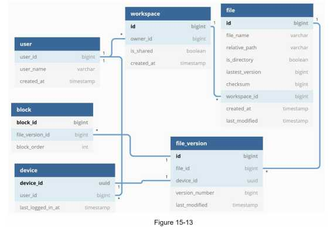
```
Figure 15-13 shows the database schema design. Please note this is a highly simplified version as it only includes the most important tables and interesting fields.
User: The user table contains basic information about the user such as username, email, profile photo, etc.
Device: Device table stores device info. Push_id is used for sending and receiving mobile push notifications. Please note a user can have multiple devices.
Namespace: A namespace is the root directory of a user. 
File: File table stores everything related to the latest file.
File_version: It stores version history of a file. Existing rows are read-only to keep the integrity of the file revision history.
Block: It stores everything related to a file block. A file of any version can be reconstructed by joining all the blocks in the correct order.
```

#### Upload flow
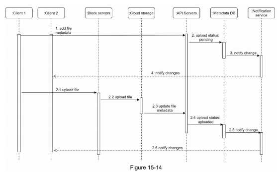


```
• Add file metadata.
  1. Client 1 sends a request to add the metadata of the new file.
  2. Store the new file metadata in metadata DB and change the file upload status to “pending.”
  3. Notify the notification service that a new file is being added.
  4. The notification service notifies relevant clients (client 2) that a file is being uploaded.

• Upload files to cloud storage.
  2.1 Client 1 uploads the content of the file to block servers.
  2.2 Block servers chunk the files into blocks, compress, encrypt the blocks, and upload them to cloud storage.
  2.3 Once the file is uploaded, cloud storage triggers upload completion callback. The request is sent to API servers.
  2.4 File status changed to “uploaded” in Metadata DB.
  2.5 Notify the notification service that a file status is changed to “uploaded.”
  2.6 The notification service notifies relevant clients (client 2) that a file is fully uploaded.
```

#### Upload flow

```
• If client A is online while a file is changed by another client,
  notification service will inform client A that changes are made somewhere so it needs to pull the latest data.

• If client A is offline while a file is changed by another client, data will be saved to the cache.
  When the offline client is online again, it pulls the latest changes.

Once a client knows a file is changed, it first requests metadata via API servers, then downloads blocks to construct the file.
Figure 15-15 shows the detailed flow. Note, only the most important components are shown in the diagram due to space constraint.
```
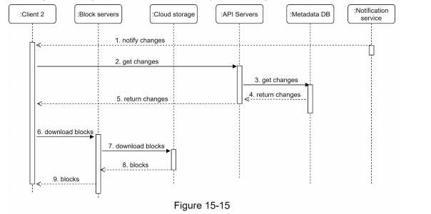

```
1. Notification service informs client 2 that a file is changed somewhere else.
2. Once client 2 knows that new updates are available, it sends a request to fetch metadata.
3. API servers call metadata DB to fetch metadata of the changes.
4. Metadata is returned to the API servers.
5. Client 2 gets the metadata.
6. Once the client receives the metadata, it sends requests to block servers to download blocks.
7. Block servers first download blocks from cloud storage.
8. Cloud storage returns blocks to the block servers.
9. Client 2 downloads all the new blocks to reconstruct the file.
```

#### Notification service
```
To maintain file consistency, any mutation of a file performed locally needs to be informed to other clients to reduce conflicts.
Notification service is built to serve this purpose.
At the high-level, notification service allows data to be transferred to clients as events happen.
Here are a few options:
• Long polling. Dropbox uses long polling [10].
• WebSocket. WebSocket provides a persistent connection between the client and the server.
  Communication is bi-directional.
  Even though both options work well, we opt for long polling for the following two reasons:
• Communication for notification service is not bi-directional.
  The server sends information about file changes to the client, but not vice versa.
• WebSocket is suited for real-time bi-directional communication such as a chat app.
  For Google Drive, notifications are sent infrequently with no burst of data.
  With long polling, each client establishes a long poll connection to the notification service.
  If changes to a file are detected, the client will close the long poll connection.
  Closing the connection means a client must connect to the metadata server to download the latest changes.
  After a response is received or connection timeout is reached, a client immediately sends a new request to keep the connection open.
```

#### Save storage space
```

To support file version history and ensure reliability, multiple versions of the same file are stored across multiple data centers.
Storage space can be filled up quickly with frequent backups of all file revisions.
Three techniques are proposed to reduce storage costs:
• De-duplicate data blocks. Eliminating redundant blocks at the account level is an easy way to save space.
  Two blocks are identical if they have the same hash value.
• Adopt an intelligent data backup strategy. Two optimization strategies can be applied:
• Set a limit: We can set a limit for the number of versions to store.
  If the limit is reached, the oldest version will be replaced with the new version.
• Keep valuable versions only: Some files might be edited frequently.
    For example, saving every edited version for a heavily modified document could mean the file is saved over 1000 times within a short period.
     To avoid unnecessary copies, we could limit the number of saved versions. We give more weight to recent versions. 
      Experimentation is helpful to figure out the optimal number of versions to save.
• Moving infrequently used data to cold storage. Cold data is the data that has not been active for months or years.
  Cold storage like Amazon S3 glacier [11] is much cheaper than S3.
```

#### Failure Handling
```
Failures can occur in a large-scale system and we must adopt design strategies to address these failures.
Your interviewer might be interested in hearing about how you handle the following system failures:
• Load balancer failure: If a load balancer fails, the secondary would become active and pick up the traffic.
  Load balancers usually monitor each other using a heartbeat, a periodic signal sent between load balancers.
  A load balancer is considered as failed if it has not sent a heartbeat for some time.
• Block server failure: If a block server fails, other servers pick up unfinished or pending jobs.
• Cloud storage failure: S3 buckets are replicated multiple times in different regions.
  If files are not available in one region, they can be fetched from different regions.
• API server failure: It is a stateless service. If an API server fails, the traffic is redirected to other API servers by a load balancer.
• Metadata cache failure: Metadata cache servers are replicated multiple times.
  If one node goes down, you can still access other nodes to fetch data.
  We will bring up a new cache server to replace the failed one.
• Metadata DB failure.
• Master down: If the master is down, promote one of the slaves to act as a new master and bring up a new slave node.
• Slave down: If a slave is down, you can use another slave for read operations and bring another database server to replace the failed one.
• Notification service failure: Every online user keeps a long poll connection with the notification server.
  Thus, each notification server is connected with many users.
  According to the Dropbox talk in 2012 [6], over 1 million connections are open per machine.
  If a server goes down, all the long poll connections are lost so clients must reconnect to a different server.
  Even though one server can keep many open connections, it cannot reconnect all the lost connections at once.
  Reconnecting with all the lost clients is a relatively slow process.
• Offline backup queue failure: Queues are replicated multiple times.
  If one queue fails, consumers of the queue may need to re-subscribe to the backup queue.
```
