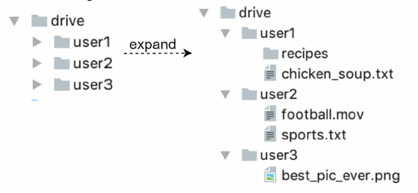
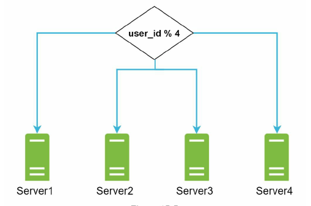
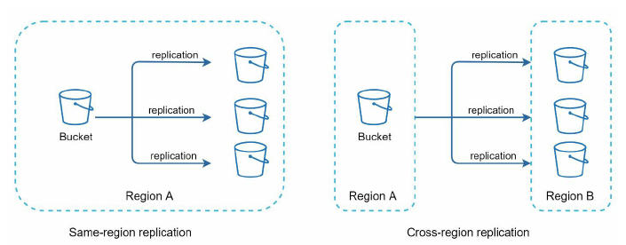
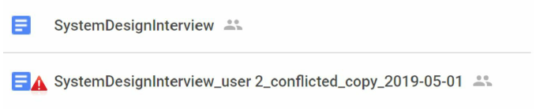
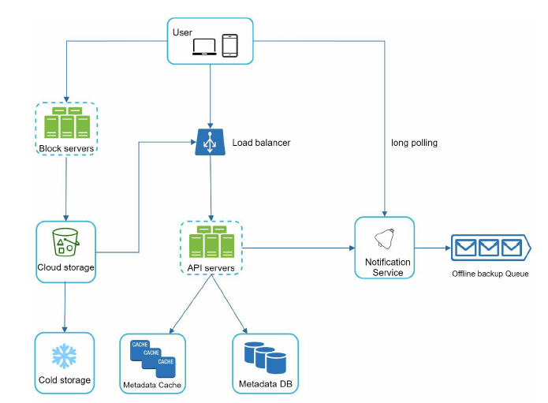
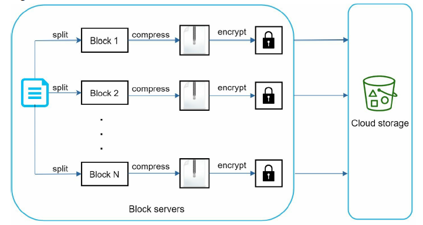
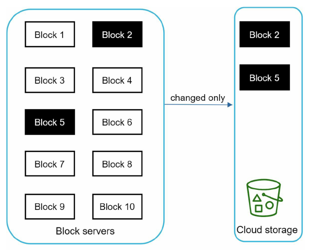
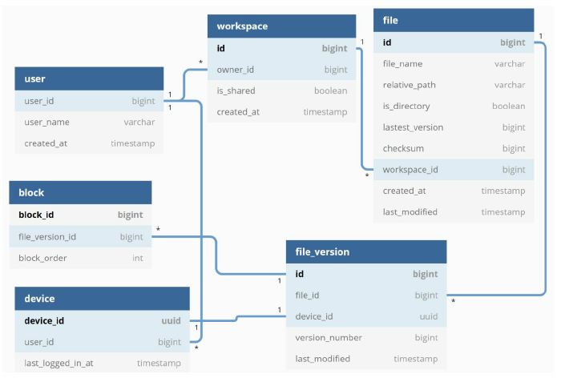
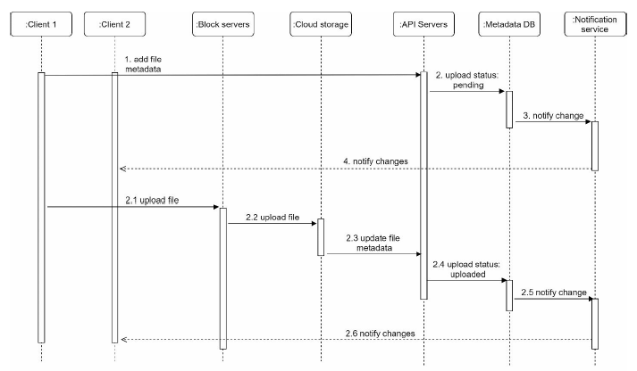
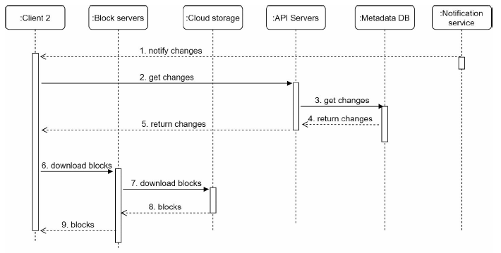

# Chapter 15: Design Google Drive

## Step 1 - Understand the problem and establish design scope
- Assumtion:
  - Assume the application has 50 million signed up users and 10 million DAU.
  - Users get 15 GB free space.
  - Assume users upload 2 files per day. The average file size is 500 KB.
  - 1:1 read to write ratio.
  - Total space allocated: 50 million * 10 GB = 500 Petabyte
  - QPS for upload API: 10 million * 2 uploads / 24 hours / 3600 seconds = ~ 240
  - Peak QPS = QPS * 2 = 480

- Functional requirements:
  - Add files. The easiest way to add a file is to drag and drop a file into Google drive.
  - Download files.
  - Sync files across multiple devices. When a file is added to one device, it is automatically
synced to other devices.
  - See file revisions.
  - Share files with your friends, family, and coworkers
  - Send a notification when a file is edited, deleted, or shared with you.

- Non-functional requirements:
  - Reliability. Reliability is extremely important for a storage system. Data loss is
unacceptable.
  - Fast sync speed. If file sync takes too much time, users will become impatient and
abandon the product.
  - Bandwidth usage. If a product takes a lot of unnecessary network bandwidth, users will
be unhappy, especially when they are on a mobile data plan.
  - Scalability. The system should be able to handle high volumes of traffic.
  - High availability. Users should still be able to use the system when some servers are
offline, slowed down, or have unexpected network errors.

## Step 2 - Propose high-level design and get buy-in
Build everything in a single server, Then, gradually scale it up to support millions of users.
- A web server to upload and download files.
- A database to keep track of metadata like user data, login info, files info, etc.
- A storage system to store files. We allocate 1TB of storage space to store files.


### APIs
We primary need 3 APIs: upload a file, download a file, and get file revisions.
1. Upload a file to Google Drive
- Simple upload. Use this upload type when the file size is small.
- Resumable upload. Use this upload type when the file size is large and there is high
chance of network interruption.
https://api.example.com/files/upload?uploadType=resumable
A resumable upload is achieved by the following 3 steps [2]:
  - Send the initial request to retrieve the resumable URL.
  - Upload the data and monitor upload state.
  - If upload is disturbed, resume the upload.

2. Download a file from Google Drive
- Example API: https://api.example.com/files/download
- path: download file path.

```json
Example params:
{
    "path": "/recipes/soup/best_soup.txt"
}
```

3. Get file revisions
- Example API: https://api.example.com/files/list_revisions
- Params:
  - path: The path to the file you want to get the revision history.
  - limit: The maximum number of revisions to return.
```json
Example params:
{
    "path": "/recipes/soup/best_soup.txt",
    "limit": 20
}
```

### Move away from single server
Time to scaling out.
- Load balancer, Web servers, Metadata database, File storage
- Sharding based on user_id


- Preventing potential data losses in case of storage server outage



### Sync conflicts
How can we resolve the conflict? Here is our strategy: the first version that gets processed wins, and the
version that gets processed later receives a conflict.



User 2 has the option to merge both files or override one version with the other.

### High-level design

- User: A user uses the application either through a browser or mobile app.
- Block servers: Block servers upload blocks to cloud storage. Block storage, referred to as
block-level storage, is a technology to store data files on cloud-based environments. A file
can be split into several blocks, each with a unique hash value, stored in our metadata
database. Each block is treated as an independent object and stored in our storage system
(S3). To reconstruct a file, blocks are joined in a particular order. As for the block size, we
use Dropbox as a reference: it sets the maximal size of a block to 4MB [6].
- Cloud storage: A file is split into smaller blocks and stored in cloud storage.
Cold storage: Cold storage is a computer system designed for storing inactive data, meaning
files are not accessed for a long time.
- Load balancer: A load balancer evenly distributes requests among API servers.
- API servers: These are responsible for almost everything other than the uploading flow. API
servers are used for user authentication, managing user profile, updating file metadata, etc.
- Metadata database: It stores metadata of users, files, blocks, versions, etc. Please note that
files are stored in the cloud and the metadata database only contains metadata.
- Metadata cache: Some of the metadata are cached for fast retrieval.
Notification service: It is a publisher/subscriber system that allows data to be transferred
from notification service to clients as certain events happen. In our specific case, notification
service notifies relevant clients when a file is added/edited/removed elsewhere so they can
pull the latest changes.
- Offline backup queue: If a client is offline and cannot pull the latest file changes, the offline
backup queue stores the info so changes will be synced when the client is online.

## Step 3 - Design deep dive
Block servers, metadata database, upload flow, download flow, notification service, save storage space and failure handling.

### Block servers
Two optimizations are proposed to minimize the amount of network traffic being transmitted:
- Delta sync. When a file is modified, only modified blocks are synced instead of the
whole file using a sync algorithm.
- Compression. Applying compression on blocks can significantly reduce the data size.
Thus, blocks are compressed using compression algorithms depending on file types. For
example, gzip and bzip2 are used to compress text files. Different compression algorithms
are needed to compress images and videos.





### High consistency requirement
To achieve strong consistency, we must ensure the
following:
- Data in cache replicas and the master is consistent.
- Invalidate caches on database write to ensure cache and database hold the same value.

### Metadata database



### Upload flow

Two requests are sent in parallel



### Download flow

- If client A is online while a file is changed by another client, notification service will
inform client A that changes are made somewhere so it needs to pull the latest data.
- If client A is offline while a file is changed by another client, data will be saved to the
cache. When the offline client is online again, it pulls the latest changes.



### Notification service
To maintain file consistency, any mutation of a file performed locally needs to be informed to
other clients to reduce conflicts.

- Long polling. Dropbox uses long polling.
- WebSocket. WebSocket provides a persistent connection between the client and the
server. Communication is bi-directional.
  - cons 1) bi-directional communication not required
  - cons 2) real-time communication not required

### Save storage space
- De-duplicate data blocks. Eliminating redundant blocks at the account level is an easy
way to save space. Two blocks are identical if they have the same hash value.
- Adopt an intelligent data backup strategy. Two optimization strategies can be applied:
  - Set a limit: We can set a limit for the number of versions to store. If the limit is
reached, the oldest version will be replaced with the new version.
  - Keep valuable versions only: Some files might be edited frequently. For example,
saving every edited version for a heavily modified document could mean the file is
saved over 1000 times within a short period. To avoid unnecessary copies, we could
limit the number of saved versions. We give more weight to recent versions.
Experimentation is helpful to figure out the optimal number of versions to save.
- Moving infrequently used data to cold storage. Cold data is the data that has not been
active for months or years. Cold storage like Amazon S3 glacier is much cheaper than
S3.

### Failure Handling
- Load balancer failure
  - If a load balancer fails, the secondary would become active and pick up the traffic.
- Block server failure: If a block server fails, other servers pick up unfinished or pending
jobs.
- Cloud storage failure: S3 buckets are replicated multiple times in different regions. If
files are not available in one region, they can be fetched from different regions.
- API server failure: It is a stateless service. If an API server fails, the traffic is redirected
to other API servers by a load balancer.
- Metadata cache failure: Metadata cache servers are replicated multiple times. If one node
goes down, you can still access other nodes to fetch data.
- Metadata DB failure.
  - Master down: If the master is down, promote one of the slaves to act as a new master
and bring up a new slave node.
  - Slave down: If a slave is down, you can use another slave for read operations and
bring another database server to replace the failed one.
- Notification service failure: Every online user keeps a long poll connection with the
notification server. Thus, each notification server is connected with many users. According
to the Dropbox talk in 2012, over 1 million connections are open per machine. If a
server goes down, all the long poll connections are lost so clients must reconnect to a
different server. Even though one server can keep many open connections, it cannot
reconnect all the lost connections at once. Reconnecting with all the lost clients is a
relatively slow process.
- Offline backup queue failure: Queues are replicated multiple times. If one queue fails,
consumers of the queue may need to re-subscribe to the backup queue.

## Step 4 - Wrap up
Key features
1. Manage file metadata
2. Manage file sync


Another approach
- Remove block server
- Separate notification service into
  - online
  - offline
