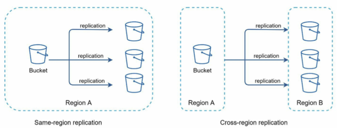
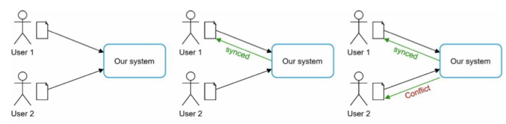
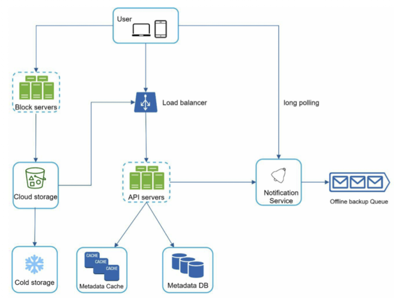
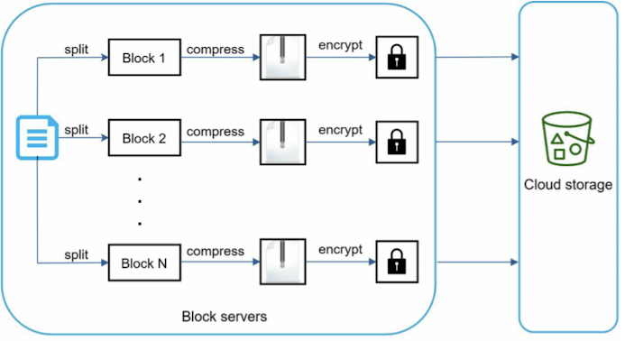
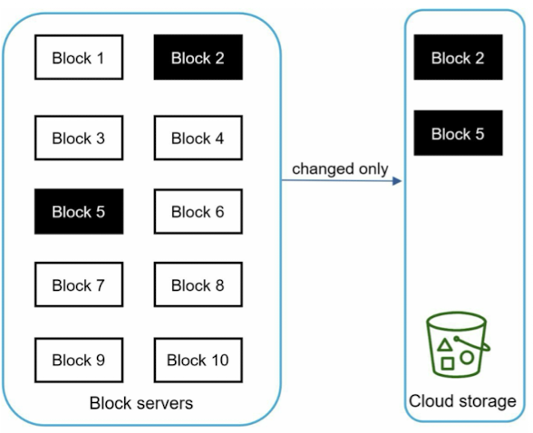

# Chapter 15. Design Google drive.

## Step 1. Understand the problem and establish design scope
- What are the most important features?
- Is this a mobile app, a web app, or both?
- What are the supported file formats?
- Do files need to be encrypted?
- Is there a file size limit?
- How many user does the product have?

### Requirements
- Add and download files.
- Sync files across multiple devices.
- See file revisions.
- Share files with your friends, family, and coworkers.
- Notification.

### Back of the envelope estimation.
- Daily active users (DAU): 50 million
- Users get 10 GB free space.
- Assume users upload 2 files per day. The average file size is 500 KB.
- 1:1 read to write ratio.
- Total space allocated: 50 million * 10 GB = 500 Petabyte
- QPS = 10 million * 2 uploads / 24 hours / 3600 seconds = ~240
- Peak QPS = QPS * 2 = 480

## Step 2. Propose high-level design and get buy-in
### APIs
1. Upload a file to Google Drive
  - Simple upload: Use this upload type when the file size is small.
  - Resumable upload: Use this upload type when the file size is large and there is high chance of network interruption.
  - Example: https://api.example.com/files/upload?uploadType=resumable
2. Download a file from Google Drive
   - Example: https://api.example.com/files/download
3. Get file revisions
   - Example: https://api.example.com/files/list_revisions

- AWS S3 storage
  - 

### Sync conflicts

- The system presents both copies of the same file
  - User 2'slocal copy and the latest version from the server. User 2 has the option to merge both files or override one version with the other.

### High-level design

- Block servers: Block servers upload blocks to cloud storage.
- Cloud storage: A file is split into smaller blocks and stored in cloud storage.

## Step 3. Design deep dive
### Block servers
- Delta sync: When a file is modified, only modified blocks are synced instead of the whole file using a sync algorithm.
- Compression
- 
- 

### High consistency requirement
- Data in cache replicas and the master is consistent.
- Invalidate caches on database write to ensure cache and database hold the same value.
  - Achieving strong consistency in a relational database is easy because it maintains the ACID(Atomicity, Consistency, Isolatio, Durability) properties. However, NoSQL database do not uspport ACID properties by default. ACID properties must be programmatically incorporated in synchronization logic.

### Metadata database
### Upload flow
- Tworequests are sent in parallel
  - Add file metadata
  - Upload files to cloud storage.
### Download flow
### Notification service
  - Long polling: Dropbox uses long polling
  - WebSocket: WebSocket provides a persistent connection between the client and the server. Commnuication is bi-directional.
### Save storage space
  - De-duplicate data blocks. Elimination redundant blocks at the account level is an easy way to save space. Two blocks are identical if they have the same hash value.
  - Adopt an intelligent data backup strategy.
    - Set a limit
    - Keep valuable versions only
  - Moving infrequently used data to cold storage.
### Failure handling

## Step 4. Wrap up
- Online vs offline