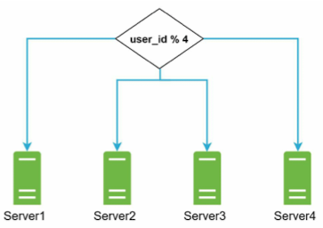
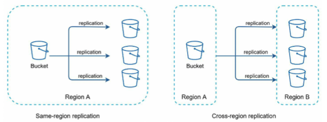
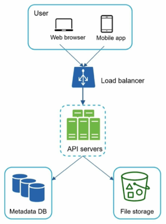
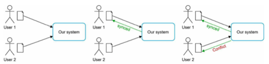
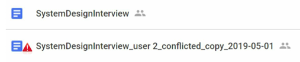
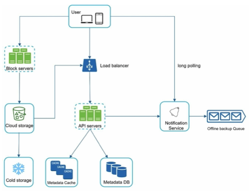
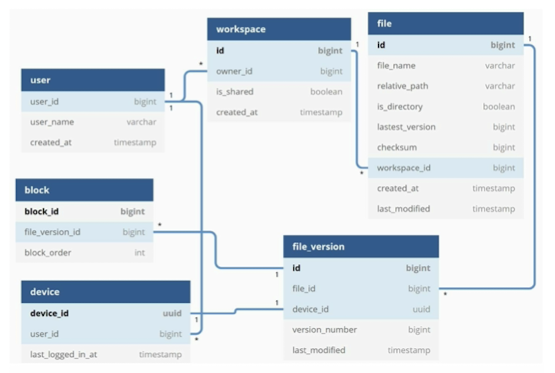
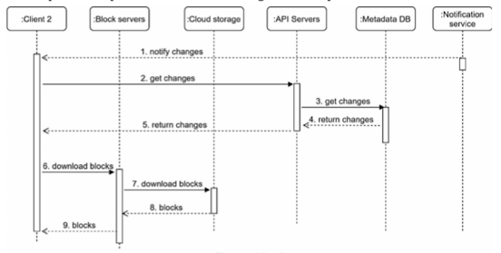

# Chapter 15 : Design Google Drive

.

## Step 1 - Understand the problem and establish design scope

.

### Most important features

- 파일 업로드 / 다운로드
- 파일 동기화
- 알림
- 모바일 앱 / 웹 앱 지원
- 모든 파일 유형 지원
- 파일 암호화되어야 함

### In this chapter...

- 파일 추가, 다운로드, 동기화, revision 보기, 공유, 알림 받기

### Back of the envelope estimation

- 파일 크기 제한 : 10GB 이하
- 사용자 수 (DAU) : 10M (1000만 명)
- 등록된 사용자 : 50 million
- 10GB의 무료 space
- 하루에 2개의 파일을 업로드한다고 가정 (평균 파일 크기 : 500KB)
- 읽기와 쓰기 비율 : 1:1
- 총 space : 50 million * 10 GB = 500 Petabyte
- 업로드 API에 대한 QPS : 10 million * 2 uploads / 24 hours / 3600 seconds = ~ 240
- 최대 QPS = QPS * 2 = 480

## Step 2 - Propose high-level design and get buy-in

- Single server setup
    - Web server : 파일 업로드 / 다운로드 (Apache)
    - Database : 사용자 데이터, 로그인 정보, 파일 정보 등의 메타데이터 추적 (MySQL)
    - Storage system : 파일을 저장하기 위해 1TB의 storage 할당  
      
    .

### APIs

.

1. 파일 업로드
    - Simple upload (작은 파일 크기)
    - Resumable upload (큰 파일 크기 / 네트워크 중단 가능성이 높은 경우) .  
    ```uploadType=resumable``` 포함
2. 파일 다운로드  
    .  
    ```GET https://api.example.com/files/download?path=/recipes/soup/best_soup.txt```
3. 파일 revision 가져오기
    - ```GET https://api.example.com/files/list_revisions?path=/recipes/soup/best_soup.txt&limit=20```  
    .

### Move away from single server

  
.

  
.



.  
- Load balancer 추가 : 네트워크 트래픽을 분산 -> 웹 서버를 쉽게 추가하거나 제거할 수 있음

### Sync conflicts


  
.  

### High-level design



- User : 브라우저나 모바일 앱을 통해 application 사용
- Block servers : 클라우드 storage에 파일을 여러 개의 block으로 나누어 업로드
- Cold storage : 장기간 접근되지 않는 inactive 데이터를 저장하기 위한 컴퓨터 시스템

## Step 3 - Design deep dive

### Block servers

- 큰 파일을 정기적으로 업데이트할 때 전체 파일을 매번 전송하는 것을 많은 bandwidth를 소모해서 2가지 최적화 제안
    1. Delta sync : 변경된 부분만 동기화
    2. Compression : block의 압축을 통해 네트워크 트래픽을 최소화

### High consistency requirement

- 시스템은 기본적으로 consistency를 요구해서 파일이 다른 클라이언트에 의해 동시에 다르게 보여지는 것은 용납될 수 없음 -> Memory caches에서 consistency를 지키기 위해 : 
    - 캐시 무효화 : 이전의 데이터를 삭제 / 업데이트
    - 동기화 로직 구현

### Metadata database



.  

### Upload flow

  
- 클라이언트가 파일을 업로드할 때 파일 메타데이터 추가와 클라우드 스토리지로의 파일 업로드 두 가지 요청이 동시에 이루어짐

### Download flow



- 파일이 다른 곳에서 추가되거나 편집될 때 다운로드 흐름 시작
- 클라이언트는 API 서버를 통해 메타데이터를 요청한 후 블록을 다운로드하여 파일 구성

### Notification service

- 파일의 일관성을 유지하기 위해, 로컬에서 수행된 파일의 변화는 다른 클라이언트에게 알려 충돌을 줄여야 함
- 알림 서비스의 일방향 통신 특성 때문에 Long polling 선택

### Save storage space

1. Data blocks De-deplicate(중복 제거)
2. 지능적인 데이터 백업 전략 채택 : set a limit, keep valuable versions only
3. 잘 사용되지 않는 데이터를 cold storage로 이동

## Failure Handling

.  
- Load balancer failure : secondary load balancer가 활성화되어 트래픽 처리
- Block server failure : 다른 서버들이 unfinished / pending 작업을 인계받아 처리
- Cloud storage failure : S3 bucket은 다른 region에 여러 번 복제되어 있어 한 region에서 사용할 수 없는 경우, 다른 region에서 파일을 가져올 수 있음
- API server failure : API 서버는 stateless service(각각의 요청이 독립적)이기 때문에, traffic은 load balancer에 의해 다른 API 서버로 redirection 됨
- Metadata cache failure : Metadata cache server는 여러 번 복제되어 있기 때문에 한 node가 다운되더라도 다른 node를 통해 데이터를 가져올 수 있음
- Metadata DB failure
    - Master down : slave 중 하나를 새로운 master로 승격시키고 새로운 slave node를 구축
    - Slave down : 다른 slave를 사용하여 read operation 수행하고 실패한 서버를 대체할 새로운 데이터베이스 서버를 구축
- Notification server failure : 온라인 상태의 모든 사용자는 알림 서버와 long polling 연결 유지하는데 서버가 다운되면 모든 연결이 끊어져 클라이언트는 다른 서버에 재연결해야 함
- Offline backup queue failure : 하나의 queue가 실패하면 소비자는 backup queue에 re-subscribe해야 함