# Chapter 15: Design google drive
- Google drive
  - File storage and synchronization service that helps you store documents, photos, videos, and other files in the cloud
  - Can access files from any computer, smartphone, and tablet.
  - Can easily share 
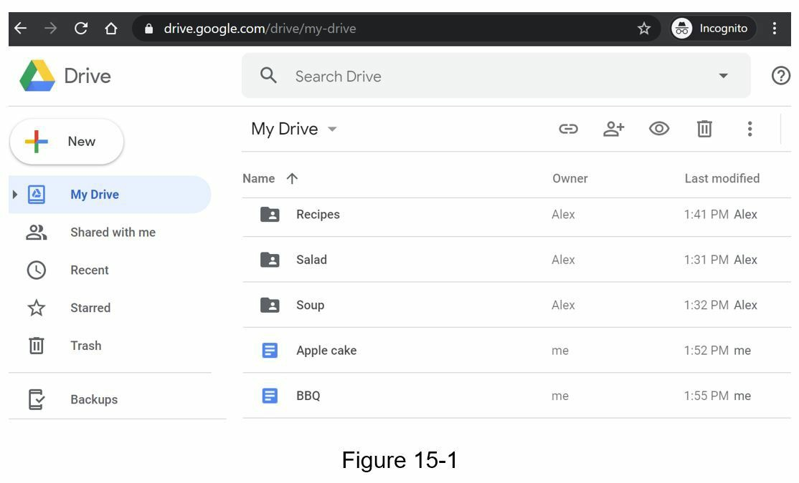
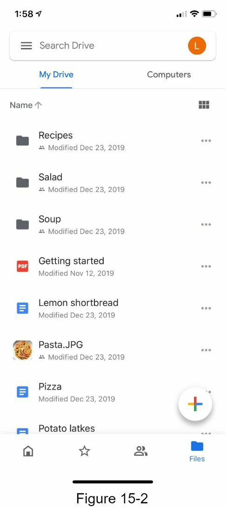

## Step 1 - Understand the problem and establish deign scope
### Questions and answer
- What are the most important features?
  - Upload & download files, file sync, and notification
- Is this a mobile app, web app, or both?
  - Both
- What are the supported file format?
  - Any file type
- Do fiels need to be encrypted?
  - Yes, files in the storage must be encrypted
- Is there a file size limit?
  - Yes, file must be 10 GB or smaller
- How many users does the product have?
  - 10M DAU

### Non-functional requirements
- Reliability
- Fast sync speed
- Bandwith usage
- Scalability
- High availability

### Back of the envelope estimation
- Assume the application has 50 millions signed up users and 10 million DAU
- User get 10GB free space
- Assume users upload 2 file per day. The average file size is 500 KB
- 1:1 read to write ratio
- total space allocated : 50 million x 10 GB = 500 Petabyte
- QPS for upload API : 10 million x 2 uploads / 24 hr / 3600 seconds = ~ 240
- Peak QPS = QPS x 2 = 480

## Step 2 - Propose high-level design and get buy-in
- Design with simple assumption. - Single Server
  - upload / download
  - database to keeps of metadata like user data, login info, files info, etc.
  - A storage system to store files
- Namespace
  - Then filename can be uniquely identified by joining the namespace and the relatvie path
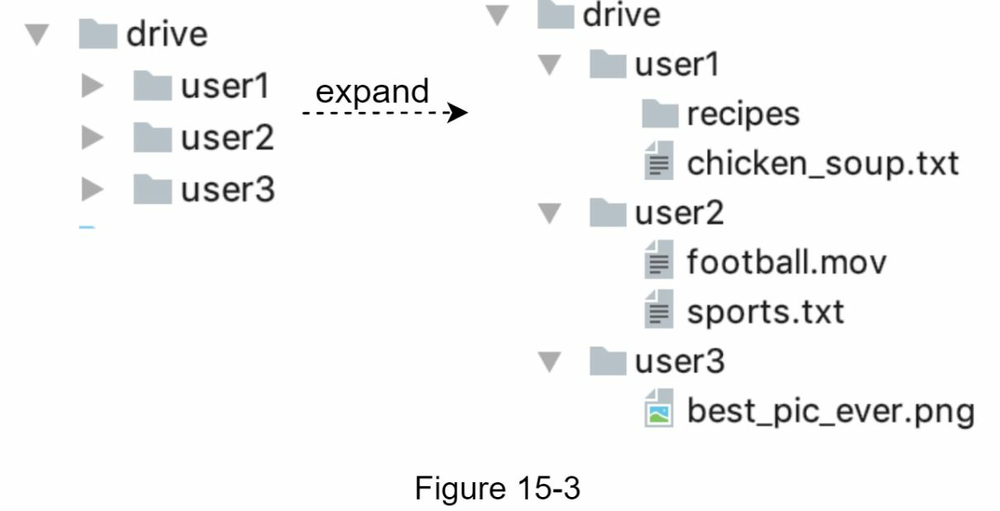

### APIs

1. Upload a file to Gootle Drive
- Two types of uploads are supported : Simple upload / resumable upload
- Example of resumable upload API
```
https://api.example.com/files/upload?uploadType=resumable
params:
- uploadType=resumable
- data: Local file to be uploaded
```
- A resumable upload is achived by the following 3 steps
  - Send th initial request to retrieve the resumable URL
  - Upload the data and monitor upload state
  - If upload is disturbed, resume the upload

2. Download a file from Google Drive
- Example API
```
https://api.example.com/files/download
Params:
- path: download file path
Example params:
{
    "path":"/recipes/soup/best_soup.txt"
}
```
3. Get file revisions
- Example
```
https://api.example.com/file/list_versions
```
params:
- path: the path to to file you want to get the revision history
- limit : The maximum number of versions to return
```
{
    "path" : "/recipes/soup/best_soup.txt"
    "limit": 20
}
```
- All the APIs require user authentication and use HTTPS. Secure Socket Layer(SSL) protect data transfer between the client and backend servers.

### Move away from single server
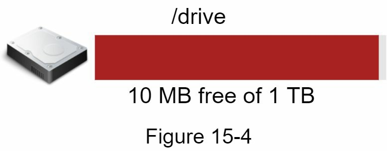
- When space is full and user cannot upload files, what is solution for this? One solution is shard data.
  - Stores on multiple storage server, like based on user_id
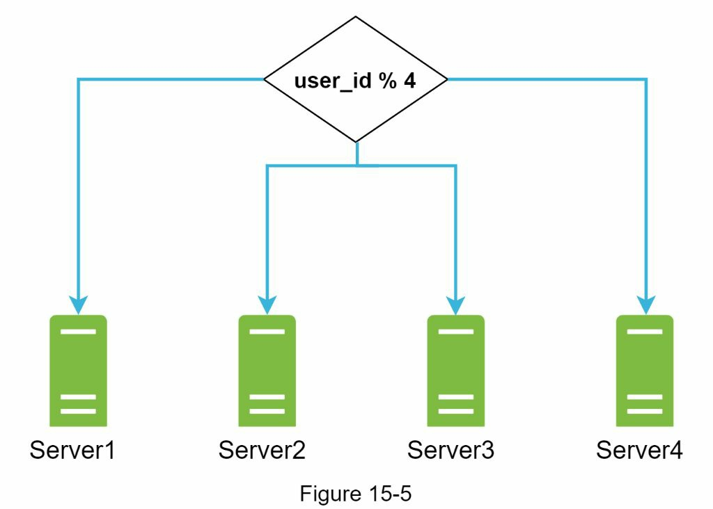
- How handle about potential data losses in case of storage server outage.
  - One of solution is using Amazon S3 for storage
  - Amazon Simple Storage Server(Amazon S3) is an object storage service that offers industry-leading scalability, data availability, security, and performance. 
  - S3 support two type replication : same-region and cross-region replication
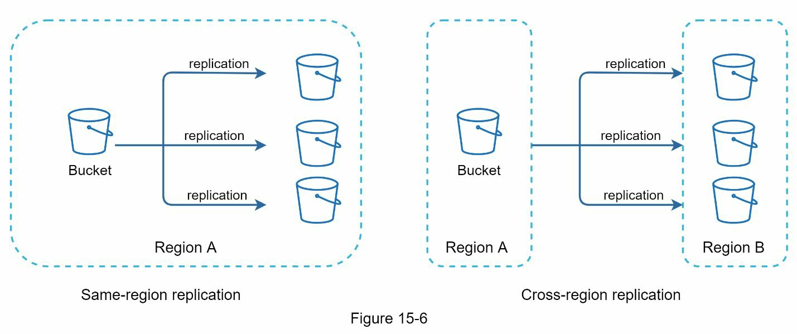
- Other topic to care
  - Load balancer
  - Web server: bBy using load balancer, web servers can be added/removed easily, depending on the traffic load
  - Metadata database: Move the DB out of the server to avoid SPOF
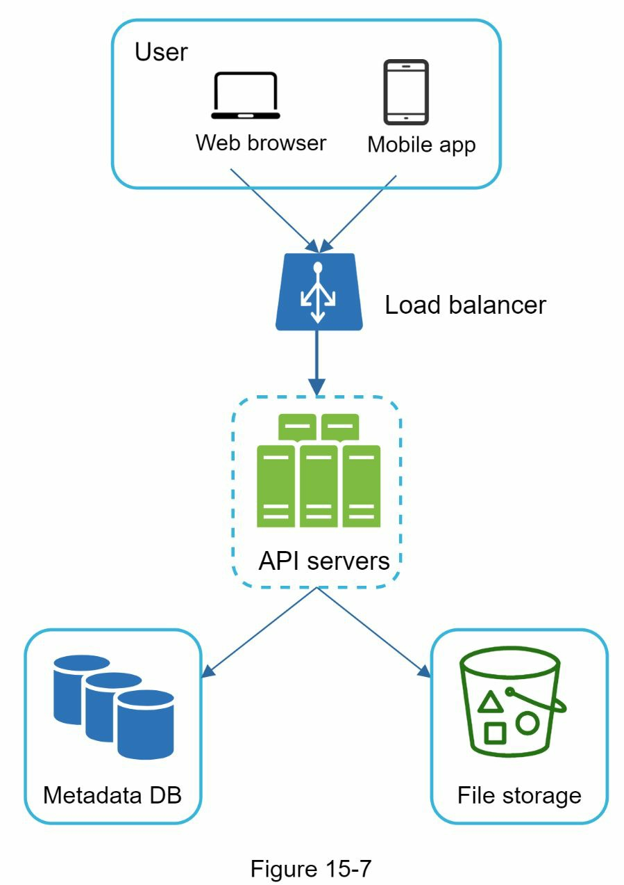

### Sync conflicts
- How to resolve file conflict in Google Drive?
  - The first version that get processed wins, and the version that gets processed later receives a conflict
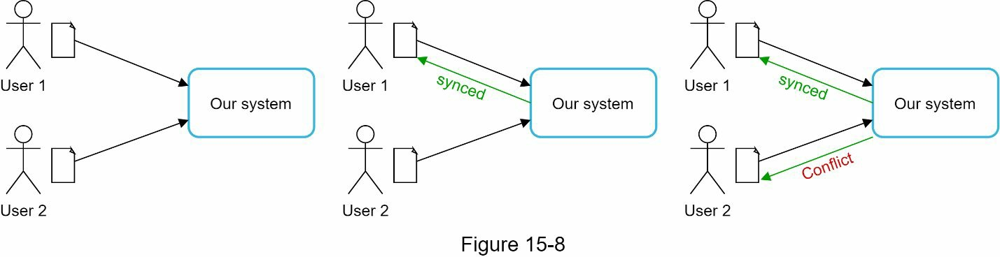
- User1 & User2 tries to update the same file at the same time.
- User1's file is processed by our system first.
- User2 gets a sync conflict
- How can we resolve the conflict?
  - Our system presents both copies of the same file
  - User2's local copy and the latest version version from the server
  - User2 has the option to merge both files or override one version with the other.
  - 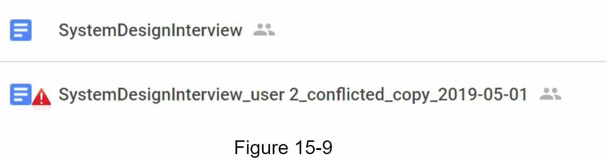

### High-level design
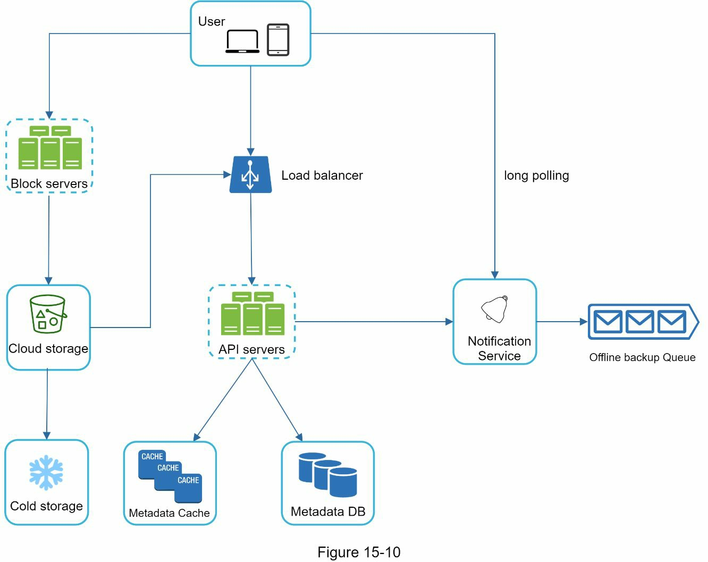
- Block servers: upload block to cloud storage. A file can be split into several blocks.
- Cloud storage: A file is split into smaller blocks and stored in cloud storage
- Cold storage: For inactive data, not accessed for a long time
- Meatdata database: Stores metadata of users, files, blocks, version
- Notification service: Publisher/subscriber system that allows data to be transferred from notification service to client as certain events happen. 
- Offline backup queue: If a client is offline and cannot pull the latest file change, the offline backup queue stores the info so changes will be synced when the client is online

## Step 3 - Design deep dive
### Block servers
- Sending large files consumes a lot of bandwith. Two optimization are proposed to minimize the amount of network traffic being transmitted
  - Delta sync: When a file is modified, only modified blocks are synced instead of whole file using a sync algorithm
  - Compression: Reduce dat size. 
- Block servers process files passed from client by splitting a file into blocks, compressing each block, and encrypting them. 
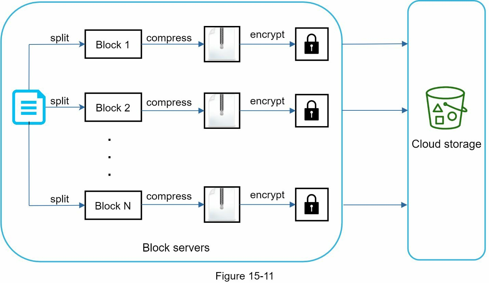
- A file is split into smaller blocks
- Each block is compressed using compression algorithm
- To ensure security, each block is encrypted before it is sent to cloud storage
- Blocks are uploaded to the cloud storage

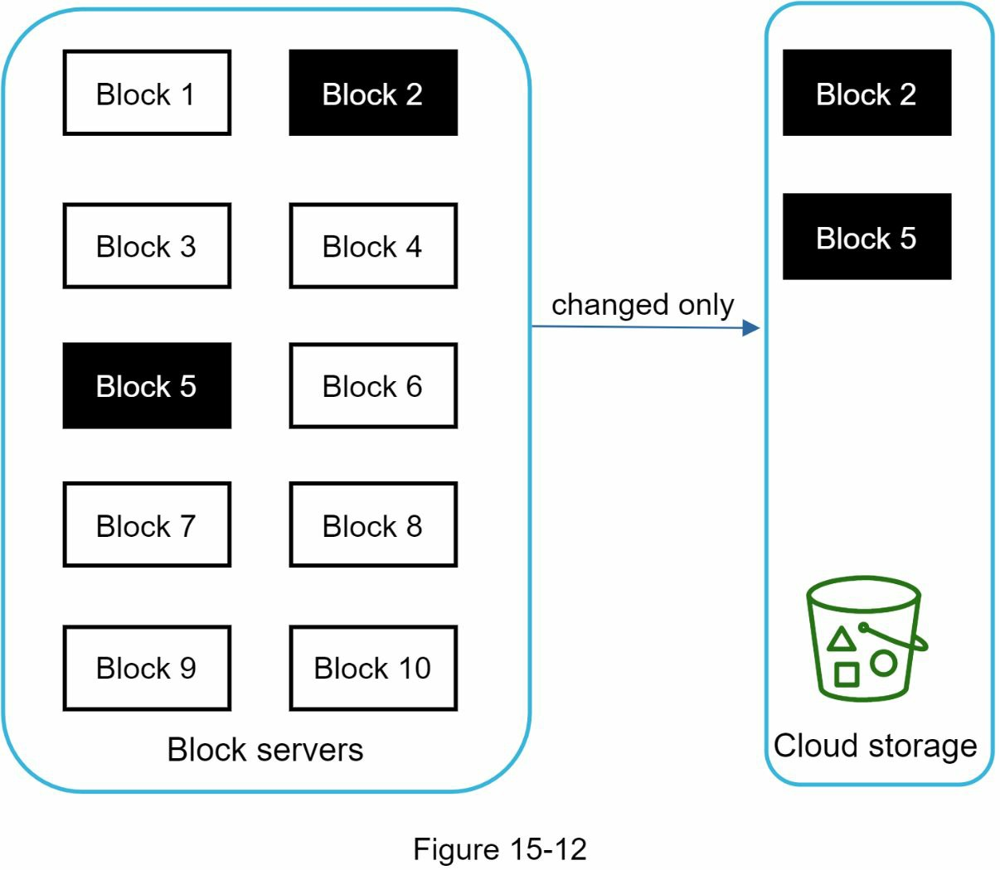
- Block2 & block5 are only changed, using delta sync, only those two blocks are uploaded to the cloug storage

### High consistency requirement
- Consistency is requirement by default
- To achieve strong consistency, we must ensure the following
  - Data in cache replicas and the master is consistent
  - Invalidate caches on database write to ensure cache and database hold the same value
- Archieving strong consistency in a relational database is easy because it maintains the ACID properties
- But NoSQL database do not support ACID properties by default. ACID properties mut be programmatically incorporated in synchronization logic.

### Metadata database
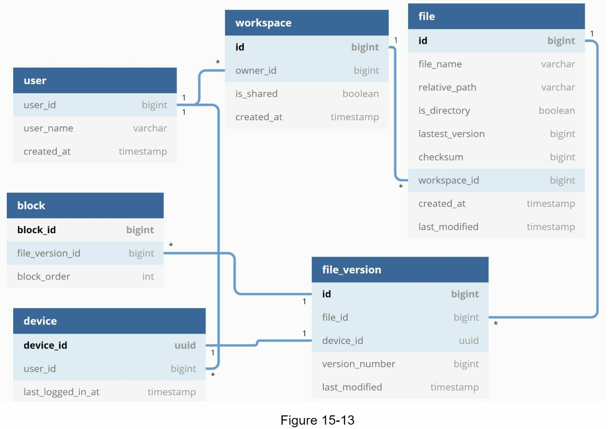
- Device: Device table stores device info. Push_id is used for sending and receiving mobile push notification. User can have multiple devices
- Namespace: Root directoy of a user
- File_version: Version history of a file. 

### Upload flow
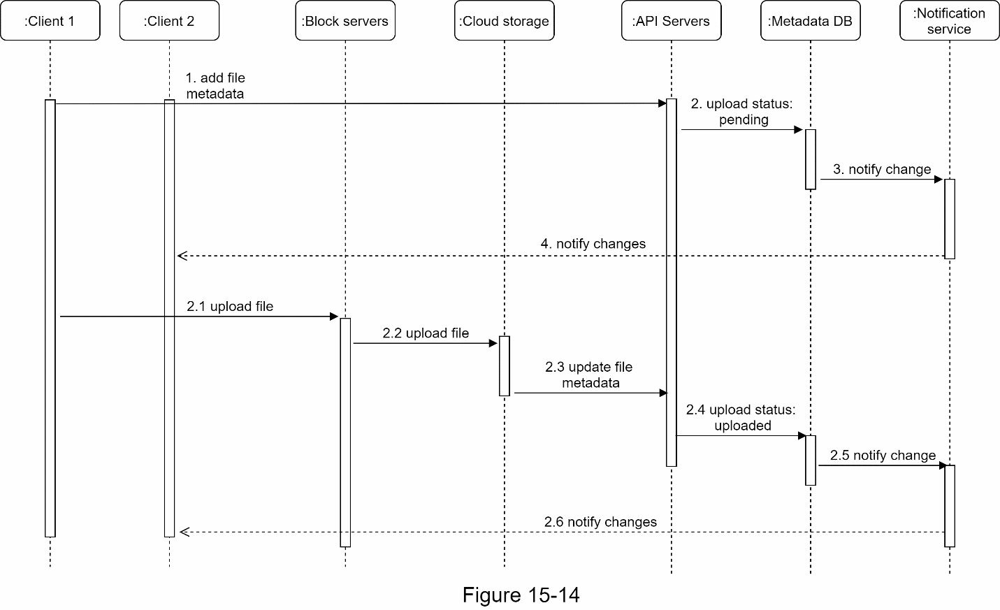
- Two request are sent in parallel. Add file metadata and upload file to cloud storage
- Add file metadata
  - Client1 send a request to add the metadata of the new file
  - Store the new file metadata in metadata DB and change the file upload status to 'pending'
  - Notify the notification service that a new file is being added
  - The notification service notifes relevant clients that a file is being uploaded
- Upload file to cloud storage
  - Client1 uploads the content of the file to block servers
  - Block servers chunk the file into blocks , compress, encrypt the blocks and upload them to cloud storage
  - Once the file is uploaded, cloud storage triggers upload completion callback. The request is sent to API servers
  - File status changed to 'uploaded' in Metadata DB
  - Notify the notification service that a file status is changed to 'uploaded'
  - The notification service notifies relevant clients that a file is fully uploaded

### Download flow
- How does a client know if a file is added or edited by another client?
  - If client A is online while a file is changed by another client, notification service will inform client A that changes are made somewhere so it needs to pull the latest data
  - If client A is offline while a file is changed by another client, data will be saved to the cache. When the offline client is online again, it pull the latest changes
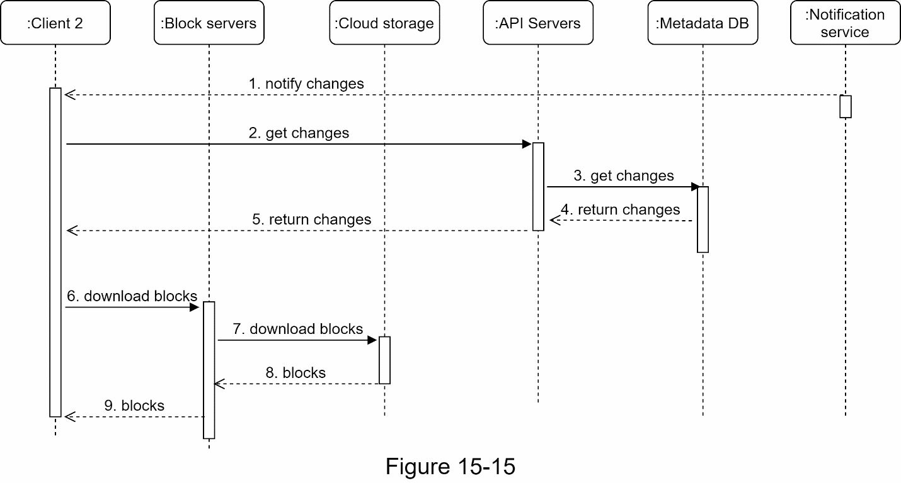
1. Notification service informs client2 
2. Once client2 knows that new updates are available, it send a request to fetch metadata
3. API servers call metadata DB to fetch metadata of the change
4. Metadata is returned to the API servers
5. Client2 gets the metadata
6. Once the client receives the metadata, it sends requests to block server to download blocks
7. Block servers first download blocks from cloud storage
8. Cloud storage returns blocks to the block servers
9. Client 2 download all the new blocks to reconstruct the file

### Notification service
- To maintain file consistency, any mutation of a file performed locally needs to be informed to other client to reduce conflict.
- Notification service is built to serve this purpose.
- Long polling, Websocet are options
- Select long polling, because of two reasons
  - Communication for notification service is not bi-directional
  - WebSocket is suited for real-time bi-directional communication

### Save storage space
- To support file version history and ensure reliability, multiple version of the same file are stored across multiple data centers, and it sends lot of spaces
- Three technique are proposed to reduce storage costs
  - De-duplicate data block
  - Adopt an intelligent data backup strategy
    - Set a limit
    - Keep valuable version only
  - Moving infrequently sued data to cold storage

### Failure Handling
- Load balance failure - use secondary by activiting and pick up the traffic.
- Block server failure - consist the server farm for block server and pick another server among them
- Cloud storage failure - S3 is replicated multiple time in different regions.
- API server failuire - Stateless server.  Use another one and set load balancer reroute to new API server
- Metadata cache failure - using replica
- Metadata DB failure - Master /Slave : use different strategy
- Notification service failure
- Offline backup queue failure : Replicate queues and let consumer re-subscribe to backup queue

## Step 4 - Wrap up
- Another design approach
  - Upload file directly to cloud storage from the client instead of going through block servers
  - Moving online/offline logic to a seperate service - Presence service