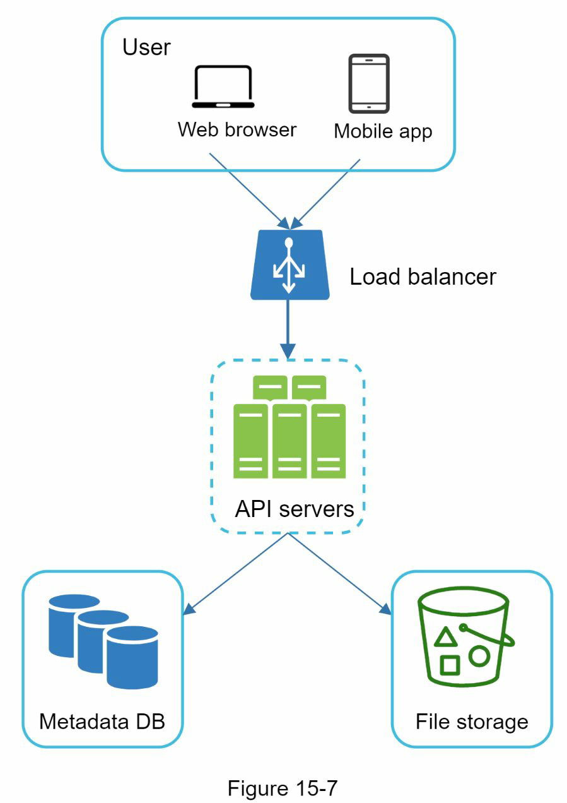
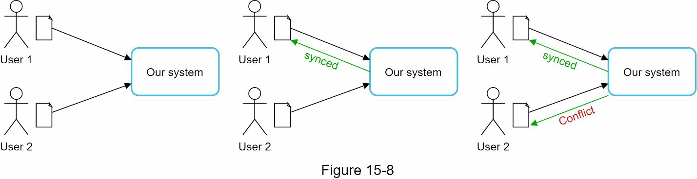
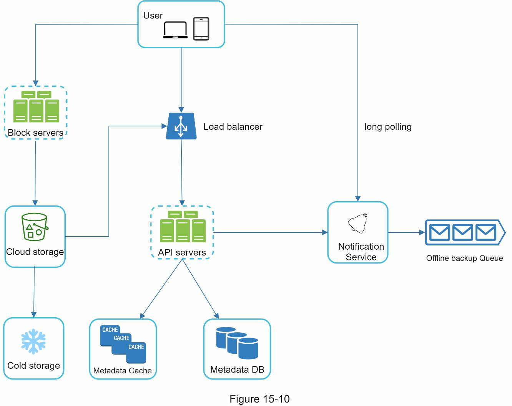
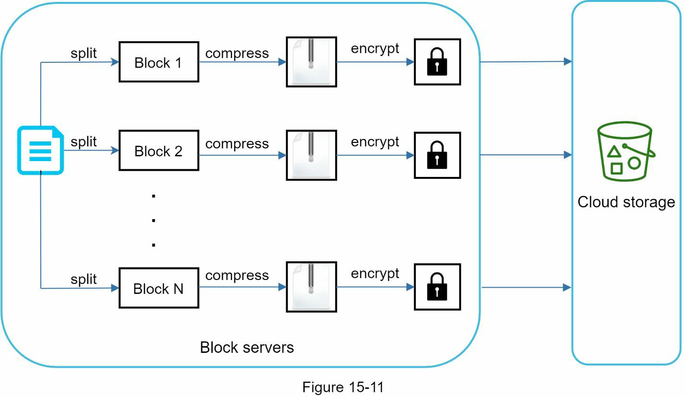
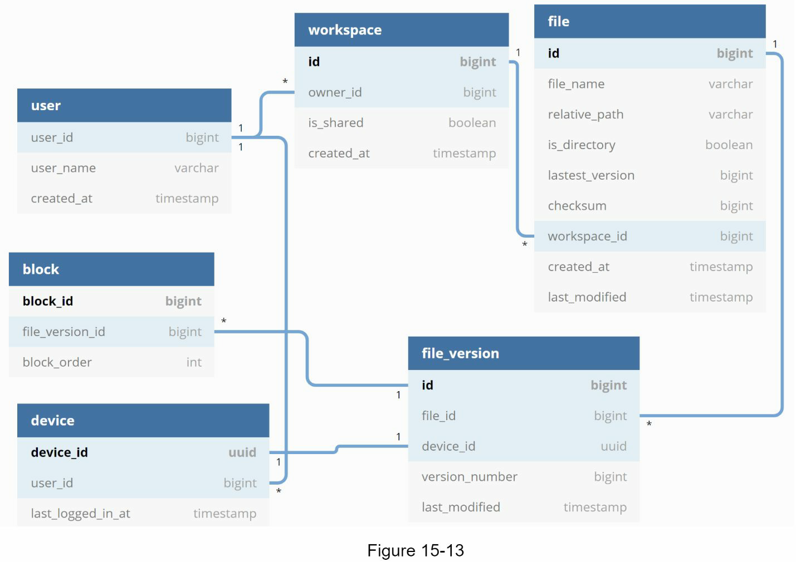
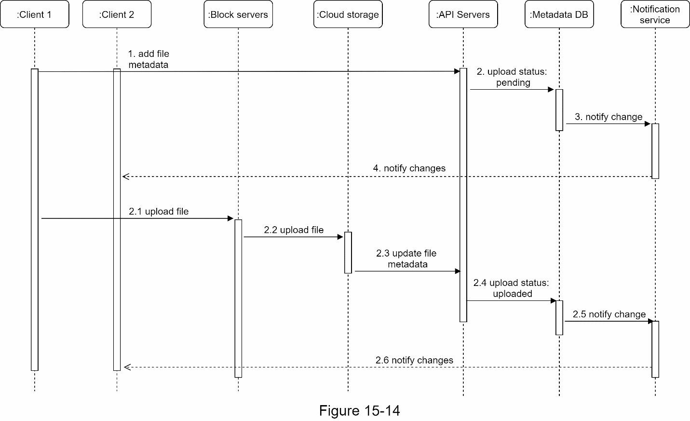
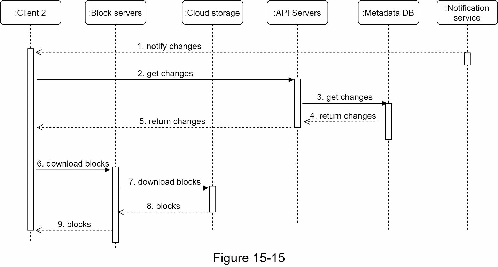

# Step 1 - Understanding the problem and establish design scope

- Most important features?
  - Upload and download files, file sync, and notifications.
- Is this a mobile app, a web app, or both?
  - Both.
- What are the supported file formats?
  - Any file type.
- Do files need to be encrypted?
  - files in the storage must be encrypted.
- Is there a file size limit?
  - Files must be 10 GB or smaller.
- How many users does the product have?
  - 10M DAU

Focus on the following features
- Add files
- Download files
- Sync files across multiple devices
- See file revisions
- Share files with your friends, family and coworkers
- Send a notification when a file is edited, deleted, or shared with you

Nonfunctional req.
- Reliability: no data loss
- Fast sync speed
- Bandwidth usage
- Scalability
- High availability

Back of the envelope estimation
- 50 million signed up users and 10 million DAU
- Users get 10 GB free space
- Assume users upload 2 files per day. The average file size is 500 KB
- 1:1 read to write ratio
- Total space allocated: 50 million * 10 GB = 500 Petabyte
- QPS for upload API: 10 million * 2 uploads / 24 hours / 3600 seconds = ~ 240
- Peak QPS = QPS * 2 = 480

# Step 2 - Propose high-level design and get buy-in

## APIs

### Upload a file to Google Drive
- Simple upload
- Resumable upload for large file

Params:
- uploadType=resumable
- data: Local file to be uploaded.

3 Steps for a resumable upload
- Send the initial request to retrieve the resumable URL.
- Upload the data and monitor upload state.
- If upload is disturbed, resume the upload.

### Download a file from Google Drive
- path: download file path.

### Get file revisions

Params:
- path: The path to the file you want to get the revision history.
- limit: The maximum number of revisions to return.

### Move away from single server

### Sync conflicts

User 1’s update operation goes through, but, user 2 gets a sync conflict. 
 - Solution: Presents both copies of the same file: user 2’s local copy and the latest version from the server

### High-level design

Block servers
- Block servers upload blocks to cloud storage. 
- It stores data files on cloud-based environments. 
- A file can be split into several blocks, each with a unique hash value, stored in our metadata database. 
- Each block is treated as an independent object and stored in our storage system (S3).

Metadata database
- It stores metadata of users, files, blocks, versions, etc. 

# Step 3 - Design deep dive

## Block servers

Two optimizations
- Delta sync: When a file is modified, only modified blocks are synced instead of the whole file using a sync algorithm.
- Compression: Applying compression on blocks can significantly reduce the data size.
Thus, blocks are compressed using compression algorithms depending on file types.

## High consistency requirement

## Upload flow

Add file metadata.
1. Client 1 sends a request to add the metadata of the new file.
2. Store the new file metadata in metadata DB and change the file upload status to “pending.”
3. Notify the notification service that a new file is being added.
4. The notification service notifies relevant clients (client 2) that a file is being uploaded.

Upload files to cloud storage.
 2.1 Client 1 uploads the content of the file to block servers.
 2.2 Block servers chunk the files into blocks, compress, encrypt the blocks, and upload them to cloud storage.
 2.3 Once the file is uploaded, cloud storage triggers upload completion callback. The request is sent to API servers.
 2.4 File status changed to “uploaded” in Metadata DB.
 2.5 Notify the notification service that a file status is changed to “uploaded.”
 2.6 The notification service

## Download flow

1. Notification service informs client 2 that a file is changed somewhere else.
2. Once client 2 knows that new updates are available, it sends a request to fetch metadata.
3. API servers call metadata DB to fetch metadata of the changes.
4. Metadata is returned to the API servers.
5. Client 2 gets the metadata.
6. Once the client receives the metadata, it sends requests to block servers to download blocks.
7. Block servers first download blocks from cloud storage.
8. Cloud storage returns blocks to the block servers.
9. Client 2 downloads all the new blocks to reconstruct the file.

## Notification service

Two options of noti
- Long polling
- WebSocket

## Save storage space

How to reduce storage costs
- De-duplicate data blocks 
- Adopt an intelligent data backup strategy
  - Set a limit
  - Keep valuable versions only
- Moving infrequently used data to cold storage

## Failure Handling
- Load balancer failure: If a load balancer fails, the secondary would become active and pick up the traffic.
- Block server failure: If a block server fails, other servers pick up unfinished or pending jobs.
- Cloud storage failure: S3 buckets are replicated multiple times in different regions. If files are not available in one region, they can be fetched from different regions.
- API server failure: It is a stateless service. If an API server fails, the traffic is redirected to other API servers by a load balancer
- Metadata cache failure: Metadata cache servers are replicated multiple times. If one node goes down, you can still access other nodes to fetch data.
- Metadata DB failure
- Notification service failure
- Offline backup queue failure: Queues are replicated multiple times.

# Step 4 - Wrap up

