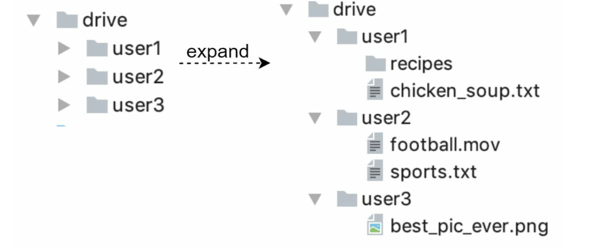
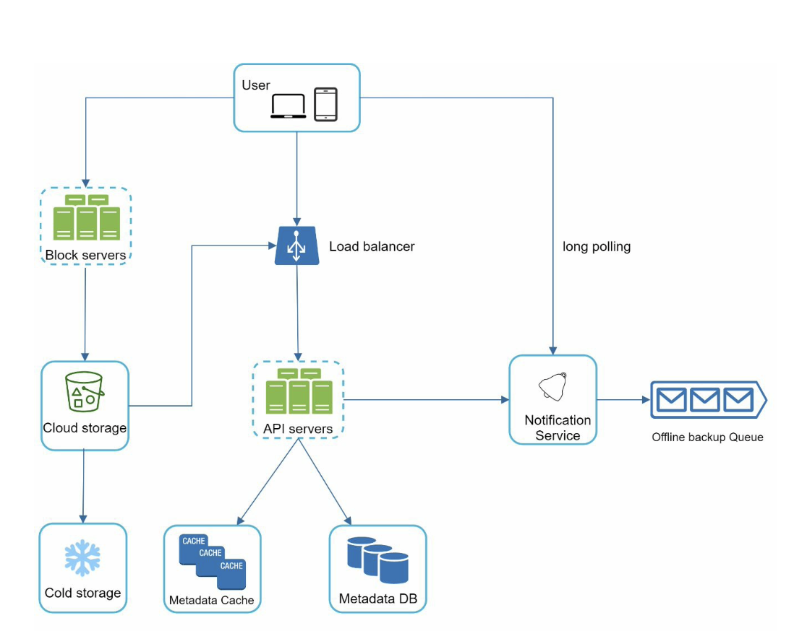

# Chapter 15: Design Google Drive

- Cloud Storage services: Google Drive, Dropbox, Microsoft OneDrive, Apple iCloud, etc

- Google Drive tldr: 
    - file storage and synchronization service that helps you store documents, photos, videos, and other files in the cloud
    - you can access your files from any computer, smartphone, and tablet
    - you can easily share files with friends, family, and coworkers

## Step 1: Understand the Problem and Establish Design Scope
- Narrow down the scope!
- Features we need after asking clarification questions:
    - Add files
        - easiest way: drag and drop a file into Google drive
    - Download files
    - Sync files across multiple devices
    - See file revisions
    - Share files
    - Send a notification when a file is edited, deleted, or shared

- Features not discussed:
    - Google doc editing and collaboration

- Important non-functional requirements:
    - Reliability  
        - Data loss is unacceptable
    - Fast sync speed
    - Bandwidth usage
        - product should not take a lot of unnecessary network bandwidth
    - Scalability
    - High availability
        - can still use when servers are offline, slowed down, or have unexpected network errors

### Back of the Envelope estimation
- Assume the application has 50 million signed up users and 10 million DAU. - Users get 10 GB free space.
- Assume users upload 2 files per day. The average file size is 500 KB.
- 1:1 read to write ratio.
- Total space allocated: 50 million * 10 GB = 500 Petabyte
- QPS for upload API: 10 million * 2 uploads / 24 hours / 3600 seconds = ~ 240 - Peak QPS = QPS * 2 = 480

## Step 2: Propose High-level Design and Get Buy-in

- Start simple: build everything in a single server. Gradually scale up to support millions of users

- Start with single server setup
    - web server to upload and download files
    - db to keep track of metadata like user data, login info, files info, etc
    - storage system to store files
        - allocate 1TB of storage space to store files
    
- Example of how the /drive directory looks like:
    

### APIs
- 3 APIs needed
    - upload a file
    - download a file
    - get file revisions

#### 1. Upload a file to Google Drive
- Two types of upload:
    - simple upload - when file size is small
    - resumable upload - when file size is large and high chance of network interruption

- example: https://api.example.com/files/upload?uploadType=resumable
    - params:
        - uploadType=resumable
        - data: Local file to be uploaded

- resumable upload steps:
    - send initial request to retrieve resumable URL
    - upload data and monitor upload state
    - if upload disturbed, resume upload

#### 2. Download a file from Google Drive
- example: https://api.example.com/files/download
    - params:
        - path: download file path
            - { "path":"/recipes/soup/best_soup.txt" }

### 3. Get file revisions
- example: https://api.example.com/files/list_revisions
    - params:
        - path: path to the file you want to get the revision history
        - limit: max number of revisions to return
            - { "path":"/recipes/soup/best_soup.txt", "limit":20 }

- Note: all APIs requireuser authentication and use HTTPS. SSL (Secure Socket Layer) protects data transfer between the client and backend servers

### Move away from single server
- You'll eventually get space full alert (from drive) as more files are uploaded 
    - users cannot upload files anymore
- Solution 1: shard the data, so it's sotred on multiple storage servers
    - i.e. user_id %4 

- Potential data losses in case of storage server outage
- Solution 1: use Amazon S3 for storage
    - an object storage service that offers industry-leading scalability, data availability, security, and performance
    - supports same-region and cross-region replication
        - region: geographic area where AWS have data centers
    - data can be replicated on the same region and cross-region
    - redundant files are stored in multiple regions to guard against data loss and ensure availability
    - bucket: like a folder in file systems

- More improvements
    - Load balancer to distribute network traffic
        - evenly distributes traffic, and if a web server goes down, it redistributes the traffic
    - Web servers - can be added/removed depending on the traffic load
    - Metadata db - move db out of the server to avoid single point of failure. Also set up data replication and sharding to meet the availability and scalability requirements
    - File storage - replicate files in two separate geographical regions to ensure availability and durability

### Sync Conflicts
- Sync conflicts happen from time to time for a large storage system like Google Drive
    - when two users modify the same file or folder at the same time

- Our strategy:
    - the first version that gets processed wins
    - the version that gets processed later receives a conflict ( user 2 has the option to merge both files or override one version with the other)
    - if multiple users edit at the same time, more challenging to keep the document synchronized

### High-level design

    

## Step 3: Design Deep Dive

### Block Servers

- Delta sync: Instead of sending the entire file, only modified blocks are synced using a sync algorithm.
- Compression: Blocks are compressed to reduce data size; different compression algorithms are used based on file types.
- Block servers handle file uploads by splitting files into blocks, compressing each block, and encrypting them.
- Only modified blocks are transferred to the storage system instead of the entire file, reducing bandwidth consumption.

### High Consistency Requirement
- Strong consistency is required by default in our system to ensure uniform file representation across all clients simultaneously.
- Metadata cache and database layers must offer strong consistency.
- Memory caches typically adopt an eventual consistency model, leading to potential data discrepancies between replicas.
- To achieve strong consistency:
    - Ensure consistency between cache replicas and the master data.
    - Invalidate caches upon database writes to synchronize cache and database values.
- Achieving strong consistency is straightforward in relational databases due to their native support for ACID properties (Atomicity, Consistency, Isolation, Durability).
- NoSQL databases lack native ACID support, necessitating the incorporation of ACID properties into synchronization logic programmatically.
- Relational databases are preferred in our design due to their native support for ACID properties.

### Metadata Database
- User: Contains user's basic details like username, email, and profile photo.
- Device: Stores device information; push_id facilitates mobile push notifications. Users can have multiple devices.
- Namespace: Root directory for a user's files.
- File: Holds all data related to the latest file.
- File_version: Records file version history; existing entries are read-only to maintain file revision integrity.
- Block: Contains data related to file blocks; joining blocks in the right sequence reconstructs any file version.

### Upload flow
- When client uploads a file
- Two parallel requests from Client 1:
    - Add File Metadata:
        - Client 1 sends metadata request.
        - Metadata stored in DB, file upload status set to “pending”.
        - Notification service informed of new file.
        - Relevant clients (Client 2) notified of upload.
    - Upload to Cloud Storage:
        - Client 1 uploads file content.
        - Block servers chunk, compress, encrypt, and upload blocks.
        - Cloud storage triggers completion callback to API servers.
        - File status updated to “uploaded” in DB.
        - Notification service informed of status change.
        - Relevant clients (Client 2) notified of completion.

### Download flow

- Client is notified of file changes:
    - If online, notified by notification service to pull latest data.
    - If offline, changes saved to cache for later retrieval.
- Upon notification, client requests metadata via API servers.
- Client then downloads blocks to reconstruct the file.

### Notification Service
- Notification service informs clients of file mutations to maintain consistency.
- Options for transferring data to clients:
    - Long polling: Used by Dropbox.
    - WebSocket: Provides persistent, bi-directional connection.
- Long polling chosen over WebSocket due to:
    - Unidirectional communication sufficiency.
    - Infrequent, non-bursty nature of notifications in Google Drive.
- Long polling process:
    - Client establishes long poll connection to notification service.
    - Upon detecting file changes, client closes connection.
    - Connection closure prompts client to download latest changes from metadata server.
    - After response or connection timeout, client sends new request to maintain open connection.

### Save storage space
- To manage file version history and ensure reliability, multiple file versions are stored across various data centers.
- Frequent backups can rapidly consume storage space, prompting the need for cost-reduction techniques.
- Proposed techniques to reduce storage costs:
    - Deduplicate data blocks by eliminating redundant blocks based on hash values.
    - Implement intelligent data backup strategies, such as:
        - Setting a version limit to replace older versions with newer ones when the limit is reached.
        - Storing only valuable versions and giving more weight to recent ones to avoid unnecessary copies.
    - Transfer infrequently accessed data to cold storage solutions like Amazon S3 Glacier, which offer cheaper storage options compared to standard S3.

### Failure handling
- System failures are inevitable in large-scale systems, necessitating the adoption of design strategies to mitigate their impact.
- Handling of various system failures:
    - Load balancer failure: Secondary load balancer takes over traffic, monitored using heartbeats.
    - Block server failure: Unfinished or pending jobs are picked up by other servers.
    - Cloud storage failure: Files are replicated across multiple S3 buckets in different regions.
    - API server failure: Stateless service; traffic redirected to other servers by load balancer.
    - Metadata cache failure: Replicated servers ensure continued access; failed node replaced.
    - Metadata DB failure: Strategies depend on master or slave node failure, including promoting a new master or replacing a failed slave.
    - Notification service failure: Long poll connections maintained; lost connections require clients to reconnect gradually.
    - Offline backup queue failure: Replicated queues ensure continuity; consumers may need to re-subscribe to backup queues if one fails.

## Step 4: Wrap up
- Proposed a system design for supporting Google Drive, emphasizing strong consistency, low network bandwidth, and fast sync.
- Design includes two main flows: managing file metadata and file synchronization.
- Notification service crucial for keeping clients updated with file changes, using long polling.
- No perfect solution exists; design must fit unique company constraints, with awareness of tradeoffs in design and technology choices.
- Example alternative design choice: Direct file upload to cloud storage from client, bypassing block servers, for faster upload. However, drawbacks include need for platform-specific implementation of chunking, compression, and encryption logic, and security concerns about implementing encryption on client side.
- Another potential evolution of system: Separating online/offline logic into separate service (presence service), allowing easier integration by other services and reducing load on notification servers.