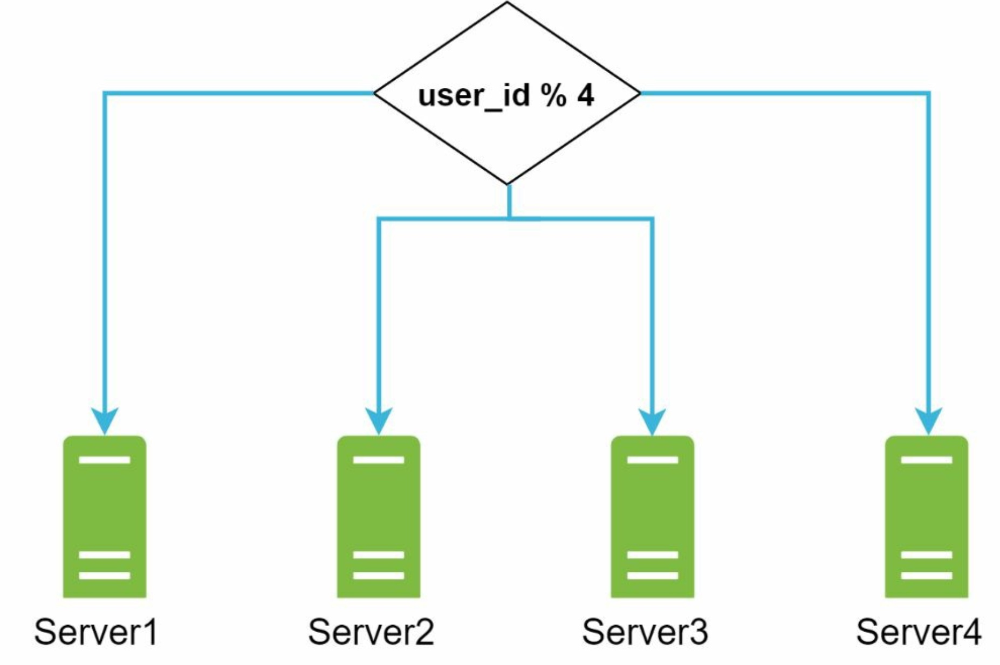
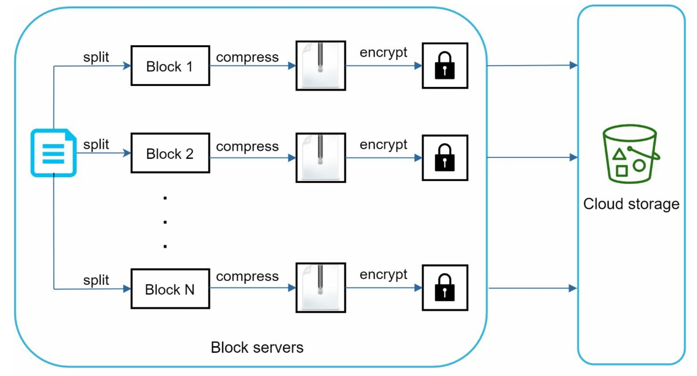
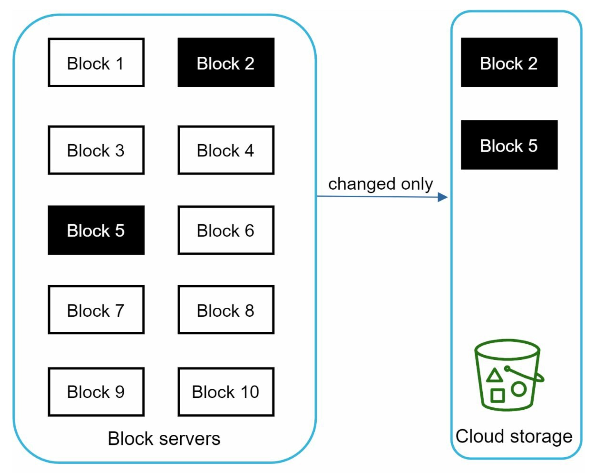
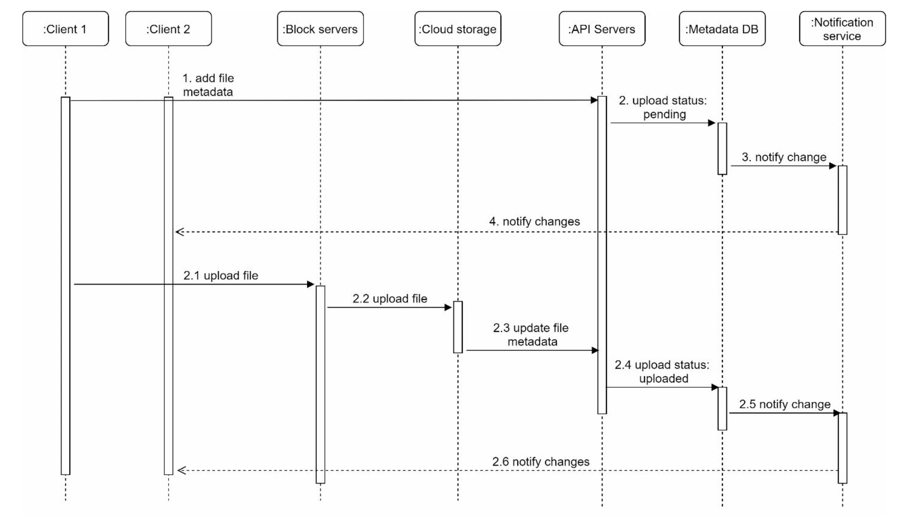
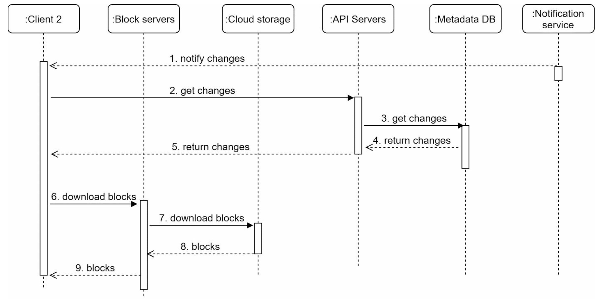

# Chapter 15. Design Google drive

- File storage and synchronization service that helps us store documents, photos, videos, and other files in the cloud
- The files can be accessed fro many computer, smartphone, and tablet

### Step 1 - Understand the problem and establish design scope

> 1-1. Requirements

- Feature to upload and download files, sync file, and send notifications
- Mobile app and wep app both are supported
- Any file formats are supported
- Files in the storage must be encrypted
- 10 million DAU

> 1-2. Focusing features in this chapter

- Add files, the easiest way to add file is to drag and drop
- Download files
- Sync files across multiple devices
- See file revisions
- Share files with friends, family, and coworkers
- Send a notification when a file is edited, deleted, or shared with us

Non- functional requirements:

- Reliability
- Fast sync speed
- Bandwidth usage
- Scalability
- High availability

> 1-3. Back of the envelope estimation

Assumptions:

- 50 million signed up users and 10 million DAU
- Users get 10GB free space
- Users upload 2 files/day
- Average file size is 500KB
- 1:1 read to write ratio

Then,

- Total space allocated: 50 million \* 10GB = 500 Petabyte
- QPS for upload API: 10 million \* 2 uploads/ 24 hours / 3600 seconds = ~240
- Peak QPS = QPS \* 2 = 480

### Step 2 - Propose high-level design and get buy-in

We start with a single server setup first:

- A web server to upload and download files
- A database to keep track of metadata like user data, login info, files info, etc
- A storage system to store files. We allocate 1TB of storage space to store files

Our root directory to store uploaded files should look like below. We need to make sure the filename on the server is kept the same as the original file name and each file or folder can be uniquely identified by joining the namespace and the relative path.

    

> 2-1. APIs

We need 3 primary APIs:

- Upload a file
- Download a file
- Get file revisions

#### 1. Upload a file to Google Drive

Two types of uploads are supported:

- Simple upload: use this upload type when the file size is small
- Resumable upload: use this upload type when the file size is large and there is high change of network interruption.
  A resumable upload is achieved by the following 3 steps: 1. Send the initial request to retrieve the resumable URL 2. Upload the data and monitor upload state 3. If upload is disturbed, resume the upload

#### 2. Download a file from Google Drive

Example API: https://api.example.com/files/download
Params:

- path: download file path

#### 3. Get file revisions

Example API: https://api.example.com/files/list_revisions
Params:

- path: The path to the file you want to get the revision history
- limit: the maximum number of revisions to return

> 2-2. Move away from single server

As more files are uploaded, eventually we get the space full alerts. The first solution comes to mind is to shard the data, so it is stored on multiple storage servers like below.

    

But we are still worried about potential data losses in case of storage server outage. We decide to store files in **Amazon S3 storage system** which offers industry-leading scalability, data availability, security, and performance. It also supports same-region and cross-region replications.

    
    
Redundant files are stored in multiple regions to guard against data loss and ensure availability

\*Further points we can improve the architecture:

- Load balancer: To distribute network traffic. It ensures every distributed traffic, and if a web server goes down, it will redistribute tht traffic
- Web servers: After a load balancer is added, more web servers can be added/removed
- Metadata database: To avoid single point of failure
- File storage: Amazon S3, to ensure availability and durability

    

> 2-3. Sync conflicts

When two users modify the same file or folder at the same time, a conflict happens.
**The strategy** is that the first version that gets processed wins, and the version that gets processed later receives a conflict.

    

User 1 and user 2 tries to update the same file at the same time, but user1's file is processed by our system first. User 2 gets a sync conflict. Then, user 2 has the option to merge both files or override one version with the other

    

> 2-4. High-level design

    

**User**: A user uses the application either through a browser or mobile app
**Block servers**: Uploads blocks to cloud storage. **Block storage(block-level storage)** is a technology to store data files on cloud-based environments. A file can be split into several blocks, each with a unique hash value, stored in our metadata database. Each block is treated as an independent object and stored in our storage system. To reconstruct a file, blocks are joined in a particular order.
**Cloud storage**: A file is split into small blocks and stored in cloud storage
**Cold storage**: A computer system designed for storing inactive data, meaning files are not accessed for a long time
**Load balancer**: Evenly distributes requests among API servers
**API servers**: Used for user authentication, managing user profile, updating file metadata, etc.
**Metadata database**: Stores metadata of users, files, blocks, versions, etc. _Files are stored in the cloud and the meta database only contains metadata._
**Metadata cache**: For fast retrieval
**Notification service**: Publisher/subscriber system that allows data to be transferred from notification service to clients as certain events happen
**Offline backup queue**: If a client is offline and cannot pull the latest file changes, the offline backup queue stores the info so changes will be synced when the client is online

### Step 3 - Design deep dive

> 3-1. Block servers

For large files that are updated regularly, sending the whole file on each update consumes a lot of bandwidth. Two optimizations to minimize the amount of network traffic being transmitted:

- **Delta sync**: when a file is modified, only modified blocks are synced instead of whole file using a sync algorithm
- **Compression**: Applying compression on blocks can significantly reduce the data size. Different compression algorithms are needed to compress images and videos.

    

- A file is split into smaller blocks
- Each block is compressed using compression algorithms
- To ensure security, each block is encrypted before it's sent to cloud storage
- Blocks are uploaded to the cloud storage

**Delta Sync**
"Block 2" and "Block 5" are changed blocks. Using delta sync, only those two blocks are uploaded to the cloud storage

    
    
Delta sync

> 3-2. High consistency requirement

It is unacceptable for a file to be shown differently by different clients at the same time. The system needs to provide **strong consistency** for metadata cache and database layers.

To achieve strong consistency, we must ensure the followings:

- Data in cache replicas and the master is consistent
- Invalidate caches on database write to ensure cache and database hold the same value

Achieving strong consistency in a relational database is easy because it maintains the [ACID(Atomicity, Consistency, Isolation, Durability)](https://www.geeksforgeeks.org/acid-properties-in-dbms/) properties.

> 3-3. Metadata database

    
    
Simplified version of metadata database

**User**: The user table contains basic information about the user
**Device**: Device table stores device info
**Workspace**: Root directory of a suer
**File**: stores everything related to the latest file
**File_version**: stores version history of a file. Existing rows are read-only to keep the integrity of the file revision history
**Block**: stores everything related to a file block. A file of any version can be reconstructed by joining all the blocks in the correct order

> 3-4. Upload flow

    

**Add file metadata**

1. Client 1 sends a request to add the metadata of the new file
2. Store the new file metadata in metadata DB and change the file upload status to "pending"
3. Notify the notification service that a new file is being added
4. The notification service notifies relevant clients(client 2) that a file is being uploaded

**Upload files to cloud storage**
2.1. Client 1 uploads the content of the file to block servers
2.2. Block servers chunk the files into blocks, compress, encrypt the blocks, and upload them to cloud storage
2.3. Once the file is uploaded, cloud storage triggers upload completion callback. The request is sent to API servers
2.4. File status changed to "uploaded" in Metadata DB
2.5. Notify the notification service that a file status is changed to "uploaded"
2.6. The notification service notifies relevant clients(client 2) that a file is fully uploaded

Flow to edit a file is similar.

> 3-5. Download flow

Download flow is triggered when a file is added or edited elsewhere.
Two ways a client can know if a file is added or edited:

- If a client A is online while a file is changed by another client, notification service will inform client A that changes are made somewhere so it needs to pull the latest data
- If client A is offline while a file is changed by another client, data will be saved to the cache. When the offline client is online again, it pulls the latest changes

Once a client knows a file is changed, it first requests metadata via API servers, then download blocks to construct the file.

    

1. Notification service informs client 2 that a file is changed somewhere else
2. Once client 2 knows that new updates are available, it sends a request to fetch metadata
3. API servers call metadata DB to fetch metadata of the changes
4. Metadata is returned to the API servers
5. Cline 2 gets the metadata
6. Once the client receives the metadata, it sends requests to block servers to download blocks
7. Block servers first download blocks from cloud storage
8. Cloud storage returns blocks to the block servers
9. Client 2 downloads all the new blocks to reconstruct the file

> 3-6. Notification service

To maintain file consistency, any mutation of a file performed locally needs to be informed to other clients to reduce conflicts. Notification service allows data to be transferred to clients as events happen.

- Long polling(Dropbox uses long polling)
- Websocket, it provides a persistent connection between the client and the server. Bi-directional communication

We opt for **long polling** for the following reasons:

- Communication for notification service is not bi-directional. The server sends information about file changes to the client, but not vice versa
- Websocket is suited for real-time bi-directional communication such as a chat app. For Google Drive, notification sa re sent infrequently with no burst of data

With long polling, if changes to a file are detected, the client will close the long poll connection. Closing the connection means a client must connect to the metadata server to download the latest changes. After a response is received or connection timeout is reached, a client immediately sends a new request to keep the connection open

> 3-7. Save storage space

To support file version history and ensure reliability, multiple versions of the same file are stored across multiple data centers, which can make the storage space filled up quickly with frequent backups of all file revisions.

Three techniques to reduce storage costs:

- De-duplicate data blocks. Eliminating redundant blocks at the account level is an easy way to save space. Two blocks are identical if they have the same hash value
- Adopt an intelligent data backup strategy
  - Set a limit: if the limit is reached, the oldest version will be replaced with the new version
  - Keep valuable versions only: to avoid unnecessary copies, we could limit the number of saved versions
- Moving infrequently used data to cold storage

> 3-8. Failure Handling

How to handle following system failures:

- **Load balancer failure**: the secondary would become active and pick up the traffic. Load balancers usually monitor each other using a heartbeat, a periodic signal sent between load balancers. It is considered as failed if it has not sent a heartbeat for some time
- **Block server failure**: other servers pick up unfinished or pending jobs
- **Cloud storage failure**: S3 buckets are replicated multiple times in different regions. Files are not available in a region can be fetched from different regions
- **API server failure**: the traffic is redirected to other API servers by a load balancer
- **Metadata cache failure**: Metadata cache servers are replicated multiple times. If one node goes down, we can still access other nodes to fetch data. We can even bring up a new cache server to replace the failed one
- **Metadata DB failure**:
  - Master down: promote one of the slaves to act as a new master and bring up a new slave node
  - Slave down: use another slave for read operations and bring another database server to replace the failed one
- **Notification service failure**: if a server goes down, all the long poll connections are lost so clients must reconnect to a different server. Even though one server can keep many open connections, it cannot reconnect all the lost connections at cone. Reconnecting with all the lost clients is a relatively slow process.
- **Offline backup queue failure**: consumers of the queue may need to re-subscribe to the backup queue
