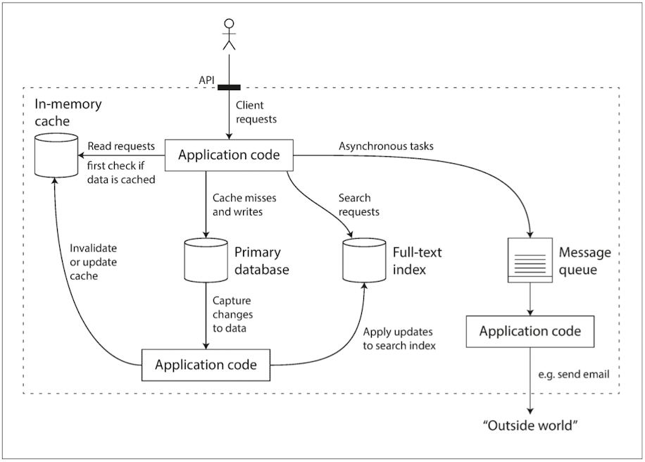
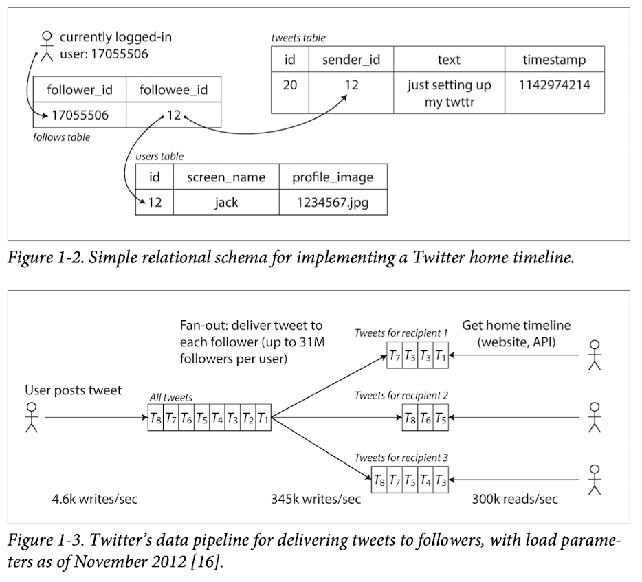
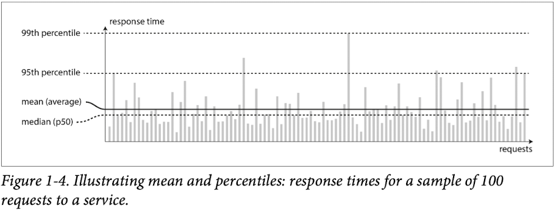
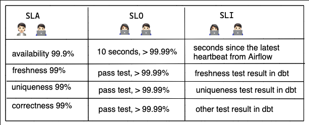

# Chapter 1: Reliable Scalable And Maintainable Application

## A Data-intensive applications need to:
- **Database**: Store data so that they, or another application, can find it again later
- **Caches**: Remember the result of an expensive operation, to speed up reads
- **Search indexes**: Allow users to search data by keyword or filter it in various ways
- **Stream processing**: Send a message to another process, to be handled asynchronously
- **Batch processing**: Periodically crunch a large amount of accumulated data

## Thinking about data systems
- Why should we lump them all together under an umbrella term like data systems?
  - Many new tools for data storage and processing have emerged in recent years. They are optimized for a variety of different use cases, and they no longer neatly fit into traditional categories

## Three concerns that are important in most software systems:
1. Reliability: The system should continue to work correctly (performing the correct function at the desired level of performance) even in the face of adversity (hardware or software faults, and even human error)
2. Scalability: As the system grows (in data volume, traffic volume, or complexity), there should be reasonable ways of dealing with that growth.
3. Maintainability: Over time, many different people will work on the system (engineering and operations, both maintaining current behavior and adapting the system to new use cases), and they should all be able to work on it productively.

## 1. Reliability -> "continuing to work correctly, even when things go wrong."
- Typical expectations include:
1. The application performs the function that the user expected. 
2. It can tolerate the user making mistakes or using the software in unexpected ways.
3. Its performance is good enough for the required use case, under the expected load and data volume.
4. The system prevents any unauthorized access and abuse.

- Fault VS Failure
  - Fault: one component of the system deviating from its spec
  - Failure: a whole stops providing the required service to the user

> It is impossible to reduce the probability of a fault to zero; therefore it is usually best to design fault-tolerance mechanisms that prevent faults from causing failures.

- Prevention VS Cure 
  - Prevention -> However, However, this book mostly deals with the kinds of faults that can be cured.

### Hardware Faults
- Hard disks are reported as having a mean time to failure (MTTF) of about 10 to 50 years.
- Thus, on a storage cluster with 10,000 disks, we should expect on average one disk to die per day.
- Our first response is usually to add redundancy to the individual hardware components.
- However, as data volumes and applications’ computing demands have increased, more applications have begun using larger numbers of machines, which proportionally increases the rate of hardware faults.
- Hence there is a move toward systems that can tolerate the loss of entire machines, by using software fault-tolerance techniques in preference or in addition to hardware redundancy.
- A system that can tolerate machine failure can be patched one node at a time, without downtime of the entire system

### Software Errors
- Hardware Faults has weak correlations between machines.
- Software Errors are correlated across nodes.
  - A software bug that causes every instance of an application server to crash when given a particular bad input.
  - A runaway process that uses up some shared resource—CPU time, memory, disk space, or network bandwidth.
  - A service that the system depends on that slows down, becomes unresponsive, or starts returning corrupted responses.
  - Cascading failures, where a small fault in one component triggers a fault in another component, which in turn triggers further faults
- There is no quick solution to the problem of systematic faults in software.
- Lots of small things can help:
  - carefully thinking about assumptions and interactions in 
    - the system; 
    - thorough testing; 
    - process isolation; 
    - allowing processes to crash and restart; 
    - measuring, monitoring, and analyzing system behavior in production.

### Human Errors
- How do we make our systems reliable, in spite of unreliable humans? The best systems combine several approaches:
  - Design systems in a way that minimizes opportunities for error.
  - Decouple the places where people make the most mistakes from the places where they can cause failures.
  - Test thoroughly at all levels, from unit tests to whole-system integration tests and manual tests.
  - Allow quick and easy recovery from human errors, to minimize the impact in the case of a failure.
  - Set up detailed and clear monitoring, such as performance metrics and error rates.
  - Implement good management practices and training—a complex and important aspect, and beyond the scope of this book.

> There are situations in which we may choose to sacrifice reliability in order to reduce development cost (e.g., when developing a prototype product for an unproven mar‐ ket) or operational cost (e.g., for a service with a very narrow profit margin)—but we should be very conscious of when we are cutting corners.

## 2. Scalability
- “If the system grows in a particular way, what are our options for coping with the growth?”
- “How can we add computing resources to handle the additional load?”

### Describing Load
- Perhaps the average case is what matters for you, or perhaps your bottleneck is dominated by a small number of extreme cases.
- Twitter Example
  - Post tweet: A user can publish a new message to their followers (4.6k requests/sec on average, over 12k requests/sec at peak).
  - Home timeline: A user can view tweets posted by the people they follow (300k requests/sec).
  - Approach 1: Relational database query
  - Approach 2: Home timeline Cache (Write < Read)

### Describing Performance
- When you increase a load parameter and keep the system resources (CPU, memory, network bandwidth, etc.) unchanged, how is the performance of your system affected?
- When you increase a load parameter, how much do you need to increase the resources if you want to keep performance unchanged?

> Latency VS Response time
>  - Response time: what the client sees <- More important
>  - Latency: the duration that a request is waiting to be handled

- Average VS Percentile

- Examples of Percentile
- If the 95th percentile response time is 1.5 seconds, that means 95 out of 100 requests take less than 1.5 seconds, and 5 out of 100 requests take 1.5 seconds or more.
- Amazon describes response time requirements for internal services in terms of the 99.9th per‐ centile, even though it only affects 1 in 1,000 requests.

> Why not p99.99?? -> too expensive and to not yield enough benefit 

- SLA: Service Level Agreements
- SLO: Service Level Objectives
- SLI: Service Level Indicator

### Approaches for Coping with Load
- People often talk of a dichotomy between scaling up (vertical scaling, moving to a more powerful machine) 
  - and scaling out (horizontal scaling, distributing the load across multiple smaller machines).
- In reality, good architectures usually involve a pragmatic mixture of approaches: 
  - for example, using several fairly powerful machines can still be simpler and cheaper than a large number of small virtual machines.
- Some systems are elastic, meaning that they can automatically add computing resources when they detect a load increase, 
  - whereas other systems are scaled manually

> There is no such thing as a generic, one-size-fits-all scalable architecture (informally known as magic scaling sauce).
> 
> If assumptions turn out to be wrong, the engineering effort for scaling is at best wasted, and at worst counterproductive.
> 
> In an early-stage startup or an unproven product it’s usually more important to be able to iterate quickly on product features than it is to scale to some hypothetical future load.

## 3. Maintainability
- We can and should design software in such a way that it will hopefully minimize pain during maintenance, and thus avoid creating legacy software ourselves. 
- To this end, we will pay particular attention to three design principles for software systems:
1. Operability: Make it easy for operations teams to keep the system running smoothly.
2. Simplicity: Make it easy for new engineers to understand the system, by removing as much complexity as possible from the system. (Note this is not the same as simplicity of the user interface.)
3. Evolvability: Make it easy for engineers to make changes to the system in the future, adapting it for unanticipated use cases as requirements change. Also known as extensibility, modifiability, or plasticity.

### 3.1 Operability: Making Life Easy for Operations
- A good operations team typically is responsible for the following, and more:
  - Monitoring the health of the system and quickly restoring service if it goes into a bad state
  - Tracking down the cause of problems, such as system failures or degraded performance
  - Keeping software and platforms up to date, including security patches
  - Keeping tabs on how different systems affect each other, so that a problematic change can be avoided before it causes damage
  - Anticipating future problems and solving them before they occur (e.g., capacity planning)
  - Establishing good practices and tools for deployment, configuration management, and more
  - Performing complex maintenance tasks, such as moving an application from one platform to another
  - Maintaining the security of the system as configuration changes are made
  - Defining processes that make operations predictable and help keep the production environment stable
  - Preserving the organization’s knowledge about the system, even as individual people come and go
- Data systems can do various things to make routine tasks easy, including:
  - Providing visibility into the runtime behavior and internals of the system, with good monitoring
  - Providing good support for automation and integration with standard tools 
  - Avoiding dependency on individual machines (allowing machines to be taken down for maintenance while the system as a whole continues running uninterrupted)
  - Providing good documentation and an easy-to-understand operational model (“If I do X, Y will happen”)
  - Providing good default behavior, but also giving administrators the freedom to override defaults when needed 
  - Self-healing where appropriate, but also giving administrators manual control over the system state when needed 
  - Exhibiting predictable behavior, minimizing surprise

### 3.2 Simplicity: Managing Complexity
- There are various possible symptoms of complexity: 
  - explosion of the state space, 
  - tight coupling of modules, 
  - tangled dependencies, 
  - inconsistent naming and terminology, 
  - hacks aimed at solving performance problems, 
  - special-casing to work around issues elsewhere, and many more.
-  In complex software, there is also a greater risk of introducing bugs when making a change: 
  - when the system is harder for developers to understand and reason about, 
  - hidden assumptions, 
  - unintended consequences, and 
  - unexpected interactions are more easily overlooked. 
- Conversely, reducing complexity greatly improves the maintainability of software, and thus simplicity should be a key goal for the systems we build.
- Making a system simpler does not necessarily mean reducing its functionality.
- One of the best tools we have for removing accidental complexity is abstraction.
  - High-level programming languages hide machine code, CPU registers, and syscalls.
  - SQL hide complex on-disk and in-memory data structures, concurrent requests from other clients, and inconsistencies after crashes.

### 3.3 Evolvability: Making Change Easy
- In terms of organizational processes, Agile working patterns provide a framework for adapting to change. 
  - The Agile community has also developed technical tools and patterns that are helpful when developing software in a frequently changing environment, 
    - such as test-driven development (TDD) and refactoring.
- The ease with which you can modify a data system, and adapt it to changing requirements, 
  - is closely linked to its simplicity and its abstractions: 
    - simple and easy-to-understand systems are usually easier to modify than complex ones.