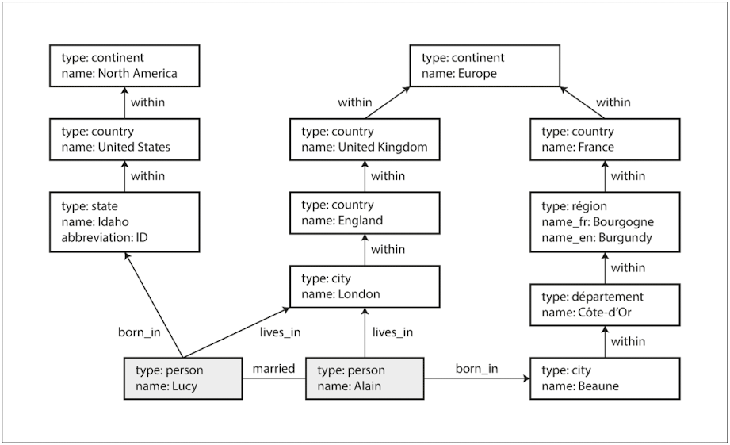

# Chapter 2: Data Models and Query Languages 2
## Query Languages for Data
- Declarative query language(like SQL) VS Imperative code
```
SELECT * FROM animals WHERE family = 'Sharks';
```
```
function getSharks() {
    var sharks = [];
    for (var i = 0; i < animals.length; i++) {
        if (animals[i].family === "Sharks") {
            sharks.push(animals[i]);
        }
    }
    return sharks;
}
```
- A declarative query language is attractive because it is typically more concise and easier to work with than an imperative API. 
- But more importantly, it also hides implementation details of the database engine, which makes it possible for the database system to introduce performance improvements without requiring any changes to queries.
- Declarative languages often lend themselves to parallel execution.

### Declarative Queries on the Web
Declarative
```
li.selected > p {
    background-color: blue;
}
```
VS

Imperative
```
var liElements = document.getElementsByTagName("li");
for (var i = 0; i < liElements.length; i++) {
    if (liElements[i].className === "selected") {
        var children = liElements[i].childNodes;
        for (var j = 0; j < children.length; j++) {
            var child = children[j];
            if (child.nodeType === Node.ELEMENT_NODE && child.tagName === "P") {
                child.setAttribute("style", "background-color: blue");
            }
        }
    }
}
```
- In a web browser, using declarative CSS styling is much better than manipulating styles imperatively in JavaScript. 
- Similarly, in databases, declarative query languages like SQL turned out to be much better than imperative query APIs.vi

### MapReduce Querying
- MapReduce is neither a declarative query language nor a fully imperative query API, but somewhere in between
- It is based on the map (also known as collect) 
  - and reduce (also known as fold or inject) functions that exist in many functional programming languages.

```
SELECT date_trunc('month', observation_timestamp) AS observation_month,
       sum(num_animals) AS total_animals
FROM observations
WHERE family = 'Sharks'
GROUP BY observation_month;
```
VS
```
db.observations.mapReduce(     
    function map() {                                            # 2
        var year  = this.observationTimestamp.getFullYear();
        var month = this.observationTimestamp.getMonth() + 1;
        emit(year + "-" + month, this.numAnimals);              #3     
    },     
    function reduce(key, values) {                              # 4
        return Array.sum(values);                               # 5
    },     
    {         
        query: { family: "Sharks" },                            # 1
        out: "monthlySharkReport"                               # 6
    } 
);
```
- The map and reduce functions are somewhat restricted in what they are allowed to do.
- MapReduce is a fairly low-level programming model for distributed execution on a cluster of machines. 
- Higher-level query languages like SQL can be implemented as a pipeline of MapReduce operations, 
  - but there are also many distributed implementations of SQL that don’t use MapReduce.
- Being able to use JavaScript code in the middle of a query is a great feature for advanced queries, 
  - but it’s not limited to MapReduce—some SQL databases can be extended with JavaScript functions too.
- A usability problem with MapReduce is that you have to write two carefully coordinated JavaScript functions, which is often harder than writing a single query. 
- Moreover, a declarative query language offers more opportunities for a query optimizer to improve the performance of a query.

> Example) a declarative query language called the aggregation pipeline in MongoDB 2.2
```
db.observations.aggregate([
    { $match: { family: "Sharks" } },
    { $group: {
        _id: {
            year:  { $year:  "$observationTimestamp" },
            month: { $month: "$observationTimestamp" }
        },
        totalAnimals: { $sum: "$numAnimals" }
    } }
]);
```
## Graph-Like Data Models
> - Document model: one-to-many relationships (tree-structured data) or no relationships between records
> - Graph model: many-to-many relationships

- A graph consists of two kinds of objects: 
  - vertices (also known as nodes or entities) 
  - and edges (also known as relationships or arcs). 
- Graph model examples:
  1. Social graphs: Vertices are people, and edges indicate which people know each other.
  2. The web graph: Vertices are web pages, and edges indicate HTML links to other pages.
  3. Road or rail networks: Vertices are junctions, and edges represent the roads or railway lines between them.


```
CREATE TABLE vertices (
    vertex_id   integer PRIMARY KEY,
    properties  json
);

CREATE TABLE edges (
    edge_id     integer PRIMARY KEY,
    tail_vertex integer REFERENCES vertices (vertex_id),
    head_vertex integer REFERENCES vertices (vertex_id),
    label       text,
    properties  json
);

CREATE INDEX edges_tails ON edges (tail_vertex); 
CREATE INDEX edges_heads ON edges (head_vertex); 
```
### The Cypher Query Language: a declarative query language for property graphs, created for the Neo4j graph database
```
CREATE   
    (NAmerica:Location {name:'North America', type:'continent'}),
    (USA:Location      {name:'United States', type:'country'  }),
    (Idaho:Location    {name:'Idaho',         type:'state'    }),
    (Lucy:Person       {name:'Lucy' }),
    (Idaho) -[:WITHIN]->  (USA)  -[:WITHIN]-> (NAmerica),
    (Lucy)  -[:BORN_IN]-> (Idaho)
```
```
MATCH
  # :WITHIN*0..: follow a WITHIN edge, zero or more times.
  (person) -[:BORN_IN]->  () -[:WITHIN*0..]-> (us:Location {name:'United States'}), 
  (person) -[:LIVES_IN]-> () -[:WITHIN*0..]-> (eu:Location {name:'Europe'}) 
RETURN person.nam
```
### Graph Queries in SQL
```
WITH RECURSIVE
  in_usa(vertex_id) AS (
      SELECT vertex_id FROM vertices WHERE properties->>'name' = 'United States'
    UNION
      SELECT edges.tail_vertex FROM edges
        JOIN in_usa ON edges.head_vertex = in_usa.vertex_id
        WHERE edges.label = 'within'
  ),
  in_europe(vertex_id) AS (
      SELECT vertex_id FROM vertices WHERE properties->>'name' = 'Europe'
    UNION
      SELECT edges.tail_vertex FROM edges
        JOIN in_europe ON edges.head_vertex = in_europe.vertex_id
        WHERE edges.label = 'within'
  ),
  born_in_usa(vertex_id) AS (
    SELECT edges.tail_vertex FROM edges
      JOIN in_usa ON edges.head_vertex = in_usa.vertex_id
      WHERE edges.label = 'born_in'
  ),
  lives_in_europe(vertex_id) AS (
    SELECT edges.tail_vertex FROM edges
      JOIN in_europe ON edges.head_vertex = in_europe.vertex_id
      WHERE edges.label = 'lives_in'
  )
  
SELECT vertices.properties->>'name' 
FROM vertices 
JOIN born_in_usa     ON vertices.vertex_id = born_in_usa.vertex_id 
JOIN lives_in_europe ON vertices.vertex_id = lives_in_europe.vertex_id;
```

### Triple-Stores and SPARQL
- The triple-store model is mostly equivalent to the property graph model, using different words to describe the same ideas
- Three-part statements: (subject, predicate, object). 
- For example, in the triple (Jim, likes, bananas), 
  - Jim is the subject, likes is the predicate (verb), and bananas is the object.
- The subject of a triple is equivalent to a vertex in a graph. The object is one of two things:
1. A value in a primitive datatype, such as a string or a number.
2. Another vertex in the graph.
   - Ex) 
   ```
    @prefix : <urn:example:>.
    _:lucy     a       :Person.
    _:lucy     :name   "Lucy".
    _:lucy     :bornIn _:idaho.
    _:idaho    a       :Location.
    _:idaho    :name   "Idaho".
    _:idaho    :type   "state".
    _:idaho    :within _:usa. 
    _:usa      a       :Location. 
    _:usa      :name   "United States". 
    _:usa      :type   "country". 
    _:usa      :within _:namerica. 
    _:namerica a       :Location. 
    _:namerica :name   "North America". 
    _:namerica :type   "continent".
    ```

#### The semantic web -> failure
#### The RDF data model:  a human-readable format for the semantic web
```
<rdf:RDF xmlns="urn:example:"     
  xmlns:rdf="http://www.w3.org/1999/02/22-rdf-syntax-ns#">
  
  <Location rdf:nodeID="idaho">     
    <name>Idaho</name>
    <type>state</type>
    <within>
      <Location rdf:nodeID="usa">
        <name>United States</name>
        <type>country</type>
        <within>
          <Location rdf:nodeID="namerica">
            <name>North America</name>
            <type>continent</type>
          </Location>
        </within>
      </Location>
    </within>
  </Location>
  
  <Person rdf:nodeID="lucy">
    <name>Lucy</name>
    <bornIn rdf:nodeID="idaho"/>
  </Person>
</rdf:RDF> 
```
#### The SPARQL query language:  a query language for triple-stores using the RDF data model
```
PREFIX : <urn:example:>
SELECT ?personName WHERE {
  ?person :name ?personName.
  ?person :bornIn  / :within* / :name "United States".
  ?person :livesIn / :within* / :name "Europe".
}
```
- Cypher VS SPARQL
```
(person) -[:BORN_IN]-> () -[:WITHIN*0..]-> (location)   # Cypher
?person :bornIn / :within* ?location.                   # SPARQL

(usa {name:'United States'})   # Cypher
?usa :name "United States".    # SPARQL
```
### The Foundation: Datalog
- Datalog is a much older language than SPARQL or Cypher, having been studied extensively by academics in the 1980s. 
- It provides the foundation that later query languages build upon.
