# Chapter 2:  Data Models and Query Languages
Most applications are built by layering one data model on top of another. For each layer, the key question is: how is it represented in terms of the next-lower layer

- Business Logic
- Stored in Data Strucutres, JSON, XML, Documents, Graph
- Database Engine, Memory, Disk, Network
- Hardware

# Relational Model Versus Document Model

Relational Database dominated
- Started from Business Data Processing (Transaction Prcessing, Batch Processing)
- Internal Representation - Relational Model (To simplify implementation with a cleaner interface)
- Network Model / Hierarchical model

## The Birth Of NoSQL

- The name “NoSQL” is unfortunate, since it doesn’t actually refer to any particular technology—it was originally intended simply as a catchy Twitter hashtag for a meetup on open source, distributed, nonrelational databases in 2009

* A need for greater scalability than relational databases can easily achieve, including very large datasets or very high write throughput
* A widespread preference for free and open source software over commercial database products
* Specialized query operations that are not well supported by the relational model
* Frustration with the restrictiveness of relational schemas, and a desire for a more dynamic and expressive data model

** It therefore seems likely that in the foreseeable future, relational databases will continue to be used alongside a broad variety of nonrelational datastores—an idea that is sometimes called polyglot persistence **

## The Object-Relational Mismatch

* Impedence Mismatch

- Linkedin profile, one person having many jobs and credentials

Many one-to-many-relationship for RDSM
- Different tables for job positions, education, contact info
- Datastypes such as XML data, multi-valued data in a single row
- Encoded JSON, XML on text column

Problems with application logic and querying
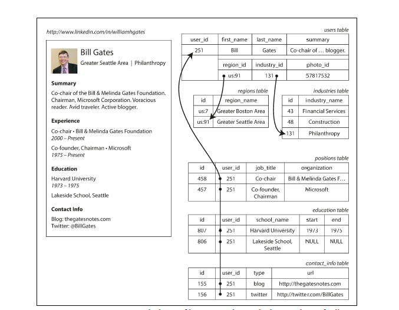

Document-based models support this much better

-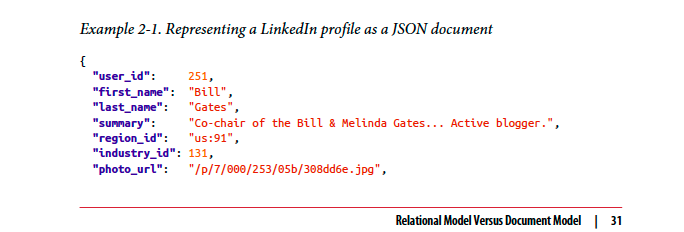

It seems to solve the problem, but there are problems (will be covered in Chapter 4)

Advantage
- Lack of a schema
- Locality - no messy join
- Explicit Representation

## Many-to-One and Many-to-Many Relationships
Consistent style and spelling across profiles
- Avoiding ambiguity (e.g., if there are several cities with the same name)
- Ease of updating—the name is stored in only one place,
- Localization support—when the site is translated into other languages, the standardized
- Better search—e.g., a search for philanthropists in the state of Washington can

When you store the text directly, you are duplicating the human-meaningful information in every record that uses it.
using an ID is that because it has no meaning to humans, it never needs to change:
changes.

Unfortunately, normalizing this data requires many-to-one relationships  which don’t fit nicely into the document model.
In relational databases, it’s normal to refer to rows in other tables by ID, because joins are easy.
In document databases, joins are not needed for one-to-many tree structures, and support for joins is often weak.

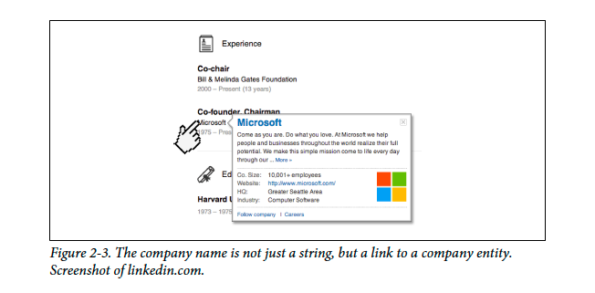

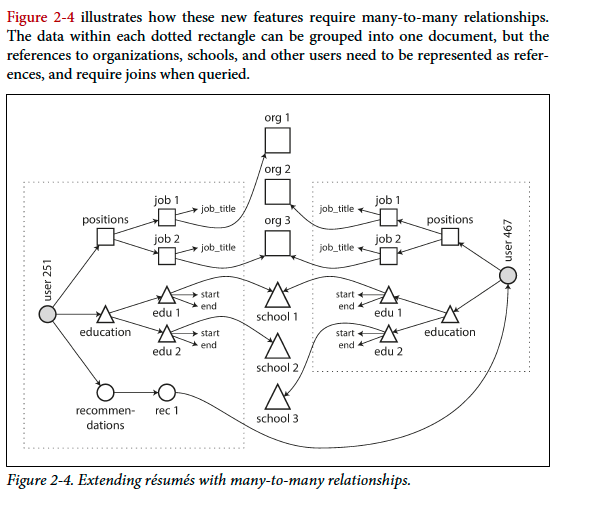

## Are Document Databases Repeating History?

In the 1970s was IBM’s Information Management System (IMS), originally developed for stock-keeping in the
Apollo space program and first commercially released in 1968

Like document databases, IMS worked well for one-to-many relationships, but it
made many-to-many relationships difficult, and it didn’t support joins. Developers
had to decide whether to duplicate (denormalize) data or to manually resolve references
from one record to another.

The two most prominent were the relational model (which became SQL, and took
over the world) and the network model (which initially had a large following but
eventually faded into obscurity).

### Network Model
The links between records in the network model were not foreign keys, but more like pointers in a programming language
Accessing a record was to follow a path from a root record along these chains of links. This was called an access path.
But in a world of many-to-many relationships, several different paths can lead to the same record,
and a programmer working with the network model had to keep track of these different access paths in their head

Too hard to change data, too many code for finding the data

### Relational DB
- all the data in the open: arelation (table) is simply a collection of tuples (rows),
- you only need to build a query optimizer once, and then all

## Document Databases
- Document databases reverted back to the hierarchical model in one aspect: storing nested records
- within their parent record rather than in a separate table.
- Bad for Many-to-many

## Relational Versus Document Databases Today
In this chapter covers only Data model only (FT, Concucrrency in other chapters)

- Document - schema flexibility, better performance due to locality, and that for some applications it is closer to the data structures used by the application.
- Relational - The relational model counters by providing better support for joins, and many-to-one and many-to-many relationships.

For applications that's using documents-like style, it's probably the best but for  For highly interconnected data, (Many-to-many) the document model is awkward,
the relational model is acceptable, and graph models (see “Graph-Like Data Models” on page 49) are the most natural.

## Schema Flexibility
schemaless, but that’s misleading, as the code that reads the data usually assumes some kind of structure—i.e., there is an
implicit schema, but it is not enforced by the database. more accurate term is schema-on-read

- Better when chainging the document format (RDMS Schema)
- Schema changes have a bad reputation of being slow and requiring downtime.
- Update Alter can be expensive
- Good when datas have different format

## Data locality for queries
- If your application often needs to access the entire document, there is a performance advantage to this storage locality.
- If data is split across multiple tables, multiple index lookups are required to retrieve it all, which may require more disk seeks and take more time.

The locality advantage only applies if you need large parts of the document at the
same time. The database typically needs to load the entire document, even if you
access only a small portion of it, which can be wasteful on large documents.

There are rmds dbs that use parent object like Google Spanner / Oracle

### Convergence of document and relational databases

It seems that relational and document databases are becoming more similar over time, and that is a good thing: the data models complement each other.v If a database
is able to handle document-like data and also perform relational queries on it, applications
can use the combination of features that best fits their needs.

## Query Languages for Data

SQL is a declarative query language, whereas IMS and CODASYL queried the database
using imperative code.

In a declarative query language, like SQL or relational algebra, you just specify the
pattern of the data you want—what conditions the results must meet, and how you
want the data to be transformed (e.g., sorted, grouped, and aggregated)—but not how
to achieve that goal.

A declarative query language is attractive because it is typically more concise and easier
to work with than an imperative API. But more importantly, it also hides implementation
details of the database engine, which makes it possible for the database
system to introduce performance improvements without requiring any changes to
queries.

-  in the imperative code shown at the beginning of this section, the list of animals appears in a particular order.

- declarative languages often lend themselves to parallel execution. Today, CPUs are getting faster by adding more cores, not by running at significantly higher

## Declarative queryies on the web

What CSS and XSL have in common is that they are both declarative languages for specifying the styling of a document.

## MapReduce Query

MapReduce is neither a declarative query language nor a fully imperative query API.

The filter to consider only shark species can be specified declaratively (this is a
MongoDB-specific extension to MapReduce).
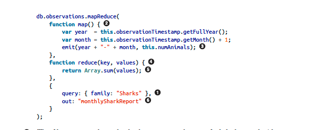

These restrictions allow the database to run the functions anywhere,
in any order, and rerun them on failure. However, they are nevertheless powerful:
they can parse strings, call library functions, perform calculations, and more

A usability problem with MapReduce is that you have to write two carefully coordinated
JavaScript functions, which is often harder than writing a single query. Moreover,
a declarative query language offers more opportunities for a query optimizer to
improve the performance of a query. For these reasons, MongoDB 2.2 added support
for a declarative query language called the aggregation pipeline [9]. In this language,
the same shark-counting query looks like this:

### Graph-Like Data Models

But what if many-to-many relationships are very common in your data? The relational
model can handle simple cases of many-to-many relationships, but as the connections
within your data become more complex, it becomes more natural to start
modeling your data as a graph.

A graph consists of two kinds of objects: vertices (also known as nodes or entities) and
edges (also known as relationships or arcs).

- Social graphs: Vertices are people, and edges indicate which people know each other.
- The web graph: Vertices are web pages, and edges indicate HTML links to other pages.
- Road or rail networks: Vertices are junctions, and edges represent the roads or railway lines between them.

In the examples just given, all the vertices in a graph represent the same kind of thing
(people, web pages, or road junctions, respectively). However, graphs are not limited
to such homogeneous data: an equally powerful use of graphs is to provide a consistent

## Property Graphs
In the property graph model, each vertex consists of:
• A unique identifier
• A set of outgoing edges
• A set of incoming edges
• A collection of properties (key-value pairs)

Each edge consists of:
• A unique identifier
• The vertex at which the edge starts
• The vertex at which the edge ends (the head vertex)
• A label to describe the kind of relationship between the two vertices
• A collection of properties (key-value pairs)

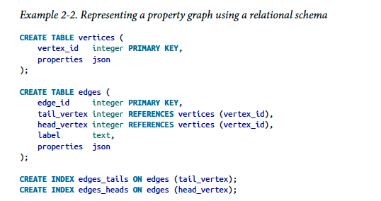

1. Any vertex can have an edge connecting it with any other vertex. There is no schema that restricts which kinds of things can or cannot be associated.
2. Given any vertex, you can efficiently find both its incoming and its outgoing edges, and thus traverse the graph—
3. By using different labels for different kinds of relationships, you can store several different kinds of information in a single graph, while still maintaining a clean data model.

* such as different kinds of regional structures in different countries (France has départements and régions, whereas the US has counties and states), quirks of history such as a country within a country

## The Cypher Query Language
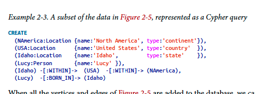

find the names of all the people who emigrated
from the United States to Europe.

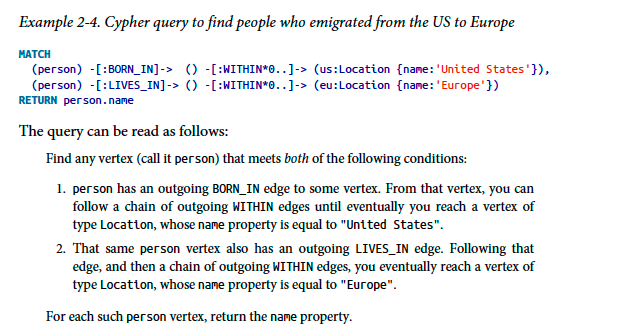

As is typical for a declarative query language, you don’t need to specify such execution
details when writing the query:

## Graph Queries in SQL
If the same query can be written in 4 lines in one query language but requires 29 lines
in another, that just shows that different data models are designed to satisfy different
use cases. It’s important to pick a data model that is suitable for your application.

## Triple-Stores and SPARQL

In a triple-store, all information is stored in the form of very simple three-part statements:
(subject, predicate, object). For example, in the triple (Jim, likes, bananas), Jim
is the subject, likes is the predicate (verb), and bananas is the object.

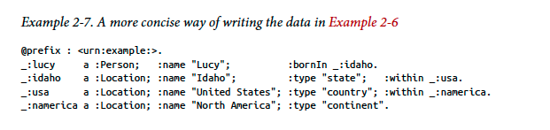

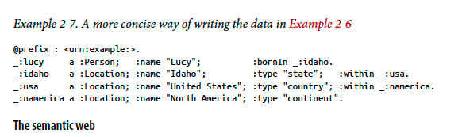

Triples can be a good internal data model for applications,
even if you have no interest in publishing RDF data on the semantic web.

### The RDF data model
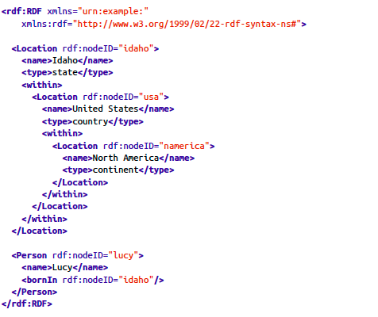

RDF has a few quirks due to the fact that it is designed for internet-wide data
exchange. The subject, predicate, and object of a triple are often URIs. For example, a
predicate might be an URI such as <http://my-company.com/namespace#within> or
<http://my-company.com/namespace#lives_in>,

### The SPARQL query language

SPARQL is a query language for triple-stores using the RDF data model [43]. (It is an
acronym for SPARQL Protocol and RDF Query Language, pronounced “sparkle.”) It
predates Cypher, and since Cypher’s pattern matching is borrowed from SPARQL,
they look quite similar [37].

### Datalog
Datalog’s data model is similar to the triple-store model, generalized a bit. Instead of
writing a triple as (subject, predicate, object), we write it as predicate(subject, object).
Example 2-10 shows how to write the data from our example in Datalog.

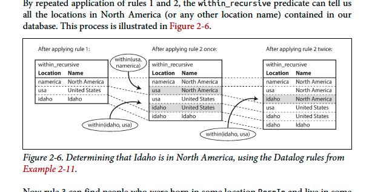

The Datalog approach requires a different kind of thinking to the other query languages
discussed in this chapter, but it’s a very powerful approach, because rules can
be combined and reused in different queries. It’s less convenient for simple one-off
queries, but it can cope better if your data is complex.