# CHAPTER 3 - Storage and Retrieval

Two families of storage engines: 
- Log-structured storage engines 
- Page-oriented storage engines such as B-trees.

## Data Structures That Power Your Database
```
#!/bin/bash
db_set () {
echo "$1,$2" >> database 
}
db_get () {
    grep "^$1," database | sed -e "s/^$1,//" | tail -n 1 
}
```
-  db_set key value : to store key and value in the database

```
$ db_set 123456 '{"name":"London","attractions":["Big Ben","London Eye"]}' 
$ db_set 42 '{"name":"San Francisco","attractions":["Golden Gate Bridge"]}' 
$ db_get 42
{"name":"San Francisco","attractions":["Golden Gate Bridge"]}
```
- a text file where each line contains a key-value pair, separated by a comma
- Every call to db_set appends to the end of the file, so if you update a key several times, the old versions of the value are not overwritten

```
$ db_set 42 '{"name":"San Francisco","attractions":["Exploratorium"]}' 
$ db_get 42
{"name":"San Francisco","attractions":["Exploratorium"]} 
$ cat database
123456,{"name":"London","attractions":["Big Ben","London Eye"]} 
42,{"name":"San Francisco","attractions":["Golden Gate Bridge"]} 
42,{"name":"San Francisco","attractions":["Exploratorium"]}
```
> db_set function
- It actually has pretty good performance for something that is so simple, because appending to a file is generally very efficient.
- Similarly to what db_set does, many databases internally use a log, which is an append-only data file.

> db_get function
- It has terrible performance if you have a large number of records in your database. 
- Every time you want to look up a key, db_get has to scan the entire database file from beginning to end, looking for occurrences of the key.
- The cost of a lookup is O(n)

> To make it efficient: **Index**
- An index is an additional structure that is derived from the primary data
- The general idea behind them is to keep some additional metadata on the side
- This doesn’t affect the contents of the database; it only affects the performance of queries.
- Maintaining additional structures incurs overhead, especially on writes.
- Any kind of index usually slows down writes, because the index also needs to be updated every time data is written.
- Trade-off: well-chosen indexes speed up read queries, but every index slows down writes.
- Not necessary, But the application developer or database administrator can then choose the indexes that give your application the greatest benefit, without introducing more overhead than necessary.

**Let's talk about Index!!**

## Hash Indexes
- indexes for key-value data
- Dictionary type(as a hash map (hash table))
- Whenever you append a new key-value pair to the file, you also update the hash map to reflect the offset of the data you just wrote
- When you want to look up a value, use the hash map to find the offset in the data file, seek to that location, and read the value.

**Frequent update of each key**

Bitcask offers high-performance reads and writes, subject to the requirement that all the keys fit in the available RAM, since the hash map is kept completely in memory.
i.e.)


**running out of disk space?**

A good solution is 
1. to break the log into segments of a certain size by closing a segment file when it reaches a certain size, and making subsequent writes to a new segment file.
2. We can then perform **compaction** on these segments
   ( **compaction**: throwing away duplicate keys in the log, and keeping only the most recent update for each key)
   
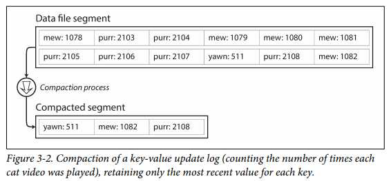

4. Moreover, since compaction often makes segments much smaller (assuming that a key is overwritten several times on average within one segment),
   we can also merge several segments together at the same time as performing the compaction, as shown in Figure 3-3.
5. no modification. written to new file. Merging and Compaction in the background thread.
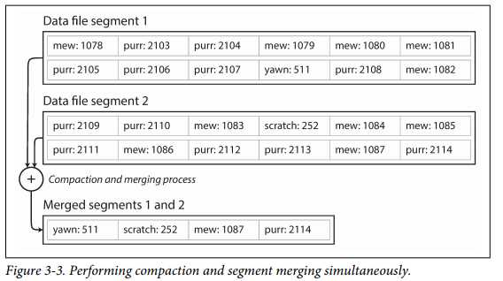  

#### Some Issues in a real implementation 
1. File format
```
CSV is not the best format for a log. It’s faster and simpler to use a binary format 
that first encodes the length of a string in bytes, followed by the raw string (without need for escaping).
```
2. Deleting records
```
If you want to delete a key and its associated value, you have to append a special deletion record to the data file(called a tombstone).
When log segments are merged, the tombstone tells the merging process to discard any previous values for the deleted key.
```
3. Crash recovery
```
If the database is restarted, the in-memory hash maps are lost. In principle, you can restore each segment’s hash map
by reading the entire segment file from beginning to end and noting the offset of the most recent value for every key as you go along.
However, that might take a long time if the segment files are large, which would make server restarts painful.
Bitcask speeds up recovery by storing
```
4. Partially written records
```
The database may crash at any time, including halfway through appending a record to the log.
Bitcask files include checksums, allowing such corrupted parts of the log to be detected and ignored.
```
5. Concurrency control
```
As writes are appended to the log in a strictly sequential order, a common implementation choice is to have only one writer thread.
Data file segments are append-only and otherwise immutable, so they can be read concurrently by multiple threads.

Why Append-only? not Update?
• Appending and segment merging are sequential write operations, which are generally much faster than random writes,
  especially on magnetic spinning-disk hard drives.
  To some extent sequential writes are also preferable on flash-based solid state drives (SSDs)
• Concurrency and crash recovery are much simpler if segment files are append-only or immutable.
    For example, you don’t have to worry about the case where a crash happened
    while a value was being overwritten, leaving you with a file containing part of the old and part of the new value spliced together.
•  Merging old segments avoids the problem of data files getting fragmented over time.
```

### limitations of the hash table index

• The hash table must fit in memory
```
  Not for a very large number of keys.
    it is difficult to make an on-disk hash map perform well.
    It requires a lot of random access I/O, it is expensive to grow when it becomes full, and hash collisions require fiddly logic  
```

• Range queries are not efficient. 
```
i.e. you cannot easily scan over all keys between kitty00000 and kitty99999—you’d have to look up each key individually in the hash maps.
```

### SSTables and LSM-Trees
 Then, how to avoid the limitation? - SSTables and LSM-Trees(an indexing structure)

 **SST(Sorted String Table)**
 Advantages
 1. Merging segments is simple and efficient, even if the files are bigger than the available memory.
        The approach is like the one used in the mergesort algorithm and is illustrated in Figure 3-4.
    
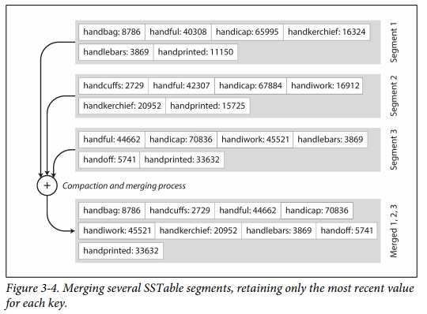  

   What if the same key appears in several input segments? 
    When multiple segments contain the same key, we can keep the value from the most recent segment and discard the values in older segments.
    
 2. In order to find a particular key in the file, you no longer need to keep an index of all the keys in memory.
    You still need an in-memory index to tell you the offsets for some of the keys,
        but it can be sparse: one key for every few kilobytes of segment file is sufficient, because a few kilobytes can be scanned very quickly.
 
 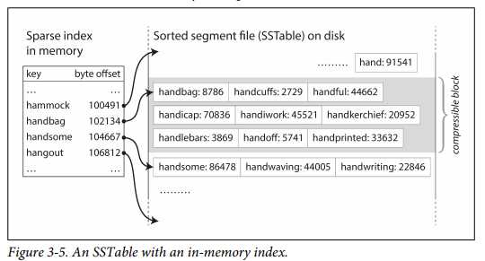 
 
  3. Since read requests need to scan over several key-value pairs in the requested range anyway,
     it is possible to group those records into a block and compress it before writing it to disk (indicated by the shaded area in Figure 3-5).
     Each entry of the sparse in-memory index then points at the start of a compressed block. 
     Besides saving disk space, compression also reduces the I/O bandwidth use.

#### Constructing and maintaining SSTables

- When a write comes in, add it to an in-memory balanced tree data structure (for example, a red-black tree). This in-memory tree is sometimes called a **memtable**.
- When the memtable gets bigger than some threshold—typically a few megabytes write it out to disk as an SSTable file.
  This can be done efficiently because the tree already maintains the key-value pairs sorted by key. The new SSTable file becomes the most recent segment of the database.
  While the SSTable is being written out to disk, writes can continue to a new memtable instance.
- In order to serve a read request, first try to find the key in the memtable, then in the most recent on-disk segment, then in the next-older segment, etc.
- From time to time, run a merging and compaction process in the background to combine segment files and to discard overwritten or deleted values.

#### Making an LSM-tree out of SSTables

#### Performance optimizations
A Bloom filter is a memory-efficient data structure for approximating the contents of a set. 
It can tell you if a key does not appear in the database, and thus saves many unnecessary disk reads for nonexistent keys.
- In size-tiered compaction, newer and smaller SSTables are successively merged into older and larger SSTables.
- In leveled compaction, the key range is split up into smaller SSTables
  and older data is moved into separate “levels,” which allows the compaction to proceed more incrementally and use less disk space.

### B-Trees
- The most widely used indexing structure is quite different: the B-tree.
- B-trees keep key-value pairs sorted by key, which allows efficient key-value lookups and range queries.
  But that’s where the similarity ends: B-trees have a very different design philosophy.
- B-trees break the database down into fixed-size blocks or pages, traditionally 4 KB in size (sometimes bigger), and read or write one page at a time.
  This design corresponds more closely to the underlying hardware, as disks are also arranged in fixed-size blocks.
- Each page can be identified using an address or location, which allows one page to refer to another—similar to a pointer, but on disk instead of in memory.

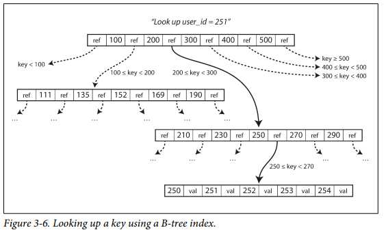  
 - One page is designated as the root of the B-tree; whenever you want to look up a key in the index, you start here.
   The page contains several keys and references to child pages.
   Each child is responsible for a continuous range of keys, and the keys between the references indicate where the boundaries between those ranges lie.
- The number of references to child pages in one page of the B-tree is called the **branching factor**.

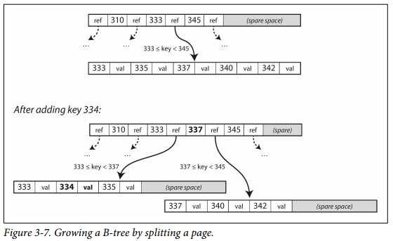  
- This algorithm ensures that the tree remains balanced: a B-tree with n keys always has a depth of O(log n).
  Most databases can fit into a B-tree that is three or four levels deep, so you don’t need to follow many page references to find the page you are looking for.
  (A four-level tree of 4 KB pages with a branching factor of 500 can store up to 256 TB.)

#### Making B-trees reliable
- In order to make the database resilient to crashes, it is common for B-tree implementations to include an additional data structure on disk: a write-ahead log (WAL, also 
known as a redo log).
- This is an append-only file to which every B-tree modification must be written before it can be applied to the pages of the tree itself. When the database comes back up after a crash, this log is used to restore the B-tree back to a consistent state

#### B-tree optimizations
- Instead of overwriting pages and maintaining a WAL for crash recovery, some databases (like LMDB) use a copy-on-write scheme.
  A modified page is written to a different location, and a new version of the parent pages in the tree is created, pointing at the new location.
  This approach is also useful for concur‐rency control, as we shall see in “Snapshot Isolation and Repeatable Read” on page 237.
- We can save space in pages by not storing the entire key, but abbreviating it. Especially in pages on the interior of the tree, keys only need to provide enough information to act as boundaries between key ranges.         Packing more keys into a page allows the tree to have a higher branching factor, and thus fewer levels.iii
- In general, pages can be positioned anywhere on disk; there is nothing requiring pages with nearby key ranges to be nearby on disk.
  If a query needs to scan over a large part of the key range in sorted order, that page-by-page layout can be inefficient, because a disk seek may be required for every page that is read.
  Many B-tree implementations therefore try to lay out the tree so that leaf pages appear in sequential order on disk. However, it’s difficult to maintain that order as the tree grows.
  By contrast, since LSM-trees rewrite large segments of the storage in one go during merging, it’s easier for them to keep sequential keys close to each other on disk.
- Additional pointers have been added to the tree.
  For example, each leaf page may have references to its sibling pages to the left and right, which allows scanning keys in order without jumping back to parent pages.
-  B-tree variants such as fractal trees [22] borrow some log-structured ideas to reduce disk seeks (and they have nothing to do with fractals).


### Comparing B-Trees and LSM-Trees
- LSM-trees are typically faster for writes, whereas B-trees are thought to be faster for reads
- Reads are typically slower on LSM-trees because they have to check several different data structures and SSTables at different stages of compaction.

#### Advantages of LSM-trees

- A B-tree index must write every piece of data at least twice: once to the write-ahead log, and once to the tree page itself (and perhaps again as pages are split). There is also overhead from having to write an entire page at a time, even if only a few bytes in that page changed.
- Log-structured indexes rewrite data multiple times due to repeated compaction and merging of SSTables. This effect—one write to the database resulting in multiple writes to the disk over the course of the database’s lifetime—is known as write amplification.
- LSM-trees are typically able to sustain higher write throughput than B-trees, partly because they sometimes have lower write amplification (although this depends on the storage engine configuration and workload), and partly because they sequentially write compact SSTable files rather than having to overwrite several pages in the tree
- LSM-trees can be compressed better, and thus often produce smaller files on disk than B-trees. B-tree storage engines leave some disk space unused due to fragmentation: when a page is split or when a row cannot fit into an existing page, some space in a page remains unused.

  
#### Downsides of LSM-trees
- A downside of log-structured storage is that the compaction process can sometimes interfere with the performance of ongoing reads and writes.
- Another issue with compaction arises at high write throughput: the disk’s finite write bandwidth needs to be shared between the initial write (logging and flushing a memtable to disk) and the compaction threads running in the background.
- An advantage of B-trees is that each key exists in exactly one place in the index, whereas a log-structured storage engine may have multiple copies of the same key in different segments.
- B-trees are very ingrained in the architecture of databases and provide consistently good performance for many workloads, so it’s unlikely that they will go away anytime soon. In new datastores, log-structured indexes are becoming increasingly popular.

  

### Other Indexing Structures
- In relational databases, you can create several secondary indexes on the same table using the CREATE INDEX com mand, and they are often crucial for performing joins efficiently.
  (For example, in Figure 2-1 in Chapter 2 you would most likely have a secondary index on the user_id columns so that you can find all the rows belonging to the same user in each of the tables.)
- The main difference is that keys are not unique; i.e., there might be many rows (documents, vertices) with the same key.
- This can be solved in two ways: either by making each value in the index a list of matching row identifiers (like a postings list in a full-text index)
- or by making each key unique by appending a row identifier to it.
- Either way, both B-trees and log-structured indexes can be used as secondary indexes.

#### Storing values within the index
- The value could be a reference to the row stored elsewhere. The place where rows are stored is known as a heap file, and it stores data in no particular order (it may be append-only, or it may keep track of deleted rows in order to overwrite them with new data later).
- The heap file approach is common because it avoids duplicating data when multiple secondary indexes are present: each index just references a location in the heap file, and the actual data is kept in one place.
- When updating a value without changing the key, the heap file approach can be quite efficient: the record can be overwritten in place, provided that the new value is not larger than the old value.
- The situation is more complicated if the new value is larger, as it probably needs to be moved to a new location in the heap where there is enough space.
- As with any kind of duplication of data, clustered and covering indexes can speed up reads, but they require additional storage and can add overhead on writes.
  Databases also need to go to additional effort to enforce transactional guarantees, because applications should not see inconsistencies due to the duplication.

#### Multi-column indexes
- The most common type of multi-column index is called a concatenated index, which simply combines several fields into one key by appending one column to another (the index definition specifies in which order the fields are concatenated).
- Multi-dimensional indexes are a more general way of querying several columns at once, which is particularly important for geospatial data.
  (For example, a restaurant-search website may have a database containing the latitude and longitude of each restaurant.)
- When a user is looking at the restaurants on a map, the website needs to search for all the restaurants within the rectangular map area that the user is currently viewing. This requires a two-dimensional range query like the following:
```
SELECT * FROM restaurants WHERE latitude  > 51.4946 AND latitude < 51.5079
AND longitude > -0.1162 AND longitude < -0.1004;
```
#### Full-text search and fuzzy indexes
- Such fuzzy querying(misspelled words) requires different techniques.
- To cope with typos in documents or queries, Lucene is able to search text for words within a certain edit distance (an edit distance of 1 means that one letter has been added, removed, or replaced)
- As mentioned in “Making an LSM-tree out of SSTables”, Lucene uses a SSTable-like structure for its term dictionary.
- This structure requires a small in-memory index that tells queries at which offset in the sorted file they need to look for a key.
- In LevelDB, this in-memory index is a sparse collection of some of the keys, but in Lucene, the in-memory index is a finite state automaton over the characters in the keys, similar to a trie
  
#### Keeping everything in memory
- The development of in-memory databases.
- When an in-memory database is restarted, it needs to reload its state, either from disk or over the network from a replica (unless special hardware is used).
- Despite writing to disk, it’s still an in-memory database, because the disk is merely used as an append-only log for durability, and reads are served entirely from memory.
- Counterintuitively, the performance advantage of in-memory databases is not due to the fact that they don’t need to read from disk. Even a disk-based storage engine may never need to read from disk if you have enough memory, because the operating system caches recently used disk blocks in memory anyway. Rather, they can be faster because they can avoid the overheads of encoding in-memory data structures in a form that can be written to disk.
- Besides performance, another interesting area for in-memory databases is providing data models that are difficult to implement with disk-based indexes
- The so-called anti-caching approach works by evicting the least recently used data from memory to disk when there is not enough memory, and loading it back into memory when it is accessed again in the future.
- This is similar to what operating systems do with virtual memory and swap files, but the database can manage memory more efficiently than the OS, as it can work at the granularity of individual records rather than entire memory pages.

## Transaction Processing or Analytics?
- In the early days of business data processing, a write to the database typically corresponded to a commercial transaction taking place: making a sale, placing an order with a supplier, paying an employee’s salary, etc
- databases also started being increasingly used for data analytics, which has very different access patterns. Usually an analytic query needs to scan over a huge number of records, only reading a few columns per record, and calculates aggregate statistics (such as count, sum, or average) rather than returning the raw data to the user.
- For example, if your data is a table of sales transactions, then analytic queries might be:
```
•  What was the total revenue of each of our stores in January?
•  How many more bananas than usual did we sell during our latest promotion?
•  Which brand of baby food is most often purchased together with brand X diapers?
```

- The difference between OLTP(online transaction processing (OLTP)) and OLAP(online analytic processing (OLAP)) is not always clear-cut, but some typical characteristics are listed in Table 3-1.

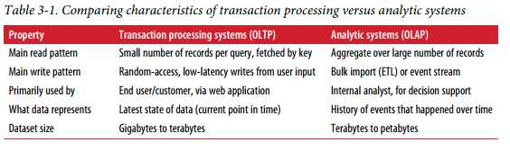  
- At first, the same databases were used for both transaction processing and analytic queries.
- SQL turned out to be quite flexible in this regard: it works well for OLTP-type queries as well as OLAP-type queries.
- Nevertheless, in the late 1980s and early 1990s, there was a trend for companies to stop using their OLTP systems for analytics purposes,
- and to run the analytics on a separate database instead. This separate data‐base was called a data warehouse.

### Data Warehousing
- They are usually reluctant to let business analysts run ad hoc analytic queries on an OLTP data‐base, since those queries are often expensive, scanning large parts of the dataset, which can harm the performance of concurrently executing transactions.
- A data warehouse, by contrast, is a separate database that analysts can query to their hearts’ content, without affecting OLTP operations
- The data warehouse contains a read-only copy of the data in all the various OLTP systems in the company. Data is extracted from OLTP databases (using either a periodic data dump or a continuous stream of updates), transformed into an analysis-friendly schema, cleaned up, and then loaded into the data warehouse.

[Extract–Transform–Load (ETL)]

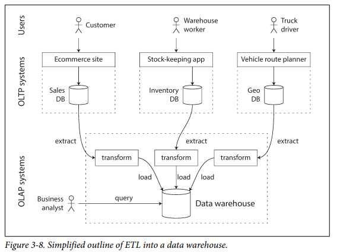  

- A big advantage of using a separate data warehouse, rather than querying OLTP systems directly for analytics, is that the data warehouse can be optimized for analytic access patterns.
- It turns out that the indexing algorithms discussed in the first half of this chapter work well for OLTP, but are not very good at answering analytic queries.

#### The divergence between OLTP databases and data warehouses
- The data model of a data warehouse is most commonly relational, because SQL is generally a good fit for analytic queries.
- There are many graphical data analysis tools that generate SQL queries, visualize the results, and allow analysts to explore the data (through operations such as drill-down and slicing and dicing).
- Some databases, such as Microsoft SQL Server and SAP HANA, have support for transaction processing and data warehousing in the same product.
- However, they are increasingly becoming two separate storage and query engines, which happen to be accessible through a common SQL interface.
- Data warehouse vendors such as Teradata, Vertica, SAP HANA, and ParAccel typically sell their systems under expensive commercial licenses. Amazon RedShift is a hosted version of ParAccel.
- More recently, a plethora of open source SQL-on-Hadoop projects have emerged; they are young but aiming to compete with commercial data warehouse systems.
- These include Apache Hive, Spark SQL, Cloudera Impala, Facebook Presto, Apache Tajo, and Apache Drill [52, 53]. Some of them are based on ideas from Google’s Dremel


### Stars and Snowflakes: Schemas for Analytics
- Many data warehouses are used in a fairly formulaic style, known as a star schema (also known as dimensional modeling.

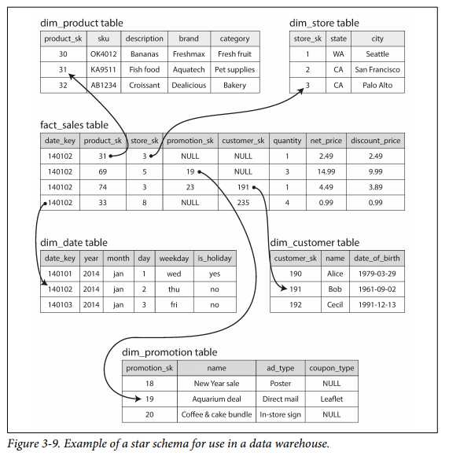  

- The example schema in Figure 3-9 shows a data warehouse that might be found at a grocery retailer.
-  At the center of the schema is a so-called fact table (in this example, it is called fact_sales).
-  Each row of the fact table represents an event that occurred at a particular time (here, each row represents a customer’s purchase of a product).
-  If we were analyzing website traffic rather than retail sales, each row might represent a page view or a click by a user.
-  A big enterprise like Apple, Walmart, or eBay may have tens of petabytes of transaction history in its data warehouse, most of which is in fact tables.

- Some of the columns in the fact table are attributes, such as the price at which the product was sold and the cost of buying it from the supplier (allowing the profit margin to be calculated).
- Other columns in the fact table are foreign key references to other tables, called dimension tables. As each row in the fact table represents an event, the dimensions represent the who, what, where, when, how, and why of the event.
- The name “star schema” comes from the fact that when the table relationships are visualized, the fact table is in the middle, surrounded by its dimension tables; the connections to these tables are like the rays of a star.
- A variation of this template is known as the snowflake schema, where dimensions are further broken down into subdimensions.

## Column-Oriented Storage
- Although fact tables are often over 100 columns wide, a typical data warehouse query only accesses 4 or 5 of them at one time ("SELECT *" queries are rarely needed for analytics) [51].
- Take the query in Example 3-1: it accesses a large number of rows (every occurrence of someone buying fruit or candy during the 2013 calendar year), but it only needs to access three columns of the fact_sales table: date_key, product_sk, and quantity. The query ignores all other columns.
  
```sql
Example 3-1. Analyzing whether people are more inclined to buy fresh fruit or candy, 
depending on the day of the week
SELECT
dim_date.weekday, dim_product.category, 
SUM(fact_sales.quantity) AS quantity_sold
FROM fact_sales
JOIN dim_date    ON fact_sales.date_key   = dim_date.date_key 
JOIN dim_product ON fact_sales.product_sk = dim_product.product_sk
WHERE
dim_date.year = 2013 AND
dim_product.category IN ('Fresh fruit', 'Candy') 
GROUP BY
dim_date.weekday, dim_product.category;
```
> How can we execute this query efficiently?
- In most OLTP databases, storage is laid out in a row-oriented fashion: all the values from one row of a table are stored next to each other.
- Document databases are similar: an entire document is typically stored as one contiguous sequence of bytes.
> The idea behind column-oriented storage is simple: don’t store all the values from one row together, but store all the values from each column together instead.

- If each column is stored in a separate file, a query only needs to read and parse those columns that are used in that query, which can save a lot of work. This principle is illustrated in Figure 3-10

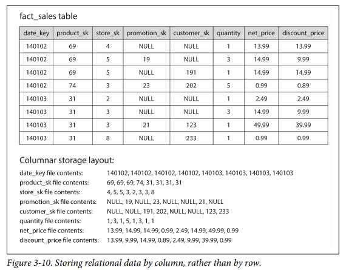 

- The column-oriented storage layout relies on each column file containing the rows in the same order.
- Thus, if you need to reassemble an entire row, you can take the 23rd entry from each of the individual column files and put them together to form the 23rd row of the table.

### Column Compression

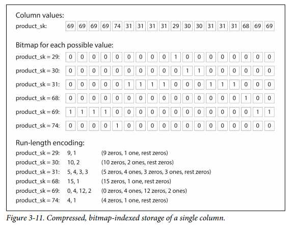 

- Often, the number of distinct values in a column is small compared to the number of rows (for example, a retailer may have billions of sales transactions, but only 100,000 distinct products).
- We can now take a column with n distinct values and turn it into n separate bitmaps: one bitmap for each distinct value, with one bit for each row.
- The bit is 1 if the row has that value, and 0 if not.
- If n is very small (for example, a country column may have approximately 200 distinct values), those bitmaps can be stored with one bit per row.
- But if n is bigger, there will be a lot of zeros in most of the bitmaps (we say that they are sparse).
- In that case, the bitmaps can additionally be run-length encoded, as shown at the bottom of Figure 3-11. This can make the encoding of a column remarkably compact.

- Bitmap indexes such as these are very well suited for the kinds of queries that are common in a data warehouse. For example:
```
WHERE product_sk IN (30, 68, 69):
Load the three bitmaps for product_sk = 30, product_sk = 68, and product_sk = 69
```
- and calculate the bitwise OR of the three bitmaps, which can be done very efficiently.
```
WHERE product_sk = 31 AND store_sk = 3:
```
- Load the bitmaps for product_sk = 31 and store_sk = 3, and calculate the bitwise AND.
- This works because the columns contain the rows in the same order, so the kth bit in one column’s bitmap corresponds to the same row as the kth bit in another column’s bitmap.

#### Memory bandwidth and vectorized processing
- For data warehouse queries that need to scan over millions of rows, a big bottleneck is the bandwidth for getting data from disk into memory.
- Developers of analytical databases also worry about efficiently using the bandwidth from main memory into the CPU cache, avoiding branch mispredictions and bubbles in the CPU instruction processing pipeline, and making use of single-instruction-multi-data (SIMD) instructions in modern CPUs
- Besides reducing the volume of data that needs to be loaded from disk, column-oriented storage layouts are also good for making efficient use of CPU cycles.

### Sort Order in Column Storage
- Note that it wouldn’t make sense to sort each column independently, because then we would no longer know which items in the columns belong to the same row.
- We can only reconstruct a row because we know that the kth item in one column belongs to the same row as the kth item in another column.
- The administrator of the database can choose the columns by which the table should be sorted, using their knowledge of common queries.
- Another advantage of sorted order is that it can help with compression of columns. If the primary sort column does not have many distinct values, then after sorting, it will have long sequences where the same value is repeated many times in a row.

### Writing to Column-Oriented Storage
- An update-in-place approach, like B-trees use, is not possible with compressed columns.
-  If you wanted to insert a row in the middle of a sorted table, you would most likely have to rewrite all the column files.
-  As rows are identified by their position within a column, the insertion has to update all columns consistently
-  Fortunately, we have already seen a good solution earlier in this chapter: LSM-trees.
-  All writes first go to an in-memory store, where they are added to a sorted structure and prepared for writing to disk.


### Aggregation: Data Cubes and Materialized Views
- Not every data warehouse is necessarily a column store: traditional row-oriented databases and a few other architectures are also used.
- However, columnar storage can be significantly faster for ad hoc analytical queries, so it is rapidly gaining popularity
- One way of creating such a cache is a materialized view. In a relational data model, it is often defined like a standard (virtual) view: a table-like object whose contents are the results of some query.
- When the underlying data changes, a materialized view needs to be updated, because it is a denormalized copy of the data. The database can do that automatically,
- but such updates make writes more expensive, which is why materialized views are not often used in OLTP databases. In read-heavy data warehouses they can make more sense (whether or not they actually improve read performance depends on the individual case).
- A common special case of a materialized view is known as a data cube or OLAP cube [64]. It is a grid of aggregates grouped by different dimensions. Figure 3-12 shows an example.

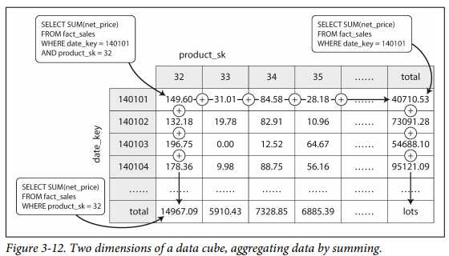 
- Imagine for now that each fact has foreign keys to only two dimension tables—in Figure 3-12, these are date and product.
- You can now draw a two-dimensional table, with dates along one axis and products along the other. Each cell contains the aggregate (e.g., SUM) of an attribute (e.g., net_price) of all facts with that date-product 
combination.
- Then you can apply the same aggregate along each row or column and get a summary that has been reduced by one dimension (the sales by product regardless of date, or the sales by date regardless of product).
- The advantage of a materialized data cube is that certain queries become very fast because they have effectively been precomputed.
- The disadvantage is that a data cube doesn’t have the same flexibility as querying the raw data. 
