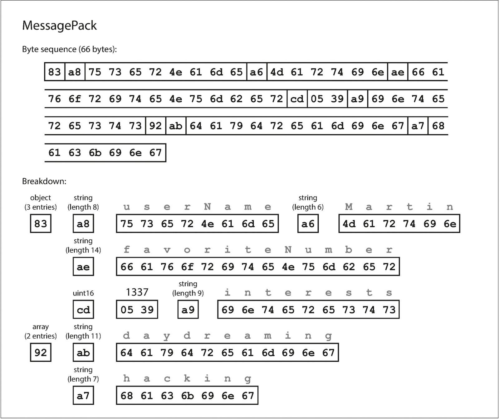
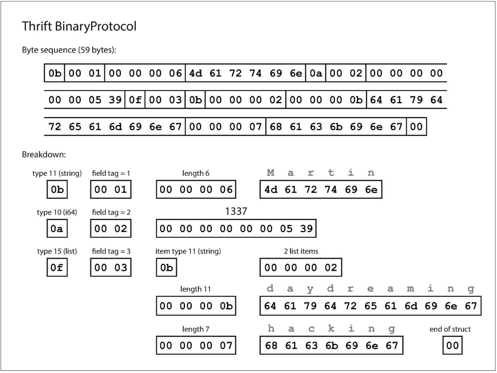
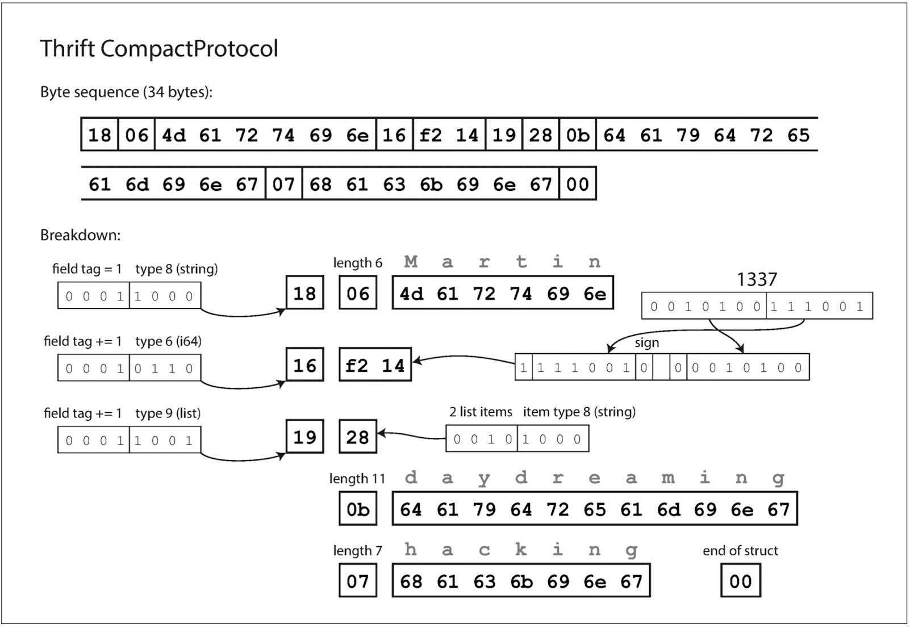
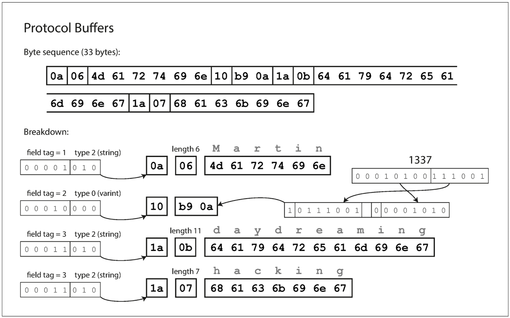
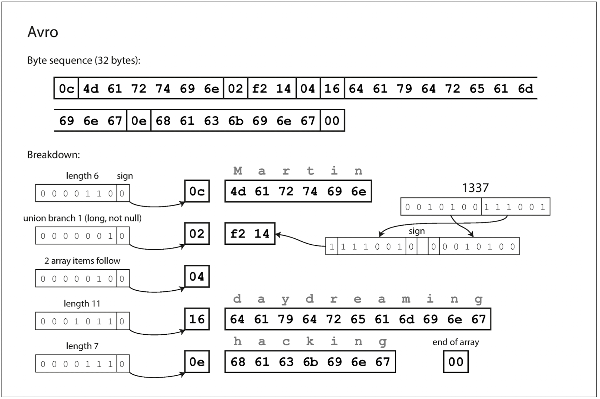
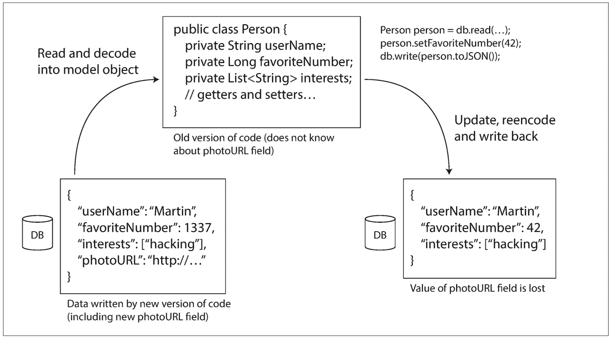

# Chapter 4 - Encoding and Evolution
- Backward compatibility 
  - Newer code can read data that was written by older code. 
- Forward compatibility 
  - Older code can read data that was written by newer code.

## Formats for Encoding Data

### Language-Specific Formats
- Examples

|Language|Format|
|--------|------|
|Java| java.io.Serializable|
|Ruby|Marshal|
|Python|pickle|

- And Many third-party libraries also exist, such as Kryo for Java.
- They also have a number of deep problems
  - The encoding is often tied to a particular programming language.
  - In order to restore data in the same object types, the decoding process needs to be able to instantiate arbitrary classes.
  - Inconvenient problems of forward and backward compatibility.
  - Bad performance and bloated encoding

### JSON, XML, and Binary Variants
- JSON, XML, and CSV are textual formats & human-readable
- Problems
  - Cannot distinguish between a number and a string that happens to consist of digits
  - Don’t support binary strings
  - There is optional schema support for both XML and JSON
  - CSV does not have any schema

> ASCII & Base 64
> 
> https://velog.io/@kwontae1313/Base64-%EC%9D%B8%EC%BD%94%EB%94%A9%EC%9D%B4%EB%9E%80
> 
> ASCII vs Unicode vs UTF8
> 
> https://velog.io/@kim-jaemin420/ASCII-Unicode-%EC%95%84%EC%8A%A4%ED%82%A4%EC%BD%94%EB%93%9C%EC%99%80-%EC%9C%A0%EB%8B%88%EC%BD%94%EB%93%9C

- Json Example
```
{
    "userName": "Martin",
    "favoriteNumber": 1337,
    "interests": ["daydreaming", "hacking"]
}
```

### Thrift and Protocol Buffers
- Thrift Example
```
struct Person {
  1: required string       userName,
  2: optional i64          favoriteNumber,
  3: optional list<string> interests
}
```


- Protocol Buffers Example
```
message Person {
    required string user_name       = 1;
    optional int64  favorite_number = 2;
    repeated string interests       = 3;
}
```

### Avro                                                                                                                            122 The Merits of Schemas                                                                                             127
```
record Person {
    string               userName;
    union { null, long } favoriteNumber = null;
    array<string>        interests;
}
```


### Metrics of Schemas
- Schema evolution allows the same kind of flexibility as schemaless/ schema-on-read JSON databases provide, 
  - while also providing better guarantees about your data and better tooling.

## Modes of Dataflow
### Dataflow Through Databases
- Sometimes we need to take care at an application level.

#### Different values written at different times
#### Archival storage

### Dataflow Through Services: REST and RPC
- Thrift, gRPC (Protocol Buffers), and Avro RPC can be evolved according to the compatibility rules of the respective encoding format.
- In SOAP, requests and responses are specified with XML schemas. These can be evolved, but there are some subtle pitfalls.
- RESTful APIs most commonly use JSON (without a formally specified schema) for responses, and JSON or URI-encoded/form-encoded request parameters for requests. 
  - Adding optional request parameters and adding new fields to response objects are usually considered changes that maintain compatibility.

### Message-Passing Dataflow
- Using a message Broker(Message queue or message-oriented middleware) has several advantages
  - It can act as a buffer if the recipient is unavailable or overloaded, and thus improve system reliability.
  - It can automatically redeliver messages to a process that has crashed, and thus prevent messages from being lost.
  - It avoids the sender needing to know the IP address and port number of the recipient (which is particularly useful in a cloud deployment where virtual machines often come and go).
  - It allows one message to be sent to several recipients.
  - It logically decouples the sender from the recipient (the sender just publishes messages and doesn’t care who consumes them).