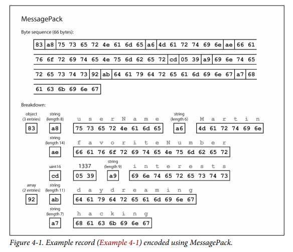
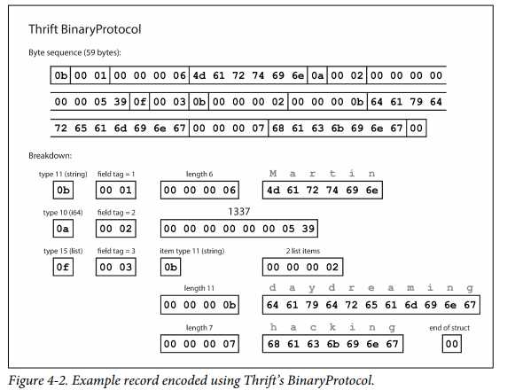
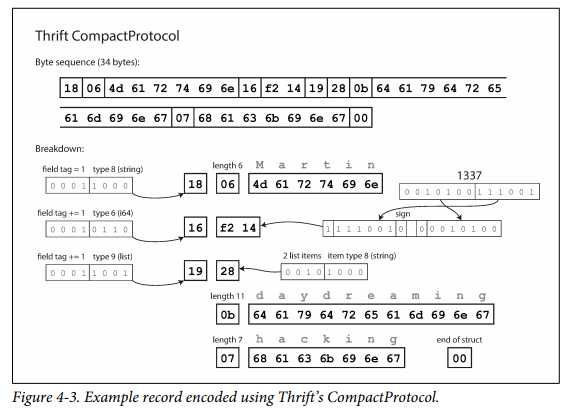
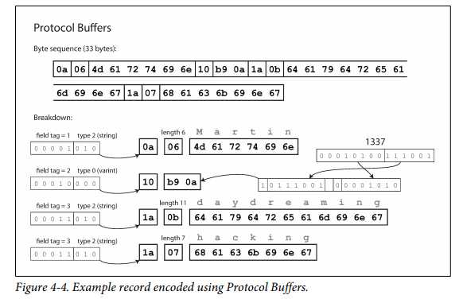
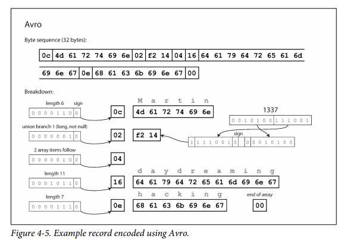

# CHAPTER 4 Encoding and Evolution

- In this chapter we will look at several formats for encoding data, including JSON, XML, Protocol Buffers, Thrift, and Avro. 
- In particular, we will look at
   - how they handle schema changes and
   - how they support systems where old and new data and code need to coexist


#### In order for the system to continue running smoothly, we need to maintain compatibility in both directions:

- [Backward compatibility]
   - Newer code can read data that was written by older code.
   - Backward compatibility is normally not hard to achieve: as author of the newer code, you know the format of data written by older code, and so you can explicitly handle it (if necessary by simply keeping the old code to read the old data).

- [Forward compatibility]
    - Older code can read data that was written by newer code.
    - Forward compatibility can be trickier, because it requires older code to ignore additions made by a newer version of the code.

## Formats for Encoding Data
Two different data representations that Programs work with 
1. Data in memory which is kept in objects, structs, lists, arrays, hash tables, trees, and so on.
2. Encoded data to be written in a file or sent it over the network which has self-contained sequence of bytes(i.e. JSON)

- Encoding : the Translation from the in-memory representation to a byte sequence (also known as serialization or marshalling)
- Decoding : the Reverse of the encoding(parsing, deserialization, unmarshalling)

### Language-Specific Formats
> Encoding libraries in many programming languages for encoding in-memory objects into byte sequences.
```
- Java: java.io.Serializable
- Ruby: Marshal
- Python: pickle
- Third-party: Kryo for Java
```

- Convenient: because Encoding libraries allow in-memory objects to be saved and restored with minimal additional code.
- Problem:
1. Compatible issue b/w differnet languages:
   - A particular program language might not be able to be read the encoded data by another language.
2. Security issue :
   - In order to restore data in the same object types, the decoding process needs to instantiate arbitrary classes.
   ```
   That is,
   -> Attackers can get your application to decode an arbitrary byte sequence
   -> they can instantiate arbitrary classes -> they can do terrible things(such as remotely executing arbitrary code).
   ```
3. Compatible issue b/w differnet versions:
   - Versioning data is often an afterthought in these libraries: as they are intended for quick and easy encoding of data, they often neglect the inconvenient problems of forward and backward compatibility.
4. Efficiency (CPU time taken to encode or decode, and the size of the encoded structure) is also often an afterthought.
   - (For example, Java’s built-in serialization is notorious for its bad performance and bloated encoding).

> ==> For these reasons it’s generally a bad idea to use your language’s built-in encoding for anything other than very transient purposes.

&nbsp;

### JSON, XML, and Binary Variants
- JSON & XML : Standardized encodings (widely known, widely supported, and almost as widely disliked)
   - XML : often criticized for being too verbose and unnecessarily complicated.
   - JSON : popular due to its built-in support in web browsers and simplicity relative to XML.
   - CSV : another popular language-independent format
   - Textual formats / human-readable
   - But, Subtle problems:
      1. There is a lot of ambiguity around the encoding of numbers.
         - XML & CSV: cannot distinguish b/w numbers and string+digits
         - JSON: cannot distinguish integers and floating-point numbers
         - This is a problem when dealing with large numbers(i.e.  > 2^53); 
      2. JSON and XML have good support for Unicode character strings (i.e., human- readable text), but they don’t support binary strings (sequences of bytes without a character encoding).
      3. If applications don’t use XML/JSON schemas, then they need to potentially hardcode the appropriate encoding/decoding logic instead.(Since the interpretation depends on information in the schema)
      4. CSV does not have any schema, so it is up to the application to define the meaning of each row and column. If an application change adds a new row or column, you have to handle that change manually.

> ==> Despite these flaws, JSON, XML, and CSV are good enough for many purposes(data interchange formats b/w different organizations)
Because as long as people agree on what the format is, it often doesn’t matter how pretty or efficient the format is. 

#### Binary encoding
- Binary encodings for JSON and XML was developed because the textual versions of JSON and XML use a lot of space.
   - Binary encodings for JSON : *MessagePack*, BSON, BJSON, UBJSON, BISON, and Smile
   - Binary encodings for XML : WBXML and Fast Infoset
- No prescribed schema -> include all the object field names

```json
//Example 4-1. Example record which we will encode in several binary formats in this chapter
{
  "userName": "Martin", 
  "favoriteNumber": 1337,
  "interests": ["daydreaming", "hacking"] 
}
```


**Encoded JSON document with MessagePack**
- [Indicator / Meaning]
   - 1st byte, 0x83 : Ox -> Hexadecimal / Top 4 bits 0x80 -> a map with key-value pairs / Bottom 4 bits = 0x03 -> three key-value pairs.
   - 2nd byte, 0xa8 : 0xa0(Top 4 bits) -> string / 0x08(bottom 4 bits) - > 8 bytes long.
   - 3rd 8 bytes:  Field name 'userName' in ASCII.
   - 4th byte, 0xa6: six-letter string inficator
   - 5th 6 byte: string value 'Martin' and so on.   
- The binary encoding 66 bytes long ( a little less than textual JSON encoding(81 bytes) (with whitespace removed)).
- But, such a small space reduction

### Thrift and Protocol Buffers
- how we can do much better, and encode the same record in just 32 bytes.
- Apache Thrift (Facebook) and Protocol Buffers (protobuf/ Google) [16] are binary encoding libraries that are based on the same principle.

```
// Thrift interface definition language (IDL)
struct Person {
  1: required string       userName,
  2: optional i64          favoriteNumber, 
  3: optional list<string> interests
}
```

```
//Protocol Buffers
message Person {
  required string user_name = 1; 
  optional int64 favorite_number = 2; 
  repeated string interests = 3;
}
```
- What does data encoded with this schema look like? Confusingly, Thrift has two different binary encoding formats,iii called BinaryProtocol and CompactProtocol, respectively.

> **BinaryProtocol** 



- Similarly to Figure 4-1, each field has a type annotation (to indicate whether it is a string, integer, list, etc.) and, where required, a length indication (length of a string, number of items in a list). The strings that appear in the data (“Martin”, “daydreaming”, “hacking”) are also encoded as ASCII (or rather, UTF-8), similar to before.
- No field names (userName, favoriteNumber, interests). Instead, field tags, which are numbers (1, 2, and 3) with the schema definition

> **Thrift CompactProtocol**



- only 34 bytes
- by packing the field type and tag number into a single byte
- by using variable-length integers
- Rather than using a full eight bytes for the number 1337, it is encoded in two bytes, with the top bit of each byte used to indicate whether there are still more bytes to come.
- This means numbers between –64 and 63 are encoded in one byte, numbers between –8192 and 8191 are encoded in two bytes, etc. Bigger numbers use more bytes.

>**Protocol Buffers (which has only one binary encoding format)**



- each field was marked either required or optional, but this makes no difference to how the field is encoded (nothing in the binary data indicates whether a field was required).
- The difference is simply that required enables a runtime check that fails if the field is not set, which can be useful for catching bugs.

#### Field tags and schema evolution
- We said previously that schemas inevitably need to change over time. We call this schema evolution. How do Thrift and Protocol Buffers handle schema changes while keeping backward and forward compatibility?
- You can change the name of a field in the schema, since the encoded data never refers to field names,
- but you cannot change a field’s tag, since that would make all existing encoded data invalid.


#### Datatypes and schema evolution


### Apache Avro

- Another binary encoding format
-  It was started in 2009 as a subproject of Hadoop, as a result of Thrift not being a good fit for Hadoop’s use cases.
-  Hadoop: a framework that allows for the distributed processing of large data sets across clusters of computers using simple programming models.
-  Avro also uses a schema to specify the structure of the data being encoded. It has two schema languages:
-  one (Avro IDL) intended for human editing,

```
Our example schema, written in Avro IDL, might look like this:
record Person { 
   string    userName;
   union { null, long } favoriteNumber = null; 
   array<string>        interests;
}
```

-  and one (based on JSON) that is more easily machine-readable.
```
{
The equivalent JSON representation of that schema is as follows:
   "type": "record", 
   "name": "Person", 
   "fields": [
      {"name": "userName",       "type": "string"},
      {"name": "favoriteNumber", "type": ["null", "long"], "default": null}, 
      {"name": "interests",      "type": {"type": "array", "items": "string"}}
   ]
}
```

[Characteristics - Avro binary encoding]
- No tag numbers in the schema
- For the figure 4-1 case, it uses just 32 bytes long which is compact.



- No identify fields or their datatypes.
- concatenated values together
- The type is encoded using a variable-length encoding (the same as Thrift’s CompactProtocol).

- 
  
