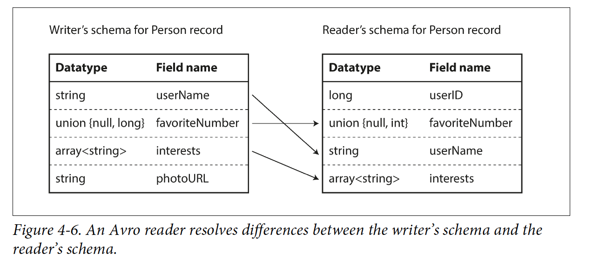
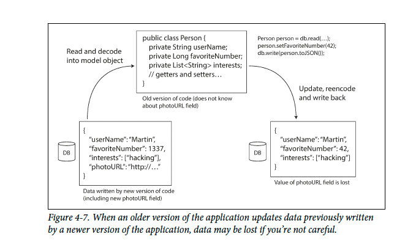

# Chapter 4:  Encoding and Evolution

Application's data change over time either in its format, field, record type etc.

When a data format or schema changes, a corresponding change to application code
often needs to happen

Rolling Upgrade is required to accomodate this change without downtime.

Clients do not get upgraded all the time

Consequently, these two factors matter
- Backward compatibility: Newer code can read data that was written by older code.
- Forward compatibility: Older code can read data that was written by newer code.

In this chapter we will look at several formats for encoding data, including JSON,
XML, Protocol Buffers, Thrift, and Avro. In particular, we will look at how they handle
schema changes and how they support systems where old and new data and code
need to coexist.

We will then discuss how those formats are used for data storage and
for communication: in web services, Representational State Transfer (REST), and
remote procedure calls (RPC), as well as message-passing systems such as actors and
message queues.

## Formats for Encoding Data

- In memory, data is kept in objects, structs, lists, arrays, hash tables, trees, and so
on.
- When you want to write data to a file or send it over the network, you have to
encode it as some kind of self-contained sequence of bytes (for example, a JSON
document). Since a pointer wouldn’t make sense to any other process, this equence-of-bytes representation looks quite different from the data structures that are normally used in memory.

Thus, we need some kind of translation between the two representations. The translation
from the in-memory representation to a byte sequence is called encoding / serialilization

### Language Specific Formats

Many programming languages come with built-in support for encoding in-memory
objects into byte sequences. For example, Java has java.io.Serializable [1], Ruby
has Marshal [2], Python has pickle [3], and so on. Many third-party libraries also
exist, such as Kryo for Java [4].

- Encoding as tied to a particular language
- Security problems
- Versionng is hard
- Expensive Operation

### JSON, XML, and Binary Variants

Very popular, JSON, XML, and CSV are textual formats, and thus somewhat human-readable...
XML, verbose and complicated, JSON is popular for Web and simple

- There is a lot of ambiguity around the encoding of numbers. (No Float for JSON, for XML, digits sometimes as string sometimes )
- No support for Binary strings (sequences of bytes without a character encoding). Binary strings are a useful feature, so people get around this limitation by encoding the binary data as text using Base64.
- Optionally, schema is used but not widespread
- CSV does not support any scheduma

Despite all these flaws, still widely accepted.

### Binary Encoding

Even if we turn these texts into binary using MessagePack, space is not much reduced

## Thrift and Protocol Buffers

Protocol Buffers was originally developed at Google,
Thrift was originally developed at Facebook, and both were made open source in 2007–08

- Both Thrift and Protocol Buffers require a schema for any data that is encoded.
- Thrift and Protocol Buffers each come with a code generation tool that takes a schema definition like the ones shown here, and produces classes that implement the schema in various programming languages [18

Thrift has two different
binary encoding formats,iii called BinaryProtocol and CompactProtocol, respectively.

### Field tags and schema evolution
How do Thrift and Protocol Buffers handle schema changes while
keeping backward and forward compatibility?

You can add new fields to the schema, provided that you give each field a new tag
number. If old code (which doesn’t know about the new tag numbers you added)
tries to read data written by new code, including a new field with a tag number it
doesn’t recognize, it can simply ignore that field. The datatype annotation allows the
parser to determine how many bytes it needs to skip. This maintains forward compatibility:
old code can read records that were written by new code.

What about backward compatibility? As long as each field has a unique tag number,
new code can always read old data, because the tag numbers still have the same
meaning. The only detail is that if you add a new field, you cannot make it required.
If you were to add a field and make it required, that check would fail if new code read
data written by old code, because the old code will not have written the new field that
you added. Therefore, to maintain backward compatibility, every field you add after
the initial deployment of the schema must be optional or have a default value.

Removing a field is just like adding a field, with backward and forward compatibility
concerns reversed. That means you can only remove a field that is optional (a
required field can never be removed), and you can never use the same tag number
again

### Datatypes and schema evolution

When changning data types, different behavior for changing datatypes.

Change int32 ti int 64, new code won't be a problem fetching data, but it might be a problem for old code to read int64.

Protocol Buffers is that it does not have a list or array datatype, but instead has a repeated marker for fields
--> A bit more flexible

Thrift has a dedicated list datatype, which is parameterized with the datatype of the list elements
--> Less flexible

## Avro
Avro also uses a schema to specify the structure of the data being encoded. It has two schema languages: one (Avro IDL) intended for human editing, and one (based on JSON) that is more easily machine-readable

It was started in 2009 as a subproject of Hadoop, as a result of Thrift not being a good fit for Hadoop’s use cases [21].

First of all, notice that there are no tag numbers in the schema. If we encode our example record (Example 4-1) using this schema, the Avro binary encoding is just 32 bytes long—the most compact of all the encodings we have seen.

### The writer’s schema and the reader’s schema

Avro library resolves the differences by looking at the writer’s schema and the
reader’s schema side by side and translating the data from the writer’s schema into
the reader’s schema. The Avro specification [20] defines exactly how this resolution
works, and it is illustrated in Figure 4-6.
For example, it’s no problem if the writer’s schema and the reader’s schema have
their fields in a different order, because the schema resolution matches up the fields
by field name. If the code reading the data encounters a field that appears in the
writer’s schema but not in the reader’s schema, it is ignored. If the code reading the
data expects some field, but the writer’s schema does not contain a field of that name,
it is filled in with a default value declared in the reader’s schema.

### Schema evolution rules
In some programming languages, null is an acceptable default for any variable, but
this is not the case in Avro: if you want to allow a field to be null, you have to use a
union type. For example, union { null, long, string } field; indicates that
field can be a number, or a string, or null. You can only use null as a default value if
it is one of the branches of the union.iv This is a little more verbose than having everything
nullable by default, but it helps prevent bugs by being explicit about what can
and cannot be null [22].
Consequently, Avro doesn’t have optional and required markers in the same way as
Protocol Buffers and Thrift do (it has union types and default values instead).
Changing the datatype of a field is possible, provided that Avro can convert the type.
Changing the name of a field is possible but a little tricky: the reader’s schema can
contain aliases for field names, so it can match an old writer’s schema field names
against the aliases. This means that changing a field name is backward compatible but
not forward compatible. Similarly, adding a branch to a union type is backward compatible
but not forward compatible.

### But what is the writer’s schema?

Large file with lots of records
A common use for Avro—especially in the context of Hadoop—is for storing a
large file containing millions of records, all encoded with the same schema. (We
will discuss this kind of situation in Chapter 10.) In this case, the writer of that
file can just include the writer’s schema once at the beginning of the file. Avro
specifies a file format (object container files) to do this.
Database with individually written records
In a database, different records may be written at different points in time using
different writer’s schemas—you cannot assume that all the records will have the
same schema. The simplest solution is to include a version number at the beginning
of every encoded record, and to keep a list of schema versions in your data‐

base. A reader can fetch a record, extract the version number, and then fetch the
writer’s schema for that version number from the database. Using that writer’s
schema, it can decode the rest of the record. (Espresso [23] works this way, for
example.)
Sending records over a network connection
When two processes are communicating over a bidirectional network connection,
they can negotiate the schema version on connection setup and then use
that schema for the lifetime of the connection. The Avro RPC protocol (see
“Dataflow Through Services: REST and RPC” on page 131) works like this.

### Dynamically generated schemas

The difference is that Avro is friendlier to dynamically generated schemas. For example,
say you have a relational database whose contents you want to dump to a file, and
you want to use a binary format to avoid the aforementioned problems with textual
formats (JSON, CSV, SQL). If you use Avro, you can fairly easily generate an Avro
schema (in the JSON representation we saw earlier) from the relational schema and
encode the database contents using that schema, dumping it all to an Avro object
container file [25].

### Code generation and dynamically typed languages

Avro provides optional code generation for statically typed programming languages,
but it can be used just as well without any code generation. If you have an object container
file (which embeds the writer’s schema), you can simply open it using the Avro
library and look at the data in the same way as you could look at a JSON file. The file
is self-describing since it includes all the necessary metadata.

## The Merits of Schemas

As we saw, Protocol Buffers, Thrift, and Avro all use a schema to describe a binary
encoding format. Their schema languages are much simpler than XML Schema or
JSON Schema, which support much more detailed validation rules (e.g., “the string
value of this field must match this regular expression” or “the integer value of this
field must be between 0 and 100”). As Protocol Buffers, Thrift, and Avro are simpler
to implement and simpler to use, they have grown to support a fairly wide range of
programming languages.

So, we can see that although textual data formats such as JSON, XML, and CSV are
widespread, binary encodings based on schemas are also a viable option. They have a
number of nice properties:
- They can be much more compact than the various “binary JSON” variants, since
they can omit field names from the encoded data.
- The schema is a valuable form of documentation, and because the schema is
required for decoding, you can be sure that it is up to date (whereas manually
maintained documentation may easily diverge from reality).
- Keeping a database of schemas allows you to check forward and backward compatibility
of schema changes, before anything is deployed.
- For users of statically typed programming languages, the ability to generate code
from the schema is useful, since it enables type checking at compile time.
In summary, schema evolution allows the same kind of flexibility as schemaless/
schema-on-read JSON databases provide (see “Schema flexibility in the document
model” on page 39), while also providing better guarantees about your data and better
tooling.

## Modes of Dataflow

In the rest of this chapter we will explore some of the most common ways how data flows between processes:
- Via databases (see “Dataflow Through Databases” on page 129)
- Via service calls (see “Dataflow Through Services: REST and RPC” on page 131)
- Via asynchronous message passing (see “Message-Passing Dataflow” on page 136)

### Datafolow Through Databases

In a database, the process that writes to the database encodes the data, and the process that reads from the database decodes it.

For databases, there will be multiple processes reading/writing the db, which means there might different versions of code writing / reading from the database.. Therefore, backward and forward compatilibity is needed.

If not careful, data can be lost... It should be known to developers.

### Different values written at different times

"Even if old data exists, database allows schema changes automatically"

Schema evolution thus allows the entire database to appear as if it was encoded with a single schema, even though the underlying storage may contain records encoded with various historical versions of the schema.

Most relational databases allow simple schema changes, such as adding a new column with a null default value, without rewriting existing data. When an old row is read, the database fills in nulls for any columns that are missing from the encoded data on disk.

### Archival storage

In this case, the data dump will typically be encoded using the latest schema, even if the original encoding in the source database contained a mixture of schema versions from different eras.

Encoded using more eifficient method may help recuding space.

will discuss more in Chapter 10.

## Dataflow Through Services: REST and RPC

A key design goal of a service-oriented/microservices architecture is to make the application easier to change and maintain by making services independently deployable and evolvable.

For example, each service should be owned by one team, and that team should be able to release new versions of the service frequently, without having to coordinate with other teams.

# Web Services
When HTTP is used as the underlying protocol for talking to the service, it is called a web service.

- A client application running on a user’s device
- One service making requests to another service owned by the same organization
- One service making requests to a service owned by a different organization, usually via the internet.

There are two popular approaches to web services: REST and SOAP

- REST is not a protocol, but rather a design philosophy that builds upon the principles of HTTP. It emphasizes simple data formats, using URLs for identifying resources and using HTTP features for cache control, authentication, and content type negotiation

- By contrast, SOAP is an XML-based protocol for making network API requests.vii Although it is most commonly used over HTTP, it aims to be independent from HTTP and avoids using most HTTP feature.

WSDL enables code generation so that a client can access a remote service using local classes and method calls (which
are encoded to XML messages and decoded again by the framework).

RESTful APIs tend to favor simpler approaches, typically involving less code generation and automated tooling

### The problems with remote procedure calls (RPCs)

Remote procedure call (RPC), which has been around since the 1970s, The RPC model tries to make a request to a remote network service look the same as calling a function or method in your programming language,
within the same process.

Many problems!
- A local function call is predictable and either succeeds or fails, depending only on parameters that are under your control. A network request is unpredictable: the request or response may be lost due to a network problem,

- A local function call either returns a result, or throws an exception, or never returns (because it goes into an infinite loop or the process crashes). A network request has another possible outcome: it may return without a result,

- In that case, retrying will cause the action to be performed multiple times, unless you build a mechanism for deduplication (idempotence) into the protocol.

- Every time you call a local function, it normally takes about the same time to execute. A network request is much slower than a function call,

- When you call a local function, you can efficiently pass it references (pointers) to  objects in local memory. When you make a network request, all those parameters

- The client and the service may be implemented in different programming languages, so the RPC framework must translate datatypes from one language into another.

### Current directions for RPC

All of these factors mean that there’s no point trying to make a remote service look too much like a local object in your programming language, because it’s a fundamentally different thing.

Part of the appeal of REST is that it doesn’t try to hide the fact
that it’s a network protocol

- For example, Finagle and Rest.li use futures (promises) to encapsulate asynchronous actions that may fail. Futures alsosimplify situations where you need to make requests to multiple services in parallel, and combine their results [45].

- gRPC supports streams, where a call consists of not just one request and one response, but a series of requests and responses over time

However, a RESTful API has other significant advantages: it is good for experimentation and debugging (you can simply make requests to it using a web browser or the command-line tool curl, without any code generation or software installation),

it is supported by all mainstream programming languages and platforms, and there is a vast ecosystem of tools available (servers, caches, load balancers, proxies, firewalls, monitoring, debugging tools, testing tools, etc.).

### Data encoding and evolution for RPC

Compared to data flowing through databases (as described in the last section), we can make a simplifying assumption in the case of dataflow
through services: it is reasonable to assume that all the servers will be updated first, and all the clients second. Thus, you only need backward compatibility on requests, and forward compatibility on responses.

The backward and forward compatibility properties of an RPC scheme are inherited from whatever encoding it uses:
- Thrift, gRPC (Protocol Buffers), and Avro RPC can be evolved according to the compatibility rules of the respective encoding format.
- In SOAP, requests and responses are specified with XML schemas. These can be evolved, but there are some subtle pitfalls [47].
- RESTful APIs most commonly use JSON (without a formally specified schema) for responses, and JSON or URI-encoded/form-encoded request parameters for requests. Adding optional request parameters and adding new fields to response objects are usually considered changes that maintain compatibility.

Service compatibility is made harder by the fact that RPC is often used for communication across organizational boundaries, so the provider of a service often has no control over its clients and cannot force them to upgrade. Thus, compatibility needs
to be maintained for a long time, perhaps indefinitely.

## Messaging Data Flow

In this final section, we will briefly look at asynchronous message-passing systems, which are somewhere between RPC and databases.
- They are similar to RPC in that a client’s request (usually called a message) is delivered to another process with low latency.
- They are similar to databases in that the message is not sent via a direct network connection, but goes via an intermediary called a message broker

It can act as a buffer if the recipient is unavailable or overloaded, and thus
improve system reliability.

- It can automatically redeliver messages to a process that has crashed, and thus prevent messages from being lost.
- It avoids the sender needing to know the IP address and port number of the recipient (which is particularly useful in a cloud deployment where virtual machines often come and go).
- It allows one message to be sent to several recipients.
- It logically decouples the sender from the recipient (the sender just publishes messages and doesn’t care who consumes them).

- communication is usually one-way: a sender normally doesn’t expect to receive a reply to its messages. I
- It is possible for a process to send a response, but this would usually be done on a separate channel.
- This communication pattern is asynchronous:

### Message Brokers

TIBCO, IBM WebSphere, and webMethods. More recently, open source implementations such as RabbitMQ, ActiveMQ, HornetQ,
NATS, and Apache Kafka have become popular.

message brokers are used as follows:
- one process sends a message to a named queue or topic
- the broker ensures that the message is delivered to one or more consumers of or subscribers to that queue or topic.
- There can be many producers and many consumers on the same topic.

However, a consumer may itself publish messages to another topic (so you can chain them together, as we shall see in Chapter
11), or to a reply queue that is consumed by the sender of the original message

Message brokers typically don’t enforce any particular data model—a message is just a sequence of bytes with some metadata, so you can use any encoding format

### Distributed actor frameworks

In distributed actor frameworks, this programming model is used to scale an application across multiple nodes. The same message-passing mechanism is used, no matter whether the sender and recipient are on the same node or different nodes. If they are on different nodes, the message is transparently encoded into a byte sequence, sent ver the network, and decoded on the other side.

Depending on actor framworks, forward and backward compaitilbities are handled diffrently.

- Akka uses Java’s built-in serialization by default,
- which does not provide forward or backward compatibility.
- replace it with something like Protocol Buffers, and thus gain the ability to do rolling upgrades

- Orleans by default uses a custom data encoding format that does not support rolling upgrade deployments; t\

- In Erlang OTP it is surprisingly hard to make changes to record schemas (despite the system having many features designed for high availability); rolling upgrades are possible but need to be planned carefully