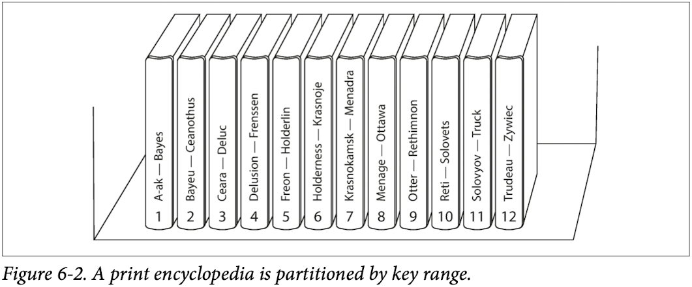
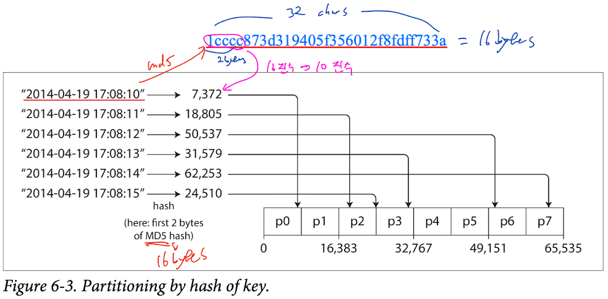
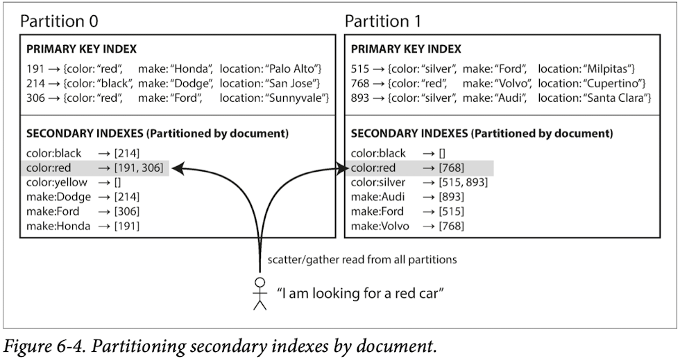
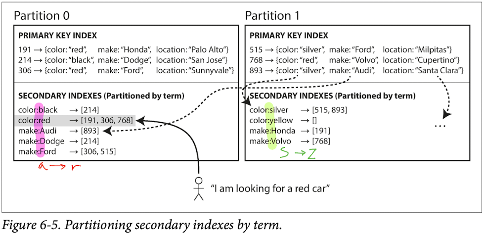
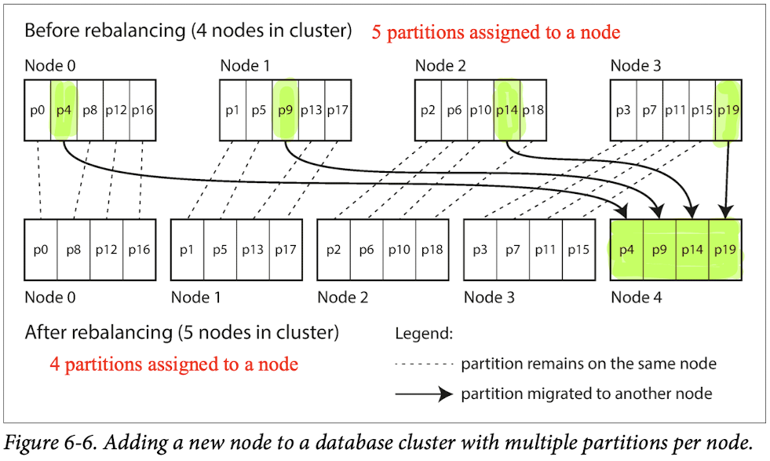
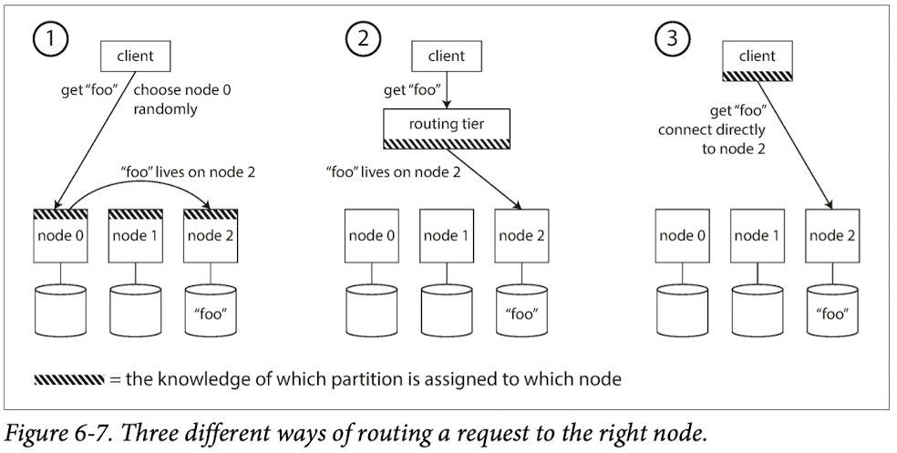
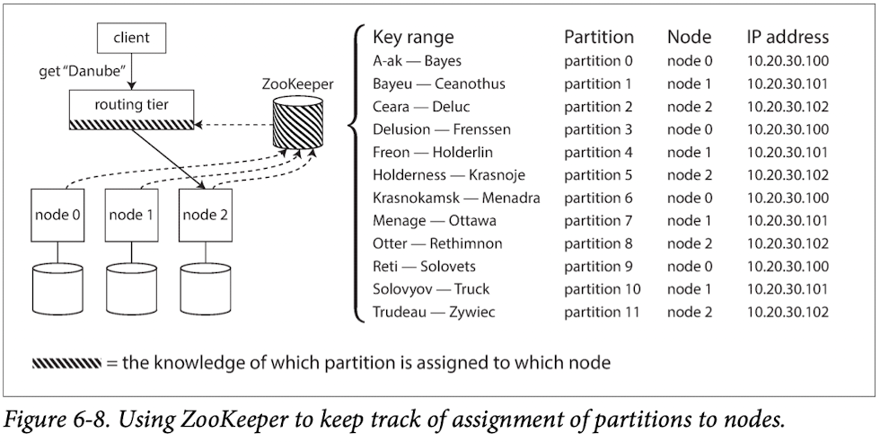

# Partitioning
> Partitioning == Sharding

1. Different approaches for partitioning large datasets
2. How the indexing of data interacts with partitioning

## Partitioning and Replication

## Partitioning of Key-Value Data
> - Skewed: Unbalanced data distribution
> - Hot spot: The point of bottleneck

- Approaches for avoiding hot spots
    1. To assign records to nodes randomly
    2. To access a record by its primary key

### Partitioning by Key Range

- How to choose the partition boundaries?
  - Manually
  - Automatically

- Keep keys in sorted order within each partition -> Range scan
- Key Examples
  - timestamp: ex) year-month-day-hour-minute-second
  - combination: ex) sensorName-year-month-day-hour-minute-second

### Partitioning by Hash of Key
- Hash Functions for Key
  - MD5: Cassandra and MongoDB
  - Fowler-Noll-Vo: Voldemort

> Consistent Hashing
> - This particular approach actually doesn’t work very well for databases.
> - It’s best to avoid the term consistent hashing and just call it hash partitioning instead.
> 

- Hash key partitioning can not do a range query
- So, a table in Cassandra can be declared with a compound primary key consisting of several columns.
  - For example, on a social media site, one user may post many updates. 
  - Key: user_id, update_timestamp
  - Different users may be stored on different partitions, but within each user, the updates are stored ordered by timestamp on a single partition.

### Skewed Workloads and Relieving Hot Spots
- Perhaps in the future, data systems will be able to automatically detect and compensate for skewed workloads; 
- but for now, you need to think through the trade-offs for your own application.

## Partitioning and Secondary Indexes
- Primary Key + Secondary Indexes for key = More complication
- Many key-value stores have avoided secondary indexes.
- But some(such as Riak) have started adding them.
- Two main approaches for secondary indexes
  - Document-based partitioning
  - Term-based partitioning

### Partitioning Secondary Indexes by Document = local index in a partition

- Scatter/Gather
  - Increase latency even if working parallel but
  - but it is widely used -> MongoDB, Riak, Cassandra, Elasticsearch, SolrCloud, and VoltDB

### Partitioning Secondary Indexes by Term = global index

- Partitioning by the term itself can be useful for range scans (e.g., on a numeric property, such as the asking price of the car), 
- whereas partitioning on a hash of the term gives a more even distribution of load.
  - fast read, slower & complicated write

## Rebalancing Partitions
- Reasons of more nodes -> Rebalancing
  1. Queries increases -> More CPU
  2. The dataset size increases -> More RAM
  3. Machines fail

- Minimum requirements of rebalancing
  1. After rebalancing, the load (data storage, read and write requests) should be shared fairly between the nodes in the cluster.
  2. While rebalancing is happening, the database should continue accepting reads and writes.
  3. No more data than necessary should be moved between nodes, to make rebalancing fast and to minimize the network and disk I/O load.

### Strategies for Rebalancing
#### How not to do it: hash mod N
For example, say hash(key) = 123456. 
- 10 nodes -> node 6 (because 123456 mod 10 = 6) 
- 11 nodes -> node 3 (123456 mod 11 = 3)
- 12 nodes -> node 0 (123456 mod 12 = 0)

#### Fixed number of partitions

- If partitions are very large, rebalancing and recovery from node failures become expensive. 
- But if partitions are too small, they incur too much overhead.

#### Dynamic partiioning -> fixed size of partition <- good for both key-range and hash partitioning
- When a partition grows to exceed a configured size (on HBase, the default is 10 GB), it is split into two partitions like B-Trees. 
- Conversely, if lots of data is deleted and a partition shrinks below some threshold, it can be merged with an adjacent partition.
- An empty database starts off with a single partition, since there is no a priori information about where to draw the partition boundaries.
  - -> An initial set of partitions to be configured on an empty database (this is called pre-splitting).

#### Partitioning proportionally to nodes -> fixed number of partitions per node
- the size of each partition grows proportion‐ ally to the dataset size while the number of nodes remains unchanged, 
- but when you increase the number of nodes, the partitions become smaller again.

### Operations: Automatic or Manual Rebalancing
- Automatic: For example, Couchbase, Riak, and Voldemort generate a suggested partition assignment automatically, 
  - but require an administrator to commit it before it takes effect.
    - Cons
      - Can be unpredictable
        - Can overload the network or the nodes and harm the performance of other requests while the rebalancing is in progress.
      - Can be dangerous in combination with automatic failure detection
- Manual: It can be a good thing to have a human in the loop for rebalancing. 
  - It’s slower than a fully automatic process, but it can help prevent operational surprises.

## Request Routing = Service discovery

1. Routing Tier: ex) ZooKeeper
  - LinkedIn’s Espresso uses Helix for cluster management (which in turn relies on ZooKeeper). 
  - HBase, SolrCloud, and Kafka also use ZooKeeper to track partition assignment. 
  - MongoDB has a similar architecture, but it relies on its own config server implementation and mongos daemons as the routing tier.

2. Gossip protocol
   - Cassandra and Riak
     - Avoids the dependency on an external coordination service such as ZooKeeper.

> When using a routing tier or when sending requests to a random node, clients still need to find the IP addresses to connect to. These are not as fast-changing as the assignment of partitions to nodes, so it is often sufficient to use DNS for this purpose.

### Parallel Query Execution
- Massively parallel processing (MPP) relational database products, often used for analytics, are much more sophisticated in the types of queries they support. 
- We will dis‐ cuss some techniques for parallel query execution in Chapter 10.