# CHAPTER 7 - Transactions

[   Issues in data systems ] 
-  The database software or hardware may fail at any time (including in the middle of a write operation).
-  The application may crash at any time (including halfway through a series of operations).
-  Interruptions in the network can unexpectedly cut off the application from the database, or one database node from another.
-  Several clients may write to the database at the same time, overwriting each other’s changes.
-  A client may read data that doesn’t make sense because it has only partially been updated.
-  Race conditions between clients can cause surprising bugs.

[ Transaction ]

- For decades, transactions have been the mechanism of choice for simplifying these issues. 
- A transaction is a way for an application to group several reads and writes together into a logical unit.
- Conceptually, all the reads and writes in a transaction are executed as one operation: either the entire transaction succeeds (commit) or it fails (abort, rollback).
- If it fails, the application can safely retry. 
- With transactions, error handling becomes much simpler for an application, because it doesn’t need to worry about partial failure
  - i.e., the case where some operations succeed and some fail (for whatever reason).
- a purpose namely *simplify the programming model for applications accessing a database.*
- By using transactions, the application is free to ignore certain potential error scenarios and concurrency issues, because the database takes care of them instead (we call these safety guarantees).
- How do you figure out whether you need transactions? In order to answer that question, we first need to understand exactly what safety guarantees transactions can provide, and what costs are associated with them.
- In this chapter, we will examine many examples of things that can go wrong, and explore the algorithms that databases use to guard against those issues.
- We will go especially deep in the area of concurrency control, discussing various kinds of race conditions that can occur and how databases implement isolation levels such as read committed, snapshot isolation, and serializability.

## The Slippery Concept of a Transaction
- the transaction support in MySQL, PostgreSQL, Oracle, SQL Server, etc., is uncannily similar to that of System R.
- Transactions were the main casualty of No-sql movement
- With the hype around this new crop of distributed databases, there emerged a popular belief that transactions were the antithesis of scalability, and that any large-scale system would have to abandon transactions in order to maintain good performance and high availability 
- On the other hand, transactional guarantees are sometimes presented by database vendors as an essential requirement for “serious applications” with “valuable data.” Both viewpoints are pure hyperbole.

### The Meaning of ACID
- The safety guarantees provided by transactions are often described by the well-known acronym ACID, which stands for Atomicity, Consistency, Isolation, and Durability.

#### Atomicity
```
If an error occurs halfway through a sequence of writes, the transaction should be aborted, and the writes made up to that point should be discarded.
In other words, the database saves you from having to worry about partial failure, by giving an all-or-nothing guarantee.
```
- In general, atomic refers to something that cannot be broken down into smaller parts.
- In computing, The system can only be in the state it was before the operation or after the operation, not something in between.
  - For example, in multi-threaded programming, if one thread executes an atomic operation, that means there is no way that another thread could see the half-finished result of the operation.
> *In ACID atomicity, if the writes are grouped together into an atomic transaction, and the transaction cannot be completed (committed) due to a fault, then the transaction is aborted and the database must discard or undo any writes it has made so far in that transaction.*
- Atomicity simplifies the error problem: if a transaction was aborted, the application can be sure that it didn’t change anything, so it can safely be retried.

#### Consistency
The word consistency is terribly overloaded:
- In Chapter 5 we discussed replica consistency and the issue of eventual consistency that arises in asynchronously replicated systems (see “Problems with Replication Lag” on page 161).
- Consistent hashing is an approach to partitioning that some systems use for rebalancing (see “Consistent Hashing” on page 204).
- In the CAP theorem (see Chapter 9), the word consistency is used to mean linearizability (see “Linearizability” on page 324).
- In the context of ACID, consistency refers to an application-specific notion of the database being in a “good state.”
- 
It’s unfortunate that the same word is used with at least four different meanings
- Your data (invariants) that must always be true—for example, in an accounting system, credits and debits across all accounts must always be balanced.
- If a transaction starts with a database that is valid according to these invariants, and any writes during the transaction preserve the validity, then you can be sure that the invariants are always satisfied.
- Consistency (in the ACID sense) is a property of the application whereas atomicity, isolation, and durability are properties of the database.

#### Isolation
```
Concurrently running transactions shouldn’t interfere with each other.
For example, if one transaction makes several writes, then another transaction should see either all or none of those writes, but not some subset.
```
- Most databases are accessed by several clients at the same time. That is no problem if they are reading and writing different parts of the database, but if they are accessing the same database records, you can run into concurrency problems (race conditions).

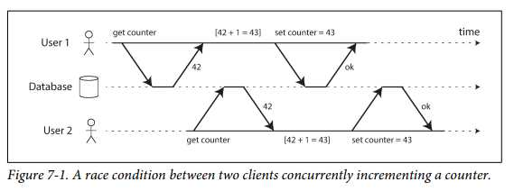

[Figure 7-1] - a example of Race condition
- Say you have two clients simultaneously incrementing a counter that is stored in a database.
- Each client needs to read the current value, add 1, and write the new value back (assuming there is no increment operation built into the database).
- The counter should have increased from 42 to 44, because two increments happened, but it actually only went to 43 because of the race condition.
- The classic database textbooks formalize isolation as serializability, which means that each transaction can pretend that it is the only transaction running on the entire database.
- However, in practice, serializable isolation is rarely used because of a performance penalty.
- In Oracle there is an isolation level called “serializable,” but it actually implements something called snapshot isolation, which is a weaker guarantee than serializability.

#### Durability
- Durability is the promise that once a transaction has committed successfully, any data it has written will not be forgotten, even if there is a hardware fault or the database crashes.
- In a single-node database, durability typically means that the data has been written to nonvolatile storage such as a hard drive or SSD.
- It usually also involves a write-ahead log or similar (see “Making B-trees reliable” on page 82), which allows recovery in the event that the data structures on disk are corrupted.
- In a replicated database, durability may mean that the data has been successfully copied to some number of nodes.
- In order to provide a durability guarantee, a database must wait until these writes or replications are complete before reporting a transaction as successfully committed.

## Single-Object and Multi-Object Operations
- Such multi-object transactions are often needed if several pieces of data need to be kept in sync.

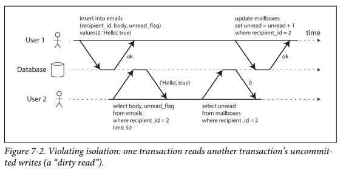
[Figure 7-2] 
- user 2 experiences an anomaly: the mailbox listing shows an unread message, but the counter shows zero unread messages because the counter increment has not yet happened.
- Isolation would have prevented this issue by ensuring that user 2 sees either both the inserted email and the updated counter, or neither, but not an inconsistent halfway point.


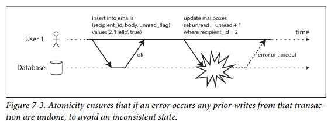
[Figure 7-3] - the need for atomicity
- if an error occurs somewhere over the course of the transaction, the contents of the mailbox and the unread counter might become out of sync.
- In an atomic transaction, if the update to the counter fails, the transaction is aborted and the inserted email is rolled back.

> Multi-object transactions
- Multi-object transactions require some way of determining which read and writeo-perations belong to the same transaction.
- In relational databases, that is typically done based on the client’s **TCP** connection to the database server:
- on any particular connection, everything between a BEGIN TRANSACTION and a COMMIT statement is considered to be part of the same transaction.
- On the other hand, many nonrelational databases don’t have such a way of grouping operations together.

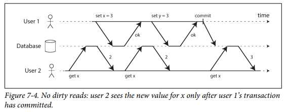

#### Single-object writes
Atomicity and isolation also apply when a single object is being changed. For example, imagine you are writing a 20 KB JSON document to a database:
- If the network connection is interrupted after the first 10 KB have been sent, does the database store that unparseable 10 KB fragment of JSON?
- If the power fails while the database is in the middle of overwriting the previous value on disk, do you end up with the old and new values spliced together?
- If another client reads that document while the write is in progress, will it see a partially updated value?
- These single-object operations are useful, as they can prevent lost updates when several clients try to write to the same object concurrently (see “Preventing Lost Updates” on page 242).
- However, they are not transactions in in the usual sense of the word.
- Compare-and-set and other single-object operations have been dubbed “lightweight transactions” or even “ACID” for marketing purposes

#### The need for multi-object transactions
- Many distributed datastores have abandoned multi-object transactions because they are difficult to implement across partitions, and they can get in the way in some scenarios where very high availability or performance is required.
- do we need multi-object transactions at all? Would it be possible to implement any application with only a key-value data model and single-object operations?
- There are some use cases in which single-object inserts, updates, and deletes are sufficient.
- However, in many other cases writes to several different objects need to be coordinated:

  - • In a relational data model, a row in one table often has a foreign key reference to a row in another table. (Similarly, in a graph-like data model, a vertex has edges to other vertices.) Multi-object transactions allow you to ensure that these references remain valid: when inserting several records that refer to one another, the foreign keys have to be correct and up to date, or the data becomes nonsensical.
  - • In a document data model, the fields that need to be updated together are often within the same document, which is treated as a single object—no multi-object transactions are needed when updating a single document. However, document databases lacking join functionality also encourage denormalization (see “Relational Versus Document Databases Today” on page 38). When denormalized information needs to be updated, like in the example of Figure 7-2, you need to update several documents in one go. Transactions are very useful in this situation to prevent denormalized data from going out of sync.
  - • In databases with secondary indexes (almost everything except pure key-value stores), the indexes also need to be updated every time you change a value. These indexes are different database objects from a transaction point of view: for example, without transaction isolation, it’s possible for a record to appear in one index but not another, because the update to the second index hasn’t happened yet.

- However, error handling becomes much more complicated without atomicity, and the lack of isolation can cause concurrency problems.

#### Handling errors and aborts
- A key feature of a transaction is that it can be aborted and safely retried if an error occurred.
- ACID databases are based on this philosophy:
  - if the database is in danger of violating its guarantee of atomicity, isolation, or durability, it would rather abandon the transaction entirely than allow it to remain half-finished.
  - Not all systems follow that philosophy, though. In particular, datastores with leaderless replication (see “Leaderless Replication” on page 177) work much more on a “best effort” basis, which could be summarized as “the database will do as much as it can, and if it runs into an error, it won’t undo something it has already done”—so it’s the application’s responsibility to recover from errors.
- Avoiding intricacies of error handling
  - For example, popular
object-relational mapping (ORM) frameworks such as Rails’s ActiveRecord and Django don’t retry aborted transactions—the error usually results in an exception bubbling up the stack, so any user input is thrown away and the user gets an error message.
  - This is a shame, because the whole point of aborts is to enable safe retries.
    
> Cons of retrying an aborted transaction

- If the transaction actually succeeded, but the network failed while the server tried to acknowledge the successful commit to the client (so the client thinks it failed), then retrying the transaction causes it to be performed twice—unless you have an additional application-level deduplication mechanism in place.
- If the error is due to overload, retrying the transaction will make the problem worse, not better. To avoid such feedback cycles, you can limit the number of retries, use exponential backoff, and handle overload-related errors differently from other errors (if possible).
- It is only worth retrying after transient errors (for example due to deadlock, isolation violation, temporary network interruptions, and failover); after a permanent error (e.g., constraint violation) a retry would be pointless.
- If the transaction also has side effects outside of the database, those side effects may happen even if the transaction is aborted. For example, if you’re sending an email, you wouldn’t want to send the email again every time you retry the transaction. If you want to make sure that several different systems either commit or abort together, two-phase commit can help (we will discuss this in “Atomic Commit and Two-Phase Commit (2PC)” on page 354).
- If the client process fails while retrying, any data it was trying to write to the database is lost.

## Weak Isolation Levels
- In practice, isolation is unfortunately not that simple. Serializable isolation has a performance cost, and many databases don’t want to pay that price [8].
- It’s therefore common for systems to use weaker levels of isolation, which protect against some concurrency issues, but not all. Those levels of isolation are much harder to understand, and they can lead to subtle bugs, but they are nevertheless used in practice.
- In this section we will look at several weak (nonserializable) isolation levels that are used in practice, and discuss in detail what kinds of race conditions can and cannot occur, so that you can decide what level is appropriate to your application.

### Read Committed
The most basic level of transaction isolation is read committed.v It makes two guarantees:
- 1. When reading from the database, you will only see data that has been committed (no dirty reads).
- 2. When writing to the database, you will only overwrite data that has been committed (no dirty writes).

#### No dirty reads
- Imagine a transaction has written some data to the database, but the transaction has not yet committed or aborted. Can another transaction see that uncommitted data?
- If yes, that is called a dirty read.
- Transactions running at the read committed isolation level must prevent dirty reads.


- [Figure 7-4] where user 1 has set x = 3, but user 2’s get x still returns the old value, 2, while user 1 has not yet committed

> Why it’s useful to prevent dirty reads:
- • If a transaction needs to update several objects, a dirty read means that another transaction may see some of the updates but not others.
  - For example, in Figure 7-2, the user sees the new unread email but not the updated counter. This is a dirty read of the email. Seeing the database in a partially updated state is confusing to users and may cause other transactions to take incorrect decisions.
- • If a transaction aborts, any writes it has made need to be rolled back (like in Figure 7-3).
  - If the database allows dirty reads, that means a transaction may see data that is later rolled back—i.e., which is never actually committed to the database. Reasoning about the consequences quickly becomes mind-bending.

#### No dirty writes
- What happens if the earlier write is part of a transaction that has not yet committed, so the later write overwrites an uncommitted value? This is called a dirty write.
  - Transactions running at the read committed isolation level must prevent dirty writes, usually by delaying the second write until the first write’s transaction has committed or aborted.
 
> preventing dirty writes -> Avoiding some kinds of concurrency problems:

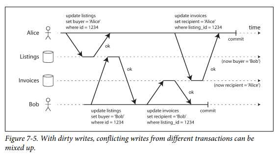

- If transactions update multiple objects, dirty writes can lead to a bad outcome.
  - For example, consider Figure 7-5, which illustrates a used car sales website on which two people, Alice and Bob, are simultaneously trying to buy the same car.
  - Buying a car requires two database writes: the listing on the website needs to be updated to reflect the buyer, and the sales invoice needs to be sent to the buyer.
  - In the case of Figure 7-5, the sale is awarded to Bob (because he performs the winning update to the listings table), but the invoice is sent to Alice (because she performs the winning update to the invoices table). Read committed prevents such mishaps.
- However, read committed does not prevent the race condition between two counter increments in Figure 7-1. In this case, the second write happens after the first transaction has committed, so it’s not a dirty write. It’s still incorrect, but for a different reason—in “Preventing Lost Updates” on page 242 we will discuss how to make such counter increments safe.

#### Implementing read committed
- Read committed is a very popular isolation level. It is the default setting in Oracle 11g, PostgreSQL, SQL Server 2012, MemSQL, and many other databases
- Row-level locks(to prevent dirty writes):
  - when a transaction wants to modify a particular object (row or document), it must first acquire a lock on that object.
  - It must then hold that lock until the transaction is committed or aborted. Only one transaction can hold the lock for any given object; if another transaction wants to write to the same object, it must wait until the first transaction is committed or aborted before it can acquire the lock and continue. This locking is done automatically by databases in read committed mode (or stronger isolation levels). 
- But, not work well in practice,
  - because one long-running write transaction can force many read-only transactions to wait until the long-running transaction has completed.
- Most databasesvi prevent dirty reads
  - for every object that is written, the database remembers both the old committed value and the new value set by the transaction that currently holds the write lock. While the transaction is ongoing, any other transactions that read the object are simply given the old value.

### Snapshot Isolation and Repeatable Read

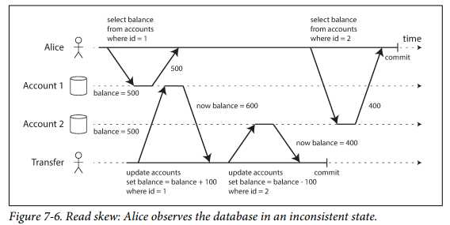
[Nonrepeatable read or Read skew]
- Say Alice has $1,000 of savings at a bank, split across two accounts with $500 each.
- Now a transaction transfers $100 from one of her accounts to the other. If she is unlucky enough to look at her list of account balances in the same moment as that transaction is being processed, she may see one account balance at a time before the incoming payment has arrived (with a balance of $500), and the other account after the outgoing transfer has been made (the new balance being $400).
- To Alice it now appears as though she only has a total of $900 in her accounts—it seems that $100 has vanished into thin air.

> some situations cannot tolerate such temporary inconsistency
- Backups
  - Taking a backup requires making a copy of the entire database, which may take hours on a large database. During the time that the backup process is running, writes will continue to be made to the database.
  - Thus, you could end up with some parts of the backup containing an older version of the data, and other parts containing a newer version.
  - If you need to restore from such a backup, the inconsistencies (such as disappearing money) become permanent.
- Analytic queries and integrity checks
  - Sometimes, you may want to run a query that scans over large parts of the database.
  - Such queries are common in analytics (see “Transaction Processing or Analytics?” on page 90), or may be part of a periodic integrity check that everything is in order (monitoring for data corruption).
  - These queries are likely to return nonsensical results if they observe parts of the database at different points in time.

[Snapshot isolation - the most common solution]
- Each transaction reads from a consistent snapshot of the database—that is, the transaction sees all the data that was committed in the database at the start of the transaction.
- Even if the data is subsequently changed by another transaction, each transaction sees only the old data from that particular point in time.
- Good Usage
  - Snapshot isolation is a boon for long-running, read-only queries such as backups and analytics.
  - It is very hard to reason about the meaning of a query if the data on which it operates is changing at the same time as the query is executing.
  - When a transaction can see a consistent snapshot of the database, frozen at a particular point in time, it is much easier to understand.
 
- Snapshot isolation is a popular feature: it is supported by PostgreSQL, MySQL with the InnoDB storage engine, Oracle, SQL Server, and others.

#### Implementing snapshot isolation
- To implement snapshot isolation, databases use a generalization of the mechanism we saw for preventing dirty reads in Figure 7-4. The database must potentially keep several different committed versions of an object, because various in-progress transactions may need to see the state of the database at different points in time. Because it maintains several versions of an object side by side, this technique is known as multiversion concurrency control (MVCC).
- If a database only needed to provide read committed isolation, but not snapshot isolation, it would be sufficient to keep two versions of an object: the committed version and the overwritten-but-not-yet-committed version. However, storage engines that support snapshot isolation typically use MVCC for their read committed isolation level as well. A typical approach is that read committed uses a separate snapshot for each query, while snapshot isolation uses the same snapshot for an entire transaction.

 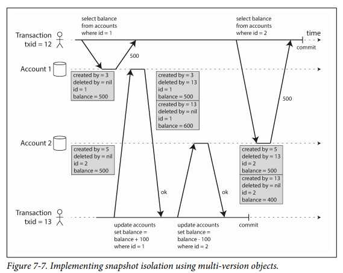

- Figure 7-7 illustrates how MVCC-based snapshot isolation is implemented in PostgreSQL [31] (other implementations are similar). When a transaction is started, it is given a unique, always-increasingvii transaction ID (txid). Whenever a transaction writes anything to the database, the data it writes is tagged with the transaction ID of the writer.
- Each row in a table has a created_by field, containing the ID of the transaction that inserted this row into the table. Moreover, each row has a deleted_by field, which is initially empty. If a transaction deletes a row, the row isn’t actually deleted from the database, but it is marked for deletion by setting the deleted_by field to the ID of the transaction that requested the deletion. At some later time, when it is certain that no transaction can any longer access the deleted data, a garbage collection process in the database removes any rows marked for deletion and frees their space.
- An update is internally translated into a delete and a create. For example, in Figure 7-7, transaction 13 deducts $100 from account 2, changing the balance from $500 to $400. The accounts table now actually contains two rows for account 2: a row with a balance of $500 which was marked as deleted by transaction 13, and a row with a balance of $400 which was created by transaction 13.

#### Visibility rules for observing a consistent snapshot

- When a transaction reads from the database, transaction IDs are used to decide which objects it can see and which are invisible. By carefully defining visibility rules, the database can present a consistent snapshot of the database to the application. This works as follows:
1. At the start of each transaction, the database makes a list of all the other transactions that are in progress (not yet committed or aborted) at that time. Any writes that those transactions have made are ignored, even if the transactions subsequently commit.
2. Any writes made by aborted transactions are ignored.
3. Any writes made by transactions with a later transaction ID (i.e., which started after the current transaction started) are ignored, regardless of whether those transactions have committed.
4. All other writes are visible to the application’s queries.

- These rules apply to both creation and deletion of objects. In Figure 7-7, when transaction 12 reads from account 2, it sees a balance of $500 because the deletion of the $500 balance was made by transaction 13 (according to rule 3, transaction 12 cannot see a deletion made by transaction 13), and the creation of the $400 balance is not yet visible (by the same rule).
- Put another way, an object is visible if both of the following conditions are true:
  - • At the time when the reader’s transaction started, the transaction that created the object had already committed.
  - • The object is not marked for deletion, or if it is, the transaction that requested deletion had not yet committed at the time when the reader’s transaction started.
- A long-running transaction may continue using a snapshot for a long time, continuing to read values that (from other transactions’ point of view) have long been overwritten or deleted.
- By never updating values in place but instead creating a new version every time a value is changed, the database can provide a consistent snapshot while incurring only a small overhead.
  
#### Indexes and snapshot isolation

- How do indexes work in a multi-version database? One option is to have the index simply point to all versions of an object and require an index query to filter out any object versions that are not visible to the current transaction.
- When garbage collection removes old object versions that are no longer visible to any transaction, the corresponding index entries can also be removed.
- In practice, many implementation details determine the performance of multiversion concurrency control. For example, PostgreSQL has optimizations for avoiding index updates if different versions of the same object can fit on the same page
- Another approach is used in CouchDB, Datomic, and LMDB. Although they also use B-trees (see “B-Trees” on page 79), they use an append-only/copy-on-write variant that does not overwrite pages of the tree when they are updated, but instead creates a new copy of each modified page.
  - Parent pages, up to the root of the tree, are copied and updated to point to the new versions of their child pages. Any pages that are not affected by a write do not need to be copied, and remain immutable.
  - With append-only B-trees, every write transaction (or batch of transactions) creates a new B-tree root, and a particular root is a consistent snapshot of the database at the point in time when it was created. There is no need to filter out objects based on transaction IDs because subsequent writes cannot modify an existing B-tree;
    - they can only create new tree roots. However, this approach also requires a background process for compaction and garbage collection
#### Repeatable read and naming confusion
- Snapshot isolation is a useful isolation level, especially for read-only transactions.
  - However, many databases that implement it call it by different names. In Oracle it is called serializable, and in PostgreSQL and MySQL it is called repeatable read [23].
  - The reason for this naming confusion is that the SQL standard doesn’t have the concept of snapshot isolation, because the standard is based on System R’s 1975 definition of isolation levels [2] and snapshot isolation hadn’t yet been invented then.
- Instead, it defines repeatable read, which looks superficially similar to snapshot isolation.
  - PostgreSQL and MySQL call their snapshot isolation level repeatable read because it meets the requirements of the standard, and so they can claim standards compliance.
  - Unfortunately, the SQL standard’s definition of isolation levels is flawed—it is ambiguous, imprecise, and not as implementation-independent as a standard should be [28]. 
  - Even though several databases implement repeatable read, there are big differences in the guarantees they actually provide, despite being ostensibly standardized [23]. 
  - There has been a formal definition of repeatable read in the research literature [29, 30], but most implementations don’t satisfy that formal definition. And to top it off, IBM DB2 uses “repeatable read” to refer to serializability [8].
  - As a result, nobody really knows what repeatable read means.

### Preventing Lost Updates
- There are several other interesting kinds of conflicts that can occur between concurrently writing transactions. The best known of these is the lost update problem, illustrated in Figure 7-1 with the example of two concurrent counter increments.
- The lost update problem can occur if an application reads some value from the database, modifies it, and writes back the modified value (a read-modify-write cycle). If two transactions do this concurrently, one of the modifications can be lost, because the second write does not include the first modification. (We sometimes say that the later write clobbers the earlier write.) This pattern occurs in various different scenarios:
- • Incrementing a counter or updating an account balance (requires reading the current value, calculating the new value, and writing back the updated value)
- • Making a local change to a complex value, e.g., adding an element to a list within a JSON document (requires parsing the document, making the change, and writing back the modified document)
- • Two users editing a wiki page at the same time, where each user saves their changes by sending the entire page contents to the server, overwriting whatever is currently in the database
- Because this is such a common problem, a variety of solutions have been developed.

#### Atomic write operations
- Many databases provide atomic update operations, which remove the need to implement read-modify-write cycles in application code.
- They are usually the best solution if your code can be expressed in terms of those operations.
  - For example, the following instruction is concurrency-safe in most relational databases:
```
  UPDATE counters SET value = value + 1 WHERE key = 'foo';
```
- Similarly, document databases such as MongoDB provide atomic operations for making local modifications to a part of a JSON document,
- and Redis provides atomic operations for modifying data structures such as priority queues.
- Not all writes can easily be expressed in terms of atomic operations—for example, updates to a wiki page involve arbitrary text editingviii—but in situations where atomic operations can be used, they are usually the best choice.
- Atomic operations are usually implemented by taking an exclusive lock on the object when it is read so that no other transaction can read it until the update has been applied.
- This technique is sometimes known as cursor stability [36, 37]. Another option is to simply force all atomic operations to be executed on a single thread.
- Unfortunately, object-relational mapping frameworks make it easy to accidentally write code that performs unsafe read-modify-write cycles instead of using atomic operations provided by the database [38].
- That’s not a problem if you know what you are doing, but it is potentially a source of subtle bugs that are difficult to find by testing.

#### Explicit locking
- Another option for preventing lost updates, if the database’s built-in atomic operations don’t provide the necessary functionality, is for the application to explicitly lock objects that are going to be updated.
- Then the application can perform a readmodify-write cycle, and if any other transaction tries to concurrently read the same object, it is forced to wait until the first read-modify-write cycle has completed.
- For example, consider a multiplayer game in which several players can move the same figure concurrently. In this case, an atomic operation may not be sufficient, because the application also needs to ensure that a player’s move abides by the rules of the game, which involves some logic that you cannot sensibly implement as a database query.
- Instead, you may use a lock to prevent two players from concurrently moving the same piece, as illustrated in Example 7-1.
```SQL
Example 7-1. Explicitly locking rows to prevent lost updates
BEGIN TRANSACTION;
SELECT * FROM figures
  WHERE name = 'robot' AND game_id = 222
  FOR UPDATE; (1)
-- Check whether move is valid, then update the position
-- of the piece that was returned by the previous SELECT.

UPDATE figures SET position = 'c4' WHERE id = 1234;
COMMIT;
```
-  (1) The FOR UPDATE clause indicates that the database should take a lock on all rows
returned by this query.
- This works, but to get it right, you need to carefully think about your application logic. It’s easy to forget to add a necessary lock somewhere in the code, and thus introduce a race condition.

#### Automatically detecting lost updates
- Atomic operations and locks are ways of preventing lost updates by forcing the readmodify-write cycles to happen sequentially. An alternative is to allow them to execute in parallel and, if the transaction manager detects a lost update, abort the transaction and force it to retry its read-modify-write cycle.
- An advantage of this approach is that databases can perform this check efficiently in conjunction with snapshot isolation. Indeed, PostgreSQL’s repeatable read, Oracle’s serializable, and SQL Server’s snapshot isolation levels automatically detect when a lost update has occurred and abort the offending transaction. However, MySQL/InnoDB’s repeatable read does not detect lost updates [23]. 
- Some authors [28, 30] argue that a database must prevent lost updates in order to qualify as providing snapshot isolation, so MySQL does not provide snapshot isolation under this definition.
- Lost update detection is a great feature, because it doesn’t require application code to use any special database features—you may forget to use a lock or an atomic operation and thus introduce a bug, but lost update detection happens automatically and is thus less error-prone.

#### Compare-and-set
- In databases that don’t provide transactions, you sometimes find an atomic compareand-set operation (previously mentioned in “Single-object writes” on page 230). The purpose of this operation is to avoid lost updates by allowing an update to happen only if the value has not changed since you last read it. If the current value does not match what you previously read, the update has no effect, and the read-modify-write cycle must be retried.
- For example, to prevent two users concurrently updating the same wiki page, you might try something like this, expecting the update to occur only if the content of the page hasn’t changed since the user started editing it:
```
-- This may or may not be safe, depending on the database implementation
UPDATE wiki_pages SET content = 'new content'
WHERE id = 1234 AND content = 'old content';
```
- If the content has changed and no longer matches 'old content', this update will have no effect, so you need to check whether the update took effect and retry if necessary. 
- However, if the database allows the WHERE clause to read from an old snapshot, this statement may not prevent lost updates, because the condition may be true even though another concurrent write is occurring. Check whether your database’s compare-and-set operation is safe before relying on it.

#### Conflict resolution and replication
- In replicated databases (see Chapter 5), preventing lost updates takes on another dimension: since they have copies of the data on multiple nodes, and the data can potentially be modified concurrently on different nodes, some additional steps need to be taken to prevent lost updates.
- Locks and compare-and-set operations assume that there is a single up-to-date copy of the data. However, databases with multi-leader or leaderless replication usually allow several writes to happen concurrently and replicate them asynchronously, so they cannot guarantee that there is a single up-to-date copy of the data. Thus, techniques based on locks or compare-and-set do not apply in this context. (We will revisit this issue in more detail in “Linearizability” on page 324.)
- Instead, as discussed in “Detecting Concurrent Writes” on page 184, a common approach in such replicated databases is to allow concurrent writes to create several conflicting versions of a value (also known as siblings), and to use application code or special data structures to resolve and merge these versions after the fact.
- Atomic operations can work well in a replicated context, especially if they are commutative (i.e., you can apply them in a different order on different replicas, and still get the same result). For example, incrementing a counter or adding an element to a set are commutative operations. That is the idea behind Riak 2.0 datatypes, which prevent lost updates across replicas. When a value is concurrently updated by different clients, Riak automatically merges together the updates in such a way that no updates are lost [39].
- On the other hand, the last write wins (LWW) conflict resolution method is prone to lost updates, as discussed in “Last write wins (discarding concurrent writes)” on page 186.
- Unfortunately, LWW is the default in many replicated databases.

## Write Skew and Phantoms
- In this section we will see some subtler examples of conflicts.
- To begin, imagine this example: you are writing an application for doctors to manage their on-call shifts at a hospital. The hospital usually tries to have several doctors on call at any one time, but it absolutely must have at least one doctor on call. Doctors can give up their shifts (e.g., if they are sick themselves), provided that at least one colleague remains on call in that shift [40, 41].
- Now imagine that Alice and Bob are the two on-call doctors for a particular shift.
- Both are feeling unwell, so they both decide to request leave. Unfortunately, they happen to click the button to go off call at approximately the same time. What happens next is illustrated in Figure 7-8
  
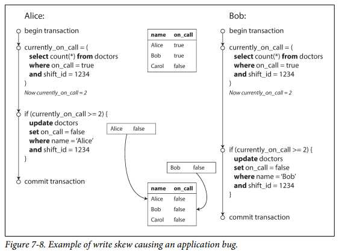

- In each transaction, your application first checks that two or more doctors are currently on call; 
- if yes, it assumes it’s safe for one doctor to go off call. Since the database is using snapshot isolation, both checks return 2, so both transactions proceed to the next stage. 
- Alice updates her own record to take herself off call, and Bob updates his own record likewise. Both transactions commit, and now no doctor is on call. 
- Your requirement of having at least one doctor on call has been violated.

#### Characterizing write skew

- This anomaly is called write skew [28]. It is neither a dirty write nor a lost update, because the two transactions are updating two different objects (Alice’s and Bob’s oncall records, respectively). \
- It is less obvious that a conflict occurred here, but it’s definitely a race condition: if the two transactions had run one after another, the second doctor would have been prevented from going off call. 
- The anomalous behavior was only possible because the transactions ran concurrently.
- You can think of write skew as a generalization of the lost update problem. Write skew can occur if two transactions read the same objects, and then update some of those objects (different transactions may update different objects). In the special case where different transactions update the same object, you get a dirty write or lost update anomaly (depending on the timing).
  - We saw that there are various different ways of preventing lost updates. With write skew, our options are more restricted:
  - • Atomic single-object operations don’t help, as multiple objects are involved.
  - • The automatic detection of lost updates that you find in some implementations of snapshot isolation unfortunately doesn’t help either: write skew is not automatically detected in PostgreSQL’s repeatable read, MySQL/InnoDB’s repeatable read, Oracle’s serializable, or SQL Server’s snapshot isolation level [23]. Automatically preventing write skew requires true serializable isolation (see “Serializability” on page 251).
 - • Some databases allow you to configure constraints, which are then enforced by the database (e.g., uniqueness, foreign key constraints, or restrictions on a particular value). However, in order to specify that at least one doctor must be on call, you would need a constraint that involves multiple objects. Most databases do not have built-in support for such constraints, but you may be able to implement them with triggers or materialized views, depending on the database [42].
  - • If you can’t use a serializable isolation level, the second-best option in this case is probably to explicitly lock the rows that the transaction depends on. In the doctors example, you could write something like the following:
    
```SQL 
BEGIN TRANSACTION;
SELECT * FROM doctors
  WHERE on_call = true
  AND shift_id = 1234 FOR UPDATE;  -- (1) 
UPDATE doctors
  SET on_call = false
  WHERE name = 'Alice'
  AND shift_id = 1234;
COMMIT;
```
(1) As before, FOR UPDATE tells the database to lock all rows returned by this query.

#### More examples of write skew
- Write skew may seem like an esoteric issue at first, but once you’re aware of it, you may notice more situations in which it can occur.
  - Here are some more examples:
  - Meeting room booking system
  - Say you want to enforce that there cannot be two bookings for the same meeting room at the same time [43].
  - When someone wants to make a booking, you first check for any conflicting bookings (i.e., bookings for the same room with an overlapping time range), and if none are found, you create the meeting (see
Example 7-2).
  - Example 7-2. A meeting room booking system tries to avoid double-booking (not safe under snapshot isolation)

```SQL
BEGIN TRANSACTION;
-- Check for any existing bookings that overlap with the period of noon-1pm
SELECT COUNT(*) FROM bookings
  WHERE room_id = 123 AND
    end_time > '2015-01-01 12:00' AND start_time < '2015-01-01 13:00';
-- If the previous query returned zero:
INSERT INTO bookings
  (room_id, start_time, end_time, user_id)
  VALUES (123, '2015-01-01 12:00', '2015-01-01 13:00', 666);
COMMIT;
```
- Unfortunately, snapshot isolation does not prevent another user from concurrently inserting a conflicting meeting. In order to guarantee you won’t get scheduling conflicts, you once again need serializable isolation

> Multiplayer game

- In Example 7-1, we used a lock to prevent lost updates (that is, making sure that two players can’t move the same figure at the same time).
- However, the lock doesn’t prevent players from moving two different figures to the same position on the board or potentially making some other move that violates the rules of the game.
- Depending on the kind of rule you are enforcing, you might be able to use a unique constraint, but otherwise you’re vulnerable to write skew.
  
> Claiming a username

- On a website where each user has a unique username, two users may try to create accounts with the same username at the same time.
- You may use a transaction to check whether a name is taken and, if not, create an account with that name.
- However, like in the previous examples, that is not safe under snapshot isolation.
- Fortunately, a unique constraint is a simple solution here (the second transaction that tries to register the username will be aborted due to violating the constraint).
  
> Preventing double-spending

- A service that allows users to spend money or points needs to check that a user doesn’t spend more than they have.
- You might implement this by inserting a tentative spending item into a user’s account, listing all the items in the account, and checking that the sum is positive [44].
- With write skew, it could happen that two spending items are inserted concurrently that together cause the balance to go negative, but that neither transaction notices the other.
  
#### Phantoms causing write skew
All of these examples follow a similar pattern:
1. A SELECT query checks whether some requirement is satisfied by searching for rows that match some search condition (there are at least two doctors on call, there are no existing bookings for that room at that time, the position on the board doesn’t already have another figure on it, the username isn’t already taken, there is still money in the account).
2. Depending on the result of the first query, the application code decides how to continue (perhaps to go ahead with the operation, or perhaps to report an error to the user and abort).
3. If the application decides to go ahead, it makes a write (INSERT, UPDATE, or DELETE) to the database and commits the transaction. The effect of this write changes the precondition of the decision of step 2. In
other words, if you were to repeat the SELECT query from step 1 after commiting the write, you would get a different result, because the write changed the set of rows matching the search condition (there is now one fewer doctor on call, the meeting room is now booked for that time, the position on the board is now taken by the figure that was moved, the username is now taken, there is now less money in the account).

- The steps may occur in a different order. For example, you could first make the write, then the SELECT query, and finally decide whether to abort or commit based on the result of the query.
  
#### Materializing conflicts
- If the problem of phantoms is that there is no object to which we can attach the locks, perhaps we can artificially introduce a lock object into the database?
  - For example, in the meeting room booking case you could imagine creating a table of time slots and rooms. Each row in this table corresponds to a particular room for a particular time period (say, 15 minutes).
  - You create rows for all possible combinations of rooms and time periods ahead of time, e.g. for the next six months.
  - Now a transaction that wants to create a booking can lock (SELECT FOR UPDATE) the rows in the table that correspond to the desired room and time period.
  - After it has acquired the locks, it can check for overlapping bookings and insert a new booking as before. Note that the additional table isn’t used to store information about the booking—
  - it’s purely a collection of locks which is used to prevent bookings on the same room and time range from being modified concurrently.

- This approach is called materializing conflicts, because it takes a phantom and turns it into a lock conflict on a concrete set of rows that exist in the database [11].
- Unfortunately, it can be hard and error-prone to figure out how to materialize conflicts, and it’s ugly to let a concurrency control mechanism leak into the application data model.
- For those reasons, materializing conflicts should be considered a last resort if no alternative is possible. A serializable isolation level is much preferable in most cases.

## Serializability

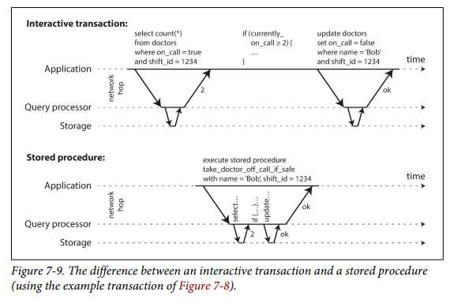

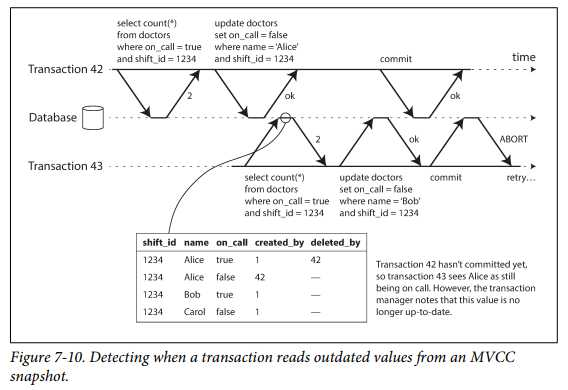

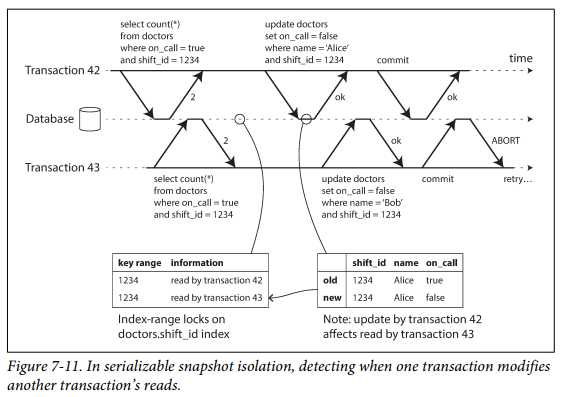


