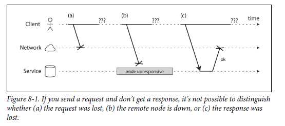
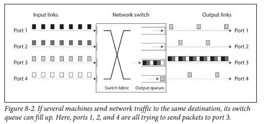
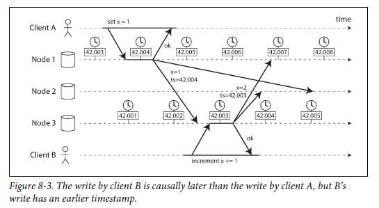
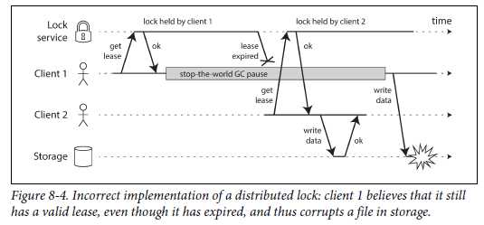
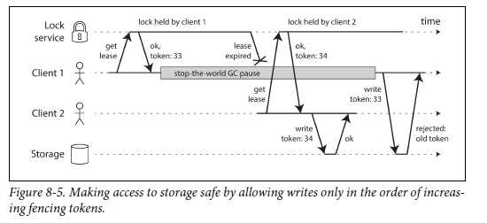

# CHAPTER 8 - The Trouble with Distributed Systems

## Faults and Partial Failures
> Why is it difficult to deal with the Distributed Systems?

- Single computer
  - fairly predictable: either it works or it doesn’t
  - mostly just a consequence of badly written software
  - If there is a hardware problem (e.g., memory corruption or a loose connector), the consequence is usually a total system failure.

- Distributed system
  - Partial Failures: some parts of the system that are broken in some unpredictable way, but others are fine.
  - In multiple nodes and the network -> sometimes work and sometimes unpredictably fail.
  - If we want to make distributed systems work, we must accept
    - (1) the possibility of partial failure and
    - (2) build fault-tolerance mechanisms into the software.    
  - In other words, we need to build a reliable system from unreliable components.

### Approaches to Handling Faults of the Distributed System
> Large-scale computing systems in internet services - Cloud Computing
- associated with multi-tenant datacenters using connectin with an IP network (often Ethernet), elastic/on-demand resource allocation.
  
> Approaches to handling faults
- Many internet-related applications are *On-line*, in the sense that they need to be able to serve users with low latency at any time.
- Nodes in cloud services are built from commodity machines
  - Equivalent performance at lower cost due to economies of scale
  - But also have higher failure rates.
- Large datacenter networks are often based on IP and Ethernet.
- It is reasonable to assume that something is always broken in a system with thousands of nodes
- If the system can tolerate failed nodes and still keep working as a whole, that is a very useful feature for operations and maintenance
- Communication most likely goes over the internet
  - => Slow and Unreliable (compared to local networks)

> Again
- We need to build a reliable system from unreliable components
- We must accept the possibility of partial failure and build fault-tolerance mechanisms into the software.

## Unreliable Networks

- The internet and most internal networks in datacenters (often Ethernet) ==> *asynchronous packet networks*.
- One node can send a message (a packet) to another node,
  - but No guarantees as to when it will arrive, or whether it will arrive at all.
  
- If you send a request and don’t get a response, the reason for that is the following 3 thing.

  - (a) Request was lost, 
  - (b) Remote node is down, or 
  - (c) Response was lost.
    
- It is impossible to tell why.
- **Timeout** : The usual way of handling the issue in the Asynchronous Packet Networks(Internet/Most Internal Networks)
  - After some time you give up waiting and assume that the response is not going to arrive.
 
### Network Faults in Practice
- Building a reliable network is still not an easy task.
- Adding redundant networking gear doesn’t reduce faults as much as you might hope
- Instead, the software needs to be able to handle them, Considering faults can occur.
  - Handling network faults doesn’t necessarily mean tolerating them
  - Show an error message to users while your network is in problems.
  - However, by having software react to network problems, you should ensure that the system can recover from them.

### Detecting Faults
- In some specific circumstances, you might get some feedback to explain something not working.
- Unfortunately, however, the uncertainty about the network makes it difficult to tell whether a node is working or not.

### Timeouts and Unbounded Delays
- If a timeout is the only sure way of detecting a fault, then how long should the timeout be?
  - A long timeout means a long wait until a node is declared dead
  - A short timeout means it's faster but, carries a higher risk of incorrectly declaring a node dead.
    - if the node is actually alive, the action may end up being performed twice.
    - Placing additional load on other nodes might cause an overload and a cascading failure.
  
- Asynchronous networks have unbounded delays
  - They deliver packets as quickly as possible
  - But there is no upper limit on the time to deliver packets
  - No guarantee to handle requests within some maximum time

#### Network congestion and queueing
- Variability of packet delays on computer networks is most often due to Queueing
  - i.e., (Figure 8-2) If several different nodes simultaneously try to send packets to the same destination
    - the network switch must queue them up and feed them into the destination network link one by one
  - i.e., When all CPU cores in the destination are currently busy
  

### Synchronous Versus Asynchronous Networks
What about the Reliable and Synchronous Network at the hardware level?

> Datacenter networks vs Traditional fixed-line telephone network(non-cellular, non-VoIP)

- Traditional fixed-line telephone network(non-cellular, non-VoIP)
  - *Synchronous* / Bounded delays / No Suffering from queueing
  - circuit-switched networks 
  - Extremely reliable
  - requires a constantly low end-to-end latency 
  - Bounded delay: maximum end-to-end latency of the network is fixed
  - How it works?
    - When you make a call over the telephone network, it establishes a *circuit*
    - This circuit remains in place until the call ends.
    - A circuit is a fixed amount of reserved bandwidth which nobody else can use while the circuit is established.
    
- Datacenter networks
  - *Asynchronous* / Unbounded delays / Suffering from queueing
  - Packet-switched protocols 
  - TCP connection
  - Optimized for bursty traffic
  - use whatever network bandwidth is available
  - A variable-sized block of data(e.g., an email or a web page)
  - transfer data in the shortest time possible.
  - While a TCP connection is idle, it doesn’t use any bandwidth.  
  - Requesting a web page / Sending an email / Transferring a file
  - No particular Bandwidth
  - As quickly As possible

#### Consequently,
- Currently deployed technology does not allow us to make any guarantees about delays or reliability of the network
- We have to assume that *network congestion*, *queueing*, and *unbounded delays* will happen.
- Consequently, there’s no “correct” value for timeouts—they need to be determined experimentally.

## Unreliable Clocks
- In a distributed system, time is a tricky business, because communication is not instantaneous.
- The time when a message is received is always later than the time when it is sent, but due to variable delays in the network, we don’t know how much later.
- Each machine on the network has its own clock with its own notion of time.
- This fact sometimes makes it difficult to determine the order in which things happened when multiple machines are involved, 

### Monotonic Versus Time-of-Day Clocks 
- Modern computers have at least two different kinds of clocks: a time-of-day clock and a monotonic clock.

#### Time-of-day clocks
- Returns the current date and time according to the reference point each system has (usually midnight of January 1, 1970 UTC)
- Time-of-day clocks are usually synchronized with NTP(Network Time Protocol)
- Not suitable for measuring elapsed time
  - cuz 1. it may *jump back* in time if the local clock is too far ahead of the NTP server.
  - cuz 2. ignore *leap seconds(23:59:60* <> 00:00:00)
    
#### Monotonic clocks
- A monotonic clock is suitable for measuring a duration (time interval: timeout or service’s response time)
  - for example, clock_gettime(CLOCK_MONOTONIC) on Linux / System.nanoTime() in Java.
- comparing two monotonic clock values from two different computers is meaningless - not same
- By default, NTP allows the clock rate to be speeded up or slowed down by up to 0.05%, but NTP cannot cause the monotonic clock to jump forward or backward.
- In a distributed system, using a monotonic clock for measuring elapsed time (e.g.,timeouts) is usually fine, because it doesn’t assume any synchronization between different nodes’ clocks and is not sensitive to slight inaccuracies of measurement.

### Clock Synchronization and Accuracy
  

