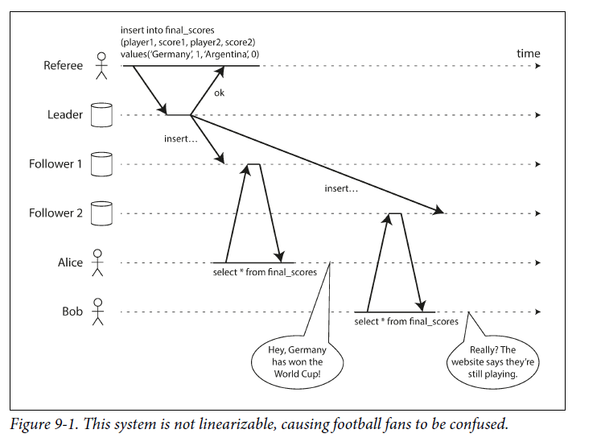
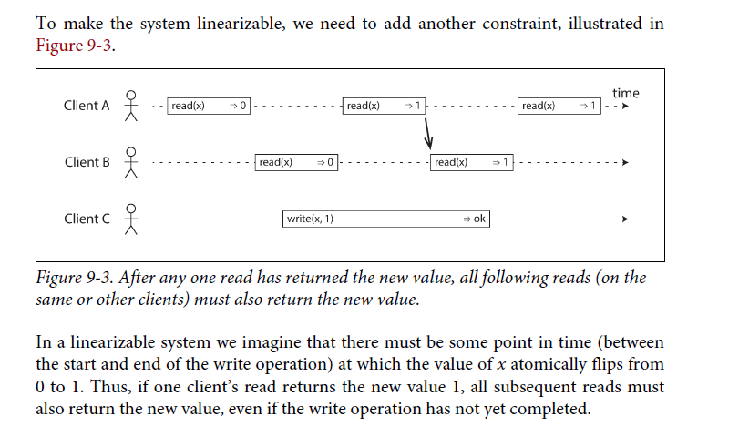
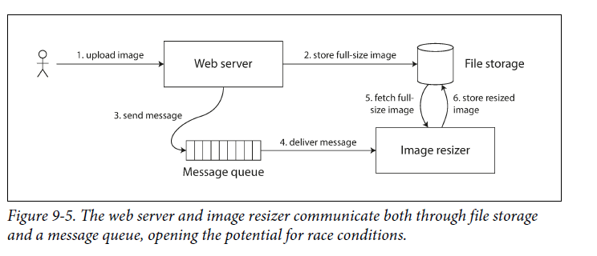
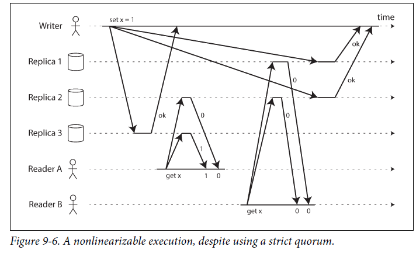
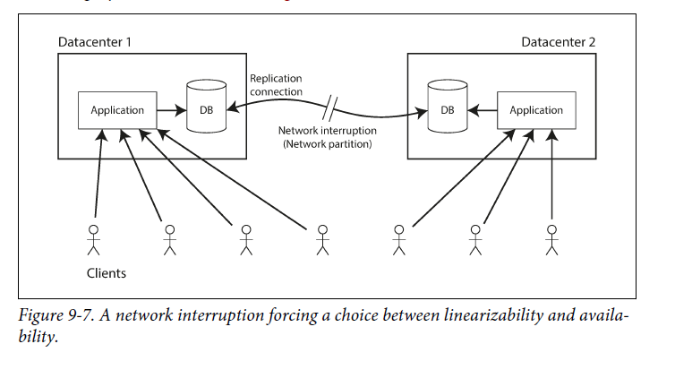

# Consistency and Consensus

### Building Fault-Tolerant Systems
- The Best/Ideal way to create fault-tolerant systems is to implement general-purpose abstractions with reliable guarantees and allow applications to depend on them.

### Consensus in Distributed Systems
- Consensus is critical in distributed systems, requiring all nodes to agree on something. Achieving consensus despite network issues and process failures is complex.

### Consistency Guarantees
- Most replicated databases provide *eventual consistency*, meaning if no new writes occur and enough time passes, all read requests will eventually return the same value. This temporary inconsistency resolves itself as systems converge to the same value.
- But how long will it take? 
- Stronger consistency models are explored, offering more guarantees but often at the cost of performance and fault tolerance. Choosing the right consistency model depends on your system’s needs.

# Linearizability
## What makes a System Linearizable
- one of the strongest consistency models
- give the illusion that there is only one replica
- Linearizability is a system's guarantee that once a write is completed, all subsequent reads will reflect that change. It provides a strong recency guarantee.
- In a linearizable system, the value of a variable, such as `x`, atomically flips from one state to another at a specific point in time, ensuring consistency across all reads after a successful write.

- NOT LINEARZABLE, 

- LINEARZABLE, 

## Serializability VS  Linearizability
- Serializability is an isolation property where transactions appear to execute in a serial order, even if they run concurrently. This ensures consistent outcomes as if each transaction ran to completion before the next began.
- It is okay for that serial order to be different from the order in which transactions were actually run

- Linearzability: It doesn’t group operations together into transactions, so it does not prevent problems such as write skew

- Serializability can be combined with linearizability, but they address different aspects of system behavior.

## Relying on Linearizability
- Locking and leader election: Systems like single-leader replication require linearizability to ensure that only one leader exists at a time (avoiding "split-brain" scenarios). Locking mechanisms or leader election processes help maintain this guarantee.
- Constraints and uniqueness guarantees: such as unique usernames in a database, rely on linearizability to prevent race conditions and ensure consistent data.
- Cross-Channel Timing Dependencies: Issues arise when timing dependencies exist across different systems, like ensuring a bank account balance doesn’t go negative or that two people don’t book the same seat. Linearizability helps prevent such inconsistencies by ensuring a single up-to-date value is always agreed upon by all nodes.

## Implementing Linearizable Systems
- **Single-Leader Replication**: (potentially linearizable) This method can be linearizable if implemented correctly.

- **Consensus Algorithms**: (linearizable) Algorithms like those used in ZooKeeper and etcd can safely implement linearizable storage. Consensus protocols contain measures to prevent split brain and stale replicas

- **Multi-Leader and Leaderless Replication**: (not linearizable) These approaches are generally not linearizable, with leaderless systems like those using Dynamo-style replication being particularly vulnerable to losing linearizability during concurrent writes or network partitions.

- **Leaderless Replication** :(probably not linearizable) 

### Linearizability and quorums

Intuitively, it seems as though strict quorum reads and writes should be linearizable in a Dynamo-style model. However, when we have variable network delays, it is possible to have race conditions, as demonstrated below.

Depending on the database, sometimes Quorum will guarantee linarizability at the cost of performance. 

### The Cost of Linearizability
- Linearizability is associated with performance penalties, particularly during network issues, which can cause delays or errors if replicas are disconnected.

- The CAP theorem highlights the trade-off between consistency, availability, and partition tolerance, emphasizing that in a network partition, you must choose between consistency and availability. Linearizability is often sacrificed in favor of better performance and availability in systems that don't require strict consistency.

### Linearizability and Network Delays
- However, there are now several copies of the data (one
in main memory, and perhaps several more in various caches), and these copies are
asynchronously updated, so linearizability is lost.
- reason for dropping linearizability is performance, not fault tolerance.
- Despite its benefits, linearizability is rare in practice due to its impact on performance. Even modern multi-core CPUs and many distributed databases opt for weaker consistency models to enhance speed and reduce latency.
- the response time of read and write requests is at least proportional to the uncertainty of delays in the network.

# Ordering Guarantees
linearizable - operations are executed in some well-defined order.
It turns out that there are deep connections between ordering, linearizability, and
consensus.
## Ordering and Causality
- Ordering helps preserve causality.
- A total order allows any two elements to be compared, so if you have two elements, you can always say which one is greater and which one is smaller.
- Ordering is crucial in preserving causality in distributed systems. 

### The causal order is not a total order
- In a linearizable system, a total order of operations ensures that causality is maintained. However, linearizability is not the only method to achieve this.
- Causal consistency is a strong consistency model that maintains causality without the performance drawbacks of linearizability, making it an attractive alternative for systems that need to remain available during network issues.

### Finalizing Order and Uniqueness Constraints
- To implement features like uniqueness constraints (e.g., unique usernames), it’s not enough to have a total order of operations; you also need to know when that order is finalized. This is where concepts like total order broadcast come into play, ensuring that once an order is decided, it remains consistent across the system.

### Total Order vs. Partial Order
- **Total Order**: Allows any two elements to be compared, so you can always determine which one is greater (e.g., natural numbers).
- **Partial Order**: Not all elements can be compared (e.g., mathematical sets). Some are incomparable, meaning they cannot be ordered relative to each other.

### Relationship Between Orders and Database Consistency Models
- **Linearizability**: 
  - A system has a total order of operations, where you can always say which operation happened first.
  - This total order is represented as a single timeline with no concurrency.
- **Causality**: 
  - Two operations are concurrent if neither happened before the other.
  - Causality defines a partial order, where some operations are ordered, but others are incomparable.

### Linearizability is stronger than causal consistency
- **Linearizability Implies Causality**: In a linearizable system, causality is preserved without additional mechanisms. This makes linearizable systems easier to understand.
- **Performance and Availability Trade-Off**: Linearizability can harm performance and availability, especially with network delays. Some systems abandon linearizability for better performance but become harder to manage.
- **Causal Consistency**: A middle ground that preserves causality without the performance hit of linearizability. It is the strongest consistency model that does not slow down due to network delays and remains available during network failures.

### Capturing Causal Consistency
- To maintain causality, the system needs to know the order of operations, which is a partial order. Concurrent operations can be processed in any order, but causally dependent operations must be processed in the correct sequence.
- **Sequence Numbers and Timestamps**: These can be used to create a total order consistent with causality. However, they may impose more ordering than necessary. Timestamp. logical clock, sequence numbers --> total 

If there is not a single leader (perhaps because you are using a multi-leader or leaderless database, or because the database is partitioned), it is less clear how to generate sequence numbers for operations. Various methods are used in practice:
- Odd Number/ Even Number
- Node A 1-1000, Node B 1001-2000
- Physical Time
However, they all have a problem: 
- the sequence numbers they generate are not consistent with causality.
- Timestamps from physical clocks are subject to clock skew,
- e sequence number is inconsistent
with causality.

### Lamport Timestamps
- **Purpose**: Provides a total order consistent with causality by using counters and node IDs.
- **Usage**: While similar to version vectors, Lamport timestamps enforce a total order but cannot distinguish between concurrent and causally dependent operations.

### Challenges with Non-Causal Sequence Number Generators
- **Inconsistency with Causality**: Methods like generating sequence numbers independently across nodes, using physical timestamps, or preallocating blocks of numbers can lead to sequences that are not consistent with causality.

### Challenges with Total Order and Uniqueness Constraints
- **Finalized Total Order**: For operations like creating unique usernames, it's not enough to have a total order; you must also know when that order is finalized. This prevents other nodes from inserting conflicting operations into the order.

### Total Order Broadcast
- **Definition**: Total order broadcast ensures that all messages are delivered to all nodes in the same order, maintaining consistency across replicas.

- Reliable delivery: No messages are lost: if a message is delivered to one node, it is delivered to all
nodes.
- Totally ordered delivery: Messages are delivered to every node in the same order.

messages are sequentially numbered in
the order they appear in the log. The sequence number can then serve as a fencing
token, because it is monotonically increasing. In ZooKeeper, this sequence number is
called zxid
- **Applications**: It’s crucial for database replication and implementing serializable transactions. It’s also used to implement services like lock management.
- **Comparison with Linearizability**: While total order broadcast guarantees message order, linearizability also guarantees that reads see the latest write, which is not inherently provided by total order broadcast.

1. Append a message to the log, tentatively indicating the username you want to
claim.
2. Read the log, and wait for the message you appended to be delivered back to
you.xi
3. Check for any messages claiming the username that you want. If the first message
for your desired username is your own message, then you are successful: you can
commit the username claim (perhaps by appending another message to the log)
and acknowledge it to the client. If the first message for your desired username is
from another user, you abort the operation. 

### Implementing Linearizability Using Total Order Broadcast
- **Steps**: To implement linearizable operations, such as ensuring unique usernames, you can use total order broadcast to sequence operations and resolve conflicts based on the order in which messages are delivered.

# Distributed Transactions and Consensus

## Consensus
- **Consensus** is a fundamental problem in distributed systems where the goal is for multiple nodes (computers) to agree on a single value or course of action. This is critical for the consistency and reliability of distributed systems.
- Achieving consensus is challenging because nodes might fail, messages might get lost, or the system might experience network partitions.

## Importance of Consensus
- **Leader Election**: In systems with a single-leader replication model, consensus is necessary to ensure that all nodes agree on which node is the leader. This prevents issues like split-brain scenarios, where two nodes mistakenly believe they are the leader, leading to data inconsistencies.
- **Atomic Commit**: In databases that support transactions across multiple nodes, consensus ensures that all nodes either commit or abort a transaction. This prevents situations where some nodes commit while others abort, which would violate the atomicity (all-or-nothing) property of transactions.

## The Impossibility of Consensus
- **FLP Result**: The FLP (Fischer, Lynch, and Paterson) result states that in an asynchronous system (where there's no guarantee on message delivery time), it is impossible to design an algorithm that always reaches consensus if there's even one faulty node.
- **Practical Consensus**: Despite the FLP result, consensus can often be achieved in practice by relaxing some assumptions, like allowing timeouts or randomness in the algorithm.

## Atomic Commit and Two-Phase Commit (2PC)
- **Atomic Commit**: Ensures that all nodes in a distributed transaction either commit or abort, maintaining atomicity.
- **Two-Phase Commit (2PC)**: A widely used protocol to achieve atomic commit across multiple nodes. It involves:
  1. **Phase 1 (Prepare Phase)**: The coordinator asks all participants (nodes) if they can commit.
  2. **Phase 2 (Commit Phase)**: If all participants agree, the coordinator sends a commit request; otherwise, it sends an abort request.
- **Coordinator Failure**: A key drawback of 2PC is that if the coordinator fails after receiving "yes" votes but before sending commit/abort requests, the participants are left in an uncertain state, leading to potential blocking.

## Three-Phase Commit (3PC)
- **Non-Blocking Protocol**: 3PC was proposed as a solution to the blocking problem in 2PC, but it assumes a more reliable network and nodes, which is often impractical.
- **Continued Use of 2PC**: Due to the limitations of 3PC in real-world scenarios, 2PC remains widely used despite its shortcomings.

# Distributed Transactions in Practice

## Overview
Distributed transactions, especially those implemented with two-phase commit (2PC), have a mixed reputation. While they provide crucial safety guarantees, they are often criticized for causing operational challenges, degrading performance, and sometimes promising more than they can deliver. Due to these drawbacks, many cloud services opt not to implement distributed transactions.

## Types of Distributed Transactions
- **Database-Internal Distributed Transactions**:
  - Supported by some distributed databases that use replication and partitioning, such as VoltDB and MySQL Cluster’s NDB storage engine.
  - In these cases, all participating nodes run the same database software, allowing for protocol optimizations specific to that technology.
  - These transactions can often perform well, thanks to the homogeneity of the systems involved.
  
- **Heterogeneous Distributed Transactions**:
  - Involve transactions across two or more different technologies, such as databases from different vendors or combinations of databases and message brokers.
  - These transactions must ensure atomic commit across systems that may have entirely different internal architectures and protocols, making them much more challenging to implement and manage.

## Performance and Operational Issues
- **Performance Penalties**:
  - Distributed transactions can significantly impact performance. For example, distributed transactions in MySQL have been reported to be more than 10 times slower than single-node transactions.
  - The performance hit mainly stems from additional disk operations, such as fsyncs for ensuring crash recovery, and the extra network round-trips required for coordination.

- **Operational Challenges**:
  - Distributed transactions, particularly those using 2PC, can introduce significant operational challenges. These include complex failure recovery processes, increased system complexity, and the potential for in-doubt transactions that block progress.

## Exactly-Once Message Processing
- Heterogeneous distributed transactions enable powerful integrations across diverse systems. For example:
  - A message from a message queue can be acknowledged as processed only if the associated database transaction was successfully committed, ensuring exactly-once message processing.
  - This is achieved by atomically committing both the message acknowledgment and the database writes within a single transaction.
  - If either the message delivery or the database transaction fails, both operations are aborted, allowing the message broker to safely retry message delivery without risk of duplication.

- **Limitations**:
  - Exactly-once processing is only possible if all systems involved support the same atomic commit protocol, like 2PC.
  - If one of the systems, such as an email server, does not support the protocol, inconsistencies like duplicate email sends can occur.

## XA Transactions
- **X/Open XA**:
  - XA (eXtended Architecture) is a standard introduced in 1991 for implementing two-phase commit across heterogeneous technologies.
  - It is widely implemented across many relational databases (e.g., PostgreSQL, MySQL, DB2, SQL Server, Oracle) and message brokers (e.g., ActiveMQ, HornetQ, MSMQ, IBM MQ).
  - XA defines a C API for interfacing with a transaction coordinator, with bindings available for other programming languages (e.g., Java Transaction API for Java EE applications).

- **Coordinator Implementation**:
  - The transaction coordinator is often a library within the application process that manages the transaction.
  - It tracks the participants in a transaction, collects their responses, and logs the commit/abort decisions for crash recovery.
  - If the application or machine crashes, the coordinator’s log is essential for recovering the transaction state and resolving any in-doubt transactions.

## Challenges of Distributed Transactions
- **Locks During In-Doubt Transactions**:
  - When a transaction is in doubt, it holds locks on database rows it has modified. These locks cannot be released until the transaction is resolved.
  - If the coordinator crashes and takes time to recover, these locks can block other transactions from accessing the affected rows, leading to potential system-wide stalls.

- **Coordinator Failure**:
  - If the coordinator crashes before resolving all transactions, in-doubt transactions can persist indefinitely, holding locks
