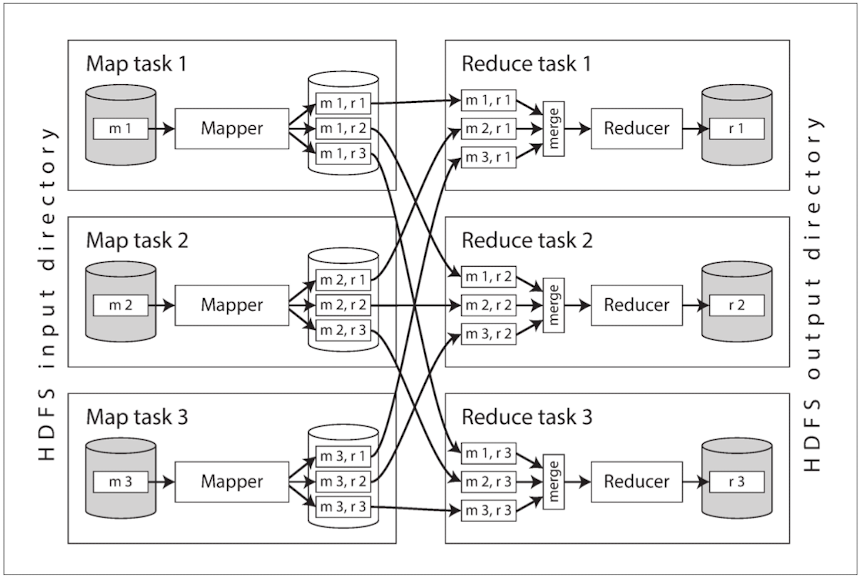
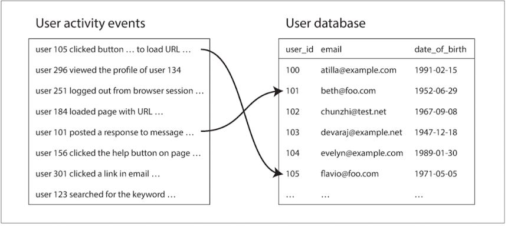
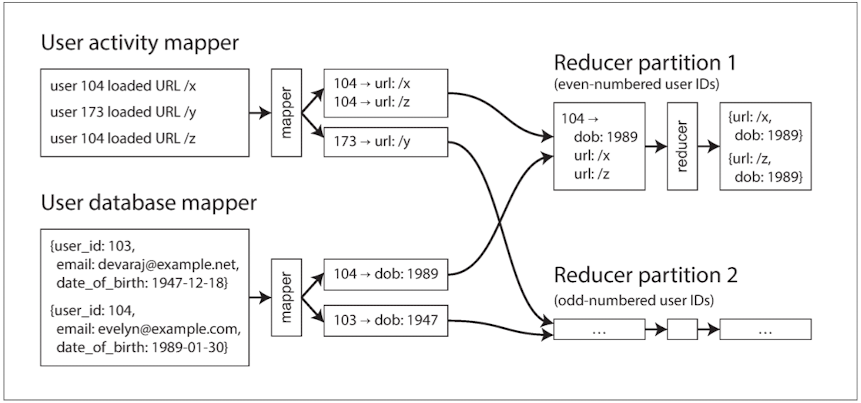

# 10 Batch Processing
## MapReduce and Distributed Filesystems
- HDFS is based on the shared-nothing principle
  - Each node uses its CPUs, RAM, and disks independently
- HDFS conceptually creates one big filesystem that can use the space on the disks of all machines running the daemon.

### MapReduce Job Execution
Simple Log Analysis

| Step                                                       | Unix Shell                                                             | MapReduce                                                                  |
|------------------------------------------------------------|------------------------------------------------------------------------|----------------------------------------------------------------------------|
| 1. Read the log file                                       | cat/var/log/nginx/access.log                                           | Read a set of input files                                                  |
| 2. Split each line                                         | awk 'print $7'                                                         | Call the mapper function to extract a key and value from each input record |
| 3. Alphabetically Sort                                     | sort                                                                   | Sort all of the key-value pairs by key                                     |
| 4. Filter out repeated lines and output a counter (-c)     | uniq -c                                                                | Call the reducer function to iterate over the sorted key-value pairs       |
| 5. Second sorts by the number (-n) with reverse order (-r) | sort -r -n                                                             |                                                                            |
| 6. Head outputs just the first five lines (-n 5)           | head -n 5                                                              |                                                                            |

| Input lines                                                                                                                                                                                                                                        | Result Lines                                                           |
|----------------------------------------------------------------------------------------------------------------------------------------------------------------------------------------------------------------------------------------------------|------------------------------------------------------------------------|
| 216.58.210.78 - - [27/Feb/2015:17:55:11 +0000] "GET /css/typography.css HTTP/1.1" 200 3377 "http://martin.kleppmann.com/" "Mozilla/5.0 (Macintosh; Intel Mac OS X10_9_5) AppleWebKit/537.36 (KHTML, like Gecko) Chrome/40.0.2214.115Safari/537.36" | 4189 /favicon.ico                                                      |
| ~ ~ ~ ~ ~ ~ /2013/05/24/improving-security-of-ssh-private-keys.html ~                                                                                                                                                                              | 3631 /2013/05/24/improving-security-of-ssh-private-keys.html           |
| ~ ~ ~ ~ ~ ~ /2012/12/05/schema-evolution-in-avro-protocol-buffers-thrift.html ~                                                                                                                                                                    | 2124 /2012/12/05/schema-evolution-in-avro-protocol-buffers-thrift.html |
| ~ ~ ~ ~ ~ ~ / ~                                                                                                                                                                                                                                    | 1369 /                                                                 |
| ~ ~ ~ ~ ~ ~ /css/typography.css ~                                                                                                                                                                                                                  | 915 /css/typography.css                                                |

- Mapper: The mapper is called once for every input record, and its job is to extract the key and value from the input record. For each input, it may generate any number of key-value pairs (including none). It does not keep any state from one input record to the next, so each record is handled independently.
- Reducer: The MapReduce framework takes the key-value pairs produced by the mappers, collects all the values belonging to the same key, and calls the reducer with an iterator over that collection of values. The reducer can produce output records (such as the number of occurrences of the same URL).

#### Distributed execution of MapReduce
- **MapReduce Query Example**
- Ex) PostgreSQL 
```
SELECT date_trunc('month', observation_timestamp) AS observation_month, sum(num_animals) AS total_animals 
  FROM observations 
  WHERE family = 'Sharks' 
  GROUP BY observation_month;
``` 
- Ex) MongoDB’s MapReduce
```
db.observations.mapReduce(     
  function map() {
    var year  = this.observationTimestamp.getFullYear();
    var month = this.observationTimestamp.getMonth() + 1;
    emit(year + "-" + month, this.numAnimals);
  },     
  function reduce(key, values) {
    return Array.sum(values);
  },
  {
    query: { family: "Sharks" },
    out: "monthlySharkReport"
  } 
);
```


#### MapReduce workflows (Map -> Shuffle -> Reduce -> Map ...)
- Chained MapReduce jobs are therefore less like pipelines of Unix commands 
  - (which pass the output of one process as input to another process directly, using only a small in-memory buffer) 
- and more like a sequence of commands where each command’s output is written to a temporary file, and the next command reads from the temporary file.

-  Workflows consisting of 50 to 100 MapReduce jobs are common when building recommendation systems, 
- and in a large organization, many different teams may be running different jobs that read each other’s output.

### Reduce-Side Joins and Grouping
- MapReduce has no concept of indexes—at least not in the usual sense. -> Need full table scan
- When we talk about joins in the context of batch processing, we mean resolving all occurrences of some association within a dataset. 
  - For example, we assume that a job is processing the data for all users simultaneously, not merely looking up the data for one particular user

#### Example: analysis of user activity events

1. Option 1
   - Go over the activity events one by one and query the user database (on a remote server) for every user ID
2. Option 2
   - A better approach would be to take a copy of the user database and  to put it in the same distributed filesystem

#### Sort-merge joins -> Bringing related data together in the same place == GROUP BY
- Example of A reduce-side sort-merge join


#### Handling skew
- Such disproportionately active database records are known as linchpin objects or hot keys.
- If a join input has hot keys, there are a few algorithms you can use to compensate.
  - For example, the skewed join method in Pig first runs a sampling job to determine which keys are hot.
    - the mappers send any records relating to a hot key to one of several reducers, chosen at random (in contrast to conventional MapReduce)
  - This technique spreads the work of handling the hot key over several reducers, which allows it to be parallelized better, 
    - at the cost of having to replicate the other join input to multiple reducers.
  - Hive’s skewed join optimization takes an alternative approach. It requires hot keys to be specified explicitly in the table metadata, 
    - and it stores records related to those keys in separate files from the rest.

### Map-Side Joins
- Reduce-side joins -> Extracting the key and value from each input record, assigning the key-value pairs to a reducer partition, and sorting by key.
  - All that sorting, copying to reducers, and merging of reducer inputs can be quite expensive.
- Map-side joins -> Each mapper simply reads one input file block from the distributed filesystem and writes one output file to the filesystem
  - Broadcast hash joins
    - The dataset needs to be small enough that it can be loaded entirely into memory in each of the mappers.
  - Partitioned hash joins
    - If the inputs to the map-side join are partitioned in the same way, then the hash join approach can be applied to each partition independently.
  - Map-side merge joins
    - Another variant of a map-side join applies if the input datasets are not only partitioned in the same way, but also sorted based on the same key. 
    - In this case, it does not matter whether the inputs are small enough to fit in memory


> - The two main problems that distributed batch processing frameworks need to solve are both Partitioning and Fault tolerance.
> - Distributed batch processing engines have a deliberately restricted programming model: 
>   - callback functions (such as mappers and reducers) are assumed to be stateless and to have no externally visible side effects besides their designated output.