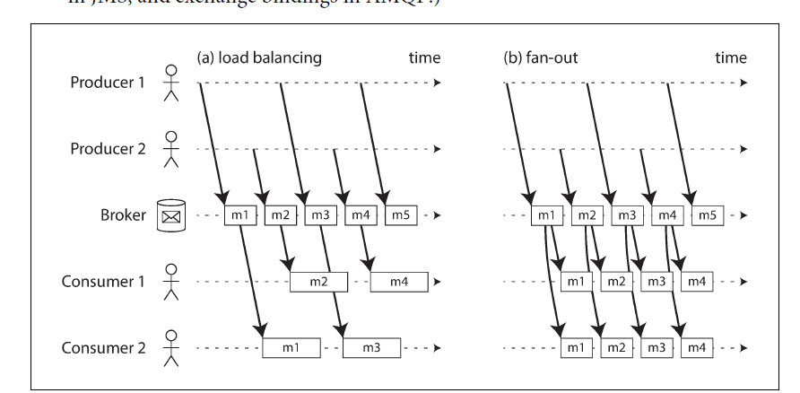
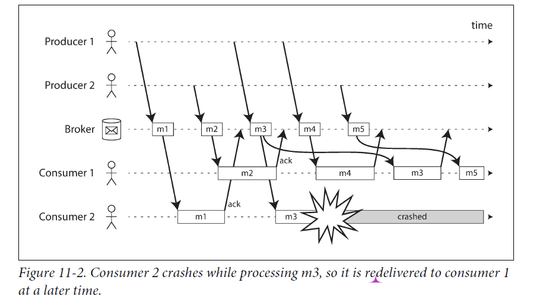
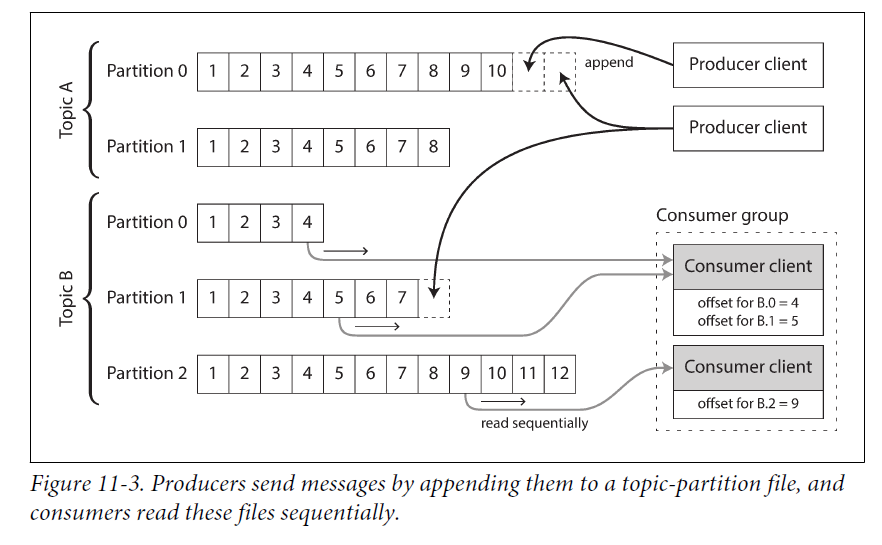

# Detailed Breakdown of Systems and Stream Processing

## 1. Evolution of Systems
- **Simple to Complex Systems:**
  - Complex systems that work have typically evolved from simpler systems that also worked.
  - Attempting to design a complex system from scratch often results in failure, as the complexities cannot be fully anticipated.

## 2. Batch Processing
- **Definition:**
  - Batch processing involves reading a set of files as input and producing a new set of files as output. The output is a form of derived data, which can be recreated by re-running the batch process.
- **Key Characteristics:**
  - **Bounded Data:** Assumes input data is of a known, finite size, allowing the process to know when it has completed.
  - **Processing Delay:** Output reflects changes only after the entire batch is processed, leading to delays. For example, processing a day’s worth of data at the end of the day.
- **Applications:**
  - Commonly used for creating search indexes, recommendation systems, analytics, etc.

## 3. Stream Processing
- **Definition:**
  - Stream processing handles unbounded data that arrives incrementally over time, processing each event as it happens.
- **Key Characteristics:**
  - **Unbounded Data:** Data continuously arrives over time, without a known end.
  - **Low-Latency Processing:** Stream processing can be run continuously or at frequent intervals to reduce delays and provide real-time processing.
- **Examples:**
  - User actions such as viewing a page or making a purchase.
  - Machine-generated data like sensor measurements or CPU utilization metrics.

## 4. Messaging Systems
- **Purpose:**
  - Messaging systems help manage the flow of data between producers (which generate events) and consumers (which process events).
- **Direct Messaging:**
  - **Description:** Involves direct communication between producers and consumers, without intermediary nodes.
  - **Examples:** UDP multicast, brokerless messaging libraries like ZeroMQ, direct HTTP or RPC requests.
  - **Limitations:** Requires application code to handle potential message loss and assumes producers and consumers are always online.
  
- **Message Brokers:**
  - **Description:** Acts as intermediaries, storing messages and managing their delivery to consumers.
  - **Advantages:**
    - **Durability:** Messages can be written to disk to prevent loss during crashes.
    - **Reliability:** Can tolerate client crashes or disconnections, managing retries and redeliveries.
    - **Scalability:** Allows multiple producers and consumers, supporting patterns like load balancing and fan-out.
  - **Challenges:**
    - **Queueing:** Messages are queued and processed asynchronously, potentially leading to delays.
    - **Message Reordering:** When a consumer crashes, undelivered messages may be redelivered out of order.
  - **Examples:** RabbitMQ, ActiveMQ, Kafka.
  
- **Message Delivery Patterns:**
  - **Load Balancing:**
    - Each message is delivered to one of the consumers, allowing the work to be shared.
    - Useful for expensive-to-process messages.
  - **Fan-Out:**
    - Each message is delivered to all consumers, allowing multiple independent consumers to receive the same data.

## 5. Comparison of Messaging Systems and Databases
- **Databases:**
  - Typically store data until explicitly deleted.
  - Support querying and indexing, with point-in-time snapshots.
- **Message Brokers:**
  - Automatically delete messages after delivery.
  - Optimized for streaming data with notification mechanisms.
  - Can participate in distributed transactions but generally have different performance characteristics than databases.

## 6. Handling Failures
- **Acknowledgments:**
  - Consumers acknowledge message processing, allowing the broker to remove the message from the queue.
- **Redelivery:**
  - If a consumer crashes before acknowledging, the broker redelivers the message to another consumer.
- **Message Reordering:**
  - Redelivery can cause messages to be processed out of the original order, which can be problematic for applications with dependencies between messages.  To avoid this issue, you can use a separate queue per consumer (i.e., not use the load balancing feature).

# Partitioned Logs

## 1. Transient Operations vs. Durable Storage
- **Transient Operations:**
  - Sending packets over a network or making a network service request is usually a transient operation with no permanent trace.
  - Though possible to record these permanently (e.g., packet capture), it's not the default mindset.
  - Even durable message brokers (e.g., AMQP, JMS) tend to delete messages after they are delivered, reinforcing a transient messaging approach.

- **Durable Storage:**
  - Databases and filesystems operate with the opposite mindset, where data is expected to be permanently recorded until explicitly deleted.
  - This approach allows for repeated batch processing without damaging the original data, unlike transient messaging.

## 2. The Hybrid Approach: Log-Based Message Brokers
- **Concept:**
  - Combines the durability of databases with the low-latency notification of messaging systems.
  - A **log** is an append-only sequence of records on disk, used here to implement message brokers.
  
- **Functionality:**
  - **Producers** send messages by appending them to the end of the log.
  - **Consumers** receive messages by reading the log sequentially.
  - If a consumer reaches the end of the log, it waits for notification of new messages.
  - Partitioning can be used to scale throughput by dividing the log across multiple machines.

- **Log Structure:**
  - Each log partition has a monotonically increasing sequence number (offset) for each message.
  - This sequence number allows total ordering within a partition, though no ordering is guaranteed across partitions.
  
- **Examples of Log-Based Message Brokers:**
  - **Apache Kafka**
  - **Amazon Kinesis Streams**
  - **Twitter’s DistributedLog**
  - **Google Cloud Pub/Sub** (architecturally similar but uses a JMS-style API)

## 3. Logs vs. Traditional Messaging
- **Fan-Out Messaging:**
  - Supports multiple consumers reading the same log independently without deleting messages from the log.
  
- **Load Balancing:**
  - Partitions can be assigned to different consumer nodes for parallel processing.
  - Single-threaded processing within a partition is preferable, but it limits the number of consumers to the number of partitions.

- **Challenges with Traditional Messaging:**
  - Traditional brokers assign individual messages to consumers, which can lead to head-of-line blocking if a message is slow to process.
  - JMS/AMQP-style brokers are preferable when message-by-message parallelism is needed.

## 4. Consumer Offsets
- **Offset Management:**
  - Consumers track their progress using offsets, simplifying the process of determining which messages have been processed.
  - Reduced bookkeeping and opportunities for batching increase throughput.
  
- **Failure Handling:**
  - If a consumer fails, another can take over using the last recorded offset, potentially reprocessing some messages.
  
## 5. Disk Space Usage
- **Log Segmentation:**
  - Logs are divided into segments, with old segments deleted or archived to free up disk space.
  - Slow consumers that fall behind may miss messages if the segments they need have been deleted.

- **Buffering:**
  - The log functions as a bounded-size buffer, typically large enough to store several days or weeks of messages.
  - Throughput remains constant, unlike systems that slow down when messages are written to disk.

- **Monitoring:**
  - Systems monitor how far consumers are behind the head of the log to prevent missing messages.

## 6. Replaying Old Messages
- **Non-Destructive Processing:**
  - Unlike AMQP/JMS brokers, consuming messages in a log-based broker doesn’t delete them, enabling replay.
  - Consumers can reset their offsets to reprocess messages, allowing experimentation and easier recovery from errors.
  
- **Comparison to Batch Processing:**
  - Similar to batch processing, where derived data is separated from input data, enabling repeatable transformations.
  - This approach supports greater experimentation and resilience in data processing workflows.

# Databases and Streams

## 1. Bridging Databases and Message Brokers
- **Traditional Separation:**
  - Historically, databases and message brokers have been considered distinct tools with separate purposes.
  
- **Log-Based Message Brokers:**
  - These brokers take ideas from databases (e.g., durability and consistency) and apply them to messaging systems.
  - Examples include **Apache Kafka**, **Amazon Kinesis Streams**, and **Twitter’s DistributedLog**.
  
- **Reverse Approach:**
  - Ideas from messaging and streams can also be applied to databases.
  - A **replication log** is a stream of database write events, where followers replicate these events to maintain an accurate copy of the database.

## 2. Streams and State Machine Replication
- **Event Streams:**
  - An event is a record of something that happened at a specific time, which could be a user action, sensor reading, or a database write.
  
- **State Machine Replication:**
  - If every replica processes the same events in the same order, they will reach the same final state.
  - This principle connects streams and databases fundamentally.

## 3. Keeping Systems in Sync

### 3.1 The Problem: Heterogeneous Data Systems
- **Diverse Technologies:**
  - Most applications use multiple technologies to meet various needs, such as:
    - **OLTP databases** for user requests.
    - **Caches** for speeding up common requests.
    - **Full-text indexes** for search queries.
    - **Data warehouses** for analytics.
  
- **Data Synchronization:**
  - Multiple copies of data are stored in different systems, each optimized for its own purpose.
  - Synchronization is crucial to keep these systems consistent with each other.

### 3.2 Common Approaches to Synchronization
- **ETL Processes:**
  - Data warehouses are usually synchronized with ETL processes, often involving a full copy of the database, transformation, and bulk-loading.
  
- **Dual Writes:**
  - Another approach is to have application code write to each system concurrently (e.g., database, search index, cache).
  - However, this method has serious challenges, such as race conditions and inconsistency issues.

### 3.3 Problems with Dual Writes
- **Race Condition:**
  - If two clients concurrently update an item, they might do so in different orders in different systems (e.g., database vs. search index), leading to inconsistencies.

- **Fault Tolerance Issues:**
  - One write operation might succeed while the other fails, creating inconsistency between systems.
  - Ensuring both succeed or fail together involves solving the **atomic commit problem**, which is complex and expensive.

## 4. Potential Solution: Single Leader with Followers
- **Single Leader Approach:**
  - If there were a single leader (e.g., the database) and other systems (e.g., search index) could follow it, inconsistencies could be reduced.
  - The challenge is implementing this in practice, given the complexity of multi-leader systems and the need for synchronization.

# Change Data Capture (CDC)

## 1. Challenges with Replication Logs
- **Internal Implementation Detail:**
  - Historically, replication logs were considered an internal feature of databases, not intended for public use.
  - As a result, there was no straightforward way to extract changes from the database to replicate them to other systems.

## 2. Introduction to Change Data Capture (CDC)
- **What is CDC?**
  - CDC is the process of observing and capturing all changes made to a database, typically in real-time.
  - This captured data can be streamed to other systems, such as search indexes or caches, ensuring they reflect the current state of the database.

- **Derived Data Systems:**
  - Systems like search indexes or data warehouses can be seen as derived data systems, consuming the change stream to maintain consistency with the primary database.

- **Log-Based Message Brokers:**
  - A log-based message broker, such as **Apache Kafka**, is well-suited for transporting change events as it preserves the order of changes.

## 3. Implementing Change Data Capture
- **Triggers:**
  - Database triggers can be used for CDC by logging changes to a changelog table.
  - However, triggers can be fragile and may introduce performance overheads.

- **Parsing the Replication Log:**
  - An alternative approach is to parse the database’s replication log, although this can be challenging, especially with schema changes.

- **Examples of CDC Implementations:**
  - **LinkedIn’s Databus**, **Facebook’s Wormhole**, **Yahoo!’s Sherpa**: Large-scale CDC implementations.
  - **Bottled Water** for PostgreSQL, **Maxwell** and **Debezium** for MySQL, **Mongoriver** for MongoDB, **GoldenGate** for Oracle.

## 4. Handling Replication Lag
- **Asynchronous CDC:**
  - CDC is typically asynchronous, meaning the database does not wait for changes to be applied to all consumers before committing them.
  - This approach reduces the impact of slow consumers but introduces issues with replication lag.

## 5. Initial Snapshot
- **Need for Initial Snapshot:**
  - A snapshot of the entire database state is often necessary when setting up new derived systems.
  - The snapshot must correspond to a known position in the change log to ensure consistency when applying subsequent changes.

- **Integrated Snapshots:**
  - Some CDC tools include snapshot functionality, while others require this as a manual step.

## 6. Log Compaction
- **Compaction for Efficiency:**
  - To avoid keeping the entire log history, log compaction can be used to keep only the most recent update for each key.
  - This method reduces the need for frequent snapshots, as the compacted log contains the latest state of the database.

- **Usage in Apache Kafka:**
  - Kafka supports log compaction, allowing it to be used for durable storage, not just transient messaging.

## 7. API Support for Change Streams
- **Emerging Support:**
  - Databases are increasingly supporting change streams as a native interface, rather than relying on retrofitted CDC solutions.

- **Examples of API Support:**
  - **RethinkDB** allows queries to subscribe to changes.
  - **Firebase** and **CouchDB** offer data synchronization based on change feeds.
  - **Meteor** uses MongoDB’s oplog for real-time updates.
  - **VoltDB** exports data continuously as a stream, with consumers able to asynchronously process this stream.
  - **Kafka Connect** aims to integrate CDC tools with Kafka for a wide range of databases.

### Event Sourcing

Event sourcing is a technique closely related to concepts in domain-driven design (DDD) and stream processing. It involves storing all changes to an application's state as a series of immutable events in a log, rather than just keeping the latest state. This approach contrasts with change data capture (CDC), where the database is updated in a traditional mutable fashion, and changes are later extracted as a log of state transitions. Event sourcing operates at a higher level of abstraction by treating each change as a meaningful event that represents a user's action or intent.

### Key Concepts and Benefits

1. **Immutable Events**: Events in event sourcing are immutable and are stored in an append-only log. Each event captures a specific action taken by a user, such as "student canceled their course enrollment." This captures intent rather than just the side effects in the database, making it easier to understand the sequence of actions that led to the current state.

2. **Reconstructing State**: The current state of the system is derived by replaying the event log. This allows for a flexible data model where the same sequence of events can be used to generate multiple views of the data, making it easier to introduce new features without altering the existing system.

3. **Advantages of Immutability**: Immutability helps in debugging and provides a clear audit trail of what has happened in the system. This is especially useful in financial systems where maintaining a detailed history of transactions is crucial. In non-financial systems, it can help in understanding user behavior, such as tracking items added and removed from a shopping cart.

4. **Concurrency and Responsiveness**: One challenge with event sourcing is that consumers of the event log might read a stale state if their read operation happens before the event log has been fully processed. However, since events are processed in a serial order within a partition, this can simplify concurrency control, especially when events are processed in a single-threaded manner per partition.

5. **Limitations and Challenges**: While event sourcing offers many benefits, there are challenges associated with keeping an immutable history, such as dealing with large datasets where the log grows indefinitely. Additionally, regulatory requirements may necessitate the deletion of certain data, which contradicts the principle of immutability. Techniques like excision or shunning can help address these situations, but they require careful implementation.

### Practical Applications

Event sourcing is particularly useful in systems where maintaining a detailed history of events is essential, such as in financial systems, analytics, or any application where the ability to replay and understand the full history of actions is important. Specialized databases, such as Event Store, are designed to support event sourcing, but the approach can also be implemented using conventional databases or log-based message brokers.

### Conclusion

Event sourcing is a powerful technique for building systems that need to maintain a clear history of changes and support flexible data modeling. It leverages the principles of immutability and stream processing to provide a robust and auditable architecture, although it comes with certain challenges that need to be managed carefully.

### State, Streams, and Immutability

- **Batch Processing and Immutability**
  - Immutability allows safe experimentation on existing input files.
  - Event sourcing and change data capture rely on immutability.

- **Databases and State**
  - Databases typically store the current state of an application.
  - State changes through updates, deletions, and insertions.
  - Immutable event logs can coexist with mutable state.

- **Mutable State and Immutable Event Logs**
  - State is the result of events over time (e.g., reservations, account balances).
  - Mutable state and an immutable append-only log of events are two sides of the same coin.
  - Storing the changelog durably makes the state reproducible.
  - **Pat Helland's Perspective:**
    - Transaction logs record all database changes.
    - The database is a cached subset of the log, representing the latest values.
  - **Log Compaction:** Retains only the latest version of each record.

### Advantages of Immutable Events

- **Historical Precedent**
  - Immutability is an established concept, particularly in accounting.
  - Accountants record transactions in an append-only ledger.

- **Auditability**
  - Immutability aids in diagnosing and recovering from issues.
  - Immutable events capture more information than just the current state.

- **Analytics and User Behavior**
  - Immutable logs can track user behavior that would be lost in mutable databases.

### Deriving Multiple Views from the Same Event Log

- **Read-Oriented Representations**
  - Immutable event logs allow for multiple read-oriented views.
  - Example: Druid analytic database, Pistachio key-value store, Kafka Connect.

- **Application Evolution**
  - Separating event logs from databases simplifies evolving applications.
  - New features can use the event log to build read-optimized views.

- **Flexibility in Data Storage**
  - Storing data without considering query patterns simplifies schema design.
  - **Command Query Responsibility Segregation (CQRS):** Allows separation of write and read forms.

### Concurrency Control

- **Asynchronous Consumers**
  - Event log consumers are usually asynchronous, leading to potential delays in read views.
  - Solutions:
    - Synchronous updates with the event log.
    - Single write append to the log, making it easy to make atomic.

- **Simplified Concurrency**
  - Event logs simplify concurrency control by defining a serial order of events.
  - Partitioned logs and application state reduce the need for complex concurrency mechanisms.

### Limitations of Immutability

- **Use of Immutability Beyond Event Sourcing**
  - Databases and version control systems use immutability to preserve history.

- **Challenges of Keeping an Immutable History**
  - Datasets with high churn may have large immutable histories, complicating storage.
  - **Compaction and Garbage Collection:** Critical for managing large immutable histories.

- **Data Deletion and Privacy**
  - Some scenarios require data deletion despite immutability (e.g., privacy regulations).
  - Systems like Datomic and Fossil have features to handle such deletions.
  - **Difficulty of Deletion:** Copies of data may exist in multiple locations, making true deletion challenging.

# Stream Processing Overview

## Processing Streams to Produce Derived Streams
- **Operators/Jobs**: Process input streams to produce output streams.
- **Pipelines**: Data flows through multiple processing stages.

## Key Characteristics
- **Unbounded Nature**: Streams are infinite; sorting and certain joins are not applicable.
- **Fault Tolerance**: Must handle long-running processes and potential failures.

## Applications
- **Fraud Detection**: Identifying unusual credit card usage.
- **Trading Systems**: Executing trades based on real-time market data.
- **Manufacturing**: Monitoring machinery for malfunctions.
- **Military/Intelligence**: Tracking and responding to potential threats.

## Complex Event Processing (CEP)
- **Pattern Matching**: Identifies patterns in event streams using declarative queries.
- **Systems**: Esper, IBM InfoSphere Streams, Apama, TIBCO StreamBase, SQLstream.

## Stream Analytics
- **Focus**: Aggregations and statistical metrics over time.
- **Tasks**: Measuring event rates, calculating rolling averages, comparing current and historical data.
- **Frameworks**: Apache Storm, Spark Streaming, Flink, Concord, Samza, Kafka Streams.
- **Hosted Services**: Google Cloud Dataflow, Azure Stream Analytics.

## Maintaining Materialized Views
- **Event Sourcing**: Maintaining application state with event logs.
- **Materialized Views**: Keeping derived systems updated with real-time changes.
- **Frameworks**: Samza, Kafka Streams.

## Search on Streams
- **Use Cases**: Media monitoring, real estate alerts.
- **Implementation**: Elasticsearch’s percolator feature.

## Message Passing and RPC
- **Differences**: 
  - **Actor Frameworks**: Manage concurrency and communication.
  - **Stream Processing**: Focuses on data management through pipelines.
- **Example**: Apache Storm supports distributed RPC.

## Reasoning About Time
- **Event Time vs. Processing Time**: Challenges with event ordering and system clocks.
- **Handling Stragglers**: Deciding when to finalize results with delayed events.

## Types of Windows
- **Tumbling Window**: Fixed size, non-overlapping intervals.
- **Hopping Window**: Fixed size with overlapping intervals.
- **Sliding Window**: Interval-based, events within a time range.
- **Session Window**: Variable duration based on activity periods.

# Stream Joins and Fault Tolerance

## Types of Joins in Stream Processing

### Stream-Stream Join (Window Join)
- **Use Case**: Detect trends in search results by joining search and click events.
- **Challenge**: Events can arrive out of order or with variable delays.
- **Implementation**: Maintain state of events within a time window (e.g., 1 hour). Join events with the same session ID and handle cases where events may expire without matching.

### Stream-Table Join (Stream Enrichment)
- **Use Case**: Enrich activity events with user profile data.
- **Challenge**: Maintain an up-to-date local copy of the database to avoid slow remote queries.
- **Implementation**: Use a changelog to update the local copy of the database. Join stream events with the local database state.

### Table-Table Join (Materialized View Maintenance)
- **Use Case**: Maintain a user timeline by updating tweets and follow relationships.
- **Implementation**: Maintain a cache of timelines, update on new tweets, deletions, and changes in follow relationships.
- **Process**: Join changes from tweets and follow events to keep the cache updated, similar to running a SQL query on live data.

## Time-Dependence of Joins
- **Issue**: Ordering of events and state changes can affect the join results.
- **Challenges**: Handling updates to state, such as tax rates or user profiles, and ensuring deterministic joins.

## Fault Tolerance

### Microbatching and Checkpointing
- **Microbatching**: Break streams into small batches (e.g., 1 second) for processing.
- **Checkpointing**: Periodically save state to durable storage (e.g., HDFS) and recover from checkpoints if a failure occurs.
- **Goal**: Ensure exactly-once semantics within the stream processing framework.

### Atomic Commit
- **Purpose**: Ensure all outputs and side effects are applied atomically.
- **Implementation**: Use distributed transactions or internal atomic commit facilities in frameworks like Google Cloud Dataflow or VoltDB.

### Idempotence
- **Definition**: Operations that can be repeated without changing the result beyond the initial application.
- **Usage**: Ensures that processing can be retried without duplicating effects (e.g., setting a key in a key-value store).

### Rebuilding State After Failure
- **Options**:
  - **Remote Datastore**: Replicate state in a remote database.
  - **Local Replication**: Periodically save state locally and recover from it after a failure.
  - **Rebuild from Logs**: Replay input events or use log-compacted streams to rebuild state.

## Summary
- **Stream Processing**: Continuous processing of unbounded data streams, similar to batch processing but on an infinite input.
- **Message Brokers**:
  - **AMQP/JMS**: Assigns messages to consumers; messages are deleted after acknowledgment.
  - **Log-Based**: Ensures order and allows re-reading of messages.
- **Stream Types**:
  - **User Activity Events**: Search logs, sensor data, etc.
  - **Database Streams**: Changelogs for integrating and updating systems.
- **Join Types**:
  - **Stream-Stream**: Joins events within a time window.
  - **Stream-Table**: Enriches streams with database data.
  - **Table-Table**: Updates materialized views based on changes in database tables.
- **Fault Tolerance**: Achieved through microbatching, checkpointing, atomic commits, and idempotence to ensure reliable processing and state recovery.
