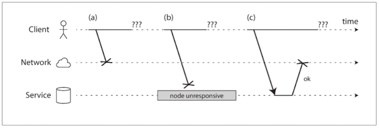

# Aiming for Correctness
- We want to build applications that are reliable and correct.
  - The transaction properties of atomicity, isolation, and durability
    - Weak isolation levels
  - Embrace weak consistency = Better availability
- It suggests some ways of thinking about correctness in the context of dataflow architectures.

## The End-to-End Argument for Databases 
- Applications do not guarantee to be free from data loss or corruption. -> State, Streams and Immutability.
  - immutable and append-only data are easier to recover from such mistake
### Exactly-once execution of an operation
- Processing twice is a form of data corruption
  - idempotent
  - additional metadata
  - fencing among nodes
#### Duplicate suppression
```
BEGIN TRANSACTION; 
UPDATE accounts SET balance = balance + 11.00 WHERE account_id = 1234; 
UPDATE accounts SET balance = balance - 11.00 WHERE account_id = 4321; 
COMMIT;
```

#### Operation identifiers
```
ALTER TABLE requests ADD UNIQUE (request_id);
BEGIN TRANSACTION;
INSERT INTO requests   (request_id, from_account, to_account, amount)   VALUES('0286FDB8-D7E1-423F-B40B-792B3608036C', 4321, 1234, 11.00);
UPDATE accounts SET balance = balance + 11.00 WHERE account_id = 1234; UPDATE accounts SET balance = balance - 11.00 WHERE account_id = 4321;
COMMIT;
```
#### The end-to-end argument
- Providing that questioned function as a feature of the communication system itself is not possible.
- We just need to remember that the low-level reliability features are not by themselves sufficient to ensure end-to-end correctness.
#### Applying end-to-end thinking in data systems
- The application itself needs to take end-to-end measures, such as duplicate suppression.

## Enforcing Constraints
### Uniqueness constraints require consensus
- If there are several concurrent requests with the same value, the system somehow needs to decide which one of the conflicting operations is accepted, and reject the others as violations of the constraint.
- The most common way of achieving this consensus is to make a single node the leader, and put it in charge of making all the decisions.
- Uniqueness checking can be scaled out by partitioning based on the value that needs to be unique. Like, request_id
- If you want to be able to immediately reject any writes that would violate the constraint, synchronous coordination is unavoidable.
### Uniqueness in log-based messaging
- In the unbundled database approach with log-based messaging, we can use a very similar approach to enforce uniqueness constraints.
- A stream processor consumes all the messages in a log partition sequentially on a single thread.
- It scales easily to a large request throughput by increasing the number of partitions, as each partition can be processed independently.
- The approach works not only for uniqueness constraints, but also for many other kinds of constraints.
### Multi-partition request processing
- By breaking down the multi-partition transaction into two differently partitioned stages and using the end-to-end request ID, we have achieved the same correctness property (every request is applied exactly once to both the payer and payee accounts), even in the presence of faults, and without using an atomic commit protocol.

## Timeliness and Integrity
- The term consistency conflates two different requirements that are worth considering separately:
  - Timeliness means ensuring that users observe the system in an up-to-date state.
  - Integrity means absence of corruption; i.e., no data loss, and no contradictory or false data. 
- Violations of timeliness are “eventual consistency,” whereas violations of integrity are “perpetual inconsistency.”

### Correctness of dataflow systems
- ACID transactions usually provide both timeliness and integrity
- On the other hand, an interesting property of the event-based dataflow systems is that they decouple timeliness and integrity.
- We achieved this integrity through a combination of mechanisms:
  - Representing the content of the write operation as a single message, which can easily be written atomically—an approach that fits very well with event sourcing
  - Deriving all other state updates from that single message using deterministic derivation functions, similarly to stored procedures
  - Passing a client-generated request ID through all these levels of processing, enabling end-to-end duplicate suppression and idempotence 
  - Making messages immutable and allowing derived data to be reprocessed from time to time, which makes it easier to recover from bugs
### Loosely interpreted constraints
- In many business contexts, it is actually acceptable to temporarily violate a constraint and fix it up later by apologizing. The cost of the apology (in terms of money or reputation) varies, but it is often quite low.
### Coordination-avoiding data systems
- We have now made two interesting observations:
  - Dataflow systems can maintain integrity guarantees on derived data without atomic commit, linearizability, or synchronous cross-partition coordination. 
  - Although strict uniqueness constraints require timeliness and coordination, many applications are actually fine with loose constraints that may be temporarily violated and fixed up later, as long as integrity is preserved throughout.
- You cannot reduce the number of apologies to zero, but you can aim to find the best trade-off for your needs—the sweet spot where there are neither too many inconsistencies nor too many availability problems.

## Trust, but Verify
### Maintaining integrity in the face of software bugs 
### Don’t just blindly trust what they promise 
### A culture of verification 
### Designing for auditability 
### The end-to-end argument again 
### Tools for auditable data systems 