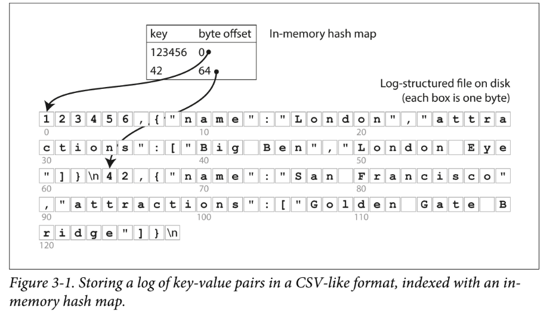
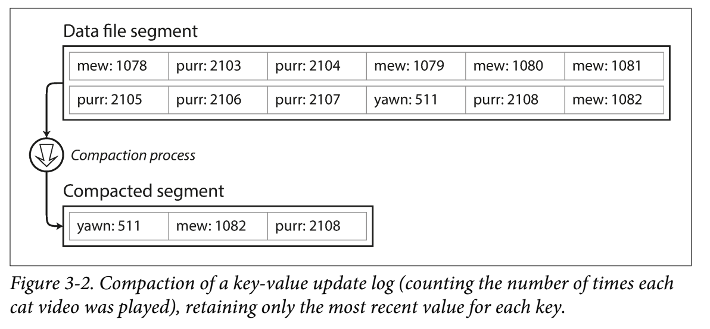
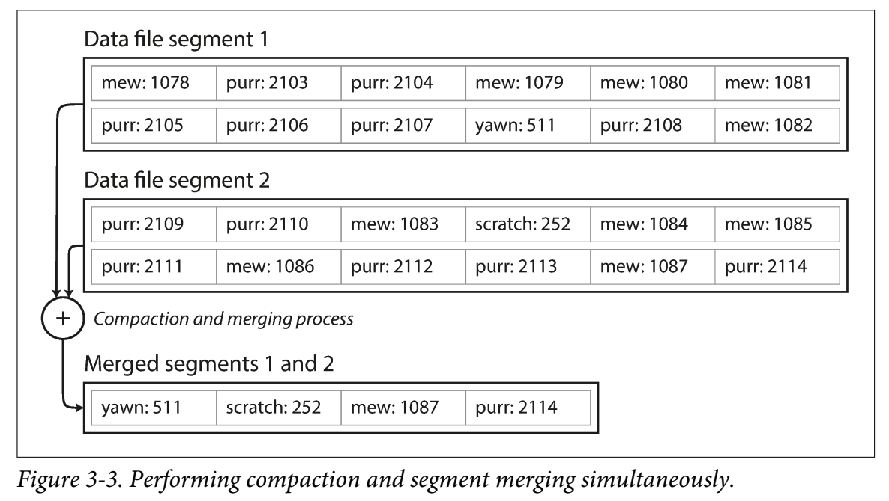
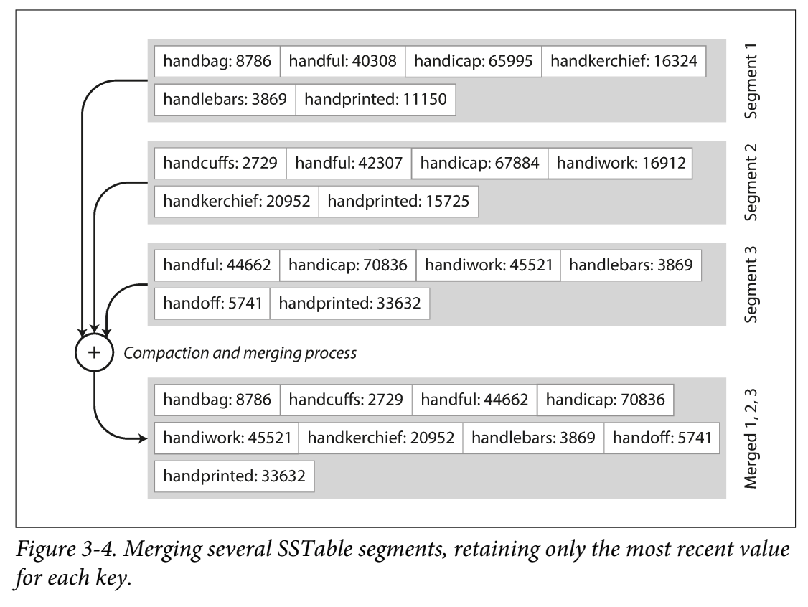
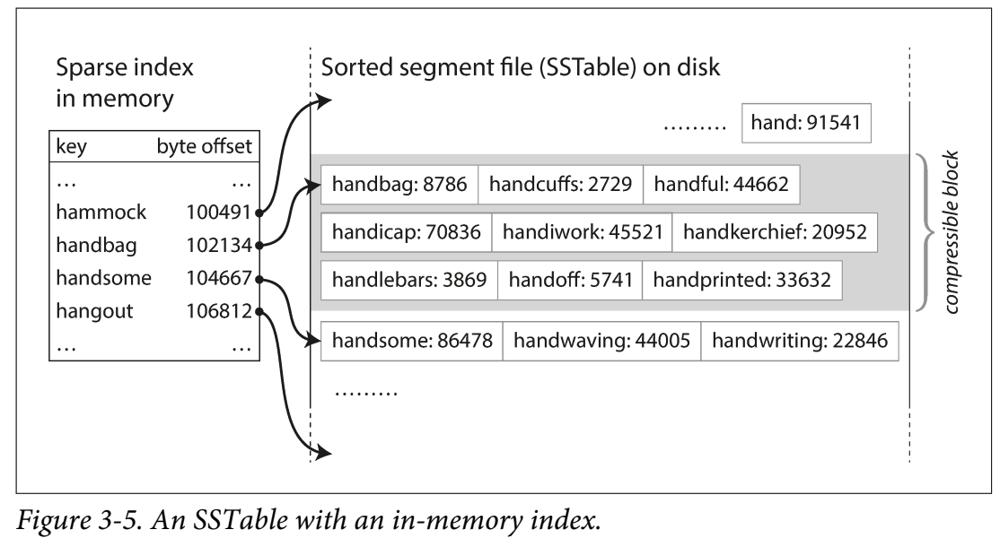
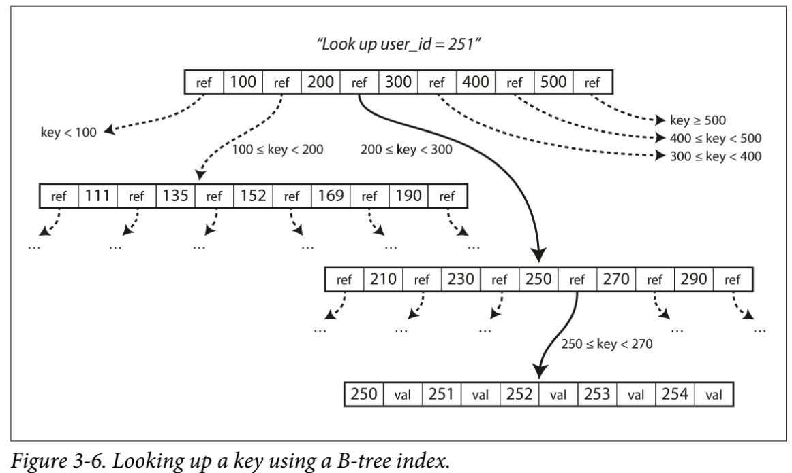

## Chapter 3: Storage and Retrieval

From the database’s point of view:
> How can we store the data that we’re given, and how can we find it again when we’re asked for it?

We need to select a storage engine that is appropriate for your application based on how storage engine is doing under the hood.
For example, the storage engine can be optimized for the **transactional workloads** or for the **analytics**.

Storage Engines in traditional relational databases and NoSQL databases:
1. log-structured storage engines
2. page-oriented storage engines (Ex. B-trees)

## Data Structures That Power Your Database

Two functions implement a key-value store. (value can be almost everything, including JSON document)
```shell
#!/bin/bash
db_set () {
    echo "$1,$2" >> database
}
db_get () {
    grep "^$1," database | sed -e "s/^$1,//" | tail -n 1
}

$ db_set 123456 
    '{"name":"London","attractions":["Big Ben","London Eye"]}'
$ db_set 42 
    '{"name":"San Francisco","attractions":["Golden Gate Bridge"]}'
$ db_get 42
    {"name":"San Francisco","attractions":["Golden Gate Bridge"]}
```
To update a key, the value is not overwritten but added as the last occurance of the key in the file.
```shell
$ db_set 42 
'{"name":"San Francisco","attractions":["Exploratorium"]}'
$ db_get 42
{"name":"San Francisco","attractions":["Exploratorium"]}
$ cat database
123456,{"name":"London","attractions":["Big Ben","London Eye"]}
42,{"name":"San Francisco","attractions":["Golden Gate Bridge"]}
42,{"name":"San Francisco","attractions":["Exploratorium"]}
```

db_set has very good performance as it only appends to the end of the file.
> Log

Many databases internally use a log, which is an append-only data file just like db_set.

Real databases have more issues to deal with:
1. concurrency control
2. reclaiming disk space so that the log doesn’t grow forever
3. handling errors and partially written records

But it's still incredibly useful!!

db_get however, has terrible performance with a large number of records in the database, as it has to scan the entire database file. (O(n))
If you double the number of records n, a lookup takes twice as long.

> Index : Efficiently find the value for a particular key in the database

The general idea behind them is to keep some additional metadata on the side to help locate the data you want. If you want to search the same data in several different ways, you may need several different indexes on different parts of the data.

An index is an additional structure that is derived from the primary data. Adding and removing indexes do not affect the contents of the database. It affects the performance of the queries.

Updating index needs maintaining additional structures and incurs overhead. (Lower performance than appends) A well-chosen indexes speed up read queries, but every index slows down writes. Database does not index everything by default, but requires you to choose indexes manually, based on your application’s typical query patterns.

## Hash Indexes

Indexes for key-value data is similar to a hash map (hash table). Since we already have hash maps for our in-memory data structures, why not use them to index our data on disk?



Simpliest indexing strategy for the append_only example:
- Keep an in-memory hash map that maps every key to the byte offset (location) in the data file.
- Appending a new key-value pair updatest the hash map to reflect the offset of the data you just wrote (both for inserts and updates)
- Looking up a value, use the hashmap to find the offset, seek to that location, and read the value.
- If a file is already in the filesystem cache, a read doesn't require any disk I/O at all.

> Bitcask (the default storage engine in Riak)

A storage engine like Bitcask is well suited to situations where the value for each key is updated frequently. 
- For example:
```
key: URL of a cat video
value: number of items it has been played (audo increments)
```

In this kind of workload, there are a lot of writes which appends to the file. how do we avoid eventually running out of disk space? 

> Compaction: throwing away duplicate keys in the log, and keeping only the most recent update for each key.

- Break the log into segments of a certain size by closing a segment file when it reaches a certain size, and making subsequent writes to a new segment file. We can then perform compaction on these segments.



Since compaction often makes segments much smaller, we can also merge several segments together at the same time as performing the compaction.

> Segment Merging

Segments are never modified after they have been written, so the merged segment is written to a new file. 
The merging and compaction of frozen segments can be done in a background thread, enabling processing read and write requests in the meantime.



Each segment now has its own in-memory hash table, mapping keys to file offsets.

To find a value for a key:
- Check the most recent segment’s hash map
- If the key is not present, we check the second-most-recent segment, and so on.

The merging process keeps the number of segments small, so lookups don’t need to check many hash maps.

## Real implementation:

> File format
- CSV is not the best format for a log.
- It’s faster and simpler to use a binary format that first encodes the length of a string in bytes, followed by the raw string
(without need for escaping).

> Deleting records
- Append a special deletion record (a.k.a. tombstone) which is discarded on segment merge.

> Crash recovery
- in-memory hash maps are lost if the database is restarted
- Restoring each segment's hash map for the entire segment file is time consuming.
- Bitcask speeds up recovery by storing a snapshot of each segment’s hash map on disk, which can be loaded into mem‐
ory more quickly.

> Partially written records
- The database can crash while appending a record to the log.
- Bitcask files include checksums, allowing such corrupted parts of the log to be detected and ignored.

> Concurrency control
- As writes are appended to the log in a strictly sequential order, a common implementation choice is to have only one writer thread. 
- Data file segments are append-only and otherwise immutable, so they can be read concurrently by mul‐
tiple threads.


## Append-only Log - Why not just update the values?

Advantages:
- Appending and segment merging are sequential write operations - generally much faster than random writes (Especially on magnetic spinning-disk
hard drives).
- Concurrency and crash recovery - much simpler for append-only or immutable segment files. You won't have partially written records.
- Merging old segments avoids the problem of data files getting fragmented over time.

Disadvantages of hash table index:
- The hash table must fit in memory (limited size)
- on-disk hash map does perform well. It requires a lot of random access I/O, it is expensive to grow when it becomes full, and hash collisions require fiddly logic.
- Range queries are not efficient as you have to look up each key individually in the hash map.

## SSTables and LSM-Trees

We want our sequence of key-value pairs to be sorted by key. And each key should only appears once within each merged segment file (ex. compaction process)

> Sorted String Table (SSTable)

Advantages of SSTables over log segments with hash indexes:

- Merging segments is simple and efficient even for files bigger than the available memory.
- Produces a new merged segment file, sorted by key, using the divide and conquer method (like merge sort)
    1. Start reading the input files side by side.
    2. Look at the first key in each file
    3. Copy the lowest key (according to the sort order) to the output file
    4. When multiple segments contain the same key, keep the most recent segment and discard the values in older segments.
    5. Repeat!



- We no longer have to keep the index of all the keys in memory, but some sparse in-memory indexes. (One key for few kilobytes of segment file)

- Since we scan over a range of key-value, we can compress the group of records before writing to disk. Compression helps with saving disk sapce, and also reduces the I/0 bandwidth.



## Constructing and Maintaining SSTables

How do we add data to be sorted by key in the first place?
- Maintain a sorted structure on disk (ex. B-Trees)
- (Easier) Maintain it in memory tree data structures (ex. red-black trees, AVL trees - eaiser)

Implementation:
- On writes - add it to in-memory balanced tree data structure (a.k.a. memtable).
- When memtable reaches threshold - write to disk as SSTable file. (Tree already maintains a key-value pairs sorted by key)
- On reads - Try to find the key in from the memtable, then the most recent on-disk segment, then in the next-older segment.
- Run merging and compaction process in the background and discard overwritten or deleted values.

Downfall:
- The database crashes and the most recent files are lost.
- Resolution: Keep a separate log on disk to which every write is immediately appended (not sorted). Use it to restore the memtable after a cash, then be discarded.

## Making an LSM-tree out of SSTables

> LSM-tree: Log-Structured Merged-Tree

## Performance Optimization

LSM-tree algorithm can be slow when looking up keys that do not exist in the database. It needs to check the memtable, then checks segments all the way to the oldest records.

Resolution: Use Bloom filters

> Bloom filters: memory-efficient data structure for approximating the contents of a set. It can tell you if a key does not appear in the database, and thuse saves many unnecessary disk reads for nonexistent keys.

Different strategies to determine the order and timing of how SSTables are compacted and merged.
1. sized-tiered (Cassandra)
    - Newer and smaller SSTables are successively merged into older and larger SSTables
2. leveled compaction. (LevelDB, RocksDB, Cassandra)
    - The key range is split up into smaller SSTables and older data is moved into separate "levels". This allows the compaction to proceed more incrementally and use less disk space. (Can perform range queries!)


## B-Trees

B-trees keep key-value pairs sorted by key, which allows efficient key-value lookups and range queries. (But with different design philosophy)

log-structured indexes - database break down into **variable-size** segments
B-trees break the database down into **fixed-size** blocks or pages, (~4KB) and read/write on one page at a time.
Corresponds more closely to underlying hardware, as disks are also arranged in fixed-sized blocks.

- Page can be identified using an address/location -> can refer to another as a pointer (on disk).



- You always start from the Top page - root of the B-tree.
- Each page contains several keys that reference to child pages.
- Each child is responsible for a continuous range of keys.
- Keys between references indicate boundaries of the ranges.

> Branching Factor: The number of references to child pages in one page of the B-tree. It depends on the amount of space required to store the page references and the range of boundaries.

Update value for an existing key:
- Search for the leaft page containing that key
- change the value in that page
- write the page back to disk

Add a new key:
- Find the page whose range encompasses the new key and add it to that page
- If there isn't enough free space in the page to accomodate the new key, it splits into two half full pages
- Parent page is updated to account for the new subdivision of key ranges


The tree remains balanced.
- B-tree with n keys = depth of O(log n)
Most databases can fit into a B-tree (three or four levels deep (~4KB) * branching factor 500 = 256 TB).


## Make B-trees reliable
Basic write operaton - overwriting a page on disk
- All references to that page remain intact
- Contrast to log-structured indexes such as LSM-trees, which only appends and delete the files, but not modify
- If you split a page due to overfull, you need to write two pages that were split, and update the parent pages that reference the two child pages

Risky when the database crashes with corrupted indice (Ex. Orphan page)
- Resolution: Implement additional data structure on disk for database resilience.
    - a write-ahead log (WAL, a.k.a. redo log)
        - An append-only file to which every B-tree modification
must be written before it can be applied to the pages of the tree itself for restoration.

Careful concurrency control is required if multiple threads are going to access the B-tree at the same time.
- A thread may see the tree in an inconsistent state.
- Resolution: Protect the tree’s data structures with latches (lightweight locks).

* Log-structured approaches are simpler in this regard, because they do all the merging in the background without interfering with incoming queries and atomically swap old segments for new segments from time to time.

## B-tree optimization
Over the years, several optimizations have been developed for B- Trees.

- Copy-on-Write Schema:

    Instead of overwriting pages and maintaining a Write-Ahead Log (WAL), it writes the modified pages to new locations and creates new versions of parent pages pointing to these locations. This is useful for concurrency control.

- Key Abbreviation:

    Saves space, especialy on the interior of the tree, only enough of each key is stored as the boundaries between key ranges. This increases the number of keys per page, which increases the branching factors with fewer levels.

- Disk Layout Optimization

    Many B- tree implementations try to lay out the tree so that leaf pages appear in sequential order on disk. However, it’s difficult to maintain that order as the tree grows. By contrast, since LSM-trees rewrite large segments of the storage in one go during merging, it’s easier for them to keep sequential keys close to each other on disk.

- Sibling Pointers:

    Leaf pages may have references to its sibling pages to the left and right, allowing in-order scanning without returning to the parent pages.

- B-tree variantes:

    Variants like fractal trees borrow some log-structured ideas to reduce disk seeks, despite having no relation to actual fractals.

## Comparing B-Trees and LSM-Trees

Although B-tree implementations are generally more mature, LSM-trees are notable for their performance characteristics. 
- LSM-trees are faster for writes
- B-trees are faster for reads.
- Reads are slower on LSM-trees because they need to check multiple data structures and SSTables at various compaction stages. However, benchmarks can be inconclusive and sensitive to the workload specifics. 

It is essential to test systems with your particular workload to make a valid comparison.


## Advantages of LSM-trees

- B-tree: Need to write every piece of data at least twice (write-ahead log + tree page itself) and has overhead from writing an entire page at a time. May also need to write page twice to avoid partially updated pages.
- Log-structured: also rewrites multiple times due to repeated compaction and merging of SSTables.

> Write Amplification: One write to the database results in multiple writes to the disk over the course of the database's lifetime.

In write-heavy application: the performance bottleneck is the rate of the disk write. Write amplification has a direct cost in this case.

- LSM-trees have lower write amplification and can sustain higher write throughput than B-trees. They sequentially write compact SSTable files rather than having to overwrite several pages in 
the tree.

- LSM-trees can be compressed better and produce smaller files on disk than B-trees. (B-tree can leave some disk space unused due to fragmentation - when a page is split or when a row cannot fit into an existing page, some space in a page remains unused)
- LSM-trees are not page-oriented and periodically rewrites SSTables to remove fragmentation -> lower storage overheads with leveled compaction.


## Downsides of LSM-trees

- Compaction process can interfere with the performance of ongoing reads and writes when disks have limited resources.
The request needs to wait while the disk finishes an expensive compaction. Impact on throughput and average response time is usually small but at higher percentiles, the response time of queries to log-structured storage engines can be quite high.

- High write through put with compaction - The disk's finite write bandwidth needs to be shared between the initial write and the compaction thread. More disk bandwidth is required for compaction in bigger database.

- SSTable-based storage engines do not throttle the rate of incoming writes. Compaction may not keep up with the rate of incoming writes. The number of unmerged segments on disk keeps growing until you run out of space. Reads slow down to check more segment files.

- Advantages of B-trees: each key exists in exactly one place in the index and offers strong transactional semantics using locks on ranges of keys. (Log-structured storage have multiple copies of the same key in different segments)


B-trees are ingrained in the architectures of databases and provide consistently good performance for high workloads.
However, the new datastores, log-structured indexes are becoming increasingly popular. Test empirically!
