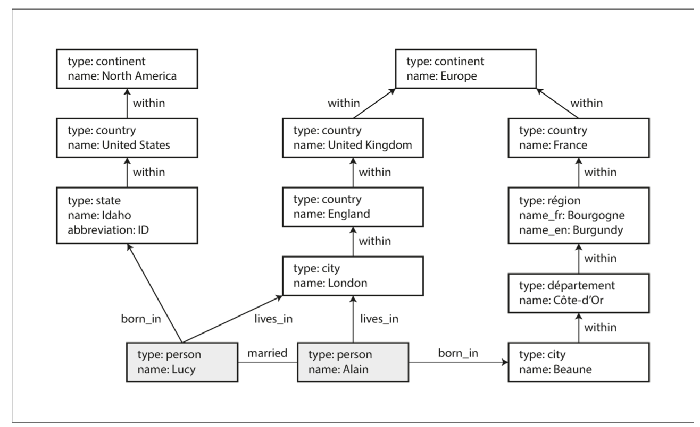

# Chapter 2: Data Models and Query Languages

Data models have a profound effect: on how the software is written, and on how we think about the problem that we are solving.

Most applications are built by layering one data model on top of another - how is each layer represented in terms of the next-lower layer?
- App developers model in terms of objects, data structures and APIs
- Then store those data structures in data models (i.e. JSON, XML documents, tables in RDBMS, graph model)
- Ways of representing data models (i.e. bytes in memory, on disk, on a network). May allow queries, searches, manipulation.
- How to represent bytes in terms of electrical currents, pulses of light, magnetic fields (Hardware engineers)
- More comples apps can have more intermediary levels (APIs built upon APIs, etc)

Basic idea: Each layer hides the complexity of the layers below it by providing a clean data model.
- Different groups of people can work together efficiently (engineers at the db vendor & app developers using db)

## Relational Model vs. Document Model
- Best-known data model: SQL
    - Based on the relational model - each relation is an unordered collection of tuples (rows in SQL)
    - Allows people to store and query data with some kind of regular structure
    - Roots in relational dbs lie in buisiness data processing
        - transaction processing (entering sales or banking transactions)
        - batch processing (customer invoicing, payroll)
    - Main goal of the relational model was to hide implementation detail behind a clearer interface
    - Turned out to generalize very well (beyond their original scope of business data processing)

- Some competing approaches:
    - netowork model
    - hierarchical model
    - object dbs
    - XML dbs

## The Birth of NoSQL
- Latest attempt to overthrow the relational model's dominance
- #NoSQL
- Driving forces behind the adoption of NoSQL dbs:
    - greater scalability (very large datasets, very high write throughput)
    - free and open source software
    - specialized query operations (not well supported by SQL)
    - more dynamic and expressive data model (less restrictive)
    
# The Object-Relational Mismatch

- Most app development is done in OOP - if data is stored in relational tables, an awkward translation layer is required between the objects in the code base and the db model of tables, rows, and columns. (aka impedance mismatch)
- ORM (Object-relational mapping) frameworks exist. But they have limitations:


- Instead, a self-contained document (i.e. JSON) representation is more appropriate:

```json
{
"user_id": 251,
"first_name": "Bill",
"last_name": "Gates",
"summary": "Co-chair of the Bill & Melinda Gates... Active blogger.", "region_id": "us:91",
"industry_id": 131,
"photo_url": "/p/7/000/253/05b/308dd6e.jpg",
"positions": [
{"job_title": "Co-chair", "organization": "Bill & Melinda Gates Foundation"}, {"job_title": "Co-founder, Chairman", "organization": "Microsoft"}
], "education": [
{"school_name": "Harvard University", "start": 1973, "end": 1975},
{"school_name": "Lakeside School, Seattle", "start": null, "end": null} ],
"contact_info": {
"blog": "http://thegatesnotes.com", "twitter": "http://twitter.com/BillGates"
} 
}
```

- Some developers believe the JSON model aligns better with application code than traditional storage models.
- JSON has its own issues as a data encoding format (Chapter 4)
- JSON's lack of a schema is seen as an advantage, discussed further in “Schema flexibility in the document model.”
- JSON representation offers better data locality than multi-table schemas, requiring only one query to fetch a profile.
- In relational databases, fetching a profile requires multiple queries or complex joins.

- JSON explicitly represents one-to-many relationships, like user profiles, as tree structures:


## Many-to-One and Many-to-Many Relationships
- Using IDs like region_id and industry_id instead of plain-text strings offers several benefits:
    - Ensures consistent style and spelling.
    - Avoids ambiguity between similar names.
    - Simplifies updates across all records.
    - Supports localization for different languages.
    - Enhances search capabilities by encoding hierarchical relationships.

- Storing IDs avoids duplication, maintaining a single source of truth for human-meaningful information.
    - IDs remain unchanged even if the associated information changes, reducing update overhead and inconsistencies.

- Normalization, which removes data duplication, often involves many-to-one relationships.
    - Relational databases handle this well with joins.
    - Document databases struggle with joins, requiring multiple queries or emulation in application code.

- Data often becomes more interconnected over time, necessitating changes to the document model:
    - Entities like organizations and schools might need their own references and web pages.
    - New features like recommendations might require references to other user profiles to reflect updates.


## Are Document Databases Repeating History?

- Many-to-many relationships and joins are common in relational databases but challenging in document databases and NoSQL.

- This debate dates back to early computerized databases, particularly the 1970s.

- IBM's Information Management System (IMS), developed for the Apollo program, used a hierarchical model similar to JSON in document databases.

- IMS worked well for one-to-many relationships but struggled with many-to-many relationships and lacked support for joins, leading to issues similar to those faced with document databases today.

- To address hierarchical model limitations, the relational model (SQL) and the network model emerged, sparking a major debate in the 1970s.

- Revisiting this debate is useful as the problems are still relevant today.

### The network model

- The network model, standardized by CODASYL, is a generalization of the hierarchical model.

- In the hierarchical model, each record has one parent, but in the network model, a record can have multiple parents.

- This allows for many-to-one and many-to-many relationships.

- Links between records act like pointers rather than foreign keys.

- Accessing records involves following a specific path from a root record.

- Queries require moving a cursor through the database by iterating over records and following paths.

- Managing multiple access paths is complex and requires careful tracking by the programmer.

- This manual path selection made efficient use of limited hardware in the 1970s but resulted in complicated and inflexible code.

- Changing access paths was difficult and required significant rewriting of query code.

### The relational model
- The relational model lays out data as tables of rows, making it simple and straightforward.

- No nested structures or complex access paths are needed to view data.

- Any row can be read by selecting conditions, or specific rows can be identified using keys.

- Rows can be added without worrying about foreign key relationships.

- The query optimizer in relational databases decides the execution order and index usage automatically.

- New queries can be supported by simply declaring new indexes without changing the queries themselves.

- Relational databases simplify adding new features to applications.

- Building a query optimizer is complex but provides long-term benefits for all applications using the database.

### Comparison to document databases

- Document databases use a hierarchical model to store nested records within parent records.

- For many-to-one and many-to-many relationships, both relational and document databases use unique identifiers (foreign keys in relational, document references in document databases).

- These identifiers are resolved at read time via joins or follow-up queries.

- Document databases have not adopted the CODASYL model approach.

## Relational vs. Document Databases Today

When comparing relational and document databases, key differences include:

- Data model: This chapter focuses on the data model differences.
- Document model advantages: Schema flexibility, better performance due to data locality, and alignment with application data structures.
- Relational model advantages: Better support for joins, and handling many-to-one and many-to-many relationships.
- Other factors: fault tolerance and concurrency

### Which data model leads to simpler application code?

- Document Model Suitability: Best for document-like structures with one-to-many relationships, where the entire tree is typically loaded at once. Avoids the cumbersome schemas and complex code of relational shredding.
    - Limitations: Cannot refer directly to nested items within a document, but usually manageable if documents aren't too deeply nested.

- Joins and Relationships: Poor support for joins in document databases may be problematic for many-to-many relationships, making the model less appealing.         
    - Denormalizing can reduce joins but adds complexity and potential inconsistency.

- Application Code Complexity: Depends on data relationships. Document model is awkward for highly interconnected data; relational model is acceptable; graph models are the most natural for such data.

### Schema flexibility in the document model
- Schema Enforcement: Most document databases and JSON support in relational databases do not enforce schemas. XML in relational databases may have optional schema validation.

- Schemaless Misconception: Document databases are often called schemaless, but this is misleading. They have an implicit schema assumed by the reading code, termed schema-on-read.

- Schema-on-Read vs. Schema-on-Write: Schema-on-read is like dynamic type checking, interpreting structure during read time. Schema-on-write is like static type checking, enforcing structure during write time.

- Debate on Schema Enforcement: Similar to static vs. dynamic type checking debates in programming, the merits of schema enforcement in databases are debated with no definitive right or wrong.

- Data Format Changes: In document databases, changing data formats (e.g., splitting a full name into first and last names) involves writing new fields in new documents and updating the application code to handle old documents.

- Example:
```
if (user && user.name && !user.first_name) {
// Documents written before Dec 8, 2013 don't have first_name user.first_name = user.name.split(" ")[0];
}
```

```
ALTER TABLE users ADD COLUMN first_name text;
UPDATE users SET first_name = split_part(name, ' ', 1); -- PostgreSQL UPDATE users SET first_name = substring_index(name, ' ', 1); -- MySQL
```

- Schema Change Perception: Schema changes in databases are often viewed as slow and requiring downtime, but this reputation is not entirely accurate. Most relational databases execute ALTER TABLE statements quickly, although MySQL's approach involves copying the entire table, which can lead to significant downtime for large tables.

- Performance Considerations: Updating large tables with UPDATE statements can be slow in any database, as each row needs rewriting. To mitigate this, applications can handle defaults like NULL and populate data at read time, akin to document databases.

- Advantages of Schema-on-Read: Schema-on-read is beneficial when data in a collection is heterogeneous:
    - Various types of objects exist, making it impractical to segregate each type into its own table.
    - Data structure is influenced by external systems that may change unpredictably.

- Flexibility of Schemaless Documents: In such scenarios, schemaless documents offer a natural data model without the constraints of a predefined schema. However, schemas are valuable for documenting and enforcing consistent data structure when all records are expected to conform.

### Data locality for queries
- Storage and Performance in Document Databases: Documents are typically stored as a single continuous string, encoded in JSON, XML, BSON (MongoDB's binary JSON), or similar formats. This approach offers performance advantages when applications frequently need to access the entire document, such as for rendering on web pages.

- Locality Advantage: Storing documents in a single unit reduces the need for multiple index lookups across tables, which can increase disk seeks and retrieval time in traditional relational databases where data is spread across multiple tables.

- Considerations on Document Size: While locality benefits are significant when accessing large portions of a document together, retrieving an entire document even for small queries can be inefficient, especially for large documents. Updates typically require rewriting the entire document, except for modifications that do not change its encoded size.

- Performance Recommendations: To optimize performance, it's advised to keep documents relatively small and minimize operations that increase their size. These constraints limit the scenarios where document databases excel.

- Locality Beyond Document Model: The concept of grouping related data for locality isn't exclusive to document databases. Technologies like Google's Spanner and Oracle's multi-table index cluster tables offer similar locality benefits within a relational model, while Bigtable's column-family concept (used in Cassandra and HBase) also manages data locality effectively.

### Convergence of document and relational databases
- XML and JSON Support in Relational Databases: Since the mid-2000s, most relational database systems (excluding MySQL) have integrated support for XML, enabling local modifications, indexing, and querying within XML documents. This functionality allows applications to utilize data models akin to those in document databases.

- JSON Support in Relational Databases: Starting with PostgreSQL 9.3, MySQL 5.7, and IBM DB2 10.5, these databases have also embraced JSON document support. Given JSON's popularity in web APIs, other relational databases are expected to follow suit in integrating JSON capabilities.

- Features in Document Databases: Document databases like RethinkDB facilitate relational-like joins in their query languages, and certain MongoDB drivers automatically resolve database references, though this process is typically slower due to additional network round-trips and reduced optimization.

- Convergence of Relational and Document Models: Over time, relational and document databases have been converging, enabling them to handle both document-like data and relational queries effectively. This convergence allows applications to leverage features from both models as per their specific requirements.

- Hybrid Models for Future Databases: A hybrid approach combining features of relational and document models is viewed positively for future database development, offering flexibility and suitability for diverse application needs.


## Query Languages for Data
- Declarative vs. Imperative Querying:
    - Introduction of SQL: When the relational model introduced SQL, it brought a shift from imperative querying methods (like IMS and CODASYL) to a declarative approach.

```
function getSharks() { var sharks = [];
for (var i = 0; i < animals.length; i++) { if (animals[i].family === "Sharks") {
                sharks.push(animals[i]);
            }
}
return sharks; }
```

```
SELECT * FROM animals WHERE family = 'Sharks';
```
    - Imperative Programming: In imperative programming, such as with common languages like JavaScript, you specify step-by-step instructions for the computer to execute. For instance, iterating over a list to filter out sharks involves explicit loops and conditions.
    - Relational Algebra and SQL: In contrast, SQL and relational algebra are declarative. Instead of specifying how to achieve the desired result, you define what data you want (e.g., animals where family is "Sharks") using operators like selection (σ).
    - Advantages of Declarative Languages: Declarative languages are concise and abstract away implementation details. They allow the database optimizer to determine the most efficient way to execute queries, including index usage and join methods.
    - Flexibility and Optimization: Unlike imperative code, declarative queries do not rely on specific data ordering, making them more adaptable to database optimizations like data reorganization.
    - Parallel Execution: Declarative languages also lend themselves well to parallel execution across multiple cores or machines, crucial in today’s multi-core CPU environments where speed gains come from parallel processing rather than increased clock speeds.

In summary, SQL's adoption of a declarative approach revolutionized querying by focusing on what data is needed rather than how to retrieve it, leading to more efficient and adaptable database operations.

## Declarative Queries on the Web
Declarative vs. Imperative Approaches: Web Browser Example:
- Background: Consider a web page about ocean animals where the user is viewing information about sharks. The navigation item "Sharks" is marked as selected with the CSS class "selected".
- Declarative CSS Example: To visually highlight the selected item with a blue background, CSS provides a straightforward solution:

```
li.selected > p {
    background-color: blue;
}
```
This CSS rule selects all <p> elements whose direct parent <li> has the class "selected", applying a blue background to <p>Sharks</p> but not to <p>Whales</p>.

- Declarative XSL Example: Alternatively, using XSL (eXtensible Stylesheet Language), which is also declarative:

```
<xsl:template match="li[@class='selected']/p">
    <fo:block background-color="blue">
        <xsl:apply-templates/>
    </fo:block>
</xsl:template>

```
Here, the XPath expression li[@class='selected']/p achieves the same effect as the CSS selector, highlighting <p>Sharks</p> with a blue background.

- Imperative JavaScript Example: In contrast, achieving the same effect imperatively in JavaScript using the DOM API is complex and error-prone:

```
var liElements = document.getElementsByTagName("li");
for (var i = 0; i < liElements.length; i++) {
    if (liElements[i].className === "selected") {
        var children = liElements[i].childNodes;
        for (var j = 0; j < children.length; j++) {
            var child = children[j];
            if (child.nodeType === Node.ELEMENT_NODE && child.tagName === "P") {
                child.setAttribute("style", "background-color: blue");
            }
        }
    }
}

```
This JavaScript code iteratively searches for the selected <li> element and manually sets the background color of its <p> child to blue, a process prone to errors and harder to maintain.

- Advantages of Declarative Languages: Both CSS and XSL demonstrate the advantages of declarative languages: they are concise, easier to understand, and automatically handle changes (like class removal) without requiring additional code. They also benefit from browser optimizations without breaking compatibility.

- Conclusion: Just as CSS and XSL simplify styling in web browsers, SQL simplifies querying in databases by focusing on what data is needed rather than how to retrieve it, enhancing clarity, maintainability, and performance.

## MapReduce Querying

MapReduce Overview and Usage in MongoDB:

- Definition and Origin: MapReduce is a programming model designed by Google for processing vast datasets across distributed clusters. It's supported in some NoSQL databases like MongoDB and CouchDB for performing read-only queries across multiple documents.

- Characteristics: MapReduce lies between declarative query languages and fully imperative APIs. It employs map (or collect) and reduce (or fold/inject) functions commonly found in functional programming languages.

- Example Scenario: Suppose you're a marine biologist managing an observation database of ocean animals. You want to generate a report detailing the number of shark sightings per month.

- SQL Query (PostgreSQL):
```
SELECT date_trunc('month', observation_timestamp) AS observation_month,
       sum(num_animals) AS total_animals
FROM observations
WHERE family = 'Sharks'
GROUP BY observation_month;
```

- Equivalent MapReduce Query (MongoDB): Using MongoDB's MapReduce feature:
```
db.observations.mapReduce(
    function map() {
        var year = this.observationTimestamp.getFullYear();
        var month = this.observationTimestamp.getMonth() + 1;
        emit(year + "-" + month, this.numAnimals);
    },
    function reduce(key, values) {
        return Array.sum(values);
    },
    {
        query: { family: "Sharks" },
        out: "monthlySharkReport"
    }
);
```

- Explanation:
    - Map Function: Extracts year and month from each observation timestamp and emits a key-value pair.
    - Reduce Function: Aggregates values (number of animals) for each key (year-month).
    - Output: Results are stored in the collection monthlySharkReport.

- Functionality and Restrictions: MapReduce functions are pure, meaning they only use input data, cannot perform additional queries, and have no side effects. This allows them to be rerun and executed in any order, ensuring fault tolerance.

- Comparison and Evolution: While powerful, MapReduce requires writing coordinated JavaScript functions, which can be complex. MongoDB later introduced the aggregation pipeline as a declarative query language alternative, offering opportunities for query optimization similar to SQL.

- Aggregation Pipeline (MongoDB): The same shark-counting query using the aggregation pipeline:

```
db.observations.aggregate([
    { $match: { family: "Sharks" } },
    { $group: {
        _id: {
            year: { $year: "$observationTimestamp" },
            month: { $month: "$observationTimestamp" }
        },
        totalAnimals: { $sum: "$numAnimals" }
    }}
]);
```

- Explanation: Uses a JSON-based syntax to perform filtering ($match) and grouping ($group), similar in functionality to SQL but with a different syntax.

- Conclusion: NoSQL systems like MongoDB initially adopted MapReduce for distributed data processing but later introduced more declarative approaches like the aggregation pipeline, resembling SQL's capabilities, albeit with different syntax preferences. This evolution highlights the versatility and ongoing convergence of query languages across database systems.

## Graph-Like Data Models

- Many-to-many relationships are pivotal in data modeling, influencing the choice between relational, document, and graph databases.

- Document Model: Suitable for one-to-many relationships or data without relationships.

- Graph Model: Ideal for complex many-to-many relationships, where entities are interconnected via edges.

- Graph Components: Consist of vertices (nodes/entities) and edges (relationships/arcs), representing various types of interconnected data.

- Examples:
    - Social Graphs: Vertices represent people, and edges denote relationships (e.g., friendships).
    - Web Graphs: Vertices are web pages, and edges signify hyperlinks between them.
    - Networks: Represented as vertices (e.g., junctions) and edges (e.g., roads or rail lines).

- Applications: Graphs enable algorithms like shortest path calculations in navigation systems and PageRank for web page popularity.

- Versatility: Graphs can store heterogeneous data types uniformly; for instance, Facebook's graph includes vertices for people, locations, events, etc., connected by various types of edges.

- Graph Models and Query Languages: Two primary models discussed are:
    - Property Graph Model: Implemented by Neo4j, Titan, InfiniteGraph.
    - Triple-store Model: Implemented by Datomic, AllegroGraph, among others.

- Query Languages:
    - Declarative: Cypher (for property graphs), SPARQL (for RDF triple-stores), Datalog.
    - Imperative: Gremlin (a traversal language), used for graph traversals and queries.

- Conclusion: Graph databases and query languages provide robust solutions for modeling and querying interconnected data, offering flexibility and efficiency for handling complex relationships beyond the capabilities of traditional relational or document-oriented approaches.



## Property Graphs

- In the property graph model:
    - Vertices: 
        - Identified uniquely.
        - Possess a set of outgoing and incoming edges.
        - Comprise a collection of properties stored as key-value pairs.
    - Edges:
        - Identified uniquely.
        - Connect a starting vertex (tail vertex) to an ending vertex (head vertex).
        - Defined with a label describing their relationship type.
        - Include properties stored as key-value pairs.

- Representation in a relational schema:
    - Vertices Table:
        - Stores vertex identifiers (vertex_id) and properties using JSON format.

```
CREATE TABLE vertices (
    vertex_id integer PRIMARY KEY,
    properties json
);
```
- Edges Table:
    - Stores edge identifiers (edge_id), tail vertex (tail_vertex), head vertex (head_vertex), relationship label (label), and properties using JSON format.
    - Includes indexes on tail_vertex and head_vertex columns for efficient querying of incoming and outgoing edges.

```
CREATE TABLE edges (
    edge_id integer PRIMARY KEY,
    tail_vertex integer REFERENCES vertices (vertex_id),
    head_vertex integer REFERENCES vertices (vertex_id),
    label text,
    properties json
);

CREATE INDEX edges_tails ON edges (tail_vertex);
CREATE INDEX edges_heads ON edges (head_vertex);
```

- Key Features:
    - Flexibility: Any vertex can connect to any other vertex, without predefined schema restrictions.
    - Efficient Traversal: Enables efficient traversal of graphs in both directions (incoming and outgoing edges) using indexes.
    - Relationship Labels: Differentiates relationships using labels, facilitating diverse data storage within a single graph structure.

- Illustrative Flexibility:
    - Graph Representation: Handles complex structures like regional differences across countries, nested geopolitical entities, and varying data granularities.
    - Application Extension: Easily extends to incorporate additional data attributes such as allergies and food contents, supporting flexible and evolving data models.

- Conclusion: Graph databases offer robust flexibility for data modeling and traversal, accommodating complex relationships and diverse data types effectively where traditional relational schemas may be limiting.

## The Cypher Query Language

- Cypher is a declarative query language designed for property graphs, particularly for use with the Neo4j graph database. It facilitates creating and querying graph structures efficiently. Example 2-3 demonstrates how to insert data into a graph using Cypher, where vertices are given symbolic names like USA or Idaho, and relationships between them are established using arrow notation

- Once all relevant data is inserted, queries can be posed to extract meaningful insights from the graph. For instance, Example 2-4 illustrates a Cypher query to find individuals who migrated from the United States to Europe. This query uses the MATCH clause with arrow notation to identify vertices connected by specific relationships (e.g., BORN_IN and LIVES_IN) across the graph structure. The query returns the names of people who meet the criteria specified by these relationships.

- Cypher's strength lies in its ability to express complex graph traversal and pattern matching operations in a straightforward, declarative manner. The language abstracts away the execution details, allowing the query optimizer to determine the most efficient strategy for execution, thereby streamlining application development.

```
CREATE
  (NAmerica:Location {name:'North America', type:'continent'}),
  (USA:Location      {name:'United States', type:'country'  }),
  (Idaho:Location    {name:'Idaho',         type:'state'    }),
  (Lucy:Person       {name:'Lucy' }),
  (Idaho) -[:WITHIN]->  (USA)  -[:WITHIN]-> (NAmerica),
  (Lucy)  -[:BORN_IN]-> (Idaho)
```

```
MATCH
  (person) -[:BORN_IN]->  () -[:WITHIN*0..]-> (us:Location {name:'United States'}),
(person) -[:LIVES_IN]-> () -[:WITHIN*0..]-> (eu:Location {name:'Europe'}) RETURN person.name
```

## Graph Queries in SQL

- In summary, the text discusses the challenge of querying graph data stored in a relational database using SQL. Unlike in relational queries where joins are typically predefined, graph queries may require traversing a variable number of edges before reaching the desired vertex, which complicates SQL queries.

- The example query finds people who migrated from the US to Europe, first expressed in Cypher using concise traversal notation (
*0..), then translated into SQL using recursive common table expressions (WITH RECURSIVE). The SQL query involves multiple recursive queries to identify vertices within the US and Europe, find people born in the US, find people living in Europe, and then intersect these sets to find the desired individuals.

- The comparison highlights that while SQL can handle graph queries using recursive techniques since SQL:1999, the syntax is cumbersome compared to Cypher. This underscores the importance of choosing a data model suited to the application's requirements, as different models excel in different scenarios.

```
WITH RECURSIVE
  -- in_usa is the set of vertex IDs of all locations within the United States
in_usa(vertex_id) AS (
SELECT vertex_id FROM vertices WHERE properties->>'name' = 'United States'
UNION
SELECT edges.tail_vertex FROM edges
JOIN in_usa ON edges.head_vertex = in_usa.vertex_id
WHERE edges.label = 'within' ),
  -- in_europe is the set of vertex IDs of all locations within Europe
in_europe(vertex_id) AS (
SELECT vertex_id FROM vertices WHERE properties->>'name' = 'Europe'
UNION
SELECT edges.tail_vertex FROM edges
JOIN in_europe ON edges.head_vertex = in_europe.vertex_id
WHERE edges.label = 'within' ),
  -- born_in_usa is the set of vertex IDs of all people born in the US
born_in_usa(vertex_id) AS (
SELECT edges.tail_vertex FROM edges
JOIN in_usa ON edges.head_vertex = in_usa.vertex_id
WHERE edges.label = 'born_in' ),
-- lives_in_europe is the set of vertex IDs of all people living in Europe
lives_in_europe(vertex_id) AS ( SELECT edges.tail_vertex FROM edges
JOIN in_europe ON edges.head_vertex = in_europe.vertex_id
WHERE edges.label = 'lives_in' )
SELECT vertices.properties->>'name'
FROM vertices
-- join to find those people who were both born in the US *and* live in Europe JOIN born_in_usa ON vertices.vertex_id = born_in_usa.vertex_id
JOIN lives_in_europe ON vertices.vertex_id = lives_in_europe.vertex_id;
```

## Triple-Stores and SPARQL

- The triple-store model: conceptually similar to the property graph model but uses different terminology. In a triple-store, all data is stored as triples consisting of subject, predicate, and object.
    - Subject: Equivalent to a vertex in a graph.
    - Predicate: Describes the relationship between the subject and object.
    - Object: Can be either:
        - A primitive value (string, number), treated like a property value in a graph.
        - Another vertex, forming an edge in the graph.

- The following demonstrates how data from previous section is represented in Turtle format, a subset of Notation3 (N3). Each triple uniquely identifies entities and relationships:
```
@prefix : <urn:example:>.
_:lucy     a       :Person.
_:lucy     :name   "Lucy".
_:lucy     :bornIn _:idaho.
_:idaho    a       :Location.
_:idaho    :name   "Idaho".
_:idaho    :type   "state".
_:idaho
_:usa
_:usa
_:usa      :type   "country".
_:usa      :within _:namerica.
_:namerica a
_:namerica :name
_:namerica :type
:Location.
"North America".
"continent".
:within _:usa.
a       :Location.
:name   "United States".
```

### todo
- Vertices are represented with identifiers like _ or _.
- Predicates indicate relationships or properties, such as or .
- Objects can be literals (like "Idaho") or other vertices (like _).

- Below shows how Turtle format allows grouping multiple statements about the same subject using semicolons, enhancing readability and reducing redundancy.
```
@prefix : <urn:example:>.
_:lucy
_:idaho
_:usa
_:namerica a :Location; :name "North America"; :type "continent".
a :Person;   :name "Lucy";          :bornIn _:idaho.
a :Location; :name "Idaho";         :type "state";   :within _:usa.
a :Location; :name "United States"; :type "country"; :within _:namerica.
```

- Overall, while both triple-stores and property graph models capture graph-like structures, they differ in how they represent and query data, with triple-stores using subject-predicate-object triples as the fundamental data unit.

### The semantic web
- Triple-Store Model: This model stores data in triples of subject-predicate-object, suitable for representing relationships and properties. Examples include Datomic, which is a triple-store but not linked to the semantic web.

- Semantic Web: A concept aimed at making web content machine-readable through standardized formats like RDF (Resource Description Framework). It envisioned creating a web of interconnected data accessible to machines.

- - Historical Context: The semantic web was highly anticipated in the early 2000s but has not fully materialized as envisioned. It faced challenges such as complex standards and practical implementation issues, leading to skepticism.

Practical Applications: Despite its challenges, the semantic web introduced useful concepts like RDF triples, which remain valuable for internal data models in applications, even if not used for web-scale data integration.

- Overall, while the semantic web concept has faced criticism and practical challenges, its underlying data model of triples has found practical application beyond its original vision of a universal web of data.

### The RDF data model
- This sub chapter discusses RDF data representation using Turtle and XML formats, emphasizing the preference for Turtle due to its human-readable nature compared to the verbosity of XML. Here’s a summary:

- Turtle vs. RDF/XML: Turtle (Terse RDF Triple Language) provides a concise and readable format for RDF (Resource Description Framework) data. It was contrasted with RDF/XML, which is more verbose, as shown in Example 2-8.

- The provided RDF/XML example illustrates how RDF data can be structured using XML tags like <rdf:RDF>, <Location>, <Person>, and properties like <name>, <type>, <within>, and relationships indicated by rdf:nodeID.
```
<rdf:RDF xmlns="urn:example:"
xmlns:rdf="http://www.w3.org/1999/02/22-rdf-syntax-ns#">
<Location rdf:nodeID="idaho"> <name>Idaho</name> <type>state</type> <within>
<Location rdf:nodeID="usa"> <name>United States</name> <type>country</type> <within>
<Location rdf:nodeID="namerica"> <name>North America</name> <type>continent</type>
          </Location>
        </within>
      </Location>
    </within>
</Location>
<Person rdf:nodeID="lucy"> <name>Lucy</name>
<bornIn rdf:nodeID="idaho"/>
  </Person>
</rdf:RDF>
```

- Use of URIs: RDF triples typically use URIs for subjects, predicates, and objects. This ensures global uniqueness and compatibility across different datasets. For instance, predicates are often represented as full URIs (e.g., <http://example.com/within>).

- Namespaces: RDF allows namespaces to distinguish between different vocabularies and prevent naming conflicts. These are typically defined at the beginning of RDF/XML or Turtle files to simplify the representation of URIs throughout the document.

- Advantages of Turtle: Turtle is preferred over RDF/XML for its readability and ease of use. Tools like Apache Jena can facilitate conversion between RDF formats if needed, making it easier to work with RDF data across different environments.

- In summary, Turtle provides a more readable and manageable way to represent RDF data compared to RDF/XML, leveraging URIs and namespaces to ensure semantic clarity and interoperability in distributed environments.

### The SPARQL query language

- SPARQL is a query language designed for querying triple-stores using the RDF data model. It stands for "SPARQL Protocol and RDF Query Language," often pronounced as "sparkle." Example 2-9 demonstrates how SPARQL can be used to query RDF data, specifically finding people who have moved from the US to Europe.

- SPARQL Overview: SPARQL is analogous to SQL for relational databases but is tailored for RDF data. It preceded Cypher and influenced its design, leading to similarities in their syntax and capabilities.

- The query in SPARQL to find people who moved from the US to Europe is concise and structured:
    - This query uses RDF predicates (:bornIn, :livesIn, :within) to navigate relationships between entities, similar to how Cypher patterns work.
```
PREFIX : <urn:example:>
SELECT ?personName WHERE {
  ?person :name ?personName.
  ?person :bornIn / :within* / :name "United States".
  ?person :livesIn / :within* / :name "Europe".
}
```

- Comparison with Cypher: SPARQL and Cypher share similar concepts:
    - Both use patterns to specify relationships and conditions (:bornIn / :within* / :name "United States" in SPARQL corresponds to (person)-[:BORN_IN]->()-[:WITHIN*0..]->(location) in Cypher).
    - Variables in SPARQL start with a question mark (?personName), similar to Cypher’s variable notation.

- Querying Properties: In SPARQL, predicates are used uniformly for both properties and edges, simplifying queries. For example, querying a vertex with a specific name in RDF is done as:
```
?usa :name "United States".
```

- Applicability: SPARQL remains a powerful tool for querying RDF data, even if the vision of the semantic web has not fully materialized. Its syntax and capabilities make it suitable for applications requiring flexible data querying and integration.

- In essence, SPARQL’s design allows for expressive and concise queries on RDF data, making it valuable not only for semantic web scenarios but also for internal applications that leverage RDF-based data models.

## The Foundation: Datalog

- Datalog is an older query language, extensively studied in the 1980s and foundational to modern query languages like SPARQL and Cypher. While less known among software engineers, it underpins several data systems such as Datomic and Cascalog.

- Key points about Datalog:
    - Data Model: Similar to the triple-store model, Datalog represents data as predicates of the form predicate(subject, object). Example 2-10 illustrates how data from a property graph can be represented in Datalog.

    - Query Example: Example 2-11 demonstrates how to query data in Datalog. Unlike Cypher and SPARQL which use declarative SELECT statements, Datalog queries are built using rules. The query finds people who migrated from the United States to Europe by recursively defining rules and predicates.

    - Syntax and Rules:
        - Rules Definition: Rules in Datalog are defined using :- to specify conditions and actions. Rules can be recursive and refer to other rules, allowing complex queries to be built up step-by-step.
        - Variables: Variables in Datalog start with uppercase letters and match predicates similarly to Cypher and SPARQL.

    - Execution:
        - Datalog applies rules iteratively to derive new predicates from existing data or other rules. For instance, within_recursive is derived iteratively based on existing within predicates.
        - Queries in Datalog are less concise than Cypher or SPARQL but provide a powerful mechanism for handling complex data relationships and recursive patterns.

    - Advantages:
        - Datalog’s strength lies in its ability to define and reuse rules, making it suitable for handling complex datasets where relationships are not straightforward. 
        - While less convenient for simple queries, Datalog excels in scenarios where data complexity requires iterative and rule-based processing.

- In summary, Datalog provides a different approach to querying data compared to SPARQL and Cypher, emphasizing recursive rules and predicate relationships. Despite its older origins, Datalog remains relevant for applications requiring sophisticated data modeling and querying capabilities.

## Summary

- In this chapter, a broad spectrum of data models has been introduced, each with specific application needs. 

- Key points covered include:
    - Historical Evolution: Data modeling started with hierarchical structures, but limitations led to the invention of the relational model, which handled many-to-many relationships more effectively.

    - Divergence of NoSQL: Non-relational "NoSQL" datastores have emerged, with document databases focusing on self-contained documents and graph databases emphasizing complex relationships.

    - Model Diversity: Document, relational, and graph models are widely used today, each excelling in different domains. While one model can mimic another, such translations often result in cumbersome solutions.

    - Schema Flexibility: Document and graph databases typically offer schema flexibility, adapting well to changing application requirements, whether through explicit (write-time) or implicit (read-time) schema handling.

    - Query Languages: Each data model is associated with its own query language or framework, such as SQL, MapReduce, MongoDB’s aggregation pipeline, Cypher, SPARQL, and Datalog, each suited to different types of data and operations.

    - Unexplored Models: Many other specialized data models exist beyond those discussed, such as genome databases for DNA sequence searches and large-scale data analysis tools used in physics research.

Overall, the chapter serves as a starting point for understanding the landscape of data modeling, emphasizing the diversity of models available to address specific application challenges.

