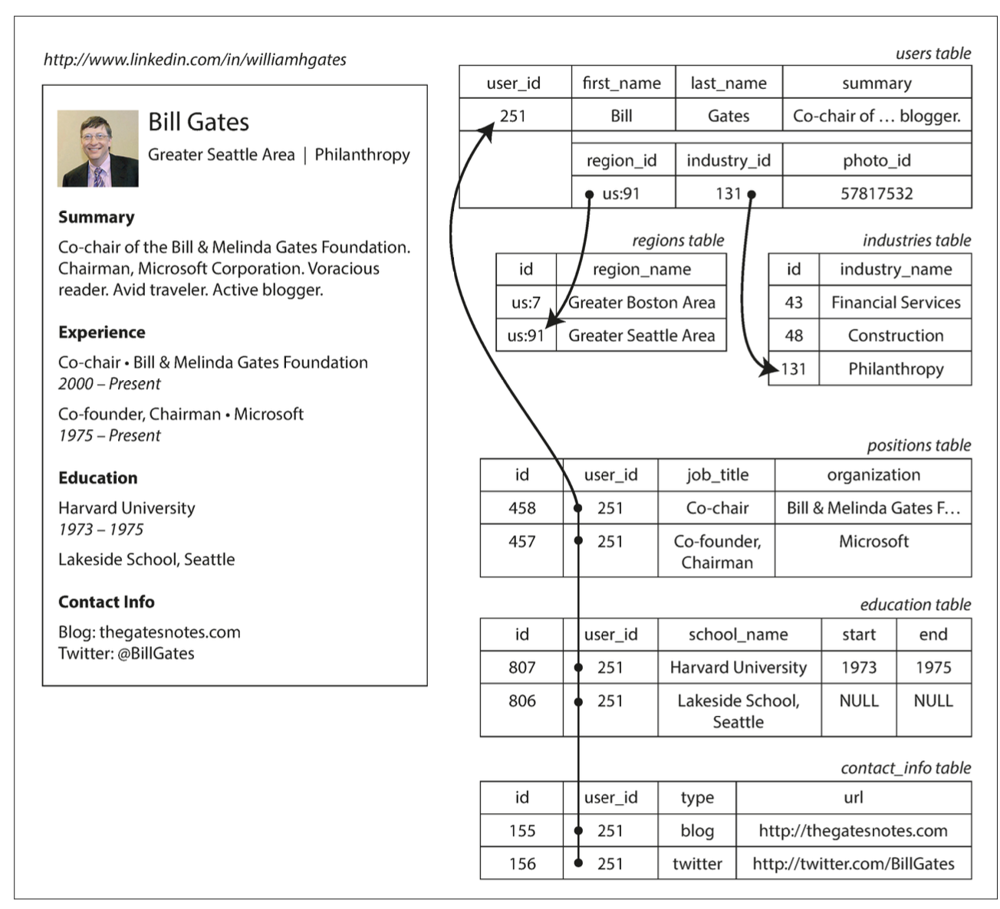
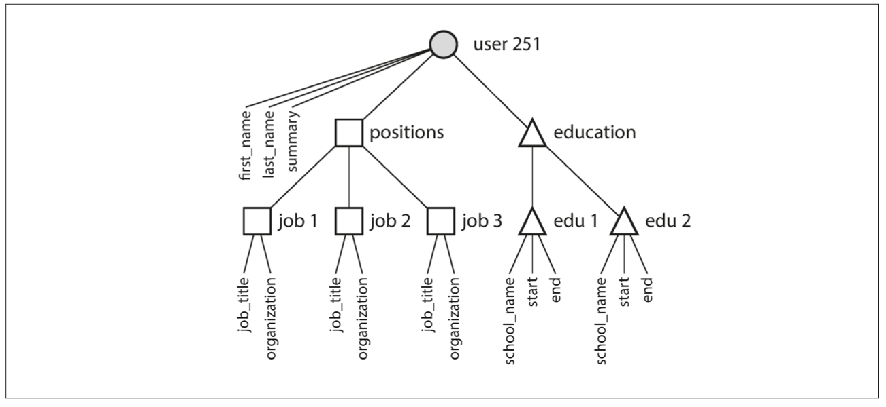
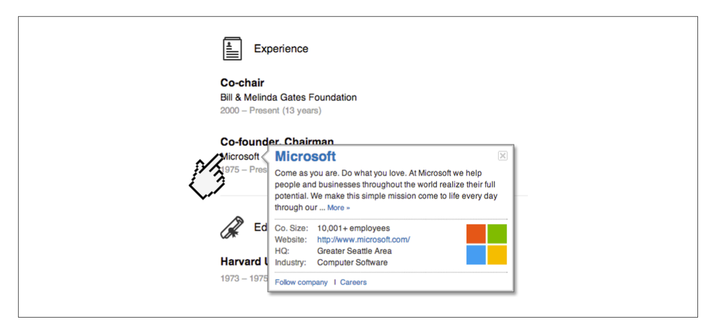
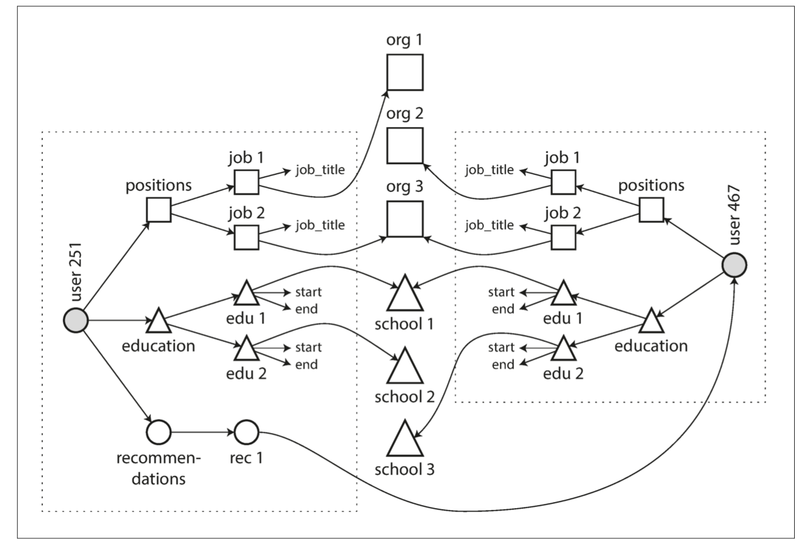

# Chapter 2: Data Models and Query Languages

Data models have a profound effect: on how the software is written, and on how we think about the problem that we are solving.

Most applications are built by layering one data model on top of another - how is each layer represented in terms of the next-lower layer?
- App developers model in terms of objects, data structures and APIs
- Then store those data structures in data models (i.e. JSON, XML documents, tables in RDBMS, graph model)
- Ways of representing data models (i.e. bytes in memory, on disk, on a network). May allow queries, searches, manipulation.
- How to represent bytes in terms of electrical currents, pulses of light, magnetic fields (Hardware engineers)
- More comples apps can have more intermediary levels (APIs built upon APIs, etc)

Basic idea: Each layer hides the complexity of the layers below it by providing a clean data model.
- Different groups of people can work together efficiently (engineers at the db vendor & app developers using db)

## Relational Model vs. Document Model
- Best-known data model: SQL
    - Based on the relational model - each relation is an unordered collection of tuples (rows in SQL)
    - Allows people to store and query data with some kind of regular structure
    - Roots in relational dbs lie in buisiness data processing
        - transaction processing (entering sales or banking transactions)
        - batch processing (customer invoicing, payroll)
    - Main goal of the relational model was to hide implementation detail behind a clearer interface
    - Turned out to generalize very well (beyond their original scope of business data processing)

- Some competing approaches:
    - netowork model
    - hierarchical model
    - object dbs
    - XML dbs

## The Birth of NoSQL
- Latest attempt to overthrow the relational model's dominance
- #NoSQL
- Driving forces behind the adoption of NoSQL dbs:
    - greater scalability (very large datasets, very high write throughput)
    - free and open source software
    - specialized query operations (not well supported by SQL)
    - more dynamic and expressive data model (less restrictive)
    
# The Object-Relational Mismatch

- Most app development is done in OOP - if data is stored in relational tables, an awkward translation layer is required between the objects in the code base and the db model of tables, rows, and columns. (aka impedance mismatch)
- ORM (Object-relational mapping) frameworks exist. But they have limitations:



- Instead, a self-contained document (i.e. JSON) representation is more appropriate:

```json
{
"user_id": 251,
"first_name": "Bill",
"last_name": "Gates",
"summary": "Co-chair of the Bill & Melinda Gates... Active blogger.", "region_id": "us:91",
"industry_id": 131,
"photo_url": "/p/7/000/253/05b/308dd6e.jpg",
"positions": [
{"job_title": "Co-chair", "organization": "Bill & Melinda Gates Foundation"}, {"job_title": "Co-founder, Chairman", "organization": "Microsoft"}
], "education": [
{"school_name": "Harvard University", "start": 1973, "end": 1975},
{"school_name": "Lakeside School, Seattle", "start": null, "end": null} ],
"contact_info": {
"blog": "http://thegatesnotes.com", "twitter": "http://twitter.com/BillGates"
} 
}
```

- Some developers believe the JSON model aligns better with application code than traditional storage models.
- JSON has its own issues as a data encoding format (Chapter 4)
- JSON's lack of a schema is seen as an advantage, discussed further in “Schema flexibility in the document model.”
- JSON representation offers better data locality than multi-table schemas, requiring only one query to fetch a profile.
- In relational databases, fetching a profile requires multiple queries or complex joins.

- JSON explicitly represents one-to-many relationships, like user profiles, as tree structures:


## Many-to-One and Many-to-Many Relationships
- Using IDs like region_id and industry_id instead of plain-text strings offers several benefits:
    - Ensures consistent style and spelling.
    - Avoids ambiguity between similar names.
    - Simplifies updates across all records.
    - Supports localization for different languages.
    - Enhances search capabilities by encoding hierarchical relationships.

- Storing IDs avoids duplication, maintaining a single source of truth for human-meaningful information.
    - IDs remain unchanged even if the associated information changes, reducing update overhead and inconsistencies.

- Normalization, which removes data duplication, often involves many-to-one relationships.
    - Relational databases handle this well with joins.
    - Document databases struggle with joins, requiring multiple queries or emulation in application code.

- Data often becomes more interconnected over time, necessitating changes to the document model:
    - Entities like organizations and schools might need their own references and web pages.
    - New features like recommendations might require references to other user profiles to reflect updates.




