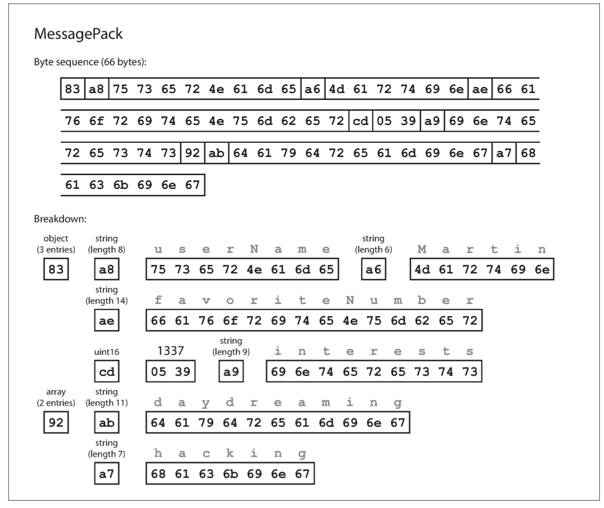
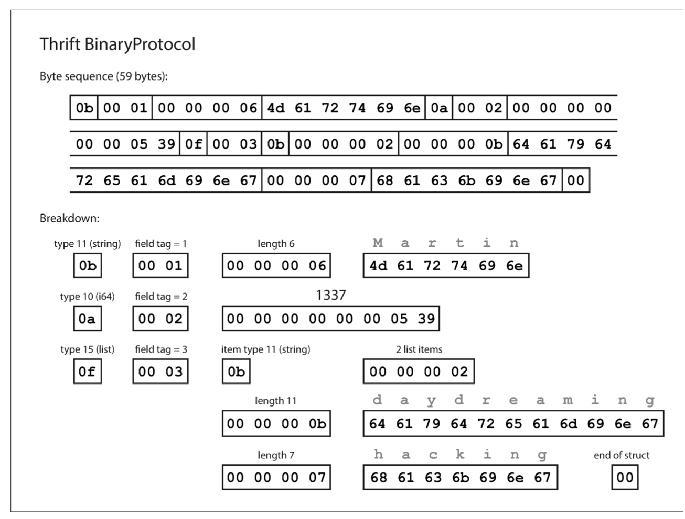
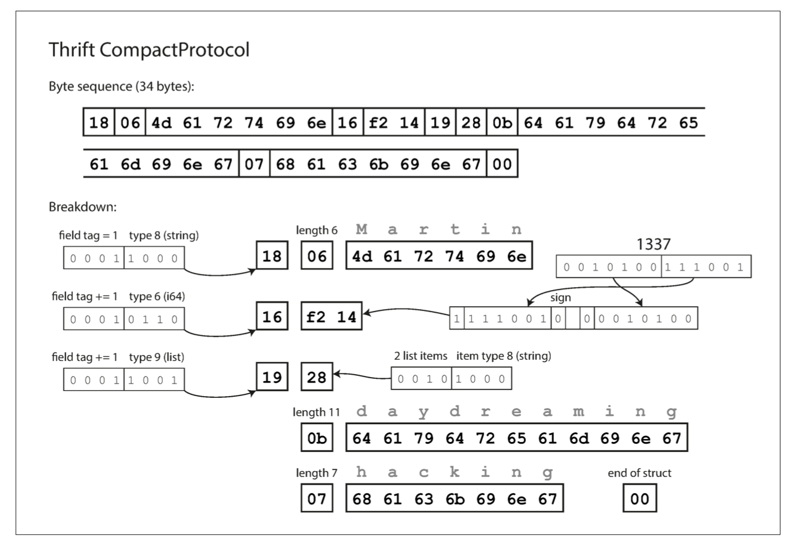
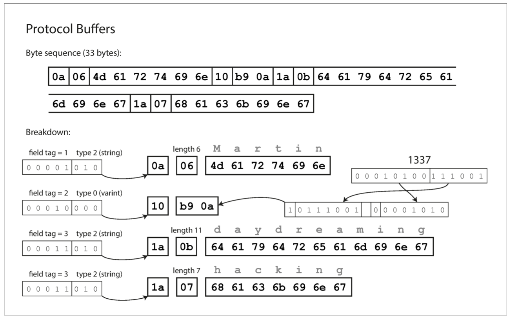
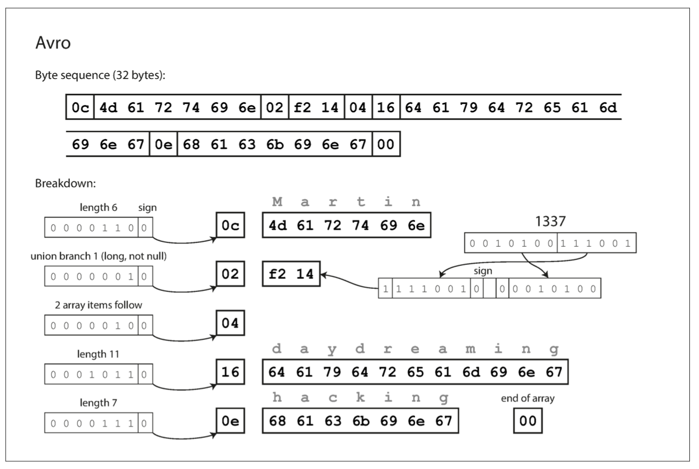
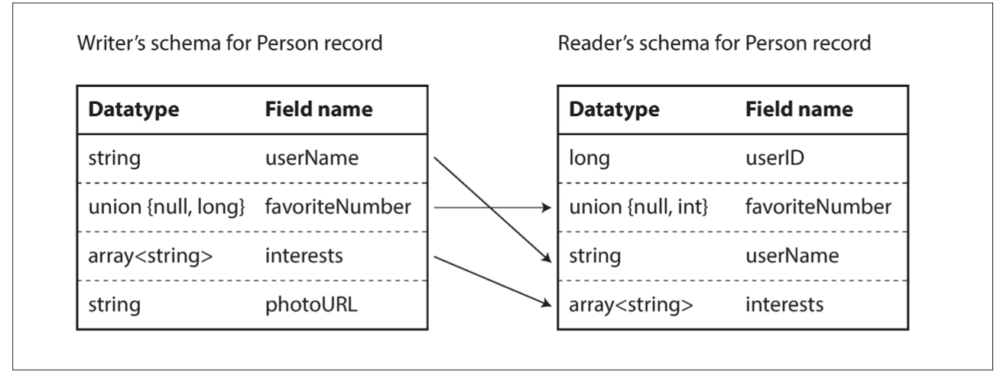
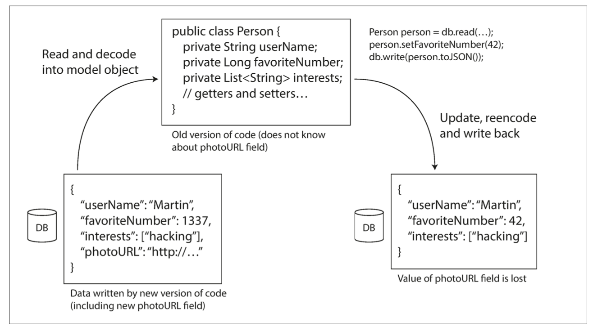

# Chapter 4: Encoding and Evolution

_"Everything changes and nothing stands still."_
    _-Heraclitus of Epheusus, as quoted by Plato in Cratylus (360 BCE)_

- Applications evolve over time due to:
    - changes in features
    - user requirements
    - business circumstances. 
    
- Systems need to evolve adapting to these changes:
    - changes in data storage formats

- Different data models handle such changes in various ways:
    - Relational Databases: Assume all data conforms to one schema, which can be altered through schema migrations. There's always one active schema.
    - Schema-on-read Databases: Do not enforce a schema, allowing a mix of old and new data formats.

- When data formats or schemas change, corresponding changes to application code are often required. However, code updates cannot always happen instantaneously, especially in large applications:
    - Server-side Applications: Rolling upgrades can be performed to deploy new versions gradually without service downtime.
    - Client-side Applications: Updates depend on users installing them, leading to potential coexistence of old and new code and data formats.

- To ensure smooth operation, systems need to maintain both backward and forward compatibility:
    - Backward Compatibility: Newer code can read data written by older code. (easier as new code can handle older data formats explicitly)
    - Forward Compatibility: Older code can read data written by newer code. (more challenging, requires older code to ignore additions made by newer versions)

## Formats for Encoding Data

- Programs typically handle data in two main representations:

    - In-memory: Data is stored in structures like objects, lists, arrays, hash tables, and trees. These are optimized for efficient access and manipulation by the CPU, often using pointers.

    - External storage/communication: Data must be encoded into a self-contained sequence of bytes (e.g., a JSON document) when written to a file or sent over a network. Pointers are not usable in this context, so the byte sequence looks different from the in-memory structures.

- To switch between these representations, translation is needed:
    - Encoding (Serialization/Marshalling): Translating in-memory data to a byte sequence. (java object -> JSON)
    - Decoding (Deserialization/Unmarshalling): Translating a byte sequence back into in-memory data. (JSON -> java object)

- Given the commonality of this problem, numerous libraries and encoding formats are available to facilitate these translations.

### Language-Specific Formats
Many programming languages offer built-in support for endoing:
    - Java's `java.io.Serializable`
    - Ruby's `Marshal`
    - Python's `pickle`
    - third-party libraries like `Kryo for Java`. 
    
- These libraries are convenient for saving and restoring in-memory objects with minimal code. However, drawbacks:

    - Language Dependency: Encoding is often tied to a specific programming language, making it difficult to read the data in another language. This restricts integration with other systems that use different languages.

    - Security Risks: Decoding data requires the ability to instantiate arbitrary classes, which can lead to security vulnerabilities. Attackers could exploit this to execute arbitrary code.

    - Versioning Issues: These libraries often overlook the problems of forward and backward compatibility, making data versioning problematic.

    - Inefficiency: Built-in serialization methods can be inefficient in terms of CPU time and the size of the encoded data. For example, Java’s serialization is known for poor performance and bloated encoding.

- Due to these issues, it is generally advisable to avoid using language-specific encoding for anything beyond very transient purposes.

### JSON, XML, and Binary Variants
- Popular standardized encodings: JSON, XML, CSV
    - can be read & written by many programming languages
    - widely used for data interchange

- Drawbacks:
    - XML: Criticized for verbosity and complexity.
    - JSON: Favored for simplicity and web browser support but has limitations like not distinguishing between integers and floating-point numbers and issues with large numbers.
    - CSV: Simple but lacks schema, making it vague and challenging to handle complex data structures.

- Common issues include:
    - Ambiguity in number encoding.
    - Lack of support for binary strings, often leading to Base64 encoding.
    - Schema complexity and optional usage in XML and JSON, with many JSON tools ignoring schemas.
    - CSV’s lack of schema and handling of special characters.

- Despite these problems, JSON, XML, and CSV remain popular for many applications, particularly in data interchange, where consensus on format is more critical than efficiency or elegance.

#### Binary encoding
- For internal data usage within an organization, there's flexibility to choose more efficient encoding formats than standard ones like JSON or XML (particularly for large datasets). 
    - JSON is less verbose than XML but still not as space-efficient as binary formats, prompting the creation of binary encodings:
        - MessagePack
        - BSON
        - Smile for JSON
        - WBXML
        - Fast Infoset for XML.

- Binary encodings typically:
    - Extend datatypes (e.g., distinguishing integers from floating-point numbers).
    - Maintain the JSON/XML data model.
    - Include all object field names within the encoded data.

- Example JSON Document (to be encoded):

```json
{
    "userName": "Martin",
    "favoriteNumber": 1337,
    "interests": ["daydreaming", "hacking"]
}
```

- MessagePack Encoding Process:

    - The first byte (0x83) indicates an object with three fields.
    - The second byte (0xa8) indicates an 8-byte long string.
    - The next eight bytes encode the field name userName.
    - The following seven bytes encode the string value Martin.

- binary encoding yields 66 bytes, only slightly less than the 81 bytes of JSON (without whitespace). While the space savings are minimal, binary formats can offer parsing speed improvements.



### Thrift and Protocol Buffers
- Apache Thrift and Protocol Buffers (protobuf) are binary encoding libraries (developed at Facebook and Google)
    - open source 
    - require a schema for data encoding, described in their interface definition languages (IDL).

- Example schemas for Thrift and Protocol Buffers:

Thrift:

```
struct Person {
    1: required string userName,
    2: optional i64 favoriteNumber, 
    3: optional list<string> interests
}
```
Protocol Buffers:

```
message Person {
    required string user_name = 1;
    optional int64 favorite_number = 2;
    repeated string interests = 3;
}
```

These schemas are used by code generation tools to produce classes for encoding/decoding records in various programming languages.

- Encoding Details:
    - Thrift uses two binary formats: BinaryProtocol and CompactProtocol.
        - BinaryProtocol: Encodes Example 4-1 in 59 bytes. Each field includes a type annotation and length indication. Strings are encoded as UTF-8. No field names are included; instead, field tags (numbers) from the schema are used.
        - CompactProtocol: Encodes the same data in 34 bytes. It packs field type and tag numbers into single bytes and uses variable-length integers to save space.




- Protocol Buffers: Encodes the data in 33 bytes, similar to Thrift's CompactProtocol but with slight differences in bit packing.



- Example JSON document:
```json
{
    "userName": "Martin",
    "favoriteNumber": 1337,
    "interests": ["daydreaming", "hacking"]
}
```

- Field tags (numbers) are used instead of field names for compact encoding.
- CompactProtocol and Protocol Buffers use efficient encoding techniques like variable-length integers.
- Marking fields as required or optional does not affect encoding but provides runtime checks for data validation.

- These binary encodings are more compact and faster to parse compared to JSON, making them suitable for large datasets used internally within organizations.


#### Field tags and schema evolution
- Schemas inevitably change over time - schema evolution. Thrift and Protocol Buffers handle these changes while maintaining backward and forward compatibility as follows:

- Field Tags and Data Types:
    - Encoded records are a concatenation of encoded fields, each identified by its tag number (e.g., 1, 2, 3) and annotated with a datatype (e.g., string or integer).
    - Field values not set are omitted from the encoded record.
    - Field tags are crucial since the encoded data refers to them and not field names. Changing a field's tag would invalidate existing encoded data.

- Adding Fields:
    - New fields can be added to the schema with new tag numbers.
    - Old code that does not recognize new tag numbers will ignore these fields, maintaining forward compatibility. The datatype annotation helps the parser skip the correct number of bytes.

- Backward Compatibility:
    - New code can read old data as long as each field has a unique tag number.
    - New fields added post-initial deployment must be optional or have a default value to maintain backward compatibility. Making new fields required would cause new code to fail when reading old data that lacks these fields.

- Removing Fields:
    - Only optional fields can be removed, ensuring that required fields are always present.
    - Once a field is removed, its tag number can never be reused to avoid conflicts with existing data that might still include the old tag number.

- These principles allow Thrift and Protocol Buffers to evolve schemas while ensuring that older and newer versions of code can continue to read and write data seamlessly.


#### Datatypes and schema evolution (Changing Field Datatypes and Handling Lists in Thrift and Protocol Buffers)

- Changing Field Datatypes:
    - Changing a field’s datatype may be possible, but it risks loss of precision or truncation.
    - i.e. changing a 32-bit integer to a 64-bit integer allows new code to read old data easily (by padding missing bits with zeros). However, old code reading new data might truncate values if the 64-bit value doesn’t fit into 32 bits.

- Lists and Arrays in Protocol Buffers:
    - Protocol Buffers does not have a list or array datatype. Instead, it uses a repeated marker for fields, alongside required and optional.
    - The encoding for a repeated field simply includes the same field tag multiple times in the record.
    - This allows an optional single-valued field to be evolved into a repeated multi-valued field. New code reading old data sees a list with zero or one elements, while old code reading new data sees only the last element of the list.

- Lists in Thrift:
    - Thrift has a dedicated list datatype, parameterized with the datatype of the list elements.
    - This does not support the same seamless evolution from single-valued to multi-valued fields as Protocol Buffers but allows for nested lists.

- These mechanisms ensure flexibility and backward compatibility in schema evolution, accommodating changes in data structures while minimizing disruptions.

## Avro
- Apache Avro is a binary encoding format developed as a subproject of Hadoop, differing significantly from Protocol Buffers and Thrift.

- Schema Specification:
    - Avro uses schemas to define the structure of data.
    - Two schema languages: Avro IDL for human editing and a JSON-based schema for machine readability.

- Example Schema in Avro IDL:

```
record Person {
  string userName;
  union { null, long } favoriteNumber = null;
  array<string> interests;
}
```

- Equivalent JSON Schema:
```json
{
  "type": "record",
  "name": "Person",
  "fields": [
    { "name": "userName", "type": "string" },
    { "name": "favoriteNumber", "type": ["null", "long"], "default": null },
    { "name": "interests", "type": { "type": "array", "items": "string" } }
  ]
}
```

- Key Characteristics:
    - No tag numbers in the schema.
    - Encoded data is a concatenation of values without field or datatype identifiers.
    - Strings are length-prefixed followed by UTF-8 bytes.
    - Integers use a variable-length encoding (similar to Thrift's CompactProtocol).

- Example Record Encoding:
    - Encoding the example record results in a 32-byte binary sequence, the most compact among discussed formats.

- Decoding Process:
    - Decoding relies on the schema to interpret the byte sequence.
    - Fields are parsed in the order they appear in the schema.
    - Correct decoding requires the same schema used by both the reader and writer; any schema mismatch results in incorrect data interpretation.

- Avro's compact and efficient binary encoding makes it a good fit for applications where schema evolution is carefully managed, ensuring both the writer and reader use the same schema.




### The writer’s schema and the reader’s schema
- Avro supports schema evolution through a process that allows for differences between the writer’s schema and the reader’s schema, ensuring data compatibility over time.

- Process Overview:
    - Writer’s Schema:
        - Used when an application encodes data.
        - Encodes data based on the schema known to the application (compiled into it).
    - Reader’s Schema:
        - Used when an application decodes data.
        - Expects data to conform to a specific schema, which the application relies on.

- Key Idea:
    - Compatibility: The writer’s schema and the reader’s schema do not need to be identical but must be compatible.
    - Schema Resolution: During decoding, Avro resolves differences between the writer’s and reader’s schemas, translating data accordingly.

- Schema Resolution Details:
    - Field Order: Fields can be in different orders in the writer’s and reader’s schemas; they are matched by field name.
    - Extra Fields: Fields in the writer’s schema that are not in the reader’s schema are ignored.
    - Missing Fields: Fields expected by the reader’s schema but missing in the writer’s schema are filled with default values specified in the reader’s schema.

- Illustration of Schema Resolution:
    - Avro looks at both schemas side by side and matches fields by name.
    - This ensures data integrity and compatibility, accommodating schema changes without breaking existing applications.

- This approach allows for seamless data evolution and compatibility, making Avro suitable for systems where data schemas change over time.



### Schema evolution rules
- Forward Compatibility:
    - New schema as writer, old schema as reader.
    - Add or remove fields with default values to maintain compatibility.
    - Example: Adding a field with a default value allows new schema readers to fill in the missing field when reading data written by the old schema.

- Backward Compatibility:
    - New schema as reader, old schema as writer.
    - Adding fields without default values breaks backward compatibility.
    - Removing fields without default values breaks forward compatibility.

- Handling Null Values:
    - Avro requires union types for nullable fields.
    - Example: union { null, long, string } field; allows field to be a number, string, or null.

- Datatype and Field Name Changes:
    - Changing datatypes is possible if Avro can convert the type.
    - Field name changes are managed using aliases in the reader’s schema.
    - Example: Aliases make field name changes backward compatible but not forward compatible.
    - Adding a branch to a union type is backward compatible but not forward compatible.

- Default Values:
    - Essential for maintaining compatibility when adding or removing fields.
    - Default values help fill in missing data when schemas evolve.

- By adhering to these principles, Avro ensures robust schema evolution, allowing applications to handle data changes gracefully over time.

### But what is the writer’s schema?

How the Reader Knows the Writer’s Schema in Avro?

- Problem:
    - The reader must know the writer’s schema to decode the data.
    - Including the schema with every record is impractical due to size concerns.

- Solutions Depending on Context:
    - Large File with Lots of Records:
        - Usage: Common in Hadoop for storing large files with millions of records.
        - Method: Include the writer’s schema once at the beginning of the file.
        - Format: Avro’s object container files.

    - Database with Individually Written Records:
        - Usage: Different records may have different schemas written at different times.
        - Method: Include a version number at the beginning of each record.
        - Process: Reader fetches the version number, retrieves the corresponding schema from the database, and decodes the record.
        - Example: Espresso database.
    - Sending Records Over a Network Connection:
        - Usage: Bidirectional network communication between processes.
        - Method: Negotiate the schema version at connection setup and use it for the connection’s lifetime.
        - Example: Avro RPC protocol.

- Additional Considerations:
    - Schema Version Database: Useful for documentation and compatibility checks.
    - Versioning Methods: Use an incrementing integer or a hash of the schema.

### Dynamically generated schemas
- Key Advantage of Avro:
    - No Tag Numbers in Schema:
        - Avro schemas don't require tag numbers for fields, unlike Protocol Buffers and Thrift.
        - This makes Avro more flexible and easier to use for dynamically generated schemas.

- Why Tag Numbers Matter:
    - Dynamically Generated Schemas:
        - Example: Dumping relational database contents to a binary file.
        - Avro: Easily generate schema from relational schema in JSON format and encode data.
        - Changes in database schema (adding/removing columns) only require generating a new Avro schema.
        - Fields are matched by name, ensuring compatibility between old reader’s and updated writer’s schemas.

    - Contrast with Thrift and Protocol Buffers:
        - Manual Tag Management:
            - Field tags need to be manually assigned and managed.
            - Schema changes require careful updates to field tags to avoid conflicts.
            - Automation is complex and error-prone.
    
    - Design Goal:
        - Avro:
            - Designed with dynamically generated schemas in mind.
        - Thrift and Protocol Buffers:
            - Not designed for dynamic schema generation; focus is different.

- Example Code:
    - Avro Schema in JSON:

```json
    {
  "type": "record",
  "name": "Person",
  "fields": [
    {"name": "userName", "type": "string"},
    {"name": "favoriteNumber", "type": ["null", "long"], "default": null},
    {"name": "interests", "type": {"type": "array", "items": "string"}}
  ]
}
```

### Code generation and dynamically typed languages
- Code Generation in Thrift and Protocol Buffers:
    - Purpose:
        - Generate code in statically typed languages (Java, C++, C#).
        - Enables efficient data structures, type checking, and IDE support.

- Challenges in Dynamically Typed Languages:
    - No Compile-Time Type Checking:
        - Languages like JavaScript, Ruby, Python lack compile-time type checks.
        - Code generation is less beneficial and often avoided.

- Avro's Approach:
    - Optional Code Generation:
        - Supports code generation for statically typed languages.
        - Not mandatory; can be used without code generation.
        - Object container files embed schema, making data self-describing.

- Advantages of Avro in Dynamic Environments:
    - Flexibility in Data Processing:
        - Useful in environments like Apache Pig.
        - Avro files are self-describing, simplifying data analysis and processing.
        - No need to pre-define or generate code, facilitating rapid data manipulation.

- Example Use Case:
    - Apache Pig:
        - Processes Avro files directly without requiring explicit schema handling.
        - Supports seamless analysis and manipulation of data without upfront schema definition or code generation.

- Key Point:
    - Avro's Design Flexibility:
        - Adaptable to both statically typed and dynamically typed environments.
        - Provides the option of code generation for efficiency but remains accessible without it, particularly advantageous in dynamic scripting languages.

## Metrics of Schemas

- Schema Definition:
    - Protocol Buffers, Thrift, and Avro use simplified schema languages to define binary encoding formats.
    - These schemas focus on describing structure rather than detailed validation rules.

- Comparison with ASN.1:
    - Historical Context:
        - Similarities exist with ASN.1, a standardized schema language since 1984.
        - ASN.1's complexity and documentation challenges make it less favorable for new applications.

- Proprietary Binary Encodings:
    - Database Protocols:
        - Many data systems employ proprietary binary encodings for efficient data exchange.
        - These protocols are specific to database vendors and utilize drivers like ODBC or JDBC for decoding.

- Advantages of Schema-Based Binary Encodings:
    - Compactness:
        - More compact than "binary JSON" variants due to omission of field names in encoded data.
    - Documentation and Maintenance:
        - Schemas serve as documentation and are required for decoding, ensuring alignment with data reality.
    - Compatibility Management:
        - Maintaining a schema database enables validation of forward and backward compatibility before deployment.
    - Tooling and Language Support:
        - Supports code generation for statically typed languages, facilitating compile-time type checking and IDE support.
    - Flexibility and Guarantees:
        - Comparison with JSON Databases:
            - Offers schema flexibility akin to JSON databases but with stronger data integrity guarantees and enhanced tooling support.

- Benefits of Schema Evolution:
    - Provides flexibility akin to schema-on-read JSON databases.
    - Ensures data integrity and facilitates efficient data handling in various programming environments.

## Modes of Dataflow

- Encoding Data:
    - Data sent between processes that do not share memory needs to be encoded as byte sequences.
    - Various encoding formats discussed include Protocol Buffers, Thrift, Avro, and proprietary binary encodings.

- Forward and Backward Compatibility:
    - Importance:
        - Essential for system evolvability, allowing independent upgrades of different parts without requiring simultaneous changes across the entire system.
        - Compatibility ensures that data encoded by one process can be correctly decoded by another process, even after schema changes.

- Data Flow Between Processes:
    - Abstract Concept:
        - Data flow scenarios explore how data moves between encoding and decoding processes.
        - Various methods include databases, service calls, and asynchronous message passing.

- Common Data Flow Scenarios:
    - Through Databases:
        - Dataflow mechanisms involving storage and retrieval from databases.
    - Through Service Calls:
        - Communication via service-oriented architectures using RESTful APIs or RPC protocols.
    - Message-Passing Dataflow:
        - Asynchronous communication patterns where messages are exchanged between processes.

## Dataflow Through Databases
- Data Encoding and Decoding in Databases:
    - Encoding and Decoding:
        - In a database system, the process that writes data encodes it, while the process that reads data decodes it.
        - Conceptually, storing data in a database can be likened to sending a message to your future self.

    - Backward Compatibility:
        - Backward compatibility is crucial in databases to ensure that data written in the past can be correctly decoded by newer versions of the decoding process.
        - Without backward compatibility, older versions of the decoding process wouldn't understand data encoded by newer versions.

    - Forward Compatibility:
        - In environments with multiple processes accessing the database concurrently, forward compatibility becomes necessary.
        - It ensures that data encoded by older versions of the encoding process can still be decoded by newer versions of the decoding process.
    
    - Handling Schema Evolution:
        - Scenario: When a new field is added to a schema and written by a newer version, older versions that read and update the data should ideally preserve the new field.
        - Encoding formats discussed (like Avro) support preservation of unknown fields, but application-level handling may be required to ensure the integrity of data translations.

    - Application-Level Considerations:
        - Care is needed when decoding database values into application model objects and then re-encoding them, to avoid losing information like unknown fields.
        - Awareness and appropriate handling in the application logic can mitigate potential issues with schema evolution and data integrity.

- Complexities of Database Access:
    - Database access involves navigating backward and forward compatibility challenges in dynamic environments where multiple versions of applications may interact with shared data.
    - Proper understanding and implementation of encoding formats and application logic are essential for maintaining data integrity and compatibility across evolving systems.



### Different values written at different times
Data Longevity and Application Deployment:

- Data Persistence:
    - In a database, data can persist for long periods, spanning from milliseconds to many years, irrespective of how often application code changes.
    - Updates to a database can include data written years ago alongside recent updates, emphasizing that "data outlives code."

- Impact of Application Deployment:
    - Unlike application code, which can be entirely replaced during deployment within minutes, database contents, including historical data, remain intact in their original encoding unless explicitly rewritten.

- Data Migration and Schema Changes:
    - Rewriting or migrating data to a new schema is feasible but expensive, especially on large datasets, prompting most databases to avoid it if possible.
    - Relational databases typically support simple schema changes, like adding columns with null default values, without rewriting existing data. When old data is read, missing columns are filled with nulls.

- Schema Evolution and Database Storage:
    - Schema evolution enables databases to present a unified view of data, even when stored records may have been encoded using various historical schema versions.
    - LinkedIn's Espresso document database uses Avro for storage, leveraging Avro's schema evolution capabilities to manage schema changes effectively without requiring data rewrites.

- Managing Data and Evolution:
    - Databases are designed to manage data persistence over long periods and accommodate schema evolution to maintain compatibility across various application versions.
    - The ability to evolve schemas without necessitating immediate data migration allows databases to adapt to changing application requirements while maintaining operational efficiency and data integrity.

### Archival storage

Database Snapshots and Schema Consistency:

- Snapshot Purposes:
    - Database snapshots are often taken for backup purposes or for loading data into a data warehouse.
    - These snapshots aim to capture a consistent state of the database at a specific point in time, typically using the latest schema version for encoding, regardless of the original mixture of schema versions within the source database.

- Encoding and Immutability:
    - Data dumps, such as those created for snapshots, are encoded in one go and remain immutable thereafter.
    - Formats like Avro object container files are well-suited for data dumps due to their ability to maintain schema evolution rules and ensure data integrity.
    - Column-oriented formats like Parquet are advantageous for analytics purposes, offering efficient storage and retrieval of columnar data.

- Consistency and Analytics:
    - Encoding database snapshots with the latest schema version ensures data consistency during storage and facilitates seamless integration into analytics platforms.
    - Utilizing formats optimized for analytics, such as Parquet, enhances data query and retrieval performance, supporting efficient data analysis and reporting tasks.

## Dataflow Through Services: REST and RPC
(Communication Patterns in Networked Systems)

- Client-Server Communication:
    - Roles Defined:
        - In networked systems, communication typically revolves around clients and servers.
        - Servers expose APIs over the network, and clients connect to servers to request services or data.

    - Web Example:
        - The web operates with web browsers (clients) making requests to web servers (servers).
        - Standardized protocols (HTTP, URLs, SSL/TLS, etc.) define the web API, enabling universal access across different browsers and servers.
    
    - Types of Clients:
        - Clients aren't limited to web browsers; native apps and client-side JavaScript apps also make network requests.
        - APIs in non-browser clients are often specialized and agreed upon between client and server.

    - Server Interactions:
        - Servers can act as clients to other services (e.g., database servers querying databases).
        - This approach supports decomposition of large applications into smaller, independently deployable services, known as microservices architecture.

    - Service vs. Database:
        - Services expose APIs with predefined inputs and outputs, unlike databases which allow arbitrary queries.
        - This encapsulation enhances control and security over interactions but limits flexibility.

    - Microservices Architecture Goals:
        - Facilitates independent deployment and evolution of services owned by separate teams.
        - Enables compatibility across different versions of services and clients using compatible data encoding strategies discussed in the chapter.

### Web services (Web services and their architectures)
- Web Services Overview:
    - HTTP as the Foundation:
        - Web services use HTTP as their underlying protocol for communication.
        - They are utilized not only on the web but also in various other contexts and architectures.
    
    - Contexts of Usage:
        - Client Applications: Native apps or JavaScript apps making HTTP requests to services over the internet.
        - Service-to-Service Communication: Within a microservices architecture or service-oriented architecture (SOA) in the same organization.
        - Inter-Organizational Communication: Services exchanging data across organizations, often over the internet.

    - REST and SOAP:
        - REST (Representational State Transfer):
            - Philosophy based on HTTP principles, emphasizing simple data formats, URL-based resource identification, and leveraging HTTP features like caching and authentication.
            - Popular for cross-organizational service integration and closely associated with microservices architecture.
        - SOAP (Simple Object Access Protocol):
            - XML-based protocol for making network API requests, originally designed to be independent from HTTP.
            - Comes with a complex framework of standards (WS-*) and uses WSDL (Web Services Description Language) for API description.
            - Supports code generation for statically typed languages but is less favored in dynamically typed languages due to complexity.

    - Comparison and Adoption:
        - REST vs SOAP:
            - RESTful APIs are simpler, involve less code generation, and often use OpenAPI (Swagger) for API description and documentation.
            - SOAP, despite its standardization attempts, faces interoperability challenges and has declined in popularity outside large enterprises.
    
    - Tooling and Support:
        - REST: Relies on simpler approaches, automated tooling, and OpenAPI for API definition.
        - SOAP: Relies heavily on tool support, code generation, and IDEs due to its complexity and less human-readable nature.

- In summary, the choice between REST and SOAP depends on factors such as simplicity, interoperability needs, and the development environment's support for code generation and tooling. While REST has gained preference, especially in microservices architectures, SOAP remains prevalent in legacy enterprise systems requiring strict standards and tooling support.

### The problems with remote procedure calls (RPCs)
- Previous Technologies:
    - Enterprise JavaBeans (EJB), Java's Remote Method Invocation (RMI), Distributed Component Object Model (DCOM), and Common Object Request Broker Architecture (CORBA) were predecessors to modern web services.
    - These technologies were often limited to specific platforms, lacked compatibility, or were overly complex, hindering widespread adoption.

- Remote Procedure Call (RPC) Model:
    - Concept:
        - RPC models aim to mimic local function calls across a network, providing location transparency.
        - Initially appealing, RPC treats network requests similarly to local calls, but faces inherent challenges due to network unpredictability.
    - Challenges:
        - Network Unpredictability: Network issues can cause request loss, delays, or timeouts, necessitating retries and error handling not required in local calls.
        - Result Uncertainty: Network requests may not return a result due to timeouts, leading to uncertainty about request status.
        - Idempotence Concerns: Retrying failed requests may cause unintended duplicate actions, requiring protocols to ensure idempotence.
        - Latency and Variability: Network requests are slower and vary widely in latency compared to local calls, impacting performance predictability.
        - Data Type Translation: RPC frameworks must translate data types between different languages, often leading to complexities and compatibility issues.

    - Advantages of REST:
        - Transparent Network Protocol: Unlike RPC, REST acknowledges and embraces its nature as a network protocol, avoiding attempts to hide network complexities.
        - Simplicity and Compatibility: RESTful APIs are simpler, promote interoperability, and are widely adopted in microservices architectures.


- RPC's attempt to mirror local function calls over a network has fundamental flaws due to network unpredictability and performance differences.
- REST's acceptance of network realities and simplicity contributes to its popularity and adoption, despite ongoing attempts to build RPC-like libraries on top of it.

- While RPC technologies have paved the way for modern web services, their attempt to abstract network communication as local calls has highlighted significant challenges. RESTful APIs, in contrast, offer a more pragmatic approach by embracing network protocols' realities and promoting simplicity and interoperability.

### Current directions for RPC

- Persistence of RPC: Despite inherent challenges, RPC frameworks continue to evolve and are widely used in various forms.

- Frameworks Integration: RPC capabilities are integrated into modern encoding formats discussed in the chapter, such as Thrift, Avro, Protocol Buffers (gRPC), and JSON over HTTP (Rest.li).

- Modern RPC Features:
    - Explicit Remote Call Awareness: New RPC frameworks acknowledge and handle the differences between local function calls and remote requests.
    - Asynchronous Handling: Frameworks like Finagle and Rest.li employ futures (promises) for asynchronous actions, managing potential failures and simplifying parallel service requests.

    - Stream Support: gRPC supports streams, enabling sequences of requests and responses over time, not limited to single interactions.
    - Service Discovery: Some frameworks facilitate service discovery, allowing clients to dynamically locate services by IP address and port number.

- Performance vs. Advantages of REST:
    - Custom RPC Protocols: RPC with binary encoding formats can offer superior performance compared to generic JSON over REST due to optimized data transmission.
    - Advantages of REST: RESTful APIs excel in ease of experimentation and debugging (accessible via web browsers or curl), broad language/platform support, and extensive ecosystem of supporting tools.

- Prevalence of REST: REST remains predominant for public APIs due to its versatility, ease of use, and broad adoption across different programming languages and platforms.

- RPC Focus: RPC frameworks primarily cater to internal service-to-service communications within organizations, particularly in datacenter environments.

- While RPC frameworks address specific needs for internal service communications with features like performance optimizations and asynchronous handling, RESTful APIs continue to dominate public API scenarios due to their accessibility, cross-platform support, and extensive tooling ecosystem.

### Data encoding and evolution for RPC
Evolvability in RPC and RESTful APIs:

- Independent Deployment: To support evolvability, RPC clients and servers should be deployable independently. Unlike data flowing through databases, where changes must accommodate both reading and writing simultaneously, services typically update servers before clients, simplifying compatibility requirements.

- Compatibility Requirements:
    - RPC Schemes: Compatibility in RPC schemes (Thrift, gRPC, Avro) depends on the compatibility rules inherited from their encoding formats. They typically support backward compatibility on requests and forward compatibility on responses.
    - SOAP: SOAP uses XML schemas for specifying requests and responses, allowing evolution with some complexities and potential pitfalls.
    - RESTful APIs: Commonly use JSON for responses without a formally specified schema, and support JSON or URI-encoded/form-encoded parameters for requests. Adding optional request parameters and new fields to response objects generally maintains compatibility.

- Challenges in Service Compatibility: RPC often spans organizational boundaries, meaning service providers cannot control client upgrades. Thus, maintaining compatibility for extended periods or indefinitely is crucial. Service providers may need to support multiple API versions concurrently to manage compatibility-breaking changes.

- API Versioning: There is no universal agreement on API versioning methods:
    - RESTful APIs: Versioning can be indicated in URLs or HTTP Accept headers.
    - API Keys: Alternatively, client-specific API versions can be stored on the server, allowing version selection via administrative interfaces.

- Achieving evolvability and compatibility in RPC and RESTful APIs involves adhering to the inherent rules of their encoding formats, managing changes carefully across organizational boundaries, and implementing clear versioning strategies to ensure smooth transitions and ongoing interoperability.

## Message-Passing Dataflow

- Asynchronous message-passing systems provide a method for sending encoded data (messages) between processes, bridging the gap between RPC and databases.

- Messages are sent via a message broker (message queue or message-oriented middleware) rather than directly over a network connection, stored temporarily for delivery.

- Advantages of Using a Message Broker:
    - Buffering: Acts as a buffer, enhancing system reliability by holding messages when recipients are unavailable or overloaded.
    - Redelivery: Automatically redelivers messages to processes that have crashed, preventing message loss.
    - Decoupling: Logically decouples senders from recipients; senders publish messages without needing to know specific recipient details, beneficial in dynamic cloud environments.
    - Multiple Recipients: Enables sending a message to multiple recipients simultaneously.

- Communication Pattern:
    - Asynchronous: Typically one-way communication; senders do not necessarily expect immediate replies to messages. Responses, if needed, are usually handled through separate channels.
    - Event-Driven: Senders initiate actions by publishing messages and continue without waiting for immediate responses.

- Asynchronous message-passing systems offer robustness and flexibility in distributed architectures, supporting reliable communication without synchronous blocking. They are suited for scenarios where decoupled, event-driven communication is advantageous, especially in dynamic cloud deployments and complex distributed systems.

### Message brokers

- Historically dominated by commercial enterprise software like TIBCO, IBM WebSphere, and webMethods, the landscape of message brokers has shifted towards open-source implementations such as RabbitMQ, ActiveMQ, HornetQ, NATS, and Apache Kafka.

- Functionality and Usage:
    - Message Delivery: Message brokers ensure reliable delivery of messages from producers to consumers or subscribers, either through queues or topics.
    - Producers and Consumers: Multiple producers can send messages to a single queue or topic, and multiple consumers can subscribe to receive messages from these queues or topics.

- Types of Communication:
    - One-way Dataflow: Topics facilitate one-way dataflow where consumers receive messages published by producers.
    - Request-Response: Consumers can respond to messages either by publishing to another topic or using reply queues, enabling request-response patterns similar to RPC.

- Flexibility and Compatibility:
    - Encoding and Compatibility: Message brokers typically handle messages as byte sequences with metadata, supporting any encoding format. Backward and forward compatibility in encoding allows independent evolution of publishers and consumers.

- Considerations:
    - Preserving Unknown Fields: When consumers republish messages to other topics, care is needed to preserve unknown fields to maintain compatibility, similar to considerations in database schema evolution.

- Message brokers play a critical role in distributed systems by facilitating asynchronous communication with high reliability and flexibility. Open-source implementations have democratized access to these capabilities, offering robust alternatives to traditional commercial solutions.


### Distributed actor frameworks

- The actor model provides a programming paradigm for handling concurrency within a single process by encapsulating logic into independent actors. Actors communicate through asynchronous message passing, mitigating issues like race conditions and deadlock associated with traditional threading models.

- Key Concepts:
    - Actors: Each actor represents a distinct entity or client, maintaining local state that is not shared with other actors. Actors communicate exclusively through asynchronous messages.
    - Concurrency Handling: Actors process messages sequentially, avoiding the complexities of thread management. They can be scheduled independently by the framework.
    - Message Delivery: Message delivery is not guaranteed, allowing for loss in certain error scenarios.

- Distributed Actor Frameworks:
    - Scaling Across Nodes: In distributed actor frameworks, the actor model extends to multiple nodes, where actors communicate over the network using the same message-passing mechanism.
    - Location Transparency: Messages are encoded into byte sequences for transmission over the network. The actor model's inherent assumption of potential message loss within a single process makes it more adaptable to network latency compared to RPC.

- Frameworks and Compatibility:
    - Akka: Uses Java's default serialization, lacking forward and backward compatibility. It can be customized with tools like Protocol Buffers to enable rolling upgrades.

    - Orleans: Uses a custom data encoding format that requires cluster setup for each application version upgrade, unless custom serialization plugins are used.

    - Erlang OTP: Known for its high availability features, Erlang OTP supports rolling upgrades with careful planning, though historical challenges with schema changes exist. New data types like maps aim to simplify future upgrades.

- The actor model offers a robust approach to managing concurrency and scalability in distributed systems, leveraging message passing and location transparency. Distributed actor frameworks extend these benefits across multiple nodes, though careful consideration of message encoding and compatibility is crucial for seamless upgrades and system maintenance.
